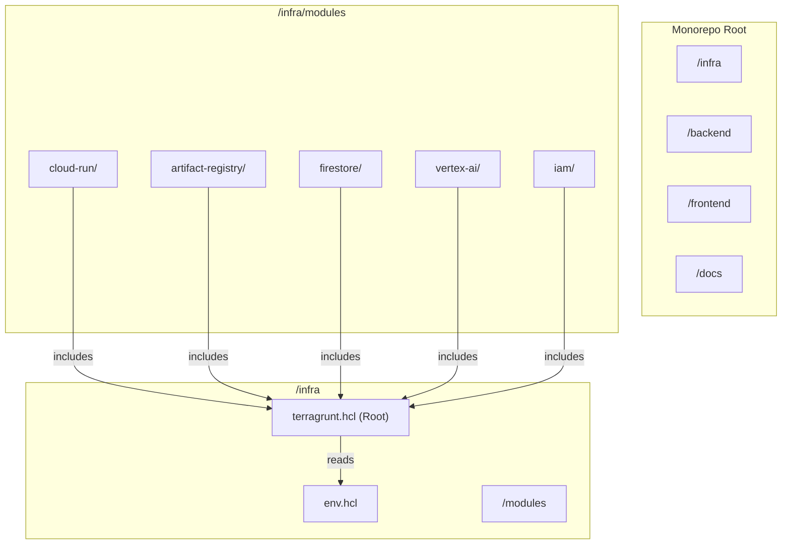
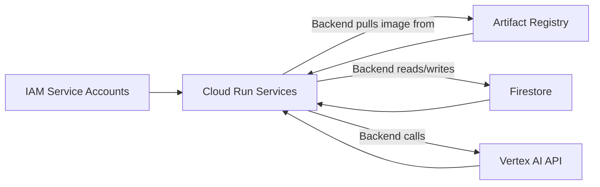
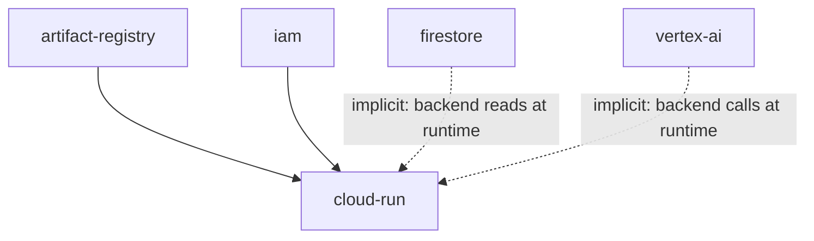

# Design Document: GCP Infrastructure Provisioning

## Overview

This design covers the Terragrunt/Terraform infrastructure-as-code (IaC) that provisions all GCP resources for the JuntoAI A2A MVP. The infrastructure is organized as a set of independent Terragrunt child modules under `/infra/modules/`, each responsible for a single GCP resource concern. A root `terragrunt.hcl` provides shared configuration (provider, remote state, common variables) inherited by all children.

The design targets a dedicated GCP project for blast-radius isolation. All environment-specific values are parameterized so the same codebase can target dev, staging, or production by changing a single `env.hcl` file.

### Key Design Decisions

1. **One module per resource concern** — Cloud Run, Artifact Registry, Firestore, Vertex AI, IAM are each isolated modules. This keeps blast radius small per `terragrunt apply` and enables independent state files.
2. **Shared root HCL with `env.hcl`** — All environment-specific values live in one file. Child modules read from it via `read_terragrunt_config()`. No duplication.
3. **GCS native locking** — No DynamoDB-equivalent needed. GCS handles state locking natively.
4. **Cloud Run service identity via dedicated SAs** — Each Cloud Run service gets its own service account. No default compute SA usage.
5. **IAM role allowlist validation** — The IAM module enforces a strict allowlist of permitted roles. Any role outside the approved set triggers a Terraform validation error at plan time.

## Architecture



### GCP Resource Dependency Graph



### Directory Layout

```
/infra/
├── terragrunt.hcl          # Root HCL: provider, remote_state, generate blocks
├── env.hcl                  # Environment variables: project_id, region, bucket
└── modules/
    ├── artifact-registry/
    │   ├── terragrunt.hcl   # Child: includes root, passes inputs
    │   ├── main.tf          # google_artifact_registry_repository
    │   ├── variables.tf
    │   └── outputs.tf
    ├── firestore/
    │   ├── terragrunt.hcl
    │   ├── main.tf          # google_firestore_database, google_project_service
    │   ├── variables.tf
    │   └── outputs.tf
    ├── vertex-ai/
    │   ├── terragrunt.hcl
    │   ├── main.tf          # google_project_service (aiplatform)
    │   ├── variables.tf
    │   └── outputs.tf
    ├── iam/
    │   ├── terragrunt.hcl
    │   ├── main.tf          # google_service_account, google_project_iam_member
    │   ├── variables.tf
    │   └── outputs.tf
    └── cloud-run/
        ├── terragrunt.hcl
        ├── main.tf          # google_cloud_run_v2_service (backend + frontend)
        ├── variables.tf
        └── outputs.tf
```

## Components and Interfaces

### 1. Root HCL (`/infra/terragrunt.hcl`)

Responsibilities:
- Load `env.hcl` via `read_terragrunt_config()`
- Configure `remote_state` block with GCS backend
- Generate `provider.tf` with `hashicorp/google` and `hashicorp/google-beta` providers
- Expose common inputs (`gcp_project_id`, `gcp_region`) to all child modules

```hcl
# /infra/terragrunt.hcl (conceptual)
locals {
  env_vars = read_terragrunt_config(find_in_parent_folders("env.hcl"))
}

remote_state {
  backend = "gcs"
  config = {
    bucket   = local.env_vars.locals.terraform_state_bucket
    prefix   = "${path_relative_to_include()}/terraform.tfstate"
    project  = local.env_vars.locals.gcp_project_id
    location = local.env_vars.locals.gcp_region
  }
}

generate "provider" {
  path      = "provider.tf"
  if_exists = "overwrite_terragrunt"
  contents  = <<EOF
provider "google" {
  project = "${local.env_vars.locals.gcp_project_id}"
  region  = "${local.env_vars.locals.gcp_region}"
}
provider "google-beta" {
  project = "${local.env_vars.locals.gcp_project_id}"
  region  = "${local.env_vars.locals.gcp_region}"
}
EOF
}

inputs = {
  gcp_project_id = local.env_vars.locals.gcp_project_id
  gcp_region     = local.env_vars.locals.gcp_region
}
```

### 2. Environment Config (`/infra/env.hcl`)

Single source of truth for environment-specific values:

```hcl
locals {
  gcp_project_id         = "juntoai-project-id"
  gcp_region             = "europe-west1"
  terraform_state_bucket = "juntoai-terraform-state-prod"
}
```

### 3. Artifact Registry Module

- Provisions a Docker-format repository
- Inputs: `gcp_project_id`, `gcp_region`, `repository_id` (default: `juntoai-docker`)
- Outputs: `repository_path` (e.g., `europe-west1-docker.pkg.dev/juntoai-project-id/juntoai-docker`)

### 4. Firestore Module

- Provisions Firestore database in Native mode
- Enables `firestore.googleapis.com` API via `google_project_service`
- Inputs: `gcp_project_id`, `gcp_region`
- Outputs: `database_name`

### 5. Vertex AI Module

- Enables `aiplatform.googleapis.com` API via `google_project_service`
- Inputs: `gcp_project_id`
- Outputs: none (API enablement only)

### 6. IAM Module

- Creates `backend-sa` and `frontend-sa` service accounts
- Grants Backend_SA: `roles/datastore.user`, `roles/aiplatform.user`
- Conditionally grants Backend_SA: `roles/run.invoker` (controlled by input variable)
- Frontend_SA receives no Firestore/Vertex AI roles
- Validates role assignments against an allowlist; rejects unapproved roles via Terraform `validation` blocks
- Inputs: `gcp_project_id`, `enable_run_invoker` (bool, default: false), `allowed_roles` (list)
- Outputs: `backend_sa_email`, `frontend_sa_email`

### 7. Cloud Run Module

- Provisions two `google_cloud_run_v2_service` resources: backend and frontend
- Each service references its corresponding SA email and Artifact Registry image path
- Inputs: `gcp_project_id`, `gcp_region`, `backend_sa_email`, `frontend_sa_email`, `backend_image`, `frontend_image`
- Outputs: `backend_service_url`, `frontend_service_url`

### Inter-Module Dependencies (Terragrunt `dependency` blocks)



Cloud Run module declares explicit `dependency` blocks on IAM and Artifact Registry for their outputs. Firestore and Vertex AI are runtime dependencies (no Terraform output wiring needed), but should be applied first via `dependencies` blocks to ensure APIs are enabled before Cloud Run services start.

## Data Models

### Terragrunt Input Variables

| Variable | Type | Default | Description |
|---|---|---|---|
| `gcp_project_id` | `string` | — (required) | GCP project ID |
| `gcp_region` | `string` | `"europe-west1"` | GCP region for all resources |
| `terraform_state_bucket` | `string` | — (required) | GCS bucket for remote state |
| `repository_id` | `string` | `"juntoai-docker"` | Artifact Registry repository name |
| `backend_service_name` | `string` | `"juntoai-backend"` | Cloud Run backend service name |
| `frontend_service_name` | `string` | `"juntoai-frontend"` | Cloud Run frontend service name |
| `backend_image` | `string` | — (required) | Full Docker image URI for backend |
| `frontend_image` | `string` | — (required) | Full Docker image URI for frontend |
| `enable_run_invoker` | `bool` | `false` | Whether to grant Backend_SA `roles/run.invoker` |

### Module Output Contracts

| Module | Output Key | Type | Value Pattern |
|---|---|---|---|
| artifact-registry | `repository_path` | `string` | `REGION-docker.pkg.dev/PROJECT/REPO` |
| firestore | `database_name` | `string` | `(default)` |
| iam | `backend_sa_email` | `string` | `backend-sa@PROJECT.iam.gserviceaccount.com` |
| iam | `frontend_sa_email` | `string` | `frontend-sa@PROJECT.iam.gserviceaccount.com` |
| cloud-run | `backend_service_url` | `string` | `https://juntoai-backend-HASH-ew.a.run.app` |
| cloud-run | `frontend_service_url` | `string` | `https://juntoai-frontend-HASH-ew.a.run.app` |

### IAM Role Allowlist

The IAM module enforces this strict set of permitted roles:

| Role | Assignee | Purpose |
|---|---|---|
| `roles/datastore.user` | Backend_SA | Firestore read/write |
| `roles/aiplatform.user` | Backend_SA | Vertex AI API calls |
| `roles/run.invoker` | Backend_SA (conditional) | Inter-service invocation |

Frontend_SA is created but receives no project-level IAM role bindings for Firestore or Vertex AI.

## Correctness Properties

*A property is a characteristic or behavior that should hold true across all valid executions of a system — essentially, a formal statement about what the system should do. Properties serve as the bridge between human-readable specifications and machine-verifiable correctness guarantees.*

### Property 1: Cloud Run service configuration invariant

*For any* Cloud Run service provisioned by the Cloud Run module, the service must: (a) reference a container image URI rooted in the Artifact Registry repository path, (b) have its `service_account` set to the corresponding dedicated IAM Service Account email (Backend_SA for backend, Frontend_SA for frontend), and (c) derive its `location` from the configurable `gcp_region` variable rather than a hardcoded string.

**Validates: Requirements 3.3, 3.4, 3.5**

### Property 2: Conditional run.invoker role grant

*For any* boolean value of the `enable_run_invoker` input variable, the `roles/run.invoker` IAM binding for Backend_SA must exist if and only if `enable_run_invoker` is `true`. When `false`, no such binding shall be present in the plan output.

**Validates: Requirements 7.5**

### Property 3: Frontend_SA least-privilege enforcement

*For any* set of IAM bindings produced by the IAM module, none shall assign `roles/datastore.user`, `roles/aiplatform.user`, or `roles/run.invoker` to Frontend_SA. The Frontend_SA service account must have zero project-level role bindings for Firestore or Vertex AI resources.

**Validates: Requirements 7.6**

### Property 4: IAM role allowlist validation

*For any* role string not in the approved set (`roles/datastore.user`, `roles/aiplatform.user`, `roles/run.invoker`), the IAM module's Terraform variable validation must reject the configuration at plan time with an explicit error message.

**Validates: Requirements 7.7**

## Error Handling

### Terraform Validation Errors

| Scenario | Handling |
|---|---|
| Unapproved IAM role assigned | `variable` validation block rejects with descriptive error message at `terraform plan` |
| Missing required variables (`gcp_project_id`, `terraform_state_bucket`) | Terraform fails at plan with "variable not set" error |
| Invalid `gcp_region` value | Provider-level error at apply time; optionally add validation regex |
| Duplicate Firestore database | `google_firestore_database` returns 409; handled by Terraform state reconciliation |
| API not yet enabled when resource created | Mitigated by `depends_on` on `google_project_service` resources |

### Terragrunt Dependency Errors

| Scenario | Handling |
|---|---|
| Child module applied before dependency | Terragrunt `dependency` blocks enforce ordering; `terragrunt run-all apply` respects DAG |
| State bucket doesn't exist | `remote_state` block with `generate = true` can auto-create; otherwise manual bootstrap required |
| `env.hcl` missing or malformed | `read_terragrunt_config()` fails with clear file-not-found error |

### Runtime Considerations

- Cloud Run services will fail to start if the referenced Docker image doesn't exist in Artifact Registry. This is expected during initial infra provisioning (images are pushed by CI/CD after first deploy).
- The Firestore module should use `google_project_service` with `disable_on_destroy = false` to prevent accidental API disablement on `terraform destroy`.

## Testing Strategy

### Unit Tests (Example-Based)

Unit tests verify specific, concrete expectations about the Terraform/Terragrunt configuration files. These cover the majority of acceptance criteria (Requirements 1.x, 2.x, 4.x, 5.x, 6.x, 8.x) which are structural checks.

**Approach:** Use `pytest` with HCL/JSON parsing to validate Terraform file contents without running `terraform plan`. This keeps tests fast and deterministic with no GCP credentials required.

**Key test areas:**
- Directory structure existence (Req 1.1–1.6)
- Root HCL content: GCS backend, `path_relative_to_include()`, variable references, provider blocks (Req 2.1–2.7)
- Artifact Registry module: Docker format, configurable region/ID (Req 4.1–4.3)
- Firestore module: Native mode, API enablement (Req 5.1–5.3)
- Vertex AI module: API enablement (Req 6.1)
- IAM module: SA creation, role bindings (Req 7.1–7.4)
- Module outputs: all expected outputs declared (Req 8.1–8.4)

**Framework:** `pytest` with `python-hcl2` for HCL parsing, `json` for JSON validation.

### Property-Based Tests

Property-based tests verify universal invariants across generated inputs. Use `hypothesis` (Python) as the PBT library.

Each property test must run a minimum of 100 iterations and be tagged with a comment referencing the design property.

**Property tests to implement:**

1. **Feature: 010_a2a-gcp-infrastructure, Property 1: Cloud Run service configuration invariant**
   - Generate random valid Cloud Run configurations (varying service names, image URIs, SA emails, regions)
   - Assert all three invariants hold for every generated configuration

2. **Feature: 010_a2a-gcp-infrastructure, Property 2: Conditional run.invoker role grant**
   - Generate random boolean values for `enable_run_invoker`
   - Assert the IAM binding list includes `roles/run.invoker` iff the flag is `true`

3. **Feature: 010_a2a-gcp-infrastructure, Property 3: Frontend_SA least-privilege enforcement**
   - Generate random sets of IAM bindings with various roles
   - Filter to Frontend_SA bindings and assert none contain privileged roles

4. **Feature: 010_a2a-gcp-infrastructure, Property 4: IAM role allowlist validation**
   - Generate random role strings (both valid and invalid)
   - Assert the validation function accepts only roles in the approved set and rejects all others

**Configuration:**
- Library: `hypothesis` (Python)
- Min iterations: 100 per property (`@settings(max_examples=100)`)
- Each test tagged: `# Feature: 010_a2a-gcp-infrastructure, Property N: <title>`
