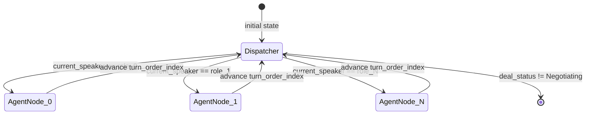
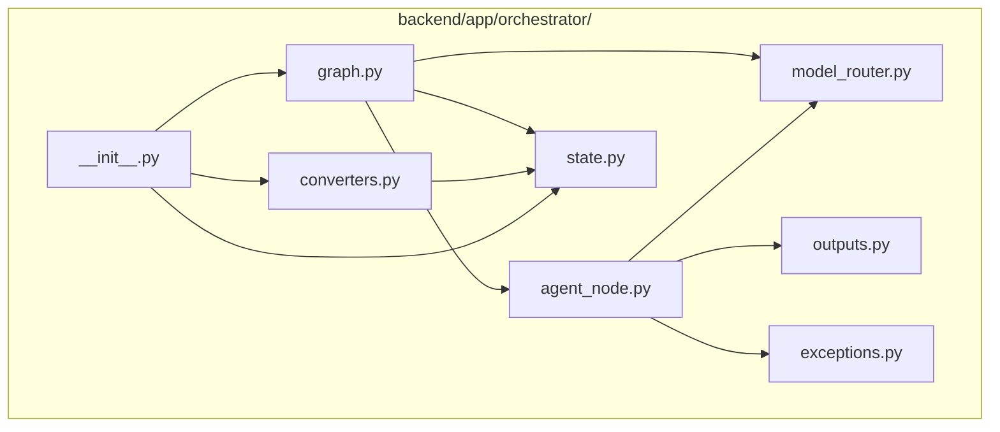

# Design Document: LangGraph N-Agent Orchestration Layer

## Overview

This design covers the LangGraph-based AI orchestration engine that drives the turn-based negotiation loop for the JuntoAI A2A MVP. The orchestrator coordinates N agents (negotiators + regulators + observers) through a config-driven state machine, routing each agent to a distinct LLM via Google Vertex AI Model Garden. The architecture is fully dynamic: agent count, turn order, personas, and termination thresholds are all read from the scenario JSON at runtime.

### Key Design Decisions

1. **TypedDict for LangGraph, Pydantic for the boundary** — LangGraph's `StateGraph` requires a `TypedDict` as its state schema. The Pydantic `NegotiationStateModel` (owned by spec 020) is the serialization format for Firestore and API responses. This spec owns the `NegotiationState` TypedDict and the explicit `to_pydantic()` / `from_pydantic()` converters.

2. **Single generic `create_agent_node()` factory** — A single factory function creates all agent nodes. The factory takes the agent's `role` and looks up the agent's `type` (`negotiator` | `regulator` | `observer`) from the scenario config at runtime. The agent type determines which output parser and state-update logic to use.

3. **Dispatcher node as central routing point** — A single `dispatcher` node inspects `current_speaker` and `deal_status` to determine the next node. Agent nodes always route back to the dispatcher. Topology: `agent_i -> dispatcher -> agent_j`.

4. **Agreement detection after every negotiator turn** — The dispatcher checks for price convergence (all negotiators' `last_proposed_price` within `agreement_threshold`) after every negotiator completes. A deal can close mid-cycle.

5. **LangChain Vertex AI integration** — Uses `ChatVertexAI` for Gemini models and `ChatAnthropicVertex` for Claude models on Vertex AI. Both use GCP IAM auth.

6. **Retry-once on parse failure** — On parse failure, retry once with explicit JSON formatting instruction. If retry fails, raise `AgentOutputParseError`.

7. **Async generator for SSE integration** — `run_negotiation()` yields `NegotiationState` snapshots after each node execution. The SSE endpoint iterates this generator.

## Architecture

### State Machine Flow



### Module Structure



### Directory Layout

```
backend/app/orchestrator/
+-- __init__.py           # Re-exports: build_graph, run_negotiation, NegotiationState
+-- state.py              # NegotiationState TypedDict + create_initial_state()
+-- outputs.py            # NegotiatorOutput, RegulatorOutput, ObserverOutput
+-- agent_node.py         # create_agent_node() + _build_prompt + _parse_output + _update_state + _advance_turn_order
+-- graph.py              # build_graph(), dispatcher, agreement detection, run_negotiation()
+-- model_router.py       # get_model() -> ChatVertexAI | ChatAnthropicVertex
+-- converters.py         # to_pydantic(), from_pydantic()
+-- exceptions.py         # ModelNotAvailableError, ModelTimeoutError, AgentOutputParseError
```


## Components and Interfaces

### 1. NegotiationState TypedDict (`state.py`)

The LangGraph runtime state. Uses `TypedDict` with `Annotated` types for LangGraph's channel-based state merging.

```python
from typing import TypedDict, Any, Annotated
from operator import add

class NegotiationState(TypedDict):
    session_id: str
    scenario_id: str
    turn_count: int                          # increments after full cycle
    max_turns: int
    current_speaker: str                     # role name of next agent
    deal_status: str                         # Negotiating | Agreed | Blocked | Failed
    current_offer: float
    history: Annotated[list[dict[str, Any]], add]  # append-only reducer
    hidden_context: dict[str, Any]           # keyed by agent role
    warning_count: int                       # global cumulative
    agreement_threshold: float
    scenario_config: dict[str, Any]          # full scenario JSON
    turn_order: list[str]                    # execution sequence per cycle
    turn_order_index: int                    # position in turn_order
    agent_states: dict[str, dict[str, Any]]  # per-agent tracking, keyed by role
    active_toggles: list[str]
```

The `history` field uses `Annotated[list, add]` so each node returns `{"history": [new_entry]}` and LangGraph appends automatically.

`create_initial_state()` builds the initial state from scenario config:

```python
def create_initial_state(
    session_id: str,
    scenario_config: dict[str, Any],
    active_toggles: list[str] | None = None,
    hidden_context: dict[str, Any] | None = None,
) -> NegotiationState:
    agents = scenario_config["agents"]
    params = scenario_config["negotiation_params"]

    # turn_order from config or derived: interleave negotiators with regulators
    turn_order = params.get("turn_order")
    if turn_order is None:
        negotiators = [a for a in agents if a.get("type", "negotiator") == "negotiator"]
        regulators = [a for a in agents if a.get("type") == "regulator"]
        turn_order = []
        for neg in negotiators:
            turn_order.append(neg["role"])
            for reg in regulators:
                turn_order.append(reg["role"])
        for a in agents:
            if a.get("type") == "observer":
                turn_order.append(a["role"])

    agent_states: dict[str, dict[str, Any]] = {}
    for a in agents:
        agent_type = a.get("type", "negotiator")
        agent_states[a["role"]] = {
            "role": a["role"],
            "name": a["name"],
            "agent_type": agent_type,
            "model_id": a["model_id"],
            "last_proposed_price": 0.0,
            "warning_count": 0,
        }

    return NegotiationState(
        session_id=session_id,
        scenario_id=scenario_config["id"],
        turn_count=0,
        max_turns=params.get("max_turns", 15),
        current_speaker=turn_order[0],
        deal_status="Negotiating",
        current_offer=0.0,
        history=[],
        hidden_context=hidden_context or {},
        warning_count=0,
        agreement_threshold=params.get("agreement_threshold", 1000000.0),
        scenario_config=scenario_config,
        turn_order=turn_order,
        turn_order_index=0,
        agent_states=agent_states,
        active_toggles=active_toggles or [],
    )
```

### 2. Output Models (`outputs.py`)

Pydantic V2 models for parsing LLM responses. Internal to the orchestrator.

```python
from pydantic import BaseModel
from typing import Any, Literal

class NegotiatorOutput(BaseModel):
    inner_thought: str
    public_message: str
    proposed_price: float
    extra_fields: dict[str, Any] = {}

class RegulatorOutput(BaseModel):
    status: Literal["CLEAR", "WARNING", "BLOCKED"]
    reasoning: str

class ObserverOutput(BaseModel):
    observation: str
    recommendation: str = ""
```

### 3. Model Router (`model_router.py`)

Maps `model_id` strings to LangChain chat model instances.

```python
from langchain_google_vertexai import ChatVertexAI, ChatAnthropicVertex

MODEL_FAMILIES: dict[str, type] = {
    "gemini": ChatVertexAI,
    "claude": ChatAnthropicVertex,
}

def get_model(
    model_id: str,
    fallback_model_id: str | None = None,
    project: str | None = None,
    location: str | None = None,
) -> BaseChatModel:
    """Return initialized LangChain chat model for model_id.
    Raises ModelNotAvailableError or ModelTimeoutError on failure."""
```

Supported: `gemini-2.5-flash`, `gemini-2.5-pro`, `claude-3-5-sonnet-v2`, `claude-sonnet-4`. Prefix before first `-` determines model family and LangChain class.

### 4. Agent Node Factory (`agent_node.py`)

Single factory creating callable node functions for any agent type.

```python
def create_agent_node(agent_role: str) -> Callable[[NegotiationState], dict[str, Any]]:
    """Create a LangGraph node callable for the given agent role."""
```

The returned callable executes this pipeline:

1. **`_build_prompt(agent_config, state)`** — Constructs system + user messages from `persona_prompt`, `goals`, `budget`, `hidden_context[role]`, and the output schema for the agent's type.
2. **`_parse_output(response, agent_type)`** — Parses LLM response JSON into `NegotiatorOutput`, `RegulatorOutput`, or `ObserverOutput`. Retries once on failure.
3. **`_update_state(parsed_output, agent_type, role, state)`** — Produces the state delta dict:
   - Negotiator: updates `current_offer`, `agent_states[role]["last_proposed_price"]`, appends to `history`
   - Regulator: increments `warning_count` on WARNING, sets `deal_status` to Blocked on 3 warnings or BLOCKED status, appends to `history`
   - Observer: appends to `history` only, no other state mutations
4. **`_advance_turn_order(state)`** — Increments `turn_order_index`. On wrap to 0, increments `turn_count`. Sets `current_speaker` to `turn_order[new_index]`.

Prompt structure:

```
SYSTEM: {persona_prompt}

Your goals:
- {goal_1}
- {goal_2}

Budget constraints: min={budget.min}, max={budget.max}, target={budget.target}

{hidden_context[role] contents, if present}

You MUST respond with valid JSON matching this schema:
{output_schema_json}


USER: Negotiation history so far:
{formatted history entries}

Current offer: {current_offer}
Turn: {turn_count} of {max_turns}

Respond with JSON only.
```

### 5. Graph Construction + Dispatcher + Agreement Detection (`graph.py`)

```python
def build_graph(scenario_config: dict[str, Any]) -> CompiledGraph:
    """Construct StateGraph dynamically from scenario config.

    1. Read agents array, create one node per unique role via create_agent_node()
    2. Add dispatcher node
    3. Set entry point to dispatcher
    4. Add edges: each agent node -> dispatcher
    5. Add conditional edges from dispatcher to agent nodes + END
    """

def _dispatcher(state: NegotiationState) -> dict[str, Any]:
    """Central routing node.

    1. If deal_status != Negotiating -> route to END
    2. If turn_count >= max_turns -> set Failed, route to END
    3. Check agreement: all negotiators' last_proposed_price within threshold
    4. Route to current_speaker's agent node
    """

def _check_agreement(state: NegotiationState) -> bool:
    """Return True if all negotiators have converged.

    - Collect last_proposed_price from agent_states where agent_type == negotiator
    - If only 1 negotiator, skip convergence (return False)
    - If any price is 0.0 (hasn't proposed yet), return False
    - Check: max(prices) - min(prices) <= agreement_threshold
    """

async def run_negotiation(
    initial_state: NegotiationState,
    scenario_config: dict[str, Any],
) -> AsyncGenerator[NegotiationState, None]:
    """Execute the compiled graph, yielding state after each node."""
    graph = build_graph(scenario_config)
    async for state_snapshot in graph.astream(initial_state):
        yield state_snapshot
```

### 6. State Converters (`converters.py`)

```python
def to_pydantic(state: NegotiationState) -> NegotiationStateModel:
    """Convert LangGraph TypedDict to Pydantic model for Firestore/API.

    Maps all fields including turn_order, turn_order_index, agent_states.
    agent_states dict values are serialized as-is (they're already plain dicts).
    """

def from_pydantic(model: NegotiationStateModel) -> NegotiationState:
    """Convert Pydantic model back to LangGraph TypedDict.

    Reconstructs agent_states with proper typing.
    Restores Annotated[list, add] history field.
    """
```

### 7. Exceptions (`exceptions.py`)

```python
class ModelNotAvailableError(Exception):
    """Raised when model_id is unrecognized or endpoint unavailable."""
    def __init__(self, model_id: str, message: str): ...

class ModelTimeoutError(Exception):
    """Raised when LLM request exceeds timeout and fallback fails."""
    def __init__(self, model_id: str, elapsed_seconds: float): ...

class AgentOutputParseError(Exception):
    """Raised when LLM response cannot be parsed after retry."""
    def __init__(self, agent_name: str, raw_response: str): ...
```

## Correctness Properties

These properties define the invariants that the orchestration layer must maintain. Each maps to a testable property-based test.

### P1: Output Model Round-Trip
FOR ALL valid `NegotiatorOutput` instances, `NegotiatorOutput.model_validate_json(instance.model_dump_json())` produces an equivalent object. Same for `RegulatorOutput` and `ObserverOutput`.

### P2: State Conversion Round-Trip
FOR ALL valid `NegotiationState` dicts, `from_pydantic(to_pydantic(state))` produces an equivalent state dict. Fields `turn_order`, `turn_order_index`, and `agent_states` must survive the round-trip.

### P3: Turn Order Advancement
AFTER any agent node executes, `turn_order_index` increments by 1. WHEN `turn_order_index` reaches `len(turn_order)`, it wraps to 0 and `turn_count` increments by 1. `current_speaker` always equals `turn_order[turn_order_index]`.

### P4: Negotiator State Update
AFTER a negotiator node executes, `current_offer` equals the agent's `proposed_price` AND `agent_states[role]["last_proposed_price"]` equals the same value. History has exactly one new entry with the agent's name.

### P5: Regulator State Update
AFTER a regulator node returns WARNING, `warning_count` increments by 1 AND `agent_states[role]["warning_count"]` increments by 1. AFTER 3 cumulative warnings, `deal_status` is `"Blocked"`.

### P6: Observer Read-Only
AFTER an observer node executes, `current_offer`, `deal_status`, and `warning_count` are unchanged from before the node executed. Only `history`, `turn_order_index`, `current_speaker`, and (possibly) `turn_count` change.

### P7: Hidden Context Injection
WHEN `hidden_context[role]` exists, the system prompt passed to the LLM for that role contains the hidden context content. WHEN `hidden_context[role]` does not exist, no hidden context appears in the prompt.

### P8: Agreement Detection
WHEN all negotiators' `last_proposed_price` values are within `agreement_threshold` of each other AND all prices are non-zero, `_check_agreement()` returns True. WHEN any pair differs by more than `agreement_threshold`, returns False. WHEN only 1 negotiator exists, always returns False.

### P9: Dispatcher Terminal Routing
WHEN `deal_status` is any of `"Agreed"`, `"Blocked"`, `"Failed"`, the dispatcher routes to END. WHEN `deal_status` is `"Negotiating"` and `turn_count < max_turns`, the dispatcher routes to the `current_speaker` node.

### P10: deal_status Invariant
`deal_status` is always one of `"Negotiating"`, `"Agreed"`, `"Blocked"`, `"Failed"`. Once `deal_status` leaves `"Negotiating"`, it never changes again.

### P11: Dynamic Graph Node Count
`build_graph(scenario_config)` creates exactly `len(unique_roles) + 1` nodes (one per unique agent role + dispatcher). No hardcoded role names appear in the graph.

### P12: Dispatcher Routes to current_speaker
The dispatcher's conditional edge always routes to the node whose name matches `state["current_speaker"]`, or to END on terminal status.

### P13: Output Parsing by Type
`_parse_output()` with `agent_type="negotiator"` validates against `NegotiatorOutput`. With `agent_type="regulator"` validates against `RegulatorOutput`. With `agent_type="observer"` validates against `ObserverOutput`. Mismatched types raise `AgentOutputParseError`.

### P14: Model Router Returns or Raises
`get_model(model_id)` either returns a `BaseChatModel` instance or raises `ModelNotAvailableError`. It never returns None. With a valid `fallback_model_id`, primary failure falls through to fallback before raising.

### P15: Turn Number Consistency
All history entries appended during the same cycle (same `turn_count` value) share the same `turn_number`. `turn_count` only increments when `turn_order_index` wraps to 0.

## Testing Strategy

- **Framework**: pytest + pytest-asyncio
- **Property-based testing**: hypothesis library, minimum 100 iterations per property
- **LLM mocking**: All tests mock the LangChain chat model clients. No real Vertex AI calls in unit/integration tests.
- **State generation**: hypothesis strategies generate valid `NegotiationState` dicts with arbitrary agent counts, turn orders, and agent_states configurations.
- **Coverage target**: 70% minimum (lines, functions, branches, statements) per workspace testing guidelines.
- **Test location**: `backend/tests/unit/orchestrator/` for unit tests, `backend/tests/integration/orchestrator/` for graph execution tests.
