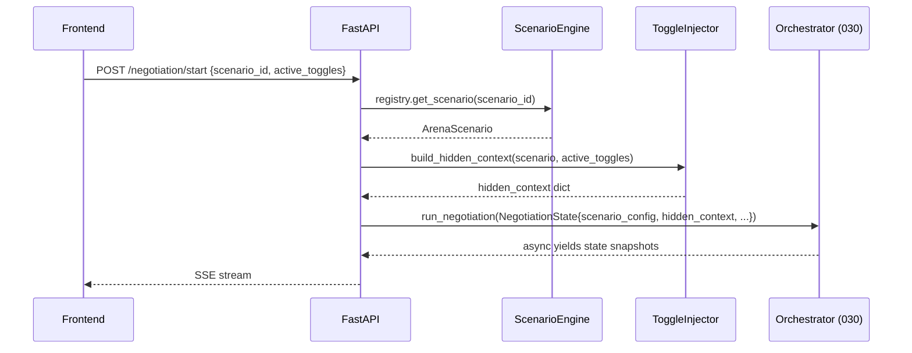

# Design Document: Scenario Config Engine

## Overview

This design covers the config-driven Scenario Engine that decouples the JuntoAI A2A backend from any hardcoded negotiation use case. The engine loads Arena Scenario JSON files at startup, validates them against a strict Pydantic V2 schema, indexes them in an in-memory registry, and exposes them via FastAPI endpoints. A Toggle Injector component assembles hidden context dictionaries from activated investor toggles for injection into the LangGraph NegotiationState (spec 030) before graph execution begins.

### Key Design Decisions

1. **Pydantic V2 as the schema, not JSON Schema** — Instead of maintaining a separate JSON Schema file and a Pydantic model, the Pydantic models ARE the schema. Pydantic V2's `model_validate()` provides validation, error messages, and type coercion in one pass. A standalone `.json` schema file would be a second source of truth that drifts. If external tooling ever needs a JSON Schema, Pydantic can generate one via `model_json_schema()`.

2. **Flat module layout under `backend/app/scenarios/`** — No sub-packages. The engine is small enough that `models.py`, `loader.py`, `registry.py`, `toggle_injector.py`, `pretty_printer.py`, `exceptions.py`, and `router.py` in a single directory is clearer than nested folders. The `scenarios/data/` subdirectory holds the `*.scenario.json` files.

3. **Eager validation at startup, not lazy** — All scenario files are parsed and validated when the `ScenarioRegistry` initializes. Invalid files are logged and skipped. This means a bad JSON file never silently corrupts a running system — you see the error in startup logs. The tradeoff is slightly slower cold starts, but with 3 MVP files this is negligible.

4. **Toggle Injector merges payloads per role** — When multiple toggles target the same agent role, their `hidden_context_payload` dicts are shallow-merged under a single role key. This matches how the orchestrator (spec 030) reads `hidden_context[role]` as a flat dict. Deep merge would be fragile and scenario authors would need to understand nested key conflicts.

5. **`turn_order` derived from agents array** — The scenario JSON does not include an explicit `turn_order` field in `negotiation_params`. The engine derives it from the `agents` array order: negotiator roles interleaved with regulator checks, matching the orchestrator's dispatcher pattern from spec 030. This keeps scenario authoring simple — just order the agents array correctly.

6. **`type` field on Agent_Definition** — Each agent has a `type` field (`"negotiator"` or `"regulator"`) that the orchestrator uses to select the output schema and state update logic. This is not in the original requirements but is required by spec 030's `create_agent_node()` factory. The schema enforces it.

## Architecture

```
┌──────────────────────────────────────────────────────────────────┐
│                    Scenario Engine Module                         │
│                    backend/app/scenarios/                         │
├──────────────────────────────────────────────────────────────────┤
│                                                                  │
│  ┌─────────────┐    ┌──────────────────┐    ┌────────────────┐  │
│  │ models.py   │    │ loader.py        │    │ registry.py    │  │
│  │             │    │                  │    │                │  │
│  │ ArenaScen-  │◄───│ load_scenario()  │───►│ ScenarioReg-   │  │
│  │ ario        │    │ _read_file()     │    │ istry          │  │
│  │ AgentDef    │    │ _validate()      │    │ list_scenarios()│  │
│  │ ToggleDef   │    │                  │    │ get_scenario() │  │
│  │ Budget      │    └──────────────────┘    │ _discover()    │  │
│  │ Negotiation │                            └───────┬────────┘  │
│  │ Params      │                                    │           │
│  │ OutcomeRec  │    ┌──────────────────┐            │           │
│  │             │    │ toggle_injector  │            │           │
│  └─────────────┘    │ .py              │            │           │
│                     │                  │            │           │
│                     │ build_hidden_    │◄───────────┘           │
│                     │ context()        │                        │
│                     └──────────────────┘                        │
│                                                                  │
│  ┌─────────────┐    ┌──────────────────┐                        │
│  │ pretty_     │    │ router.py        │                        │
│  │ printer.py  │    │                  │                        │
│  │             │    │ GET /scenarios   │                        │
│  │ pretty_     │    │ GET /scenarios/  │                        │
│  │ print()     │    │   {scenario_id}  │                        │
│  └─────────────┘    └──────────────────┘                        │
│                                                                  │
│  ┌─────────────┐    ┌──────────────────┐                        │
│  │ exceptions  │    │ data/            │                        │
│  │ .py         │    │  *.scenario.json │                        │
│  └─────────────┘    └──────────────────┘                        │
└──────────────────────────────────────────────────────────────────┘
         │                        │
         ▼                        ▼
┌─────────────────┐    ┌──────────────────────┐
│ Spec 020:       │    │ Spec 030:            │
│ FastAPI app     │    │ Orchestrator         │
│ main.py router  │    │ NegotiationState     │
│ registration    │    │ hidden_context field  │
└─────────────────┘    └──────────────────────┘
```

### Directory Layout

```
backend/app/scenarios/
├── __init__.py            # Re-exports: ScenarioRegistry, build_hidden_context, ArenaScenario
├── models.py              # Pydantic V2 models (ArenaScenario, AgentDefinition, etc.)
├── loader.py              # load_scenario_from_file(), load_scenario_from_dict()
├── registry.py            # ScenarioRegistry class
├── toggle_injector.py     # build_hidden_context()
├── pretty_printer.py      # pretty_print()
├── exceptions.py          # ScenarioValidationError, ScenarioFileNotFoundError, etc.
├── router.py              # FastAPI APIRouter for /scenarios endpoints
└── data/
    ├── talent-war.scenario.json
    ├── ma-buyout.scenario.json
    └── b2b-sales.scenario.json
```

## Components and Interfaces

### 1. Pydantic Models (`models.py`)

The schema is defined entirely as Pydantic V2 models. These serve as both validation and documentation.

```python
from pydantic import BaseModel, Field, field_validator, model_validator
from typing import Literal

class Budget(BaseModel):
    min: float = Field(..., ge=0, description="Minimum acceptable value")
    max: float = Field(..., ge=0, description="Maximum budget ceiling")
    target: float = Field(..., ge=0, description="Target/ideal value")

    @model_validator(mode="after")
    def min_le_max(self) -> "Budget":
        if self.min > self.max:
            raise ValueError(f"min ({self.min}) must be <= max ({self.max})")
        return self

class AgentDefinition(BaseModel):
    role: str = Field(..., min_length=1)
    name: str = Field(..., min_length=1)
    type: Literal["negotiator", "regulator"] = Field(
        ..., description="Agent type for output schema selection"
    )
    persona_prompt: str = Field(..., min_length=1)
    goals: list[str] = Field(..., min_length=1)
    budget: Budget
    tone: str = Field(..., min_length=1)
    output_fields: list[str] = Field(..., min_length=1)
    model_id: str = Field(..., min_length=1)
    fallback_model_id: str | None = Field(default=None)

class ToggleDefinition(BaseModel):
    id: str = Field(..., min_length=1)
    label: str = Field(..., min_length=1)
    target_agent_role: str = Field(..., min_length=1)
    hidden_context_payload: dict = Field(..., min_length=1)

class NegotiationParams(BaseModel):
    max_turns: int = Field(..., gt=0)
    agreement_threshold: float = Field(..., gt=0)

class OutcomeReceipt(BaseModel):
    equivalent_human_time: str = Field(..., min_length=1)
    process_label: str = Field(..., min_length=1)

class ArenaScenario(BaseModel):
    id: str = Field(..., min_length=1)
    name: str = Field(..., min_length=1)
    description: str = Field(..., min_length=1)
    agents: list[AgentDefinition] = Field(..., min_length=2)
    toggles: list[ToggleDefinition] = Field(..., min_length=1)
    negotiation_params: NegotiationParams
    outcome_receipt: OutcomeReceipt

    @model_validator(mode="after")
    def validate_cross_references(self) -> "ArenaScenario":
        agent_roles = {a.role for a in self.agents}
        # Unique roles
        if len(agent_roles) != len(self.agents):
            roles = [a.role for a in self.agents]
            dupes = [r for r in roles if roles.count(r) > 1]
            raise ValueError(f"Duplicate agent roles: {set(dupes)}")
        # Toggle target_agent_role references valid role
        for toggle in self.toggles:
            if toggle.target_agent_role not in agent_roles:
                raise ValueError(
                    f"Toggle '{toggle.id}' targets role '{toggle.target_agent_role}' "
                    f"which is not in agents: {agent_roles}"
                )
        return self
```

Why `min_length=2` on `agents`: The requirements state "exactly 3" agents, but the technical master doc and spec 030 design support N-agent scenarios. Enforcing exactly 3 would break extensibility (Requirement 10). The minimum of 2 ensures at least two parties exist for a negotiation. The `type` field on each agent tells the orchestrator how to handle it.

Why `min_length=1` on `toggles`: Requirements 1.6 states "at least 1 Toggle_Definition."

### 2. Scenario Loader (`loader.py`)

Reads a JSON file, parses it, and validates it against the Pydantic models.

```python
import json
from pathlib import Path

def load_scenario_from_file(file_path: str | Path) -> ArenaScenario:
    """Load and validate a scenario from a JSON file.
    
    Raises:
        ScenarioFileNotFoundError: File doesn't exist or isn't readable
        ScenarioParseError: File content isn't valid JSON
        ScenarioValidationError: JSON doesn't conform to schema
    """
    path = Path(file_path)
    if not path.exists() or not path.is_file():
        raise ScenarioFileNotFoundError(str(path))
    
    try:
        raw = path.read_text(encoding="utf-8")
    except OSError as e:
        raise ScenarioFileNotFoundError(str(path)) from e
    
    try:
        data = json.loads(raw)
    except json.JSONDecodeError as e:
        raise ScenarioParseError(str(path), str(e)) from e
    
    return load_scenario_from_dict(data, source_path=str(path))


def load_scenario_from_dict(
    data: dict, source_path: str = "<dict>"
) -> ArenaScenario:
    """Validate a dict against the ArenaScenario schema.
    
    Raises:
        ScenarioValidationError: Data doesn't conform to schema
    """
    try:
        return ArenaScenario.model_validate(data)
    except ValidationError as e:
        raise ScenarioValidationError(source_path, e.errors()) from e
```

Two entry points: `load_scenario_from_file` for disk-based discovery, `load_scenario_from_dict` for programmatic use (tests, API-driven scenario creation in the future).

### 3. Scenario Registry (`registry.py`)

In-memory index of validated scenarios. Initialized eagerly at startup.

```python
import os
import logging
from pathlib import Path

logger = logging.getLogger(__name__)

DEFAULT_SCENARIOS_DIR = "./scenarios"

class ScenarioRegistry:
    def __init__(self, scenarios_dir: str | None = None):
        self._scenarios: dict[str, ArenaScenario] = {}
        self._dir = Path(scenarios_dir or os.getenv("SCENARIOS_DIR", DEFAULT_SCENARIOS_DIR))
        self._discover()

    def _discover(self) -> None:
        if not self._dir.exists():
            logger.warning(f"Scenarios directory not found: {self._dir}")
            return
        for path in sorted(self._dir.glob("*.scenario.json")):
            try:
                scenario = load_scenario_from_file(path)
                self._scenarios[scenario.id] = scenario
                logger.info(f"Loaded scenario: {scenario.id} ({scenario.name})")
            except (ScenarioFileNotFoundError, ScenarioParseError, ScenarioValidationError) as e:
                logger.warning(f"Skipping invalid scenario file {path}: {e}")

    def list_scenarios(self) -> list[dict[str, str]]:
        return [
            {"id": s.id, "name": s.name, "description": s.description}
            for s in self._scenarios.values()
        ]

    def get_scenario(self, scenario_id: str) -> ArenaScenario:
        if scenario_id not in self._scenarios:
            raise ScenarioNotFoundError(scenario_id)
        return self._scenarios[scenario_id]

    def __len__(self) -> int:
        return len(self._scenarios)
```

`sorted()` on glob ensures deterministic ordering across OS file systems. The registry imposes no hardcoded limit on the number of scenarios (Requirement 10.4).

### 4. Toggle Injector (`toggle_injector.py`)

Assembles the `hidden_context` dictionary for injection into `NegotiationState`.

```python
def build_hidden_context(
    scenario: ArenaScenario,
    active_toggle_ids: list[str],
) -> dict[str, Any]:
    """Build hidden_context dict from activated toggles.
    
    Returns:
        Dict keyed by agent role, values are merged toggle payloads.
    
    Raises:
        InvalidToggleError: If a toggle_id doesn't exist in the scenario.
    """
    if not active_toggle_ids:
        return {}

    toggle_map = {t.id: t for t in scenario.toggles}
    hidden_context: dict[str, Any] = {}

    for toggle_id in active_toggle_ids:
        if toggle_id not in toggle_map:
            raise InvalidToggleError(toggle_id, scenario.id)
        toggle = toggle_map[toggle_id]
        role = toggle.target_agent_role
        if role not in hidden_context:
            hidden_context[role] = {}
        # Shallow merge — later toggles overwrite conflicting keys
        hidden_context[role].update(toggle.hidden_context_payload)

    return hidden_context
```

Shallow merge is intentional. If two toggles targeting the same role have overlapping keys, the last one wins. This is documented behavior — scenario authors should use distinct keys in their payloads.

### 5. Pretty Printer (`pretty_printer.py`)

Serializes an `ArenaScenario` back to formatted JSON.

```python
def pretty_print(scenario: ArenaScenario) -> str:
    """Serialize an ArenaScenario to a 2-space indented JSON string."""
    return scenario.model_dump_json(indent=2)
```

This is intentionally trivial. Pydantic V2's `model_dump_json()` handles all serialization. The round-trip property (Requirement 3.3) is validated by parsing the output back through `load_scenario_from_dict(json.loads(output))`.

### 6. Exceptions (`exceptions.py`)

```python
class ScenarioValidationError(Exception):
    def __init__(self, file_path: str, errors: list):
        self.file_path = file_path
        self.errors = errors
        super().__init__(f"Validation failed for {file_path}: {errors}")

class ScenarioFileNotFoundError(Exception):
    def __init__(self, file_path: str):
        self.file_path = file_path
        super().__init__(f"Scenario file not found: {file_path}")

class ScenarioParseError(Exception):
    def __init__(self, file_path: str, detail: str):
        self.file_path = file_path
        self.detail = detail
        super().__init__(f"JSON parse error in {file_path}: {detail}")

class ScenarioNotFoundError(Exception):
    def __init__(self, scenario_id: str):
        self.scenario_id = scenario_id
        super().__init__(f"Scenario not found: {scenario_id}")

class InvalidToggleError(Exception):
    def __init__(self, toggle_id: str, scenario_id: str):
        self.toggle_id = toggle_id
        self.scenario_id = scenario_id
        super().__init__(
            f"Toggle '{toggle_id}' not found in scenario '{scenario_id}'"
        )
```

### 7. FastAPI Router (`router.py`)

```python
from fastapi import APIRouter, Depends, HTTPException

router = APIRouter(prefix="/scenarios", tags=["scenarios"])

@router.get("")
async def list_scenarios(
    registry: ScenarioRegistry = Depends(get_scenario_registry),
) -> list[dict[str, str]]:
    return registry.list_scenarios()

@router.get("/{scenario_id}")
async def get_scenario(
    scenario_id: str,
    registry: ScenarioRegistry = Depends(get_scenario_registry),
):
    try:
        scenario = registry.get_scenario(scenario_id)
        return scenario.model_dump()
    except ScenarioNotFoundError:
        raise HTTPException(
            status_code=404,
            detail={"scenario_id": scenario_id, "error": "Scenario not found"},
        )
```

The router is registered in `main.py` (spec 020) under the `/api/v1` prefix, making the full paths `GET /api/v1/scenarios` and `GET /api/v1/scenarios/{scenario_id}`.

The `get_scenario_registry` dependency returns a module-level singleton, same pattern as the Firestore client in spec 020:

```python
_registry: ScenarioRegistry | None = None

def get_scenario_registry() -> ScenarioRegistry:
    global _registry
    if _registry is None:
        _registry = ScenarioRegistry()
    return _registry
```

## Data Models

### ArenaScenario Field Reference

| Field | Type | Constraint | Description |
|---|---|---|---|
| `id` | `str` | min_length=1 | Unique scenario identifier (e.g., `"talent_war"`) |
| `name` | `str` | min_length=1 | Human-readable title |
| `description` | `str` | min_length=1 | Scenario premise summary |
| `agents` | `list[AgentDefinition]` | min_length=2 | Agent cast (roles must be unique) |
| `toggles` | `list[ToggleDefinition]` | min_length=1 | Investor-facing information toggles |
| `negotiation_params` | `NegotiationParams` | — | Turn limits and agreement threshold |
| `outcome_receipt` | `OutcomeReceipt` | — | Post-negotiation display metadata |

### AgentDefinition Field Reference

| Field | Type | Constraint | Description |
|---|---|---|---|
| `role` | `str` | min_length=1 | Unique role name within scenario |
| `name` | `str` | min_length=1 | Display name |
| `type` | `Literal["negotiator", "regulator"]` | — | Determines output schema in orchestrator |
| `persona_prompt` | `str` | min_length=1 | Full system prompt text |
| `goals` | `list[str]` | min_length=1 | Structured goals for UI display |
| `budget` | `Budget` | min ≤ max | Financial constraints |
| `tone` | `str` | min_length=1 | Persona tone descriptor |
| `output_fields` | `list[str]` | min_length=1 | Expected LLM output field names |
| `model_id` | `str` | min_length=1 | Vertex AI model identifier |
| `fallback_model_id` | `str \| None` | — | Optional fallback model |

### ToggleDefinition Field Reference

| Field | Type | Constraint | Description |
|---|---|---|---|
| `id` | `str` | min_length=1 | Unique toggle identifier within scenario |
| `label` | `str` | min_length=1 | Investor-facing display label |
| `target_agent_role` | `str` | must match an agent role | Which agent receives the hidden context |
| `hidden_context_payload` | `dict` | non-empty | Key-value pairs injected into agent prompt |

### NegotiationParams Field Reference

| Field | Type | Constraint | Description |
|---|---|---|---|
| `max_turns` | `int` | > 0 | Maximum negotiation rounds |
| `agreement_threshold` | `float` | > 0 | Price convergence threshold |

### OutcomeReceipt Field Reference

| Field | Type | Constraint | Description |
|---|---|---|---|
| `equivalent_human_time` | `str` | min_length=1 | Human-equivalent time (e.g., "~3 weeks") |
| `process_label` | `str` | min_length=1 | Process name (e.g., "Talent Acquisition") |

### Integration with NegotiationState (spec 030)

When a negotiation starts, the backend:

1. Loads the `ArenaScenario` from the registry via `scenario_id`
2. Calls `build_hidden_context(scenario, active_toggle_ids)` to get the hidden context dict
3. Initializes the `NegotiationState` with:
   - `scenario_config`: `scenario.model_dump()` (full scenario as dict)
   - `hidden_context`: output of `build_hidden_context()`
   - `max_turns`: `scenario.negotiation_params.max_turns`
   - `agreement_threshold`: `scenario.negotiation_params.agreement_threshold`
   - `turn_order`: derived from agents array order (roles in sequence)




## Correctness Properties

*A property is a characteristic or behavior that should hold true across all valid executions of a system — essentially, a formal statement about what the system should do. Properties serve as the bridge between human-readable specifications and machine-verifiable correctness guarantees.*

### Property 1: ArenaScenario round-trip serialization

*For any* valid `ArenaScenario` object, serializing it via `pretty_print()` and then parsing the resulting JSON string back via `load_scenario_from_dict(json.loads(output))` shall produce an `ArenaScenario` object equal to the original.

**Validates: Requirements 3.1, 3.2, 3.3**

### Property 2: Schema rejects scenarios with missing required fields

*For any* valid `ArenaScenario` dict, removing any single required top-level field (`id`, `name`, `description`, `agents`, `toggles`, `negotiation_params`, `outcome_receipt`) or any required nested field from an `AgentDefinition` or `ToggleDefinition` shall cause `ArenaScenario.model_validate()` to raise a `ValidationError`.

**Validates: Requirements 1.1, 1.2, 1.3, 1.4, 1.5, 1.6, 1.7, 1.8, 2.2**

### Property 3: Cross-reference validation rejects invalid toggle targets

*For any* valid `ArenaScenario` dict, if any `ToggleDefinition.target_agent_role` is changed to a string that does not match any `AgentDefinition.role` in the same scenario, `ArenaScenario.model_validate()` shall raise a `ValidationError`.

**Validates: Requirements 1.9, 2.5**

### Property 4: Unique agent roles constraint

*For any* scenario dict containing two or more `AgentDefinition` objects with the same `role` value, `ArenaScenario.model_validate()` shall raise a `ValidationError`.

**Validates: Requirements 2.6**

### Property 5: Toggle injection produces correct hidden context

*For any* valid `ArenaScenario` and any subset of its toggle identifiers, `build_hidden_context(scenario, toggle_ids)` shall return a dictionary where: (a) every key is a `target_agent_role` from an activated toggle, (b) the value for each role key contains all key-value pairs from the `hidden_context_payload` of every activated toggle targeting that role, and (c) no keys from non-activated toggles appear.

**Validates: Requirements 5.1, 5.2, 5.3, 10.3**

### Property 6: Invalid toggle identifiers raise InvalidToggleError

*For any* valid `ArenaScenario` and any toggle identifier string that does not match any `ToggleDefinition.id` in the scenario, `build_hidden_context(scenario, [invalid_id])` shall raise an `InvalidToggleError` containing the invalid toggle id and the scenario id.

**Validates: Requirements 5.6**

### Property 7: Registry get/list consistency

*For any* set of valid `ArenaScenario` objects registered in a `ScenarioRegistry`: (a) `list_scenarios()` shall return exactly one entry per registered scenario with matching `id`, `name`, and `description`, (b) `get_scenario(id)` shall return the original `ArenaScenario` object for each registered id, and (c) `get_scenario(unknown_id)` shall raise `ScenarioNotFoundError` for any id not in the registry.

**Validates: Requirements 4.4, 4.5, 4.6**

### Property 8: Non-JSON content raises ScenarioParseError

*For any* string that is not valid JSON, writing it to a file and calling `load_scenario_from_file()` shall raise a `ScenarioParseError` containing the file path.

**Validates: Requirements 2.4**

## Error Handling

### Exception Hierarchy

| Exception | Raised By | HTTP Status | Response Body |
|---|---|---|---|
| `ScenarioValidationError(file_path, errors)` | `loader.py` | — (startup only) | Logged, file skipped |
| `ScenarioFileNotFoundError(file_path)` | `loader.py` | — (startup only) | Logged, file skipped |
| `ScenarioParseError(file_path, detail)` | `loader.py` | — (startup only) | Logged, file skipped |
| `ScenarioNotFoundError(scenario_id)` | `registry.py` | 404 | `{"scenario_id": "...", "error": "Scenario not found"}` |
| `InvalidToggleError(toggle_id, scenario_id)` | `toggle_injector.py` | 400 | `{"toggle_id": "...", "scenario_id": "...", "error": "Toggle not found"}` |

### Exception-to-HTTP Mapping

The scenario router handles `ScenarioNotFoundError` directly via try/except → `HTTPException(404)`. The `InvalidToggleError` is caught by the negotiation start endpoint (spec 020) and mapped to HTTP 400.

Startup errors (`ScenarioValidationError`, `ScenarioFileNotFoundError`, `ScenarioParseError`) are never exposed via HTTP. They are logged at WARNING level during registry initialization and the invalid file is skipped. This ensures one bad scenario file doesn't take down the entire service.

### Validation Error Detail

`ScenarioValidationError.errors` contains the Pydantic V2 error list, which includes:
- `loc`: field path (e.g., `["agents", 0, "budget", "min"]`)
- `msg`: human-readable error message
- `type`: error type code (e.g., `"missing"`, `"value_error"`)

This gives scenario authors precise feedback on what's wrong with their JSON file.

## Testing Strategy

### Unit Tests (Example-Based)

Unit tests verify specific, concrete expectations. External services are not involved — this module is pure Python with no external dependencies.

**Framework:** `pytest`

**Key test areas:**

- `test_models.py`: Valid scenario instantiation, field defaults, Budget min ≤ max constraint, AgentDefinition with all required fields, ToggleDefinition with all required fields
- `test_loader.py`: Load valid file returns ArenaScenario, non-existent path raises ScenarioFileNotFoundError, invalid JSON raises ScenarioParseError, invalid schema raises ScenarioValidationError
- `test_registry.py`: Discovery from temp directory with valid/invalid files, list_scenarios returns correct entries, get_scenario returns correct object, get_scenario with unknown id raises ScenarioNotFoundError, SCENARIOS_DIR env var is respected
- `test_toggle_injector.py`: Single toggle injection, multiple toggles same role merge, no toggles returns empty dict, invalid toggle raises InvalidToggleError
- `test_pretty_printer.py`: Output is valid JSON, output has 2-space indentation
- `test_scenario_files.py`: Each MVP scenario file (talent-war, ma-buyout, b2b-sales) loads successfully, contains expected agent roles/names/budgets, contains expected toggles
- `test_router.py` (integration): GET /api/v1/scenarios returns list, GET /api/v1/scenarios/{id} returns full scenario, GET /api/v1/scenarios/{unknown} returns 404

### Property-Based Tests

Property-based tests verify universal invariants across generated inputs. Use `hypothesis` as the PBT library.

Each property test must run a minimum of 100 iterations and be tagged with a comment referencing the design property.

**Property tests to implement:**

1. **Feature: 040_a2a-scenario-config-engine, Property 1: ArenaScenario round-trip serialization**
   - Generate random valid `ArenaScenario` instances using `hypothesis` strategies (random strings for ids/names, random floats for budgets, random agent counts ≥ 2, random toggle counts ≥ 1)
   - Assert `load_scenario_from_dict(json.loads(pretty_print(scenario)))` produces an equal object

2. **Feature: 040_a2a-scenario-config-engine, Property 2: Schema rejects scenarios with missing required fields**
   - Generate valid scenario dicts, then systematically remove one required field at a time
   - Assert `ArenaScenario.model_validate()` raises `ValidationError` for each removal

3. **Feature: 040_a2a-scenario-config-engine, Property 3: Cross-reference validation rejects invalid toggle targets**
   - Generate valid scenario dicts, then replace `target_agent_role` with a string not in the agents list
   - Assert `ArenaScenario.model_validate()` raises `ValidationError`

4. **Feature: 040_a2a-scenario-config-engine, Property 4: Unique agent roles constraint**
   - Generate scenario dicts with duplicate agent roles
   - Assert `ArenaScenario.model_validate()` raises `ValidationError`

5. **Feature: 040_a2a-scenario-config-engine, Property 5: Toggle injection produces correct hidden context**
   - Generate random valid `ArenaScenario` instances and random subsets of their toggle ids
   - Assert `build_hidden_context()` output contains exactly the expected role keys with merged payloads

6. **Feature: 040_a2a-scenario-config-engine, Property 6: Invalid toggle identifiers raise InvalidToggleError**
   - Generate random valid `ArenaScenario` instances and random strings not matching any toggle id
   - Assert `build_hidden_context()` raises `InvalidToggleError`

7. **Feature: 040_a2a-scenario-config-engine, Property 7: Registry get/list consistency**
   - Generate random sets of valid `ArenaScenario` objects, register them in a `ScenarioRegistry`
   - Assert `list_scenarios()` returns all ids and `get_scenario(id)` returns the correct object

8. **Feature: 040_a2a-scenario-config-engine, Property 8: Non-JSON content raises ScenarioParseError**
   - Generate random strings that are not valid JSON
   - Write to temp files and assert `load_scenario_from_file()` raises `ScenarioParseError`

**Configuration:**
- Library: `hypothesis`
- Min iterations: 100 per property (`@settings(max_examples=100)`)
- Each test tagged: `# Feature: 040_a2a-scenario-config-engine, Property N: <title>`
- Each correctness property is implemented by a single property-based test

**Test file structure:**
```
backend/tests/
├── unit/
│   ├── test_scenario_models.py
│   ├── test_scenario_loader.py
│   ├── test_scenario_registry.py
│   ├── test_toggle_injector.py
│   ├── test_pretty_printer.py
│   └── test_scenario_files.py
├── integration/
│   └── test_scenario_router.py
├── property/
│   └── test_scenario_properties.py    # All 8 property tests
└── conftest.py                        # Shared fixtures, hypothesis strategies
```
