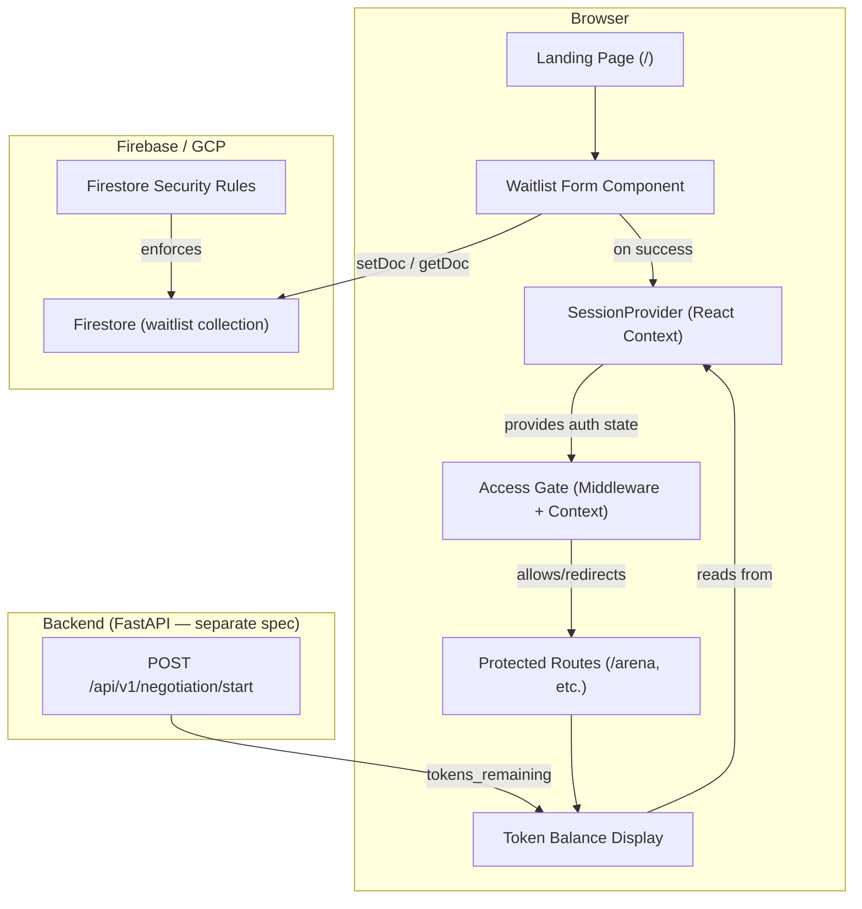
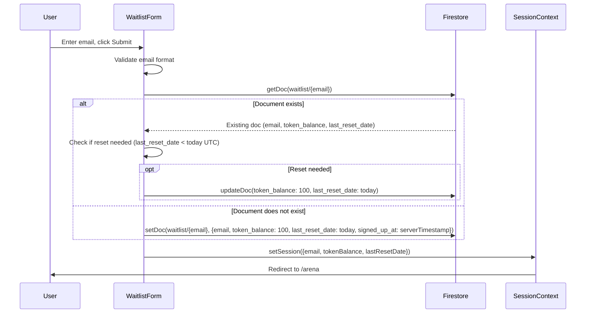

# Design Document: A2A Frontend Gate & Waitlist

## Overview

This design covers the Next.js 14 frontend foundation for the JuntoAI A2A MVP: the application scaffold, landing page, email waitlist capture, access gate, token system, Firebase/Firestore client integration, and Firestore security rules.

The frontend is a greenfield Next.js 14+ App Router application deployed to GCP Cloud Run. It uses Tailwind CSS for styling, Lucide React for icons, and the Firebase JS SDK (modular/tree-shakeable imports) for client-side Firestore access. The backend (FastAPI) is a separate service — this spec only covers the frontend and the Firestore security rules.

### Key Design Decisions

1. **Client-side Firestore for waitlist only.** The waitlist signup writes directly to Firestore from the browser using the Firebase JS SDK. This avoids a round-trip through the backend for a simple document create/read. Firestore Security Rules enforce data integrity.

2. **No Firebase Auth.** Authentication is email-based waitlist entry, not Firebase Authentication. The "session" is a React context holding the email + token state, persisted only for the browser session (sessionStorage). This is intentional — the product is a gated demo, not a full auth system.

3. **Backend is source of truth for token deductions.** The frontend never writes token decrements to Firestore. It reads the initial balance on login, displays it optimistically, and syncs from the backend response (`tokens_remaining`) after each simulation start. The backend uses atomic Firestore increments to prevent race conditions.

4. **Daily reset is client-triggered on auth.** When a returning user submits their email, the frontend reads their Waitlist_Document. If `last_reset_date < today (UTC)`, the frontend writes the reset (`token_balance: 100`, `last_reset_date: today`). This is safe because Firestore Security Rules cap `token_balance` at 100 and the reset is idempotent.

5. **Access gate via React context + middleware.** A `SessionProvider` context holds auth state. Next.js middleware redirects unauthenticated requests to `/`. Protected route layouts also check context as a client-side fallback.

## Architecture



### Route Structure

```
frontend/
├── app/
│   ├── layout.tsx              # Root layout: global styles, SessionProvider
│   ├── page.tsx                # Landing page (/)
│   ├── globals.css             # Tailwind imports
│   └── (protected)/
│       ├── layout.tsx          # Protected layout: gate check
│       └── arena/
│           └── page.tsx        # Arena selector (future spec)
├── components/
│   ├── WaitlistForm.tsx        # Email capture form
│   └── TokenDisplay.tsx        # "Tokens: X / 100" badge
├── lib/
│   ├── firebase.ts             # Firebase app + Firestore singleton
│   ├── waitlist.ts             # Firestore waitlist read/write logic
│   └── tokens.ts               # Token reset logic, balance helpers
├── context/
│   └── SessionContext.tsx      # React context: email, tokenBalance, etc.
├── middleware.ts               # Next.js middleware: redirect if no session
└── firestore.rules             # Firestore Security Rules
```

### Data Flow: Waitlist Signup (New User)



## Components and Interfaces

### 1. Firebase Client (`lib/firebase.ts`)

```typescript
// Singleton Firebase app + Firestore instance
import { initializeApp, getApps } from "firebase/app";
import { getFirestore, Firestore } from "firebase/firestore";

const firebaseConfig = {
  apiKey: process.env.NEXT_PUBLIC_FIREBASE_API_KEY,
  projectId: process.env.NEXT_PUBLIC_FIREBASE_PROJECT_ID,
  appId: process.env.NEXT_PUBLIC_FIREBASE_APP_ID,
};

// Validate at init time
for (const [key, value] of Object.entries(firebaseConfig)) {
  if (!value) throw new Error(`Missing Firebase env var: ${key}`);
}

const app = getApps().length === 0 ? initializeApp(firebaseConfig) : getApps()[0];
export const db: Firestore = getFirestore(app);
```

### 2. Waitlist Service (`lib/waitlist.ts`)

```typescript
interface WaitlistDocument {
  email: string;
  signed_up_at: Timestamp;
  token_balance: number;
  last_reset_date: string; // "YYYY-MM-DD"
}

// joinWaitlist(email: string): Promise<WaitlistDocument>
// - Normalizes email to lowercase
// - Checks if doc exists via getDoc
// - If exists: returns existing doc (caller handles reset)
// - If not: creates doc with setDoc, returns new doc
```

### 3. Token Helpers (`lib/tokens.ts`)

```typescript
// getUtcDateString(): string — returns "YYYY-MM-DD" in UTC
// needsReset(lastResetDate: string): boolean — true if lastResetDate < today UTC
// resetTokens(email: string): Promise<void> — updates Firestore doc
// formatTokenDisplay(balance: number): string — "Tokens: X / 100"
```

### 4. Session Context (`context/SessionContext.tsx`)

```typescript
interface SessionState {
  email: string | null;
  tokenBalance: number;
  lastResetDate: string | null;
  isAuthenticated: boolean;
}

interface SessionContextValue extends SessionState {
  login: (email: string, tokenBalance: number, lastResetDate: string) => void;
  logout: () => void;
  updateTokenBalance: (newBalance: number) => void;
}
```

The context persists `email` to `sessionStorage` so the middleware can check auth state. On mount, the provider reads from `sessionStorage` to restore state. When the tab/window closes, `sessionStorage` is cleared by the browser.

### 5. WaitlistForm Component (`components/WaitlistForm.tsx`)

Props: none (uses SessionContext internally).

State:
- `email: string` — input value
- `error: string | null` — validation or Firestore error
- `isLoading: boolean` — submission in progress

Behavior:
- Validates email with regex on submit
- Calls `joinWaitlist(email)` from `lib/waitlist.ts`
- Handles token reset if needed
- Calls `login()` from SessionContext
- Navigates to first protected route via `router.push`

### 6. TokenDisplay Component (`components/TokenDisplay.tsx`)

Props: none (reads from SessionContext).

Renders: `"Tokens: {balance} / 100"` with Lucide `Coins` icon. Clamps display to `Math.max(0, balance)`.

### 7. Next.js Middleware (`middleware.ts`)

Checks for session cookie/sessionStorage marker. If absent on protected routes, redirects to `/`. Uses `NextResponse.redirect`.

Note: Next.js middleware runs on the edge and cannot access `sessionStorage` directly. The middleware will check for a lightweight cookie (`junto_session=1`) that the client sets on login and clears on logout. This is not a security mechanism — it's a UX redirect. The real gate is the client-side context check in the protected layout.

### 8. Protected Layout (`app/(protected)/layout.tsx`)

Client component that reads SessionContext. If `!isAuthenticated`, redirects to `/` via `router.replace`. Renders children + TokenDisplay when authenticated.

## Data Models

### Firestore: `waitlist/{email}` Document

| Field            | Type              | Description                                      |
|------------------|-------------------|--------------------------------------------------|
| `email`          | `string`          | Normalized lowercase email (matches document ID) |
| `signed_up_at`   | `Timestamp`       | Firestore server timestamp, set on creation      |
| `token_balance`  | `number`          | Current token balance (0–100)                    |
| `last_reset_date`| `string`          | UTC date of last reset, format `YYYY-MM-DD`      |

Document ID: the normalized (lowercase) email address.

### Client-Side Session State (sessionStorage)

| Key                    | Type     | Description                          |
|------------------------|----------|--------------------------------------|
| `junto_email`          | `string` | Authenticated email                  |
| `junto_token_balance`  | `string` | Current token balance (stringified)  |
| `junto_last_reset`     | `string` | Last reset date `YYYY-MM-DD`         |

A cookie `junto_session=1` (SameSite=Strict, path=/) is set for middleware redirect checks. It carries no sensitive data.

### Firestore Security Rules

```
rules_version = '2';
service cloud.firestore {
  match /databases/{database}/documents {

    match /waitlist/{emailId} {
      // Create: only if doc ID matches email field and token_balance is 100
      allow create: if request.resource.data.email == emailId
                    && request.resource.data.token_balance == 100;

      // Read: scoped to /waitlist/{emailId} — client must know the exact doc ID (email).
      // Without Firebase Auth, we can't use request.auth. The security boundary is
      // that the email IS the document key — you can only read if you know the email.
      // read rules cannot reference request.resource.data, so we allow reads on this
      // path only. Collection-level list queries are not possible without knowing the ID.
      allow read: if true;

      // Update: allow token reset (balance back to 100, update last_reset_date)
      // Deny setting balance > 100 or < 0
      allow update: if request.resource.data.token_balance >= 0
                    && request.resource.data.token_balance <= 100
                    && request.resource.data.email == emailId;

      // Deny delete
      allow delete: if false;
    }

    // Deny all access to negotiation_sessions from client
    match /negotiation_sessions/{docId} {
      allow read, write: if false;
    }

    // Default deny for everything else
    match /{document=**} {
      allow read, write: if false;
    }
  }
}
```

**Security Rules Design Notes:**

- Without Firebase Auth, we cannot use `request.auth.uid` or custom claims. The security model relies on document-ID-as-email. A client can only read/write a waitlist doc if they know the exact email (which is the document ID).
- `token_balance` is capped at 0–100 on all writes. The backend service account bypasses these rules (Admin SDK), so server-side token deductions are unaffected.
- The `negotiation_sessions` collection is fully locked from client access.
- The default deny rule catches any collection not explicitly listed.


## Correctness Properties

*A property is a characteristic or behavior that should hold true across all valid executions of a system — essentially, a formal statement about what the system should do. Properties serve as the bridge between human-readable specifications and machine-verifiable correctness guarantees.*

### Property 1: Invalid email rejection

*For any* string that is empty, contains only whitespace, or does not conform to a standard email format (missing `@`, missing domain, etc.), submitting it through the WaitlistForm SHALL be rejected with an inline error message, and no Firestore write SHALL occur.

**Validates: Requirements 3.2, 3.3**

### Property 2: New waitlist document structure

*For any* valid email address, when a new Waitlist_Document is created, the document SHALL have: `email` equal to the input normalized to lowercase, `token_balance` equal to `100`, and `last_reset_date` equal to the current UTC date in `YYYY-MM-DD` format.

**Validates: Requirements 3.4, 5.1, 5.2**

### Property 3: Idempotent re-submission

*For any* email that already has a Waitlist_Document in Firestore, re-submitting that email through the WaitlistForm SHALL not overwrite or modify the existing document's `signed_up_at`, `token_balance`, or `last_reset_date` fields (except for a token reset if applicable per Property 8).

**Validates: Requirements 3.5**

### Property 4: Session state loaded on auth

*For any* successful waitlist submission (new or returning user), the client-side session state SHALL contain the authenticated email and the `token_balance` and `last_reset_date` values from the Firestore Waitlist_Document.

**Validates: Requirements 3.6, 5.4**

### Property 5: Error display on Firestore failure

*For any* Firestore operation failure (network error, permission denied, service unavailable), the WaitlistForm SHALL display a user-facing error message and SHALL NOT set session state or navigate away from the landing page.

**Validates: Requirements 3.7**

### Property 6: Access gate blocks unauthenticated users

*For any* protected route path and any request where no authenticated email exists in the client-side session state, the Access_Gate SHALL redirect the user to the root route (`/`).

**Validates: Requirements 4.1, 4.2**

### Property 7: Access gate allows authenticated users

*For any* protected route path and any request where a valid authenticated email exists in the client-side session state, the Access_Gate SHALL allow navigation to that route.

**Validates: Requirements 4.3**

### Property 8: Token daily reset logic

*For any* Waitlist_Document where `last_reset_date` is earlier than the current UTC date, authenticating SHALL update `token_balance` to `100` and `last_reset_date` to the current UTC date string, and persist both to Firestore. *For any* Waitlist_Document where `last_reset_date` equals the current UTC date, authenticating SHALL leave `token_balance` unchanged.

**Validates: Requirements 6.1, 6.2, 6.3**

### Property 9: UTC date consistency

*For any* JavaScript `Date` object, the `getUtcDateString` function SHALL return a string in `YYYY-MM-DD` format representing the UTC date, regardless of the local timezone offset.

**Validates: Requirements 6.4**

### Property 10: Token balance display formatting

*For any* integer token balance value (including negative values from edge cases), the display SHALL render as `"Tokens: X / 100"` where `X = max(0, balance)`, ensuring the displayed value is never below zero.

**Validates: Requirements 7.1, 7.4**

### Property 11: Token balance sync from backend

*For any* `tokens_remaining` value returned by the backend `POST /api/v1/negotiation/start` response, the client-side Token_Balance SHALL be updated to exactly match that value.

**Validates: Requirements 7.2**

### Property 12: Insufficient tokens disables action

*For any* client-side Token_Balance that is less than the expected token cost for an action, the action trigger (e.g., "Initialize A2A Protocol" button) SHALL be disabled and a message indicating insufficient tokens and the reset time SHALL be displayed.

**Validates: Requirements 7.3**

### Property 13: Missing Firebase env var throws descriptive error

*For any* required Firebase environment variable (`NEXT_PUBLIC_FIREBASE_API_KEY`, `NEXT_PUBLIC_FIREBASE_PROJECT_ID`, `NEXT_PUBLIC_FIREBASE_APP_ID`) that is missing or empty, the Firebase initialization module SHALL throw an error whose message includes the name of the missing variable.

**Validates: Requirements 8.4**

### Property 14: Waitlist document write validation (Security Rules)

*For any* client-side create request to the `waitlist` collection where the document ID does not match the `email` field OR `token_balance` is not `100`, the Firestore Security Rules SHALL deny the write. *For any* client-side update where `token_balance` is set to a value greater than `100` or less than `0`, the rules SHALL deny the write.

**Validates: Requirements 9.2, 9.4**

### Property 15: Waitlist document read scoping (Security Rules)

*For any* client-side read request to the `waitlist` collection, the request SHALL only succeed for the specific document ID requested (the email). No list/query operations SHALL return documents belonging to other users.

**Validates: Requirements 9.3**

### Property 16: Default deny for unauthorized operations (Security Rules)

*For any* client-side delete operation on the `waitlist` collection, *for any* client-side read or write to the `negotiation_sessions` collection, and *for any* client-side read or write to any collection not explicitly listed in the rules, the Firestore Security Rules SHALL deny the operation.

**Validates: Requirements 9.5, 9.6, 9.7**

## Error Handling

### Client-Side Errors

| Error Scenario | Handling Strategy |
|---|---|
| Invalid email format | Inline form validation error below input field. Prevent submission. |
| Firestore write/read failure | Display toast/inline error: "Something went wrong. Please try again." Log error to console. Do not set session state. |
| Missing Firebase env var | Throw at module init with descriptive message. App will not render (caught by Next.js error boundary). |
| Network timeout on Firestore | Same as Firestore failure — generic error message. Firebase SDK has built-in retry for transient errors. |
| Session state missing on protected route | Redirect to `/` via middleware (server-side) and context check (client-side). |
| Token balance insufficient | Disable action button. Show message: "No tokens remaining. Resets at midnight UTC." |
| Backend returns HTTP 429 | Display: "Token limit reached. Try again tomorrow." Update client balance to 0. |
| Backend returns unexpected error | Display generic error. Do not modify token state. |

### Error Boundaries

- The root layout should include a React error boundary that catches rendering errors and displays a fallback UI.
- The WaitlistForm handles its own errors internally (loading/error state).
- Protected routes catch auth errors and redirect.

### Logging

- All Firestore errors are logged to `console.error` with the operation context.
- No PII (email addresses) should be logged to external services. Console logging is acceptable for development.

## Testing Strategy

### Testing Framework

- **Unit & Component Tests**: Vitest + React Testing Library (jsdom environment)
- **Property-Based Tests**: `fast-check` library for Vitest
- **Coverage**: `@vitest/coverage-v8` with 70% threshold
- **Firestore Security Rules Tests**: `@firebase/rules-unit-testing` with the Firestore emulator

### Test Structure

```
frontend/__tests__/
├── components/
│   ├── WaitlistForm.test.tsx       # Form rendering, validation, submission flows
│   └── TokenDisplay.test.tsx       # Display formatting, edge cases
├── lib/
│   ├── firebase.test.ts            # Singleton init, env var validation
│   ├── waitlist.test.ts            # joinWaitlist logic, document creation
│   └── tokens.test.ts             # Reset logic, UTC date, formatting
├── context/
│   └── SessionContext.test.tsx     # Provider behavior, login/logout
├── middleware/
│   └── middleware.test.ts          # Route protection, redirect logic
├── rules/
│   └── firestore.rules.test.ts    # Security rules with emulator
├── properties/
│   ├── email-validation.property.test.ts
│   ├── token-system.property.test.ts
│   ├── waitlist-document.property.test.ts
│   └── security-rules.property.test.ts
└── setup.ts                        # Vitest setup, mocks
```

### Unit Tests (Specific Examples & Edge Cases)

- WaitlistForm renders input + button (Req 3.1)
- Landing page renders at `/` with headline, subheadline, form (Req 2.1–2.4)
- Root layout has `lang="en"` attribute (Req 1.4)
- Loading state disables button during submission (Req 3.8)
- Session cleared when sessionStorage is cleared (Req 4.5)
- Firebase singleton returns same instance on multiple imports (Req 8.2)
- Firestore rules file exists (Req 9.1)

### Property-Based Tests (fast-check)

Each property test runs a minimum of 100 iterations. Each test is tagged with the design property it validates.

| Property | Test Description | Generator Strategy |
|---|---|---|
| Property 1 | Generate random invalid email strings (empty, whitespace, missing @, missing domain, special chars). Verify all rejected. | `fc.oneof(fc.constant(''), fc.stringOf(fc.constant(' ')), fc.string().filter(s => !s.includes('@')))` |
| Property 2 | Generate random valid emails. Call joinWaitlist. Verify document has correct structure. | `fc.emailAddress()` mapped to lowercase |
| Property 3 | Generate existing documents with random token_balance/last_reset_date. Re-submit same email. Verify original fields preserved. | `fc.record({email: fc.emailAddress(), token_balance: fc.integer({min:0, max:100}), ...})` |
| Property 4 | Generate random valid emails with random existing Firestore state. After auth, verify session matches Firestore. | Composite of email + document generators |
| Property 5 | Generate random Firestore error types. Verify error message displayed, no navigation. | `fc.oneof(fc.constant('network'), fc.constant('permission-denied'), ...)` |
| Property 6 | Generate random protected route paths. With no session, verify redirect to `/`. | `fc.stringOf(fc.constantFrom('a','b','/','-','_')).map(s => '/arena/' + s)` |
| Property 7 | Generate random protected route paths + valid session. Verify access allowed. | Same path generator + valid session fixture |
| Property 8 | Generate random past dates and today's date. Verify reset happens iff date < today. | `fc.date()` filtered to reasonable range |
| Property 9 | Generate random Date objects across timezones. Verify output is always UTC YYYY-MM-DD. | `fc.date({min: new Date('2020-01-01'), max: new Date('2030-12-31')})` |
| Property 10 | Generate random integers (including negatives). Verify display format and clamping. | `fc.integer({min: -100, max: 200})` |
| Property 11 | Generate random tokens_remaining values (0–100). Verify client state matches. | `fc.integer({min: 0, max: 100})` |
| Property 12 | Generate random balance/cost pairs where balance < cost. Verify button disabled. | `fc.record({balance: fc.integer({min:0, max:99}), cost: fc.integer({min:1, max:100})}).filter(({balance, cost}) => balance < cost)` |
| Property 13 | For each required env var, remove it and verify error message contains the var name. | Enumerate the 3 required vars |
| Property 14 | Generate random create/update payloads with invalid fields. Verify rules deny. | `fc.record({email: fc.emailAddress(), token_balance: fc.integer()}).filter(invalid)` |
| Property 15 | Generate random email pairs (requester vs doc owner). Verify read only succeeds when they match. | `fc.tuple(fc.emailAddress(), fc.emailAddress())` |
| Property 16 | Generate random collection names and operations. Verify all denied except explicitly allowed. | `fc.string().filter(s => s !== 'waitlist')` |

### Property Test Tagging

Each property test file must include a comment referencing the design property:

```typescript
// Feature: 050_a2a-frontend-gate-waitlist, Property 1: Invalid email rejection
test.prop([invalidEmailArb], (email) => {
  // ...
});
```

### Mocking Strategy

- **Firebase JS SDK**: Mock `firebase/firestore` module (`getDoc`, `setDoc`, `updateDoc`, `getFirestore`, `serverTimestamp`)
- **Next.js Router**: Mock `next/navigation` (`useRouter`, `redirect`)
- **sessionStorage**: Use jsdom's built-in sessionStorage (reset between tests)
- **Date/timezone**: Mock `Date` for UTC consistency tests
- **Backend API**: Mock `fetch` for token sync tests

### CI Integration

- Tests run via `cd frontend && npx vitest run --coverage`
- Coverage threshold: 70% (lines, functions, branches, statements)
- Security rules tests require Firestore emulator (`firebase emulators:exec`)
- All tests must pass before deployment in Cloud Build pipeline
