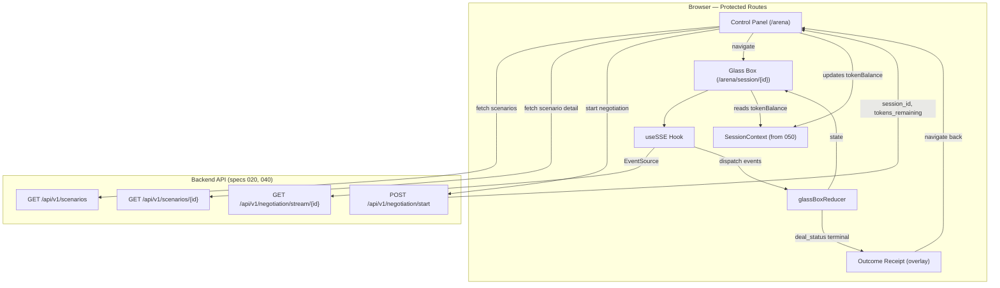
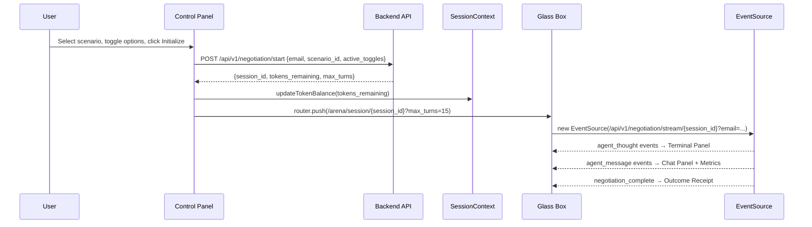

# Design Document: Glass Box Simulation UI

## Overview

This design covers the real-time simulation UI for the JuntoAI A2A MVP: the Arena Selector / Control Panel (`/arena`), the Glass Box live simulation view (`/arena/session/{session_id}`), and the Outcome Receipt overlay. These pages consume the backend SSE stream (spec 020) and scenario API (spec 040) to visualize autonomous AI negotiations in real time.

This spec builds on the Next.js 14 scaffold, SessionContext, TokenDisplay, access gate, and middleware from spec 050. It adds two new pages under the existing `(protected)` route group, a reusable SSE client module, and several UI components.

### Key Design Decisions

1. **SSE via native `EventSource` API, not a library.** The browser's built-in `EventSource` handles reconnection, buffering, and connection lifecycle. We wrap it in a thin `useSSE` hook that parses the `data` field as JSON and dispatches typed events via a reducer. No need for `eventsource-polyfill` — all target browsers support it natively. We use `EventSource` directly (not `fetch` streaming) because the backend sends standard SSE format (`data: <JSON>\n\n`).

2. **Reducer-based state for Glass Box.** The Glass Box page manages complex state: thoughts array, messages array, current offer, regulator status, turn count, deal status. A `useReducer` with typed actions (`AGENT_THOUGHT`, `AGENT_MESSAGE`, `NEGOTIATION_COMPLETE`, `SSE_ERROR`, `CONNECTION_ERROR`) keeps state transitions predictable and testable independently of React rendering. The reducer is a pure function — easy to property-test.

3. **No global state store (no Redux/Zustand).** The Glass Box state is local to the session page. It doesn't need to persist across navigations or be shared with other pages. SessionContext (from spec 050) handles auth/token state. Adding a global store for ephemeral simulation data would be overengineering.

4. **Scenario data fetched fresh on Control Panel mount.** The Control Panel fetches `GET /api/v1/scenarios` on mount and `GET /api/v1/scenarios/{id}` on selection. No client-side caching — the scenario list is small (3 items MVP) and the API is fast. This ensures the UI always reflects the latest backend state.

5. **Outcome Receipt as conditional render, not a separate route.** When `deal_status` transitions to a terminal state, the Glass Box page renders the Outcome Receipt overlay in place. No route change — the session URL stays the same. This avoids losing SSE connection state during navigation and keeps the browser back button behavior clean.

6. **`max_turns` passed via URL search param.** When the Control Panel navigates to `/arena/session/{session_id}?max_turns=15`, the Glass Box reads `max_turns` from the URL to display the Turn Counter denominator. This avoids an extra API call to fetch session state. The backend response from `POST /api/v1/negotiation/start` includes the session's `max_turns`.

7. **Simulation start timestamp captured client-side.** The Outcome Receipt needs elapsed time. We capture `Date.now()` when the SSE connection opens and compute the delta when `negotiation_complete` arrives. This is a client-side measurement — not a backend timestamp — which is acceptable for a demo metric.

## Architecture



### Route Structure (additions to spec 050)

```
frontend/
├── app/
│   └── (protected)/
│       └── arena/
│           ├── page.tsx                          # Control Panel (this spec)
│           └── session/
│               └── [sessionId]/
│                   └── page.tsx                  # Glass Box + Outcome Receipt (this spec)
├── components/
│   ├── arena/
│   │   ├── ScenarioSelector.tsx                  # Dropdown component
│   │   ├── AgentCard.tsx                         # Agent character card
│   │   ├── InformationToggle.tsx                 # Toggle checkbox
│   │   └── InitializeButton.tsx                  # CTA button with loading state
│   ├── glassbox/
│   │   ├── TerminalPanel.tsx                     # Inner thoughts terminal
│   │   ├── ChatPanel.tsx                         # Public messages chat
│   │   ├── MetricsDashboard.tsx                  # Top bar metrics
│   │   └── OutcomeReceipt.tsx                    # Deal summary overlay
│   └── ... (existing from 050: WaitlistForm, TokenDisplay)
├── hooks/
│   └── useSSE.ts                                 # SSE client hook
├── lib/
│   ├── api.ts                                    # API client functions (scenarios, negotiation)
│   ├── glassBoxReducer.ts                        # Reducer + types for Glass Box state
│   └── ... (existing from 050: firebase.ts, waitlist.ts, tokens.ts)
└── types/
    └── sse.ts                                    # SSE event type definitions
```

### Data Flow: Start Simulation



## Components and Interfaces

### 1. SSE Event Types (`types/sse.ts`)

```typescript
interface AgentThoughtEvent {
  event_type: "agent_thought";
  agent_name: string;
  inner_thought: string;
  turn_number: number;
}

interface AgentMessageEvent {
  event_type: "agent_message";
  agent_name: string;
  public_message: string;
  turn_number: number;
  proposed_price?: number;
  retention_clause_demanded?: boolean;
  status?: "CLEAR" | "WARNING" | "BLOCKED";
}

interface NegotiationCompleteEvent {
  event_type: "negotiation_complete";
  session_id: string;
  deal_status: "Agreed" | "Blocked" | "Failed";
  final_summary: Record<string, unknown>;
}

interface SSEErrorEvent {
  event_type: "error";
  message: string;
}

type SSEEvent = AgentThoughtEvent | AgentMessageEvent | NegotiationCompleteEvent | SSEErrorEvent;
```

### 2. API Client (`lib/api.ts`)

```typescript
const API_BASE = process.env.NEXT_PUBLIC_API_URL || "http://localhost:8000/api/v1";

interface ScenarioSummary {
  id: string;
  name: string;
  description: string;
}

interface StartNegotiationResponse {
  session_id: string;
  tokens_remaining: number;
  max_turns: number;
}

async function fetchScenarios(): Promise<ScenarioSummary[]>;
async function fetchScenarioDetail(scenarioId: string): Promise<ArenaScenario>;
async function startNegotiation(
  email: string,
  scenarioId: string,
  activeToggles: string[]
): Promise<StartNegotiationResponse>;
```

Each function throws on non-2xx responses with the error detail from the response body. The `startNegotiation` function specifically checks for HTTP 429 and throws a typed `TokenLimitError`.

### 3. Glass Box Reducer (`lib/glassBoxReducer.ts`)

The reducer is a pure function managing all Glass Box state. This is the core testable unit.

```typescript
interface ThoughtEntry {
  agentName: string;
  innerThought: string;
  turnNumber: number;
  timestamp: number;
}

interface MessageEntry {
  agentName: string;
  publicMessage: string;
  turnNumber: number;
  proposedPrice?: number;
  retentionClauseDemanded?: boolean;
  regulatorStatus?: "CLEAR" | "WARNING" | "BLOCKED";
  timestamp: number;
}

interface GlassBoxState {
  thoughts: ThoughtEntry[];
  messages: MessageEntry[];
  currentOffer: number;
  regulatorStatus: "CLEAR" | "WARNING" | "BLOCKED";
  turnNumber: number;
  maxTurns: number;
  dealStatus: "Negotiating" | "Agreed" | "Blocked" | "Failed";
  finalSummary: Record<string, unknown> | null;
  error: string | null;
  isConnected: boolean;
}

type GlassBoxAction =
  | { type: "AGENT_THOUGHT"; payload: AgentThoughtEvent }
  | { type: "AGENT_MESSAGE"; payload: AgentMessageEvent }
  | { type: "NEGOTIATION_COMPLETE"; payload: NegotiationCompleteEvent }
  | { type: "SSE_ERROR"; payload: { message: string } }
  | { type: "CONNECTION_OPENED" }
  | { type: "CONNECTION_ERROR"; payload: { message: string } };

function createInitialState(maxTurns: number): GlassBoxState;
function glassBoxReducer(state: GlassBoxState, action: GlassBoxAction): GlassBoxState;
```

Reducer behavior per action:

- `AGENT_THOUGHT`: Appends to `thoughts`, updates `turnNumber` to `max(state.turnNumber, payload.turn_number)`.
- `AGENT_MESSAGE`: Appends to `messages`, updates `turnNumber`. If `proposed_price` present, updates `currentOffer`. If `status` present (regulator), updates `regulatorStatus`.
- `NEGOTIATION_COMPLETE`: Sets `dealStatus`, `finalSummary`, `isConnected = false`.
- `SSE_ERROR`: Sets `error`, `isConnected = false`.
- `CONNECTION_OPENED`: Sets `isConnected = true`, clears `error`.
- `CONNECTION_ERROR`: Sets `error`, `isConnected = false`.

### 4. SSE Hook (`hooks/useSSE.ts`)

```typescript
function useSSE(
  sessionId: string | null,
  email: string,
  maxTurns: number,
  dispatch: React.Dispatch<GlassBoxAction>
): { isConnected: boolean; startTime: number | null };
```

Behavior:
- On mount (when `sessionId` is non-null), opens `EventSource` to `GET /api/v1/negotiation/stream/{sessionId}?email={email}`.
- Parses each `message.data` as JSON, switches on `event_type`, dispatches the corresponding action.
- On `EventSource.onerror`: attempts one reconnect after 2 seconds. If reconnect fails, dispatches `CONNECTION_ERROR`.
- On unmount: calls `eventSource.close()`.
- Captures `startTime = Date.now()` when connection opens.

### 5. Scenario Selector (`components/arena/ScenarioSelector.tsx`)

Props:
```typescript
interface ScenarioSelectorProps {
  scenarios: ScenarioSummary[];
  selectedId: string | null;
  onSelect: (scenarioId: string) => void;
  isLoading: boolean;
  error: string | null;
}
```

Renders a `<select>` dropdown with placeholder "Select Simulation Environment". Disabled during loading. Shows error message if fetch failed.

### 6. Agent Card (`components/arena/AgentCard.tsx`)

Props:
```typescript
interface AgentCardProps {
  name: string;
  role: string;
  goals: string[];
  modelId: string;
  index: number; // for color differentiation
}
```

Renders a card with agent name, role badge, goals list, and model identifier. Uses `index` to pick from a predefined color palette for role differentiation.

### 7. Information Toggle (`components/arena/InformationToggle.tsx`)

Props:
```typescript
interface InformationToggleProps {
  id: string;
  label: string;
  checked: boolean;
  onChange: (id: string, checked: boolean) => void;
}
```

Renders a labeled checkbox. Calls `onChange` with toggle `id` and new checked state.

### 8. Initialize Button (`components/arena/InitializeButton.tsx`)

Props:
```typescript
interface InitializeButtonProps {
  onClick: () => void;
  disabled: boolean;
  isLoading: boolean;
  insufficientTokens: boolean;
}
```

Renders "Initialize A2A Protocol" button. Shows spinner when loading. Shows "Insufficient tokens — resets at midnight UTC" when `insufficientTokens` is true. Disabled when `disabled || isLoading || insufficientTokens`.

### 9. Terminal Panel (`components/glassbox/TerminalPanel.tsx`)

Props:
```typescript
interface TerminalPanelProps {
  thoughts: ThoughtEntry[];
  isConnected: boolean;
  dealStatus: string;
}
```

- Dark background (`#1C1C1E`), monospace font (`font-mono`), green/white text.
- Each entry: `[AgentName]` prefix in green, thought text in white.
- Auto-scrolls to bottom via `useRef` + `scrollIntoView` on `thoughts` change.
- Shows blinking cursor (`animate-pulse`) when `isConnected && dealStatus === "Negotiating"`.
- Shows "Awaiting agent initialization..." when `thoughts` is empty and connected.

### 10. Chat Panel (`components/glassbox/ChatPanel.tsx`)

Props:
```typescript
interface ChatPanelProps {
  messages: MessageEntry[];
  isConnected: boolean;
}
```

- Chat bubbles with agent name as sender label.
- Agent differentiation: first negotiator left-aligned (blue), second negotiator right-aligned (green), regulator centered (system style).
- If `proposedPrice` present, rendered as highlighted badge below the message text.
- If `regulatorStatus` present, rendered as a system message with color coding: green text for CLEAR, yellow for WARNING, red for BLOCKED.
- Auto-scrolls to bottom on new messages.

### 11. Metrics Dashboard (`components/glassbox/MetricsDashboard.tsx`)

Props:
```typescript
interface MetricsDashboardProps {
  currentOffer: number;
  regulatorStatus: "CLEAR" | "WARNING" | "BLOCKED";
  turnNumber: number;
  maxTurns: number;
  tokenBalance: number;
}
```

- Full-width top bar with four metric cards.
- Current Offer: formatted as currency with `transition-all` animation on value change.
- Regulator Traffic Light: colored circle — `bg-green-500` / `bg-yellow-500` / `bg-red-500`. Pulse animation on status transition.
- Turn Counter: "Turn: X / Y".
- Token Balance: "Tokens: X / 100" (reads from SessionContext via prop).

### 12. Outcome Receipt (`components/glassbox/OutcomeReceipt.tsx`)

Props:
```typescript
interface OutcomeReceiptProps {
  dealStatus: "Agreed" | "Blocked" | "Failed";
  finalSummary: Record<string, unknown>;
  elapsedTimeMs: number;
  scenarioOutcomeReceipt: {
    equivalent_human_time: string;
    process_label: string;
  } | null;
  scenarioId: string | null;
}
```

- Renders based on `dealStatus`:
  - **Agreed**: Final terms from `finalSummary`, success styling.
  - **Blocked**: Block reason from `finalSummary`, warning styling.
  - **Failed**: "Negotiation reached maximum turns without agreement", neutral styling.
- ROI Metrics in two groups:
  - Measured: "Time Elapsed: Xs" (computed from `elapsedTimeMs`).
  - Scenario-estimated: "Equivalent Human Time" and process label from scenario config, visually labeled "Industry Estimate" with lighter text/italic.
- "Run Another Scenario" button → navigates to `/arena`.
- "Reset with Different Variables" button → navigates to `/arena?scenario={scenarioId}`.
- Fade-in transition via Tailwind `animate-fadeIn` or CSS transition.

### 13. Control Panel Page (`app/(protected)/arena/page.tsx`)

Client component. State:
- `scenarios: ScenarioSummary[]` — fetched on mount
- `selectedScenarioId: string | null`
- `scenarioDetail: ArenaScenario | null` — fetched on selection
- `activeToggles: string[]`
- `isLoadingScenarios: boolean`
- `isLoadingDetail: boolean`
- `isStarting: boolean`
- `error: string | null`

Behavior:
- On mount: fetch scenarios list. On error, show error message.
- On scenario select: fetch detail, render Agent Cards and Information Toggles. Reset toggles.
- On Initialize click: call `startNegotiation(email, scenarioId, activeToggles)`. On success, update token balance, navigate to Glass Box. On 429, show token limit message. On other error, show error.
- If URL has `?scenario={id}` query param (from Outcome Receipt "Reset" button), pre-select that scenario on mount.

### 14. Glass Box Page (`app/(protected)/arena/session/[sessionId]/page.tsx`)

Client component. Reads `sessionId` from route params, `max_turns` from search params, `email` and `tokenBalance` from SessionContext.

- Initializes `useReducer(glassBoxReducer, createInitialState(maxTurns))`.
- Passes `dispatch` to `useSSE` hook.
- Renders three-region layout:
  - Top: `MetricsDashboard`
  - Left: `TerminalPanel`
  - Center: `ChatPanel`
- When `dealStatus` is terminal: renders `OutcomeReceipt` overlay.
- If `sessionId` is missing or SSE returns error, shows error with "Return to Arena" link.

Responsive layout (Tailwind):
- `>= 1024px` (`lg:`): Terminal and Chat side by side in a flex row.
- `< 1024px`: Terminal stacked above Chat in a flex column.
- Both panels have `max-h-[60vh] overflow-y-auto` (scrollable, bounded height).

## Data Models

### SSE Event Payloads (from backend spec 020)

| Event Type | Key Fields | Used By |
| --- | --- | --- |
| `agent_thought` | `agent_name`, `inner_thought`, `turn_number` | Terminal Panel |
| `agent_message` | `agent_name`, `public_message`, `turn_number`, `proposed_price?`, `retention_clause_demanded?`, `status?` | Chat Panel, Metrics Dashboard |
| `negotiation_complete` | `session_id`, `deal_status`, `final_summary` | Outcome Receipt |
| `error` | `message` | Error display |

### Scenario API Response (from backend spec 040)

`GET /api/v1/scenarios` returns:
```json
[{"id": "talent_war", "name": "The Talent War", "description": "..."}]
```

`GET /api/v1/scenarios/{id}` returns the full `ArenaScenario` object including `agents`, `toggles`, `negotiation_params`, `outcome_receipt`.

### Start Negotiation Response (from backend spec 020)

`POST /api/v1/negotiation/start` request:
```json
{"email": "user@example.com", "scenario_id": "talent_war", "active_toggles": ["competing_offer"]}
```

Response:
```json
{"session_id": "uuid-here", "tokens_remaining": 85, "max_turns": 15}
```

### Glass Box State (client-side only)

| Field | Type | Initial | Updated By |
| --- | --- | --- | --- |
| `thoughts` | `ThoughtEntry[]` | `[]` | `AGENT_THOUGHT` |
| `messages` | `MessageEntry[]` | `[]` | `AGENT_MESSAGE` |
| `currentOffer` | `number` | `0` | `AGENT_MESSAGE` (when `proposed_price` present) |
| `regulatorStatus` | `"CLEAR" \| "WARNING" \| "BLOCKED"` | `"CLEAR"` | `AGENT_MESSAGE` (when `status` present) |
| `turnNumber` | `number` | `0` | `AGENT_THOUGHT`, `AGENT_MESSAGE` |
| `maxTurns` | `number` | from URL param | — |
| `dealStatus` | `"Negotiating" \| "Agreed" \| "Blocked" \| "Failed"` | `"Negotiating"` | `NEGOTIATION_COMPLETE` |
| `finalSummary` | `Record<string, unknown> \| null` | `null` | `NEGOTIATION_COMPLETE` |
| `error` | `string \| null` | `null` | `SSE_ERROR`, `CONNECTION_ERROR` |
| `isConnected` | `boolean` | `false` | `CONNECTION_OPENED`, terminal events |


## Correctness Properties

*A property is a characteristic or behavior that should hold true across all valid executions of a system — essentially, a formal statement about what the system should do. Properties serve as the bridge between human-readable specifications and machine-verifiable correctness guarantees.*

### Property 1: Reducer state invariant under event sequences

*For any* initial `GlassBoxState` and *for any* sequence of valid `GlassBoxAction` objects (AGENT_THOUGHT, AGENT_MESSAGE, NEGOTIATION_COMPLETE, SSE_ERROR, CONNECTION_OPENED, CONNECTION_ERROR), applying the sequence through `glassBoxReducer` shall produce a state where: (a) `thoughts.length` equals the number of AGENT_THOUGHT actions, (b) `messages.length` equals the number of AGENT_MESSAGE actions, (c) `currentOffer` equals the `proposed_price` of the last AGENT_MESSAGE that contained one (or 0 if none did), (d) `regulatorStatus` equals the `status` of the last AGENT_MESSAGE that contained one (or "CLEAR" if none did), (e) `turnNumber` is the maximum `turn_number` across all thought and message events (or 0 if none), and (f) if a NEGOTIATION_COMPLETE action was dispatched, `dealStatus` matches its `deal_status` and `isConnected` is `false`.

**Validates: Requirements 5.3, 5.4, 5.5, 5.6, 6.3, 7.3, 8.2, 8.3, 8.4, 11.2**

### Property 2: SSE event JSON parsing correctness

*For any* valid JSON string containing an `event_type` field with value `"agent_thought"`, `"agent_message"`, `"negotiation_complete"`, or `"error"`, and the corresponding required fields for that event type, parsing the string shall produce a typed event object where all fields match the input JSON values exactly.

**Validates: Requirements 5.2, 5.3, 5.4, 5.5, 5.6**

### Property 3: Scenario selection renders correct component counts

*For any* scenario object with `N` agents and `M` toggles, selecting that scenario in the Control Panel shall render exactly `N` Agent Card components and exactly `M` Information Toggle checkbox components.

**Validates: Requirements 1.3, 2.1, 3.1**

### Property 4: Agent Card displays all required fields

*For any* agent definition containing `name`, `role`, `goals`, and `model_id`, the rendered Agent Card shall contain text matching each of those field values.

**Validates: Requirements 2.2**

### Property 5: Toggle state management and reset

*For any* sequence of toggle check/uncheck operations on a set of Information Toggles, the `active_toggles` list shall contain exactly the IDs of currently checked toggles. *For any* scenario switch, the `active_toggles` list shall be empty and all toggles shall be unchecked.

**Validates: Requirements 3.3, 3.4, 3.5**

### Property 6: Insufficient tokens disables Initialize button

*For any* client-side token balance that is less than the simulation cost (scenario's `max_turns`), the Initialize button shall be disabled and a message indicating insufficient tokens shall be displayed.

**Validates: Requirements 4.5**

### Property 7: Start negotiation request contains correct payload

*For any* combination of authenticated email, selected scenario ID, and active toggles list, the `POST /api/v1/negotiation/start` request body shall contain `email` matching the authenticated email, `scenario_id` matching the selected scenario, and `active_toggles` matching the current toggle selection.

**Validates: Requirements 4.3**

### Property 8: Outcome Receipt renders appropriate content per deal status

*For any* `negotiation_complete` event with `deal_status` of `"Agreed"`, `"Blocked"`, or `"Failed"`, the Outcome Receipt shall render: (a) for Agreed — the final terms from `final_summary`, (b) for Blocked — the block reason from `final_summary`, (c) for Failed — a failure message indicating max turns reached.

**Validates: Requirements 10.1, 10.2, 10.3**

### Property 9: Outcome Receipt displays both metric groups

*For any* elapsed time value (in milliseconds) and *for any* scenario `outcome_receipt` config containing `equivalent_human_time` and `process_label`, the Outcome Receipt shall display: (a) the measured elapsed time formatted as seconds, and (b) the scenario-estimated metrics with a visual label distinguishing them as estimates.

**Validates: Requirements 10.4**

### Property 10: Agent visual differentiation

*For any* two agents with different indices (positions in the agents array), the Agent Cards shall use distinct color styling, and the Chat Panel shall use distinct alignment or color for their messages.

**Validates: Requirements 2.3, 7.4**

### Property 11: Regulator status to color mapping

*For any* regulator status value, the Metrics Dashboard traffic light and Chat Panel system message shall use the correct color: green for `"CLEAR"`, yellow for `"WARNING"`, red for `"BLOCKED"`.

**Validates: Requirements 7.7, 8.3**

### Property 12: Proposed price rendering in Chat Panel

*For any* `agent_message` event containing a `proposed_price` field, the Chat Panel shall render the price value as a visually highlighted element within or below the chat bubble.

**Validates: Requirements 7.6**

### Property 13: API error display on negotiation start failure

*For any* non-429 HTTP error response from `POST /api/v1/negotiation/start`, the Control Panel shall display the error detail string from the response body to the user.

**Validates: Requirements 4.7, 11.5**

## Error Handling

### Control Panel Errors

| Error Scenario | Handling Strategy |
| --- | --- |
| `GET /api/v1/scenarios` fails | Display inline error: "Could not load scenarios. Please try again." Disable scenario selector. |
| `GET /api/v1/scenarios/{id}` fails | Display inline error below dropdown. Clear agent cards and toggles. |
| `POST /api/v1/negotiation/start` returns 429 | Display: "Token limit reached. Resets at midnight UTC." Sync client token balance to 0. |
| `POST /api/v1/negotiation/start` returns other 4xx/5xx | Display error detail from response body. No token state change. |
| Network failure on any API call | Display: "Network error. Check your connection and try again." |
| No scenario selected + Initialize click | Button is disabled — prevented at UI level. |
| Insufficient tokens | Button disabled. Message: "Insufficient tokens — resets at midnight UTC." |

### Glass Box Errors

| Error Scenario | Handling Strategy |
| --- | --- |
| Invalid/missing `session_id` in URL | Display error message with "Return to Arena" link. Do not open SSE. |
| SSE `error` event received | Display error message in notification area. Close connection. Stop rendering new events. |
| SSE connection drops unexpectedly | Retry once after 2-second delay. If retry fails, display "Connection lost" with "Return to Arena" link. |
| SSE connection cannot be established | Same as above — one retry, then error display. |
| JSON parse error on SSE data | Log to console. Skip the malformed event. Continue processing subsequent events. |
| User navigates away during simulation | `useSSE` cleanup closes `EventSource` in `useEffect` return. |

### Error Boundaries

- The Glass Box page should catch rendering errors via a React error boundary and display a fallback with "Return to Arena" link.
- The Control Panel handles its own errors via component state (loading/error states).
- Both pages are wrapped by the protected layout from spec 050, which handles auth errors.

## Testing Strategy

### Testing Framework

- **Unit & Component Tests**: Vitest + React Testing Library (jsdom environment)
- **Property-Based Tests**: `fast-check` library for Vitest
- **Coverage**: `@vitest/coverage-v8` with 70% threshold (per workspace testing guidelines)

### Test Structure

```
frontend/__tests__/
├── components/
│   ├── arena/
│   │   ├── ScenarioSelector.test.tsx
│   │   ├── AgentCard.test.tsx
│   │   ├── InformationToggle.test.tsx
│   │   └── InitializeButton.test.tsx
│   └── glassbox/
│       ├── TerminalPanel.test.tsx
│       ├── ChatPanel.test.tsx
│       ├── MetricsDashboard.test.tsx
│       └── OutcomeReceipt.test.tsx
├── hooks/
│   └── useSSE.test.ts
├── lib/
│   ├── api.test.ts
│   └── glassBoxReducer.test.ts
├── pages/
│   ├── arena.test.tsx
│   └── glassbox.test.tsx
└── properties/
    ├── glassBoxReducer.property.test.ts
    ├── sseEventParsing.property.test.ts
    ├── scenarioSelection.property.test.ts
    ├── agentCard.property.test.ts
    ├── toggleState.property.test.ts
    ├── outcomeReceipt.property.test.ts
    └── regulatorStatus.property.test.ts
```

### Unit Tests (Specific Examples & Edge Cases)

- ScenarioSelector renders placeholder "Select Simulation Environment" (Req 1.2)
- ScenarioSelector shows loading state and disables during fetch (Req 1.5)
- ScenarioSelector shows error message on API failure (Req 1.4)
- No Agent Cards rendered when no scenario selected (Req 2.4)
- Initialize button renders with label "Initialize A2A Protocol" (Req 4.1)
- Initialize button disabled when no scenario selected (Req 4.2)
- Initialize button shows loading state during request (Req 4.8)
- HTTP 429 response shows token limit message and syncs balance to 0 (Req 4.6)
- SSE connection opens on Glass Box mount (Req 5.1)
- SSE connection closes on Glass Box unmount (Req 5.7, 11.4)
- SSE reconnects once after 2-second delay on drop (Req 5.8)
- Terminal Panel shows "Awaiting agent initialization..." when empty (Req 6.6)
- Terminal Panel auto-scrolls on new thought (Req 6.4)
- Chat Panel auto-scrolls on new message (Req 7.5)
- Token balance displayed as "Tokens: X / 100" in Metrics Dashboard (Req 8.5)
- Invalid session_id shows error with "Return to Arena" link (Req 11.1)
- SSE connection failure after retry shows error with "Return to Arena" link (Req 11.3)
- Outcome Receipt "Run Another Scenario" navigates to /arena (Req 10.5)
- Outcome Receipt "Reset with Different Variables" navigates to /arena?scenario={id} (Req 10.6)
- Control Panel pre-selects scenario from URL query param (Req 10.6 return flow)

### Property-Based Tests (fast-check)

Each property test runs a minimum of 100 iterations. Each test is tagged with the design property it validates.

| Property | Test Description | Generator Strategy |
| --- | --- | --- |
| Property 1 | Generate random sequences of GlassBoxAction objects. Apply through reducer. Verify state invariants (array lengths, currentOffer, regulatorStatus, turnNumber, dealStatus). | `fc.array(fc.oneof(thoughtActionArb, messageActionArb, completeActionArb, errorActionArb))` |
| Property 2 | Generate random valid SSE event JSON payloads for each event_type. Parse and verify all fields preserved. | `fc.oneof(agentThoughtJsonArb, agentMessageJsonArb, completeJsonArb, errorJsonArb)` |
| Property 3 | Generate random scenario objects with varying agent/toggle counts. Render Control Panel. Verify card and toggle counts match. | `fc.record({agents: fc.array(agentArb, {minLength:2, maxLength:6}), toggles: fc.array(toggleArb, {minLength:1, maxLength:5})})` |
| Property 4 | Generate random agent definitions with random name, role, goals, model_id. Render AgentCard. Verify all fields present in output. | `fc.record({name: fc.string({minLength:1}), role: fc.string({minLength:1}), goals: fc.array(fc.string({minLength:1}), {minLength:1}), modelId: fc.string({minLength:1})})` |
| Property 5 | Generate random sequences of toggle check/uncheck operations. Verify active_toggles matches checked set. Then simulate scenario switch and verify reset. | `fc.array(fc.record({id: fc.string(), checked: fc.boolean()}))` |
| Property 6 | Generate random token balance and max_turns pairs where balance < max_turns. Verify Initialize button is disabled. | `fc.record({balance: fc.integer({min:0, max:99}), cost: fc.integer({min:1, max:100})}).filter(({balance, cost}) => balance < cost)` |
| Property 7 | Generate random email, scenario_id, and active_toggles. Mock fetch. Verify request body contains all three fields. | `fc.record({email: fc.emailAddress(), scenarioId: fc.string({minLength:1}), toggles: fc.array(fc.string({minLength:1}))})` |
| Property 8 | Generate random deal_status (Agreed/Blocked/Failed) with random final_summary. Render OutcomeReceipt. Verify appropriate content rendered. | `fc.record({dealStatus: fc.constantFrom("Agreed","Blocked","Failed"), finalSummary: fc.dictionary(fc.string(), fc.string())})` |
| Property 9 | Generate random elapsed time (ms) and random outcome_receipt config. Render OutcomeReceipt. Verify both metric groups present. | `fc.record({elapsedMs: fc.integer({min:1000, max:300000}), equivalentHumanTime: fc.string({minLength:1}), processLabel: fc.string({minLength:1})})` |
| Property 10 | Generate pairs of different agent indices. Verify distinct CSS classes/colors assigned. | `fc.tuple(fc.integer({min:0, max:5}), fc.integer({min:0, max:5})).filter(([a,b]) => a !== b)` |
| Property 11 | Generate random regulator status values (CLEAR/WARNING/BLOCKED). Verify correct color class in rendered output. | `fc.constantFrom("CLEAR", "WARNING", "BLOCKED")` |
| Property 12 | Generate random agent_message events with proposed_price. Render ChatPanel. Verify price value appears as highlighted element. | `fc.record({agentName: fc.string({minLength:1}), publicMessage: fc.string({minLength:1}), proposedPrice: fc.float({min:1, max:100000000})})` |
| Property 13 | Generate random HTTP error responses (status 400-599, excluding 429) with random error detail strings. Verify error detail displayed. | `fc.record({status: fc.integer({min:400, max:599}).filter(s => s !== 429), detail: fc.string({minLength:1})})` |

### Property Test Tagging

Each property test file must include a comment referencing the design property:

```typescript
// Feature: 060_a2a-glass-box-ui, Property 1: Reducer state invariant under event sequences
test.prop([eventSequenceArb], (events) => {
  // ...
});
```

### Mocking Strategy

- **Backend API**: Mock `fetch` globally for all API calls (scenarios, negotiation start). Return typed response objects.
- **EventSource**: Mock the browser `EventSource` constructor. Simulate events via `onmessage` callbacks. Simulate errors via `onerror`.
- **Next.js Router**: Mock `next/navigation` (`useRouter`, `useParams`, `useSearchParams`).
- **SessionContext**: Wrap test components in a `SessionProvider` with controlled initial state.
- **Date.now()**: Mock for elapsed time calculations in Outcome Receipt tests.

### CI Integration

- Tests run via `cd frontend && npx vitest run --coverage`
- Coverage threshold: 70% (lines, functions, branches, statements)
- All tests must pass before deployment in Cloud Build pipeline
