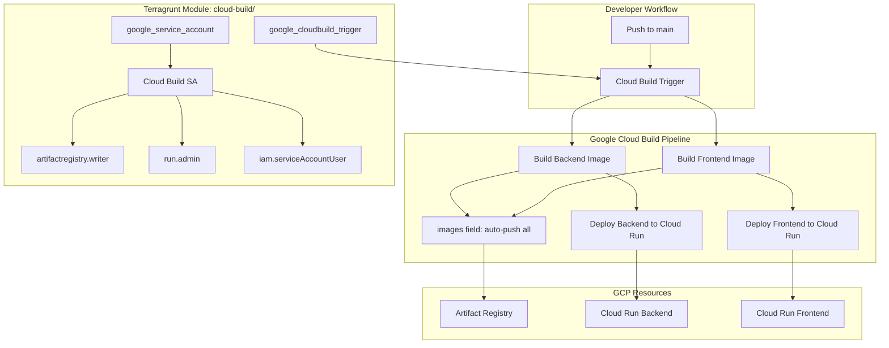
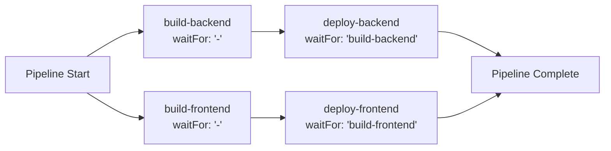
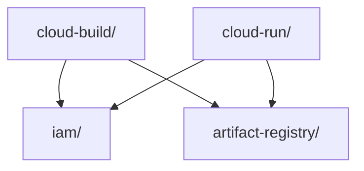

# Design Document: A2A CI/CD Pipelines

## Overview

This design specifies the CI/CD pipeline for the JuntoAI A2A MVP, implemented as a Google Cloud Build pipeline (`cloudbuild.yaml`) at the monorepo root, with supporting Terragrunt infrastructure for the Cloud Build trigger and service account IAM roles.

The pipeline automates: Docker image builds (backend + frontend) → push to Artifact Registry → deploy to Cloud Run. It is triggered on pushes to the `main` branch.

The spec is split into two execution phases:
- **Phase A (after spec 010):** `cloudbuild.yaml` pipeline definition, Terragrunt `cloud-build/` module (trigger + SA + IAM). Pure infra — no application code needed.
- **Phase B (after specs 020 + 050):** Backend and frontend Dockerfiles, end-to-end pipeline validation. Requires working app scaffolds with health endpoints.

### Key Design Decisions

1. **Separate `cloud-build/` Terragrunt module** — not merged into the existing `iam/` module. The Cloud Build SA, trigger, and IAM bindings are a self-contained concern with its own lifecycle. The `iam/` module manages application SAs (Backend_SA, Frontend_SA); mixing CI/CD concerns would violate single-responsibility and create unnecessary coupling.

2. **Trigger provisioned disabled by default** (`trigger_enabled = false`) — prevents broken deploys from pushes to `main` before Dockerfiles exist. Flipped to `true` via `terragrunt apply` after Phase B validation.

3. **Parallel builds, sequential deploys** — backend and frontend Docker builds run in parallel (`waitFor: ["-"]`). Deploy steps depend on their respective build steps (`waitFor: ["build-backend"]`, `waitFor: ["build-frontend"]`). This maximizes build throughput while ensuring images exist before deploy.

4. **Dual SHA + latest tagging** — every image gets both `$SHORT_SHA` and `latest` tags. Deploys always reference the `$SHORT_SHA` tag for traceability and deterministic rollbacks. The `latest` tag is a convenience for local development and debugging.

5. **Cloud Build `images` field for automatic push** — instead of explicit `docker push` steps, the `images` field declares all image URIs. Cloud Build pushes them automatically after all steps succeed, which is atomic (all-or-nothing) and idiomatic.

6. **Cloud Build SA gets exactly 3 roles** — `artifactregistry.writer`, `run.admin`, `iam.serviceAccountUser`. No more, no less. An allowlist validation block in `variables.tf` enforces this at plan time, matching the pattern established in the `iam/` module from spec 010.

## Architecture



### Pipeline Step Execution Order



### Module Dependency Graph



The `cloud-build/` module depends on `iam/` (to read `backend_sa_email` and `frontend_sa_email` for substitution variables) and `artifact-registry/` (to reference the repository path). It does NOT depend on `cloud-run/` — the pipeline deploys to Cloud Run by service name, not by Terraform resource reference.

## Components and Interfaces

### Component 1: `cloudbuild.yaml` (Pipeline Definition)

Location: repository root (`/cloudbuild.yaml`)

Defines 4 build steps:

| Step ID | Builder | Action | waitFor |
|---------|---------|--------|---------|
| `build-backend` | `gcr.io/cloud-builders/docker` | Build `/backend/Dockerfile`, tag with SHA + latest | `["-"]` (start immediately) |
| `build-frontend` | `gcr.io/cloud-builders/docker` | Build `/frontend/Dockerfile`, tag with SHA + latest | `["-"]` (start immediately) |
| `deploy-backend` | `gcr.io/google.com/cloudsdktool/cloud-sdk` | `gcloud run deploy` backend with SHA tag | `["build-backend"]` |
| `deploy-frontend` | `gcr.io/google.com/cloudsdktool/cloud-sdk` | `gcloud run deploy` frontend with SHA tag | `["build-frontend"]` |

Substitution variables consumed:

| Variable | Description | Example |
|----------|-------------|---------|
| `_REGION` | GCP region | `europe-west1` |
| `_PROJECT_ID` | GCP project ID | `juntoai-a2s-mvp` |
| `_REPO_NAME` | Artifact Registry repo name | `juntoai-docker` |
| `_BACKEND_SERVICE` | Cloud Run backend service name | `juntoai-backend` |
| `_FRONTEND_SERVICE` | Cloud Run frontend service name | `juntoai-frontend` |
| `_BACKEND_SA_EMAIL` | Backend SA email for `--service-account` | `backend-sa@...iam.gserviceaccount.com` |
| `_FRONTEND_SA_EMAIL` | Frontend SA email for `--service-account` | `frontend-sa@...iam.gserviceaccount.com` |

The `images` field declares all 4 image URIs (backend:SHA, backend:latest, frontend:SHA, frontend:latest) for automatic push.

### Component 2: `infra/modules/cloud-build/` (Terragrunt Module)

Files:
- `main.tf` — `google_service_account`, `google_project_iam_member` (×3), `google_cloudbuild_trigger`
- `variables.tf` — input variables with allowlist validation
- `outputs.tf` — trigger ID, trigger name, Cloud Build SA email
- `terragrunt.hcl` — includes `root.hcl`, declares dependencies on `iam/` and `artifact-registry/`

#### Resources

**`google_service_account.cloudbuild`**
- `account_id`: `"cloudbuild-sa"`
- `display_name`: `"Cloud Build CI/CD Service Account"`

**`google_project_iam_member.cloudbuild_ar_writer`**
- Role: `roles/artifactregistry.writer`
- Member: `serviceAccount:${google_service_account.cloudbuild.email}`

**`google_project_iam_member.cloudbuild_run_admin`**
- Role: `roles/run.admin`
- Member: `serviceAccount:${google_service_account.cloudbuild.email}`

**`google_project_iam_member.cloudbuild_sa_user`**
- Role: `roles/iam.serviceAccountUser`
- Member: `serviceAccount:${google_service_account.cloudbuild.email}`

**`google_cloudbuild_trigger.main`**
- `name`: `"juntoai-cicd-main"`
- `filename`: `"cloudbuild.yaml"`
- `disabled`: `var.trigger_enabled ? false : true` (disabled by default)
- `source_to_build.uri` / `github.owner` + `github.name`: configured via variables
- `substitutions`: map of all `_SUBSTITUTION_VARIABLE` values

#### Interface: Inputs (variables.tf)

| Variable | Type | Default | Description |
|----------|------|---------|-------------|
| `gcp_project_id` | `string` | — | GCP project ID |
| `gcp_region` | `string` | — | GCP region |
| `repository_id` | `string` | `"juntoai-docker"` | Artifact Registry repo name |
| `backend_service_name` | `string` | `"juntoai-backend"` | Cloud Run backend service name |
| `frontend_service_name` | `string` | `"juntoai-frontend"` | Cloud Run frontend service name |
| `backend_sa_email` | `string` | — | Backend SA email (from iam/ output) |
| `frontend_sa_email` | `string` | — | Frontend SA email (from iam/ output) |
| `trigger_enabled` | `bool` | `false` | Whether the trigger is active |
| `github_owner` | `string` | — | GitHub repo owner |
| `github_repo` | `string` | — | GitHub repo name |
| `allowed_roles` | `list(string)` | `[3 approved roles]` | Allowlist with validation block |

#### Interface: Outputs (outputs.tf)

| Output | Description |
|--------|-------------|
| `trigger_id` | Cloud Build trigger ID |
| `trigger_name` | Cloud Build trigger name |
| `cloudbuild_sa_email` | Cloud Build SA email |

#### Interface: Terragrunt Dependencies (terragrunt.hcl)

```hcl
dependency "iam" {
  config_path = "../iam"
}

dependency "artifact_registry" {
  config_path = "../artifact-registry"
}

inputs = {
  backend_sa_email  = dependency.iam.outputs.backend_sa_email
  frontend_sa_email = dependency.iam.outputs.frontend_sa_email
}
```

### Component 3: Backend Dockerfile (Phase B)

Location: `/backend/Dockerfile`

Produces a container that:
- Runs the FastAPI application via `uvicorn`
- Exposes port 8080 (Cloud Run default)
- Responds to `GET /api/v1/health` with HTTP 200

### Component 4: Frontend Dockerfile (Phase B)

Location: `/frontend/Dockerfile`

Produces a container that:
- Runs the Next.js application in production mode
- Exposes port 3000 (or Cloud Run's `PORT` env var)
- Serves the application and responds to health checks

## Data Models

### Cloud Build Substitution Variables

The pipeline is parameterized via substitution variables, passed from the Terragrunt trigger resource to the `cloudbuild.yaml` steps. This is the contract between the infra module and the pipeline definition.

```
substitutions = {
  _REGION             = var.gcp_region
  _PROJECT_ID         = var.gcp_project_id
  _REPO_NAME          = var.repository_id
  _BACKEND_SERVICE    = var.backend_service_name
  _FRONTEND_SERVICE   = var.frontend_service_name
  _BACKEND_SA_EMAIL   = var.backend_sa_email
  _FRONTEND_SA_EMAIL  = var.frontend_sa_email
}
```

### Image URI Format

All image URIs follow the Artifact Registry convention:

```
${_REGION}-docker.pkg.dev/${_PROJECT_ID}/${_REPO_NAME}/<service>:<tag>
```

Where `<service>` is `backend` or `frontend`, and `<tag>` is either `$SHORT_SHA` or `latest`.

### Trigger Resource Configuration

```hcl
resource "google_cloudbuild_trigger" "main" {
  name     = "juntoai-cicd-main"
  project  = var.gcp_project_id
  disabled = var.trigger_enabled ? false : true

  github {
    owner = var.github_owner
    name  = var.github_repo
    push {
      branch = "^main$"
    }
  }

  filename      = "cloudbuild.yaml"
  substitutions = { ... }

  service_account = google_service_account.cloudbuild.id
}
```


## Correctness Properties

*A property is a characteristic or behavior that should hold true across all valid executions of a system — essentially, a formal statement about what the system should do. Properties serve as the bridge between human-readable specifications and machine-verifiable correctness guarantees.*

### Property 1: Dual image tagging (SHA + latest)

*For any* service (backend, frontend) defined in the pipeline, the `images` field and build step tags must include both a `$SHORT_SHA`-tagged URI and a `latest`-tagged URI rooted in the Artifact Registry path.

**Validates: Requirements 1.3, 1.4, 2.2, 2.3, 3.2, 3.3, 4.1, 4.2**

### Property 2: Substitution variable parameterization

*For any* environment-specific value (project ID, region, repo name, service names, SA emails) referenced in the pipeline steps, it must use a Cloud Build substitution variable (prefixed with `$_` or `$`), never a hardcoded literal.

**Validates: Requirements 1.2, 5.2, 6.2**

### Property 3: Deploy steps use SHA tag

*For any* deploy step in the pipeline, the `--image` argument to `gcloud run deploy` must reference the `$SHORT_SHA`-tagged image URI, never the `latest` tag.

**Validates: Requirements 5.1, 6.1**

### Property 4: Cloud Build SA role allowlist

*For any* role string, it passes the Cloud Build module's allowlist validation if and only if it is in the approved set (`roles/artifactregistry.writer`, `roles/run.admin`, `roles/iam.serviceAccountUser`). The Cloud Build SA must have exactly these 3 roles — no more, no less.

**Validates: Requirements 8.1, 8.2, 8.3, 8.4**

### Property 5: Pipeline step dependency ordering

*For any* pipeline step graph derived from `waitFor` directives: (a) all build steps must have `waitFor: ["-"]` enabling parallel execution, and (b) each deploy step must depend on its corresponding build step (deploy-backend depends on build-backend, deploy-frontend depends on build-frontend). No deploy step may execute before its build step.

**Validates: Requirements 9.1, 9.2, 9.3, 9.4**

### Property 6: Trigger substitutions completeness

*For any* substitution variable referenced in `cloudbuild.yaml`, the Cloud Build trigger resource must include that variable in its `substitutions` map. The set of variables passed by the trigger must be a superset of the set consumed by the pipeline.

**Validates: Requirements 7.3, 10.4**

### Property 7: Trigger disabled-by-default

*For any* boolean value of `trigger_enabled`, the trigger's `disabled` field must equal `!trigger_enabled`. When `trigger_enabled` is `false` (the default), the trigger must be disabled.

**Validates: Requirements 7.4, 10.6**

## Error Handling

### Pipeline Failures

- **Build step failure**: If either Docker build fails, Cloud Build halts the pipeline. No images are pushed (the `images` field only pushes after all steps succeed). No deploy occurs.
- **Deploy step failure**: If `gcloud run deploy` fails (e.g., image not found, permission denied), the pipeline reports failure. The other service's deploy is unaffected (they run independently after their respective builds).
- **Substitution variable missing**: Cloud Build fails at trigger time if a required substitution is not provided. The trigger resource's `substitutions` map must be complete.

### Infrastructure Failures

- **Trigger provisioning with disabled=true**: Safe by design. Even if the trigger is created before Dockerfiles exist, it won't fire because it's disabled.
- **IAM permission denied**: If the Cloud Build SA lacks a required role, the specific step (push or deploy) fails with a clear GCP permission error. The allowlist validation catches this at `terragrunt plan` time.
- **Artifact Registry not found**: If the AR repo doesn't exist, image push fails. The `cloud-build/` module depends on `artifact-registry/` via Terragrunt, ensuring the repo is created first.

### Rollback Strategy

- Cloud Run maintains previous revisions. A failed deploy does not affect the currently serving revision.
- SHA-tagged images are immutable — you can always redeploy a known-good SHA.
- The `latest` tag is mutable but never used for deploys, only for convenience.

## Testing Strategy

### Static Analysis Tests (Phase A — HCL/YAML parsing)

These tests parse Terraform HCL and `cloudbuild.yaml` files without running `terraform plan` or `apply`. They follow the same pattern as the existing spec 010 tests in `infra/tests/`.

**Unit tests** (`infra/tests/test_cloud_build.py`):
- Verify `cloud-build/` module directory exists with required files (`main.tf`, `variables.tf`, `outputs.tf`, `terragrunt.hcl`)
- Verify `google_cloudbuild_trigger` resource exists in `main.tf`
- Verify `google_service_account` resource exists with `account_id = "cloudbuild-sa"`
- Verify 3 `google_project_iam_member` resources with correct roles
- Verify `trigger_enabled` variable defaults to `false`
- Verify `terragrunt.hcl` includes `root.hcl` and declares dependencies on `iam/` and `artifact-registry/`
- Verify outputs include `trigger_id`, `trigger_name`, `cloudbuild_sa_email`
- Verify `cloudbuild.yaml` exists at repo root
- Verify `cloudbuild.yaml` has an `images` field (not explicit push steps)
- Verify deploy steps include `--service-account` flag

**Pipeline YAML tests** (`infra/tests/test_cloudbuild_yaml.py`):
- Parse `cloudbuild.yaml` and verify step IDs, builder images, and `waitFor` directives
- Verify substitution variables are used (no hardcoded project IDs or regions)
- Verify `images` field contains all 4 expected image URIs

### Property-Based Tests (Hypothesis)

**Library**: `hypothesis` (already used in spec 010 tests)
**Configuration**: minimum 100 iterations per property test
**Location**: `infra/tests/test_cloud_build_properties.py`

Each property test is tagged with a comment referencing the design property:

```python
# Feature: 070_a2a-cicd-pipelines, Property 4: Cloud Build SA role allowlist
```

Property tests model the module logic as pure Python functions (same pattern as `test_properties.py` from spec 010) and verify invariants across generated inputs:

- **Property 1 (Dual tagging)**: Generate random service names and SHA strings, build image URI lists, verify both SHA and latest tags present for each service.
- **Property 2 (Substitution parameterization)**: Generate random pipeline configs, verify no hardcoded environment values leak through.
- **Property 3 (SHA deploy)**: Generate random deploy commands, verify image argument always uses SHA tag.
- **Property 4 (Role allowlist)**: Generate random role strings, verify validation accepts approved roles and rejects all others. (Directly analogous to spec 010 Property 4.)
- **Property 5 (Step ordering)**: Generate random step graphs with waitFor directives, verify topological ordering constraint (builds before deploys, builds parallel).
- **Property 6 (Trigger substitutions)**: Generate random sets of required variables, verify trigger substitutions map is a superset.
- **Property 7 (Trigger disabled)**: Generate random boolean for trigger_enabled, verify disabled field is the inverse.

### Integration Tests (Phase B)

Phase B tests require working Dockerfiles and are out of scope for Phase A:
- Build backend image locally, run container, verify `GET /api/v1/health` returns 200
- Build frontend image locally, run container, verify it serves on the configured port
- End-to-end: trigger pipeline on a test branch, verify images appear in AR and services update in Cloud Run

### Test Dependencies

```
pytest
python-hcl2
hypothesis
pyyaml  # for parsing cloudbuild.yaml
```
