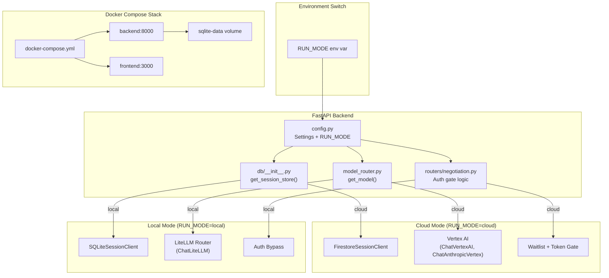
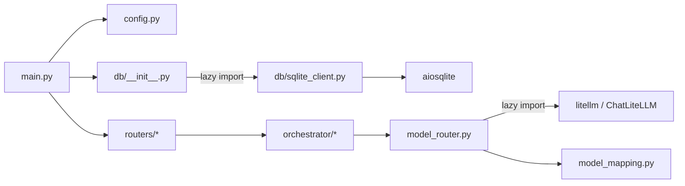

# Design Document — A2A Local Battle Arena

## Overview

This design enables the JuntoAI A2A MVP to run entirely on a developer's machine with zero GCP dependencies. The approach introduces runtime-switchable abstraction layers for database persistence, LLM routing, and auth gating — all controlled by a single `RUN_MODE` environment variable.

The core principle: **the cloud path is untouched**. Every change is additive. When `RUN_MODE=cloud`, the application behaves identically to today's production deployment. When `RUN_MODE=local`, SQLite replaces Firestore, LiteLLM replaces Vertex AI, and the auth gate is bypassed.

A `docker-compose.yml` at the monorepo root gives developers a single `docker compose up` command to launch the full stack (FastAPI + Next.js) on localhost.

### Key Design Decisions

1. **Protocol-based abstraction over inheritance** — `SessionStore` is a Python `Protocol`, not an ABC. This avoids import-time coupling to GCP libraries and enables structural subtyping.
2. **Factory pattern with lazy imports** — The `db/__init__.py` factory and `model_router.py` use conditional lazy imports so GCP packages are never loaded in local mode.
3. **LiteLLM as the local LLM router** — LiteLLM already supports 100+ providers with a unified interface and has a LangChain integration (`ChatLiteLLM`). No need to build custom provider adapters.
4. **Model mapping layer** — A dedicated `model_mapping.py` translates cloud `model_id` values (e.g., `gemini-2.5-flash`) to local provider equivalents, with override support via environment variables.
5. **Exception generalization** — `FirestoreConnectionError` → `DatabaseConnectionError`. A single rename that makes the error hierarchy provider-agnostic.

## Architecture



### Module Dependency Flow (Local Mode)



Note: In local mode, `google.cloud.firestore`, `langchain_google_vertexai`, and `google.cloud.aiplatform` are never imported.

## Components and Interfaces

### 1. SessionStore Protocol (`backend/app/db/base.py`)

```python
from typing import Protocol, runtime_checkable
from app.models.negotiation import NegotiationStateModel

@runtime_checkable
class SessionStore(Protocol):
    async def create_session(self, state: NegotiationStateModel) -> None: ...
    async def get_session(self, session_id: str) -> NegotiationStateModel: ...
    async def get_session_doc(self, session_id: str) -> dict: ...
    async def update_session(self, session_id: str, updates: dict) -> None: ...
```

All four methods match the existing `FirestoreSessionClient` public API exactly — zero breaking changes.

### 2. SQLiteSessionClient (`backend/app/db/sqlite_client.py`)

Implements `SessionStore` using `aiosqlite`. Stores `NegotiationStateModel` as JSON in a `data` column. The database file path is configurable via `SQLITE_DB_PATH` (default: `data/juntoai.db`).

Key behaviors:
- Auto-creates the database file and `negotiation_sessions` table on init
- Serializes via `model.model_dump_json()`, deserializes via `NegotiationStateModel.model_validate_json()`
- `update_session` reads existing JSON, merges the updates dict, writes back, and bumps `updated_at`
- Raises `SessionNotFoundError` for missing session_id
- Raises `DatabaseConnectionError` if the SQLite file cannot be opened/created

### 3. Session Store Factory (`backend/app/db/__init__.py`)

Replaces the current `get_firestore_client()` with `get_session_store() -> SessionStore`:

```python
def get_session_store() -> SessionStore:
    global _client
    if _client is None:
        if settings.RUN_MODE == "local":
            from app.db.sqlite_client import SQLiteSessionClient
            _client = SQLiteSessionClient(db_path=settings.SQLITE_DB_PATH)
        else:
            from google.cloud import firestore  # lazy import
            from app.db.firestore_client import FirestoreSessionClient
            _client = FirestoreSessionClient(project=settings.GOOGLE_CLOUD_PROJECT or None)
    return _client
```

The old `get_firestore_client()` function is removed. All call sites switch to `get_session_store()`.

### 4. Model Router Refactor (`backend/app/orchestrator/model_router.py`)

The `get_model()` function signature stays the same. Internally, it branches on `RUN_MODE`:

- **Cloud mode**: Existing Vertex AI logic (unchanged)
- **Local mode**: Uses `ChatLiteLLM` from `langchain_community.chat_models` with model IDs translated via the model mapping layer

GCP imports (`langchain_google_vertexai`, `ChatVertexAI`, `ChatAnthropicVertex`) move from top-level to inside the cloud-mode branch (lazy imports).

### 5. Model Mapping (`backend/app/orchestrator/model_mapping.py`)

A new module that translates scenario `model_id` values to local provider model strings:

```python
DEFAULT_MODEL_MAP: dict[str, dict[str, str]] = {
    "openai": {
        "gemini-2.5-flash": "gpt-4o",
        "claude-3-5-sonnet-v2": "gpt-4o",
        "claude-sonnet-4": "gpt-4o",
    },
    "anthropic": {
        "gemini-2.5-flash": "claude-3-5-sonnet-20241022",
        "claude-3-5-sonnet-v2": "claude-3-5-sonnet-20241022",
        "claude-sonnet-4": "claude-sonnet-4-20250514",
    },
    "ollama": {
        "gemini-2.5-flash": "llama3",
        "claude-3-5-sonnet-v2": "llama3",
        "claude-sonnet-4": "llama3",
    },
}
```

Resolution order:
1. `LLM_MODEL_OVERRIDE` env var → use this single model for all agents
2. `MODEL_MAP` env var (JSON string) → per-model-id overrides
3. `DEFAULT_MODEL_MAP[LLM_PROVIDER][model_id]` → built-in defaults
4. Provider's default model + warning log

### 6. Auth Gate Bypass

In `backend/app/routers/negotiation.py`, the auth gate logic (email validation, token checks) is wrapped in a `RUN_MODE` check:

```python
if settings.RUN_MODE == "cloud":
    # existing waitlist + token gate logic
    ...
else:
    # local mode: skip all auth, use placeholder email for SSE tracker
    email = email or "local@dev"
```

### 7. Configuration Updates (`backend/app/config.py`)

New fields on the `Settings` class:

| Field | Type | Default | Description |
|-------|------|---------|-------------|
| `RUN_MODE` | `Literal["cloud", "local"]` | `"local"` | Runtime mode switch |
| `SQLITE_DB_PATH` | `str` | `"data/juntoai.db"` | SQLite database file path |
| `LLM_PROVIDER` | `str` | `"openai"` | LiteLLM provider name |
| `LLM_MODEL_OVERRIDE` | `str` | `""` | Override all model_ids with this model |
| `MODEL_MAP` | `str` | `""` | JSON string for per-model-id overrides |

Startup validation ensures `RUN_MODE` is one of `cloud` or `local`.

### 8. Exception Generalization (`backend/app/exceptions.py`)

```python
class DatabaseConnectionError(Exception):
    """Raised when the database connection fails (Firestore or SQLite)."""
    def __init__(self, message: str) -> None:
        self.message = message
        super().__init__(message)

# Backward compat alias (deprecated)
FirestoreConnectionError = DatabaseConnectionError
```

### 9. Docker Compose Stack (`docker-compose.yml`)

```yaml
services:
  backend:
    build: ./backend
    ports: ["8000:8080"]
    env_file: .env
    environment:
      RUN_MODE: local
    volumes:
      - sqlite-data:/app/data
    healthcheck:
      test: ["CMD", "curl", "-f", "http://localhost:8080/api/v1/health"]
      interval: 10s
      timeout: 5s
      retries: 3

  frontend:
    build: ./frontend
    ports: ["3000:3000"]
    environment:
      NEXT_PUBLIC_API_URL: http://localhost:8000
      NEXT_PUBLIC_RUN_MODE: local
    depends_on:
      backend:
        condition: service_healthy

volumes:
  sqlite-data:
```

### 10. Frontend Environment Detection

The Next.js app reads `NEXT_PUBLIC_RUN_MODE`:
- `local`: Skip landing page (waitlist gate), hide token counter, go straight to Arena Selector
- `cloud`: Full 4-screen flow, no changes

This is a simple conditional at the page/component level — no architectural changes to the frontend.

## Data Models

### SQLite Schema

```sql
CREATE TABLE IF NOT EXISTS negotiation_sessions (
    session_id TEXT PRIMARY KEY,
    data JSON NOT NULL,
    created_at TIMESTAMP DEFAULT CURRENT_TIMESTAMP,
    updated_at TIMESTAMP DEFAULT CURRENT_TIMESTAMP
);
```

The `data` column stores the full `NegotiationStateModel` as a JSON string. This mirrors the Firestore document model (one document per session, all fields in a single JSON blob).

### NegotiationStateModel (unchanged)

The existing Pydantic model in `backend/app/models/negotiation.py` is used as-is by both `FirestoreSessionClient` and `SQLiteSessionClient`. No schema changes.

### Model Mapping Data Structure

```python
# Per-provider mapping: scenario_model_id → local_model_string
DEFAULT_MODEL_MAP: dict[str, dict[str, str]] = {
    "openai": {"gemini-2.5-flash": "gpt-4o", ...},
    "anthropic": {"gemini-2.5-flash": "claude-3-5-sonnet-20241022", ...},
    "ollama": {"gemini-2.5-flash": "llama3", ...},
}
```

### Environment Variable Schema

| Variable | Required | Default | Description |
|----------|----------|---------|-------------|
| `RUN_MODE` | No | `local` | `cloud` or `local` |
| `SQLITE_DB_PATH` | No | `data/juntoai.db` | SQLite file path (local mode) |
| `LLM_PROVIDER` | No | `openai` | LiteLLM provider |
| `LLM_MODEL_OVERRIDE` | No | `""` | Single model for all agents |
| `MODEL_MAP` | No | `""` | JSON per-model-id overrides |
| `OPENAI_API_KEY` | Local+OpenAI | — | OpenAI API key |
| `ANTHROPIC_API_KEY` | Local+Anthropic | — | Anthropic API key |
| `GOOGLE_CLOUD_PROJECT` | Cloud | — | GCP project ID |
| `VERTEX_AI_LOCATION` | Cloud | `europe-west1` | Vertex AI region |
| `NEXT_PUBLIC_RUN_MODE` | No | `local` | Frontend mode detection |
| `NEXT_PUBLIC_API_URL` | No | `http://localhost:8000` | Backend URL for frontend |


## Correctness Properties

*A property is a characteristic or behavior that should hold true across all valid executions of a system — essentially, a formal statement about what the system should do. Properties serve as the bridge between human-readable specifications and machine-verifiable correctness guarantees.*

### Property 1: Session round-trip (create → read equivalence)

*For any* valid `NegotiationStateModel` instance, creating a session via `SQLiteSessionClient.create_session()` and then reading it back via `get_session()` shall produce a `NegotiationStateModel` that is equivalent to the original (all fields match). This is a classic serialization round-trip: `get_session(create_session(model).session_id) == model`.

**Validates: Requirements 2.4, 2.5, 2.7**

### Property 2: Missing session raises SessionNotFoundError

*For any* random session_id string that has not been inserted into the `SessionStore`, calling `get_session(session_id)` shall raise `SessionNotFoundError`. This must hold for both `SQLiteSessionClient` and `FirestoreSessionClient`.

**Validates: Requirements 1.6**

### Property 3: Update merge preserves unmodified fields

*For any* valid `NegotiationStateModel` that has been persisted, and *for any* valid partial updates dict (a subset of the model's fields with new values), calling `update_session(session_id, updates)` and then `get_session(session_id)` shall return a model where: (a) every field in the updates dict has the new value, and (b) every field NOT in the updates dict retains its original value.

**Validates: Requirements 2.6**

### Property 4: Model mapping produces valid provider model strings

*For any* supported `LLM_PROVIDER` value and *for any* scenario `model_id` present in the default mapping, `resolve_model_id(model_id, provider)` shall return a non-empty string that is a valid model identifier for that provider. The mapping must cover all `model_id` values used in the shipped scenario configs.

**Validates: Requirements 3.4, 4.1, 9.3**

### Property 5: Model override takes precedence over mapping

*For any* scenario `model_id` string and *for any* non-empty `LLM_MODEL_OVERRIDE` value, the resolved local model shall always equal the override value, regardless of the `LLM_PROVIDER` or `MODEL_MAP` settings. When `LLM_MODEL_OVERRIDE` is empty but `MODEL_MAP` contains an entry for the `model_id`, the `MODEL_MAP` entry shall take precedence over the default mapping.

**Validates: Requirements 4.2, 4.3**

### Property 6: Local mode accepts any email value

*For any* string value (including empty string and arbitrary unicode), when `RUN_MODE=local`, the negotiation start endpoint shall not reject the request based on the email field. The auth gate is completely bypassed.

**Validates: Requirements 5.3**

### Property 7: RUN_MODE validation rejects invalid values

*For any* string that is not `"cloud"` or `"local"`, constructing the `Settings` class with that `RUN_MODE` value shall raise a Pydantic `ValidationError`.

**Validates: Requirements 6.5**

### Property 8: Scenario config produces identical initial state across modes

*For any* valid scenario JSON config, calling `create_initial_state()` when `RUN_MODE=cloud` and when `RUN_MODE=local` shall produce `NegotiationState` dicts with identical values for all fields (same session structure, agent roles, turn order, toggles, max_turns, agreement_threshold). The only difference between modes is which LLM backs each agent — the state structure is mode-independent.

**Validates: Requirements 9.1, 9.2, 9.4**

### Property 9: DatabaseConnectionError produces HTTP 503

*For any* request that triggers a `DatabaseConnectionError` (regardless of whether the underlying store is Firestore or SQLite), the FastAPI exception handler shall return HTTP 503 with body `{"detail": "Database unavailable"}`.

**Validates: Requirements 10.5**

## Error Handling

### Exception Hierarchy

| Exception | Raised When | HTTP Status | Response Body |
|-----------|-------------|-------------|---------------|
| `SessionNotFoundError` | `get_session()` / `get_session_doc()` / `update_session()` with non-existent session_id | 404 | `{"detail": "Session {id} not found"}` |
| `DatabaseConnectionError` | Store initialization fails (bad SQLite path, Firestore SDK error) | 503 | `{"detail": "Database unavailable"}` |
| `ModelNotAvailableError` | Unknown model family, missing API key, LiteLLM instantiation failure | 500 | `{"detail": "Model {id}: {message}"}` |
| `ValidationError` (Pydantic) | Invalid `RUN_MODE` value at startup | Startup crash | Clear error message in logs |

### Error Handling by Mode

**Local mode specific errors:**
- Missing API key → `ModelNotAvailableError` with message like `"Missing OPENAI_API_KEY for provider 'openai'"`
- Invalid SQLite path (e.g., read-only filesystem) → `DatabaseConnectionError`
- Unknown `model_id` with no mapping → fallback to provider default + warning log; if no default exists → `ModelNotAvailableError`

**Cloud mode specific errors:**
- Missing GCP package → `ImportError` with message listing the package name (e.g., `"google-cloud-firestore is required for cloud mode"`)
- Firestore SDK connection failure → `DatabaseConnectionError` (renamed from `FirestoreConnectionError`)

### Backward Compatibility

`FirestoreConnectionError` is kept as an alias for `DatabaseConnectionError` to avoid breaking any external code that catches it by name. The alias is marked as deprecated.

## Testing Strategy

### Dual Testing Approach

This feature requires both unit tests and property-based tests:

- **Unit tests**: Verify specific examples, edge cases, integration points, and mode-switching behavior
- **Property tests**: Verify universal properties across randomly generated inputs using Hypothesis

### Property-Based Testing Configuration

- **Library**: [Hypothesis](https://hypothesis.readthedocs.io/) (already in `backend/requirements.txt`)
- **Minimum iterations**: 100 per property test (via `@settings(max_examples=100)`)
- **Each property test must reference its design document property via a comment tag**
- **Tag format**: `# Feature: 080_a2a-local-battle-arena, Property {number}: {property_text}`
- **Each correctness property must be implemented by a SINGLE property-based test**

### Unit Test Plan

| Test Area | What to Test | Mock Strategy |
|-----------|-------------|---------------|
| `SessionStore` protocol | `FirestoreSessionClient` and `SQLiteSessionClient` both satisfy `isinstance` check | No mocks — use `runtime_checkable` |
| Factory function | Returns correct type per `RUN_MODE` | Mock `Settings` |
| Factory singleton | Second call returns same object | Mock `Settings` |
| Model router (cloud) | Returns `ChatVertexAI` / `ChatAnthropicVertex` | Mock Vertex AI SDK |
| Model router (local) | Returns `ChatLiteLLM` with correct model string | Mock LiteLLM |
| Auth bypass | Local mode skips email/token checks | TestClient with `RUN_MODE=local` |
| Auth enforcement | Cloud mode enforces email/token checks | TestClient with `RUN_MODE=cloud` |
| Exception rename | `DatabaseConnectionError` handler returns 503 | TestClient |
| Docker Compose | YAML structure has correct services, volumes, healthcheck | Parse YAML |
| `.env.example` | Contains all required variables, comments, provider examples | File content assertions |
| Dockerfile | Contains `RUN data/` or `mkdir data` | File content assertions |
| Lazy imports | GCP modules not in `sys.modules` when `RUN_MODE=local` | Check `sys.modules` |
| Frontend env | `NEXT_PUBLIC_RUN_MODE` controls page routing | Component tests with env override |

### Property Test Plan

| Property | Generator Strategy | Assertion |
|----------|-------------------|-----------|
| P1: Session round-trip | `hypothesis.strategies` for all `NegotiationStateModel` fields (random strings, ints, floats, lists, dicts) | `get_session(id) == original` |
| P2: Missing session error | Random UUID strings | `pytest.raises(SessionNotFoundError)` |
| P3: Update merge | Random `NegotiationStateModel` + random subset of fields as updates | Updated fields match, others unchanged |
| P4: Model mapping | `st.sampled_from(known_model_ids)` × `st.sampled_from(providers)` | Result is non-empty string |
| P5: Override precedence | Random model_id + random override string | Resolved == override |
| P6: Any email accepted | `st.text()` for email | No auth rejection |
| P7: RUN_MODE validation | `st.text().filter(lambda s: s not in ("cloud", "local"))` | `ValidationError` raised |
| P8: Scenario state identity | Random scenario configs | `state_cloud == state_local` (all fields) |
| P9: DB error → 503 | Trigger `DatabaseConnectionError` | Response status == 503, body matches |

### Test File Organization

```
backend/tests/unit/
├── test_session_store_protocol.py      # Protocol conformance, factory tests
├── test_sqlite_client.py               # SQLite CRUD unit tests
├── test_sqlite_client_properties.py    # Properties 1, 2, 3
├── test_model_router_local.py          # LiteLLM routing unit tests
├── test_model_mapping.py               # Mapping unit tests
├── test_model_mapping_properties.py    # Properties 4, 5
├── test_auth_bypass.py                 # Auth gate unit tests
├── test_config_properties.py           # Property 7
├── test_scenario_compat_properties.py  # Property 8
├── test_exceptions.py                  # Property 9 + exception rename tests
```
