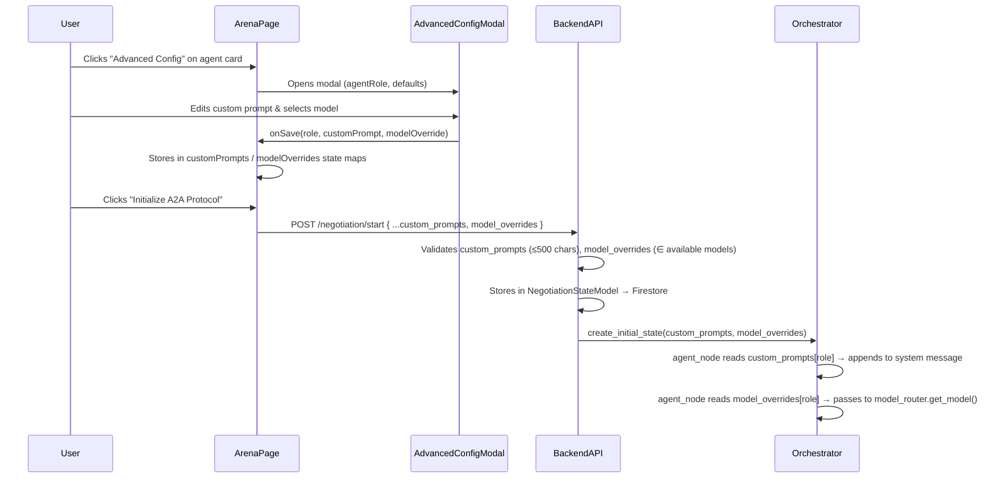
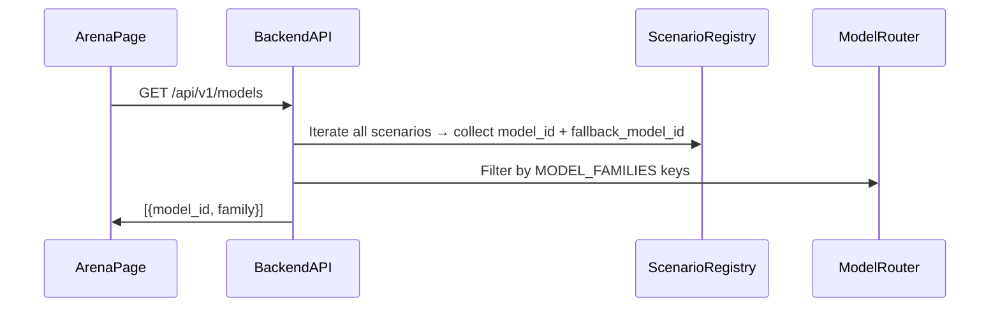

# Design Document: Agent Advanced Configuration

## Overview

This feature adds per-agent advanced configuration to the Arena Selector, allowing users to customize agent behavior before starting a negotiation. Two configuration axes are exposed:

1. **Custom Prompt** — free-text (≤500 chars) appended to the agent's system message
2. **Model Override** — select an alternative LLM model from the system's available models

The design touches four layers: a new React modal component, frontend state management in the Arena page, two backend API changes (new `/api/v1/models` endpoint + updated `StartNegotiationRequest`), and orchestrator-level prompt injection and model routing.

The feature is strictly additive — agents with no overrides behave identically to today.

## Architecture



### Data Flow: Available Models



## Components and Interfaces

### Frontend

#### AdvancedConfigModal

New component at `frontend/components/arena/AdvancedConfigModal.tsx`.

```typescript
interface AdvancedConfigModalProps {
  isOpen: boolean;
  agentName: string;
  agentRole: string;
  defaultModelId: string;
  availableModels: ModelInfo[];
  initialCustomPrompt: string;
  initialModelOverride: string | null;
  onSave: (customPrompt: string, modelOverride: string | null) => void;
  onCancel: () => void;
}

interface ModelInfo {
  model_id: string;
  family: string;
}
```

Responsibilities:
- Renders a modal overlay with backdrop
- Textarea for custom prompt with 500-char limit and live counter
- Dropdown for model selection (default model shown first with "(default)" suffix)
- Save/Cancel buttons, Escape key closes
- Focus trap for accessibility (tab cycling within modal)
- Responsive: full-width bottom sheet on `<1024px`, centered 480px modal on `≥1024px`
- Textarea min-height: 120px

#### AgentCard Changes

The existing `AgentCard` component gains:
- An "Advanced Config" button (Lucide `SlidersHorizontal` icon + text)
- A visual indicator dot when a custom prompt is configured
- Display of overridden model name when a model override is active

```typescript
// Extended props
interface AgentCardProps {
  name: string;
  role: string;
  goals: string[];
  modelId: string;
  index: number;
  hasCustomPrompt: boolean;
  modelOverride: string | null;
  onAdvancedConfig: () => void;
}
```

#### Arena Page State

Two new `useState` maps in `ArenaPageContent`:

```typescript
const [customPrompts, setCustomPrompts] = useState<Record<string, string>>({});
const [modelOverrides, setModelOverrides] = useState<Record<string, string>>({});
const [availableModels, setAvailableModels] = useState<ModelInfo[]>([]);
```

- Both maps are keyed by agent `role` string
- Both are cleared when `selectedScenarioId` changes
- `availableModels` is fetched once on page mount from `GET /api/v1/models`

#### API Client Addition

New function in `frontend/lib/api.ts`:

```typescript
export async function fetchAvailableModels(): Promise<ModelInfo[]> {
  const res = await fetch(`${API_BASE}/models`);
  if (!res.ok) throw new Error(await extractErrorDetail(res));
  return res.json();
}
```

Updated `startNegotiation` signature:

```typescript
export async function startNegotiation(
  email: string,
  scenarioId: string,
  activeToggles: string[],
  customPrompts?: Record<string, string>,
  modelOverrides?: Record<string, string>,
): Promise<StartNegotiationResponse>
```

### Backend

#### New Endpoint: GET /api/v1/models

Added to a new router `backend/app/routers/models.py`, registered in `main.py`.

```python
@router.get("/models")
async def list_available_models(
    registry: ScenarioRegistry = Depends(get_scenario_registry),
) -> list[dict[str, str]]:
    """Return deduplicated list of available models from all loaded scenarios."""
```

Logic:
1. Iterate all scenarios in the registry
2. Collect every `model_id` and `fallback_model_id` from every agent
3. Deduplicate
4. Filter: keep only model IDs whose family prefix (`model_id.split("-")[0]`) exists in `model_router.MODEL_FAMILIES`
5. Return `[{"model_id": "...", "family": "..."}]`

#### Updated Pydantic Models

`StartNegotiationRequest` in `backend/app/routers/negotiation.py`:

```python
class StartNegotiationRequest(BaseModel):
    email: str = Field(..., min_length=1)
    scenario_id: str = Field(..., min_length=1)
    active_toggles: list[str] = Field(default_factory=list)
    custom_prompts: dict[str, str] = Field(default_factory=dict)
    model_overrides: dict[str, str] = Field(default_factory=dict)
```

With a Pydantic `model_validator` that enforces:
- Each value in `custom_prompts` is ≤500 characters
- Each value in `model_overrides` is a recognized model (validated at the endpoint level against the registry-derived available models list)

`NegotiationStateModel` in `backend/app/models/negotiation.py`:

```python
custom_prompts: dict[str, str] = Field(default_factory=dict)
model_overrides: dict[str, str] = Field(default_factory=dict)
```

#### Updated Orchestrator State

`NegotiationState` TypedDict in `backend/app/orchestrator/state.py`:

```python
custom_prompts: dict[str, str]
model_overrides: dict[str, str]
```

`create_initial_state` gains two new optional parameters:

```python
def create_initial_state(
    session_id: str,
    scenario_config: dict[str, Any],
    active_toggles: list[str] | None = None,
    hidden_context: dict[str, Any] | None = None,
    custom_prompts: dict[str, str] | None = None,
    model_overrides: dict[str, str] | None = None,
) -> NegotiationState:
```

#### Agent Node Changes

In `_build_prompt` (`backend/app/orchestrator/agent_node.py`):

After the persona/goals/budget/hidden_context block and before the output schema block, inject:

```python
custom_prompts = state.get("custom_prompts", {})
custom_prompt = custom_prompts.get(role)
if custom_prompt:
    parts.append(f"\nAdditional user instructions:\n{custom_prompt}")
```

In `create_agent_node._node`:

When calling `model_router.get_model`, check for a model override:

```python
model_overrides = state.get("model_overrides", {})
effective_model_id = model_overrides.get(agent_role, agent_config["model_id"])
model = model_router.get_model(
    effective_model_id,
    fallback_model_id=agent_config.get("fallback_model_id"),
)
```

#### Negotiation Router Changes

In `start_negotiation` endpoint:
1. Validate `custom_prompts` values ≤500 chars (Pydantic validator)
2. Validate `model_overrides` values against available models (endpoint-level check using registry)
3. Filter out keys that don't match any agent role in the scenario (silently ignore)
4. Store both in `NegotiationStateModel` and persist to Firestore
5. Pass both to `create_initial_state`

In `stream_negotiation` endpoint:
- Pass `custom_prompts` and `model_overrides` from the loaded state to `create_initial_state`

## Data Models

### Frontend State Shape

```typescript
// Arena page component state
{
  customPrompts: Record<string, string>,    // { "Recruiter": "Be aggressive..." }
  modelOverrides: Record<string, string>,   // { "Recruiter": "claude-3-5-sonnet" }
  availableModels: ModelInfo[],             // fetched from GET /api/v1/models
}
```

### Backend: StartNegotiationRequest (updated)

```python
class StartNegotiationRequest(BaseModel):
    email: str = Field(..., min_length=1)
    scenario_id: str = Field(..., min_length=1)
    active_toggles: list[str] = Field(default_factory=list)
    custom_prompts: dict[str, str] = Field(default_factory=dict)
    model_overrides: dict[str, str] = Field(default_factory=dict)

    @model_validator(mode="after")
    def validate_custom_prompt_lengths(self) -> "StartNegotiationRequest":
        for role, prompt in self.custom_prompts.items():
            if len(prompt) > 500:
                raise ValueError(
                    f"Custom prompt for '{role}' exceeds 500 character limit "
                    f"({len(prompt)} chars)"
                )
        return self
```

### Backend: NegotiationStateModel (updated)

Two new fields added:

```python
custom_prompts: dict[str, str] = Field(default_factory=dict)
model_overrides: dict[str, str] = Field(default_factory=dict)
```

### Backend: NegotiationState TypedDict (updated)

```python
class NegotiationState(TypedDict):
    # ... existing fields ...
    custom_prompts: dict[str, str]
    model_overrides: dict[str, str]
```

### Backend: GET /api/v1/models Response

```json
[
  { "model_id": "gemini-2.5-flash", "family": "gemini" },
  { "model_id": "gemini-2.5-pro", "family": "gemini" },
  { "model_id": "gemini-3-flash-preview", "family": "gemini" },
  { "model_id": "claude-3-5-sonnet", "family": "claude" },
  { "model_id": "claude-sonnet-4-6", "family": "claude" }
]
```

### Firestore Document (updated)

The negotiation session document gains two new top-level fields:

```json
{
  "session_id": "abc123",
  "scenario_id": "talent-war",
  "custom_prompts": { "Recruiter": "Be more aggressive..." },
  "model_overrides": { "Candidate": "gemini-2.5-pro" },
  "...": "existing fields unchanged"
}
```


## Correctness Properties

*A property is a characteristic or behavior that should hold true across all valid executions of a system — essentially, a formal statement about what the system should do. Properties serve as the bridge between human-readable specifications and machine-verifiable correctness guarantees.*

### Property 1: StartNegotiationRequest round-trip serialization

*For any* valid `StartNegotiationRequest` containing `custom_prompts` (each value ≤500 chars) and `model_overrides` (each value a recognized model_id), serializing to JSON and deserializing back should produce an equivalent model with all fields preserved, including `custom_prompts` and `model_overrides` defaulting to empty dicts when omitted.

**Validates: Requirements 6.1, 11.1, 13.1**

### Property 2: Custom prompt length validation rejects oversized prompts

*For any* string longer than 500 characters used as a value in `custom_prompts`, the `StartNegotiationRequest` Pydantic validator should raise a `ValidationError`.

**Validates: Requirements 6.2**

### Property 3: Invalid model override rejection

*For any* model_id string that is not present in the available models list (derived from loaded scenarios filtered by MODEL_FAMILIES), the backend should return HTTP 422 when that model_id is used as a value in `model_overrides`.

**Validates: Requirements 11.2**

### Property 4: Unknown agent role keys are silently ignored

*For any* `custom_prompts` or `model_overrides` key that does not match any agent role in the selected scenario, the backend should process the request successfully, ignoring the unrecognized keys — the stored state should contain only keys matching valid agent roles.

**Validates: Requirements 6.3, 11.3**

### Property 5: Custom prompt injection into system message

*For any* non-empty custom prompt string and any agent configuration, the system message built by `_build_prompt` should contain the custom prompt prefixed with `"\nAdditional user instructions:\n"`, positioned after the persona/goals/budget/hidden_context block and before the output schema JSON instructions. When no custom prompt exists for the agent, the system message should be identical to the output without the feature.

**Validates: Requirements 7.1, 7.2, 7.3, 7.4**

### Property 6: Model override routing

*For any* agent with a model override in the negotiation state, the `agent_node` should pass the overridden `model_id` to `model_router.get_model()` instead of the agent's default `model_id` from the scenario config, while always preserving the original `fallback_model_id` from the scenario config. When no model override exists, the default `model_id` should be used.

**Validates: Requirements 12.1, 12.2, 12.3, 12.4**

### Property 7: Available models endpoint returns correct filtered union

*For any* set of loaded scenarios in the ScenarioRegistry, the `GET /api/v1/models` endpoint should return the deduplicated union of all `model_id` and `fallback_model_id` values across all agents, filtered to include only those whose family prefix (text before the first `-`) exists in `model_router.MODEL_FAMILIES`. Each returned object should contain both `model_id` (string) and `family` (string) fields.

**Validates: Requirements 9.2, 9.3, 9.4**

### Property 8: Custom prompt character limit enforcement in textarea

*For any* input string, the custom prompt textarea should never contain more than 500 characters. The displayed character counter should always equal the current length of the textarea content. Pasting text that would exceed 500 characters should result in truncation to exactly 500 characters.

**Validates: Requirements 3.1, 3.2, 3.3, 3.4**

### Property 9: Request payload includes only non-empty overrides

*For any* set of agent configurations where some agents have custom prompts or model overrides and others do not, the `StartNegotiationRequest` payload should include only the agents with non-empty values in `custom_prompts` and `model_overrides` respectively. Agents with empty or unset values should be omitted from both maps.

**Validates: Requirements 5.1, 5.2, 5.3, 5.5, 5.6, 5.7**

### Property 10: State persistence round-trip

*For any* valid `custom_prompts` and `model_overrides` dicts, storing them in `NegotiationStateModel`, serializing to a Firestore document dict, and deserializing back should produce equivalent values. The `create_initial_state` function should include both fields in the returned `NegotiationState` when provided.

**Validates: Requirements 6.4, 11.4, 13.2, 13.4**

### Property 11: Agent card visual indicators reflect configuration state

*For any* agent card, when `hasCustomPrompt` is true, a visual indicator (dot/badge) should be present in the rendered output. When `modelOverride` is non-null, the displayed model text should show the overridden model name instead of the default.

**Validates: Requirements 1.4, 1.5**

### Property 12: Model selector default ordering and labeling

*For any* available models list and default model_id, the Model_Selector dropdown should display the default model as the first option with a "(default)" suffix, and all models should display their family as a secondary label.

**Validates: Requirements 2.5, 10.2, 10.3, 10.4**

### Property 13: Config save-and-reload round-trip

*For any* agent role, custom prompt string (≤500 chars), and model override selection, saving the configuration and re-opening the modal should pre-populate the textarea with the saved custom prompt and pre-select the saved model override in the dropdown.

**Validates: Requirements 4.3, 4.4, 4.6, 4.7**

## Error Handling

| Error Condition | Layer | Handling |
|---|---|---|
| `custom_prompts` value > 500 chars | Backend (Pydantic) | HTTP 422 with validation error detail |
| `model_overrides` value not in available models | Backend (endpoint) | HTTP 422 with error specifying invalid model_id |
| Unknown agent role key in `custom_prompts` or `model_overrides` | Backend (endpoint) | Silently ignored — filtered out before storage |
| `GET /api/v1/models` fetch fails | Frontend | Model_Selector shows only default model, dropdown disabled, tooltip explains unavailability |
| `POST /negotiation/start` returns 422 | Frontend | Display validation error message to user |
| Model override model fails at LLM invocation time | Backend (model_router) | Falls back to `fallback_model_id` from scenario config (existing behavior) |
| Empty `custom_prompts` / `model_overrides` | Both | Treated as no-op — identical to current behavior |

## Testing Strategy

### Dual Testing Approach

This feature requires both unit tests and property-based tests:

- **Unit tests**: Specific examples, integration points, edge cases (modal open/close, Escape key, API error display, Firestore persistence)
- **Property tests**: Universal properties across generated inputs (Pydantic validation, prompt injection, model routing, serialization round-trips)

### Property-Based Testing Libraries

- **Backend (Python)**: `hypothesis` (already in use in the project)
- **Frontend (TypeScript)**: `fast-check` (already in use in the project)

### Property Test Configuration

- Minimum 100 iterations per property test
- Each test tagged with: `Feature: agent-advanced-config, Property {number}: {property_text}`

### Backend Property Tests

| Property | Test File | Strategy |
|---|---|---|
| P1: Request round-trip | `backend/tests/unit/test_negotiation_models.py` | Generate random `StartNegotiationRequest` instances with `custom_prompts` and `model_overrides`, serialize to JSON, deserialize, assert equality |
| P2: Prompt length validation | `backend/tests/unit/test_negotiation_models.py` | Generate strings > 500 chars, assert `ValidationError` raised |
| P3: Invalid model rejection | `backend/tests/integration/test_negotiation_router.py` | Generate random non-existent model_ids, POST to `/negotiation/start`, assert 422 |
| P4: Unknown role keys ignored | `backend/tests/integration/test_negotiation_router.py` | Generate random role strings not in scenario, assert they're filtered from stored state |
| P5: Prompt injection | `backend/tests/unit/test_agent_node.py` | Generate random custom prompts, call `_build_prompt`, assert delimiter + prompt present in correct position |
| P6: Model override routing | `backend/tests/unit/test_agent_node.py` | Generate random model overrides, mock `model_router.get_model`, assert called with overridden model_id and original fallback |
| P7: Models endpoint | `backend/tests/integration/test_models_router.py` | Generate random scenario configs with various model_ids, assert endpoint returns correct filtered union |
| P10: State persistence | `backend/tests/unit/test_negotiation_models.py` | Generate random state with custom_prompts and model_overrides, round-trip through `NegotiationStateModel` |

### Frontend Property Tests

| Property | Test File | Strategy |
|---|---|---|
| P8: Char limit enforcement | `frontend/__tests__/properties/customPromptCharLimit.property.test.ts` | Generate random strings of varying lengths, simulate input, assert textarea never exceeds 500 chars and counter matches |
| P9: Request payload filtering | `frontend/__tests__/properties/startNegotiationPayload.property.test.ts` | Generate random agent configs with mixed empty/non-empty prompts and overrides, assert payload contains only non-empty entries |
| P11: Agent card indicators | `frontend/__tests__/properties/agentCardConfig.property.test.tsx` | Generate random hasCustomPrompt/modelOverride combinations, render AgentCard, assert indicator presence matches props |
| P12: Model selector ordering | `frontend/__tests__/properties/modelSelector.property.test.tsx` | Generate random model lists and default model_id, render dropdown, assert default is first with "(default)" suffix |
| P13: Config round-trip | `frontend/__tests__/properties/configRoundTrip.property.test.tsx` | Generate random prompts and model selections, simulate save then re-open, assert pre-populated values match |

### Unit Tests (Examples & Edge Cases)

- Modal opens/closes on button click, Escape key, Cancel button
- Focus trap within modal
- Scenario change clears all overrides
- API error fallback for model list fetch failure
- Empty custom_prompts/model_overrides produce identical behavior to no feature
- Backdrop overlay prevents background interaction
