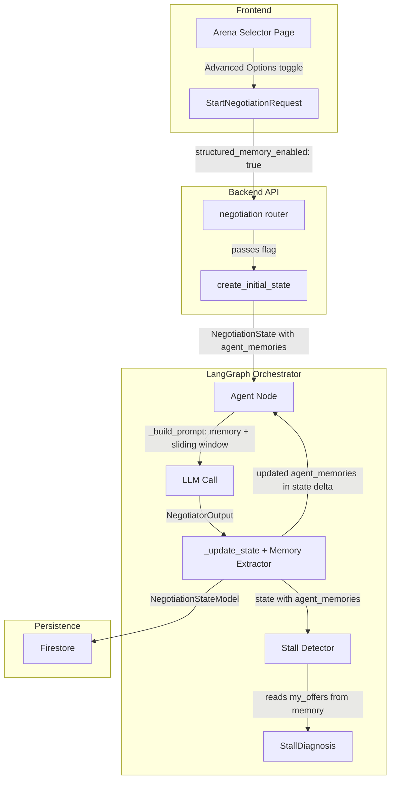

# Design Document: Structured Agent Memory

## Overview

This feature replaces the stateless full-history-in-prompt approach with a typed, per-agent memory object (`AgentMemory`) that is deterministically updated after each turn. When enabled, agents receive their structured memory plus a sliding window of the last 3 raw messages instead of the entire history transcript. This cuts token cost from O(n²) to O(1) per turn while giving agents precise structured recall.

The feature is opt-in via an "Advanced Options" collapsible section on the Arena Selector page. When disabled, the system behaves identically to today — zero behavioral change for existing users.

### Key Design Decisions

1. **Deterministic extraction over LLM summarization** — Memory is updated by parsing the already-structured `NegotiatorOutput` fields, not by making a second LLM call. This is cheaper, faster, and reproducible.
2. **Sliding window of 3** — Retains conversational tone and immediate context without the token cost of full history. The number 3 covers the most recent exchange cycle in a typical 2-negotiator + 1-regulator turn order.
3. **Feature flag at state level** — `structured_memory_enabled` lives in `NegotiationState` and `NegotiationStateModel`, making it available everywhere in the pipeline without threading a separate config object.
4. **AgentMemory in outputs.py** — Co-located with `NegotiatorOutput` since the memory fields directly mirror output fields. Avoids a new module for a single model.

## Architecture



### Data Flow (Memory-Enabled Turn)

1. Frontend sends `StartNegotiationRequest` with `structured_memory_enabled: true`
2. `create_initial_state` initializes empty `AgentMemory` dicts per role in `agent_memories`
3. On each agent turn, `_build_prompt` reads `agent_memories[role]` and serializes it into the user message, appending the last 3 history entries as a sliding window
4. After LLM response, `_update_state` calls the memory extractor to update `agent_memories[role]` with new offer data, incremented turn count, etc.
5. Stall detector reads `my_offers` directly from `agent_memories` instead of re-parsing history
6. State (including `agent_memories`) is persisted to Firestore via `NegotiationStateModel`

## Components and Interfaces

### 1. `AgentMemory` (Pydantic V2 Model) — `backend/app/orchestrator/outputs.py`

New Pydantic model added alongside existing output models.

```python
class AgentMemory(BaseModel):
    my_offers: list[float] = Field(default_factory=list)
    their_offers: list[float] = Field(default_factory=list)
    concessions_made: list[str] = Field(default_factory=list)
    concessions_received: list[str] = Field(default_factory=list)
    open_items: list[str] = Field(default_factory=list)
    tactics_used: list[str] = Field(default_factory=list)
    red_lines_stated: list[str] = Field(default_factory=list)
    compliance_status: dict[str, str] = Field(default_factory=dict)
    turn_count: int = 0
```

### 2. `NegotiationState` Changes — `backend/app/orchestrator/state.py`

Two new fields added to the TypedDict:

```python
structured_memory_enabled: bool
agent_memories: dict[str, dict[str, Any]]
```

`create_initial_state` gains a `structured_memory_enabled` parameter. When `True`, it populates `agent_memories` with `AgentMemory().model_dump()` per role.

### 3. `NegotiationStateModel` Changes — `backend/app/models/negotiation.py`

Two new optional fields with backward-compatible defaults:

```python
structured_memory_enabled: bool = Field(default=False)
agent_memories: dict[str, dict[str, Any]] = Field(default_factory=dict)
```

### 4. `StartNegotiationRequest` Changes — `backend/app/routers/negotiation.py`

New optional field:

```python
structured_memory_enabled: bool = Field(default=False)
```

### 5. `_build_prompt` Changes — `backend/app/orchestrator/agent_node.py`

When `structured_memory_enabled` is `True`:
- Serialize `AgentMemory` fields with labeled sections instead of full history
- Append last 3 history entries (or all if fewer than 3) as sliding window
- When `False`: no change to current behavior

### 6. Memory Extractor in `_update_state` — `backend/app/orchestrator/agent_node.py`

When `structured_memory_enabled` is `True` and agent type is `negotiator`:
- Load current `AgentMemory` from `agent_memories[role]`
- Append `proposed_price` to `my_offers`
- Find last opposing negotiator's price from history, append to `their_offers`
- Increment `turn_count`
- Store updated `AgentMemory.model_dump()` back into `agent_memories[role]` in the state delta

### 7. Stall Detector Changes — `backend/app/orchestrator/stall_detector.py`

When `structured_memory_enabled` is `True`:
- `_get_prices_by_role` reads from `agent_memories[role]["my_offers"]` directly
- Falls back to existing history-parsing when `False`

### 8. Converter Changes — `backend/app/orchestrator/converters.py`

`to_pydantic` and `from_pydantic` must map the two new fields (`structured_memory_enabled`, `agent_memories`) between `NegotiationState` and `NegotiationStateModel`.

### 9. Frontend: Advanced Options Section — `frontend/app/(protected)/arena/page.tsx`

- New collapsible "Advanced Options" section below Hidden Variables
- Contains a toggle switch for "Structured Agent Memory" using the existing `InformationToggle` pattern
- Collapsed by default, resets to off on scenario change
- Passes `structured_memory_enabled` in the `startNegotiation` API call

### 10. Frontend API Client — `frontend/lib/api.ts`

`startNegotiation` function gains an optional `structuredMemoryEnabled` parameter, included in the request body as `structured_memory_enabled`.

## Data Models

### AgentMemory

| Field | Type | Default | Description |
|---|---|---|---|
| `my_offers` | `list[float]` | `[]` | Prices this agent has proposed, in chronological order |
| `their_offers` | `list[float]` | `[]` | Prices the opposing negotiator proposed, in chronological order |
| `concessions_made` | `list[str]` | `[]` | Concessions this agent has made (extracted from output) |
| `concessions_received` | `list[str]` | `[]` | Concessions received from the other party |
| `open_items` | `list[str]` | `[]` | Unresolved negotiation items |
| `tactics_used` | `list[str]` | `[]` | Tactics this agent has employed |
| `red_lines_stated` | `list[str]` | `[]` | Non-negotiable positions stated |
| `compliance_status` | `dict[str, str]` | `{}` | Regulator compliance tracking (item → status) |
| `turn_count` | `int` | `0` | Number of turns this agent has taken |

### NegotiationState (additions)

| Field | Type | Default | Description |
|---|---|---|---|
| `structured_memory_enabled` | `bool` | `False` | Whether structured memory is active for this session |
| `agent_memories` | `dict[str, dict[str, Any]]` | `{}` | Serialized `AgentMemory` per agent role |

### NegotiationStateModel (additions)

| Field | Type | Default | Description |
|---|---|---|---|
| `structured_memory_enabled` | `bool` | `False` | Persisted memory flag |
| `agent_memories` | `dict[str, dict[str, Any]]` | `{}` | Persisted memory data |

### StartNegotiationRequest (addition)

| Field | Type | Default | Description |
|---|---|---|---|
| `structured_memory_enabled` | `bool` | `False` | Client opt-in for structured memory |


## Correctness Properties

*A property is a characteristic or behavior that should hold true across all valid executions of a system — essentially, a formal statement about what the system should do. Properties serve as the bridge between human-readable specifications and machine-verifiable correctness guarantees.*

### Property 1: AgentMemory serialization round-trip

*For any* valid `AgentMemory` instance with arbitrary field values, calling `model_dump()` and then reconstructing via `AgentMemory(**data)` shall produce an object equal to the original.

**Validates: Requirements 1.4, 9.1**

### Property 2: create_initial_state memory initialization

*For any* valid scenario config with N agents and any boolean value for `structured_memory_enabled`: when `True`, `create_initial_state` shall produce `agent_memories` with exactly N keys (one per agent role), each containing a default `AgentMemory().model_dump()`; when `False`, `agent_memories` shall be an empty dict.

**Validates: Requirements 2.3, 2.4, 2.5**

### Property 3: Memory-enabled prompt contains labeled memory and sliding window

*For any* `NegotiationState` with `structured_memory_enabled=True`, any agent config, and any `AgentMemory` with arbitrary field values: `_build_prompt` shall produce a user message that (a) contains labeled sections for each non-empty memory field, (b) does NOT contain the full history transcript, and (c) contains exactly `min(3, len(history))` history entries as a sliding window taken from the end of the history list.

**Validates: Requirements 5.1, 5.2, 5.3, 5.4**

### Property 4: Disabled memory produces identical prompts

*For any* `NegotiationState` with `structured_memory_enabled=False` (or absent), `_build_prompt` shall produce output identical to the current implementation that serializes the full history.

**Validates: Requirements 5.5, 8.1**

### Property 5: Memory extractor correctly updates agent memory

*For any* `NegotiationState` with `structured_memory_enabled=True`, any negotiator role, and any valid `NegotiatorOutput` with a `proposed_price`: after `_update_state`, the state delta's `agent_memories[role]` shall have `my_offers` ending with the new `proposed_price`, `turn_count` incremented by 1 from the previous value, and the data shall be a valid `AgentMemory` dict.

**Validates: Requirements 6.1, 6.3, 6.4**

### Property 6: Memory extractor captures opposing offers

*For any* `NegotiationState` with `structured_memory_enabled=True` and at least one prior opposing negotiator entry in history: after `_update_state` for a negotiator turn, the state delta's `agent_memories[role]["their_offers"]` shall end with the most recent opposing negotiator's `proposed_price`.

**Validates: Requirements 6.2**

### Property 7: Memory extraction skipped when disabled

*For any* `NegotiationState` with `structured_memory_enabled=False` and any valid agent output: `_update_state` shall produce a state delta that does not modify `agent_memories`, and the delta shall be identical to what the current implementation produces.

**Validates: Requirements 6.5, 8.2**

### Property 8: Stall detector equivalence

*For any* negotiation state where `agent_memories` data is consistent with the `history` data (i.e., the memory was correctly extracted from the same history): `detect_stall` shall produce identical `StallDiagnosis` results regardless of whether `structured_memory_enabled` is `True` or `False`.

**Validates: Requirements 7.1, 7.2, 7.3, 7.4, 8.3**

### Property 9: Full state round-trip with memory

*For any* valid `NegotiationState` containing populated `agent_memories`, converting to `NegotiationStateModel` via `to_pydantic` and back via `from_pydantic` shall preserve all `agent_memories` data and the `structured_memory_enabled` flag without loss.

**Validates: Requirements 9.2**

### Property 10: AgentMemory produces JSON-serializable output

*For any* valid `AgentMemory` instance, `model_dump()` shall produce a dict that `json.dumps()` can serialize without error (no custom objects, datetimes, or non-primitive types).

**Validates: Requirements 9.3**

## Error Handling

| Scenario | Handling |
|---|---|
| `structured_memory_enabled` field missing from state (pre-feature sessions) | Default to `False` via `state.get("structured_memory_enabled", False)` — full backward compatibility |
| `agent_memories` field missing from state | Default to `{}` via `state.get("agent_memories", {})` |
| `agent_memories[role]` missing for current speaker | Initialize a fresh `AgentMemory().model_dump()` on the fly, log a warning |
| `AgentMemory` reconstruction fails (corrupted Firestore data) | Catch `ValidationError`, fall back to fresh `AgentMemory()`, log error |
| NegotiationStateModel receives Firestore doc without new fields | Pydantic defaults handle this — `structured_memory_enabled=False`, `agent_memories={}` |
| Opposing negotiator not found in history (first turn) | Skip `their_offers` update — no opposing price to record yet |
| Sliding window on empty history | `history[-3:]` on empty list returns `[]` — no special handling needed |
| Frontend sends `structured_memory_enabled` without backend support (version mismatch) | Pydantic `extra="ignore"` on older backend would drop the field; on updated backend, it's accepted |

## Testing Strategy

### Unit Tests

- `AgentMemory` default construction and field types (Req 1.1, 1.2)
- `NegotiationState` TypedDict includes new fields (Req 2.1, 2.2)
- `NegotiationStateModel` accepts documents without new fields (Req 8.5)
- `StartNegotiationRequest` accepts optional `structured_memory_enabled` (Req 4.2)
- `_build_prompt` sliding window format matches current history format (Req 5.6)
- Advanced Options section renders collapsed by default (Req 3.2)
- Toggle defaults to off (Req 3.4)
- Toggle resets on scenario change (Req 3.5)
- Missing `structured_memory_enabled` treated as False (Req 8.4)

### Property-Based Tests

All property tests use `hypothesis` (Python) with minimum 100 examples per test. Each test is tagged with its design property reference.

| Test | Property | Tag |
|---|---|---|
| `test_agent_memory_round_trip` | Property 1 | Feature: structured-agent-memory, Property 1: AgentMemory serialization round-trip |
| `test_create_initial_state_memory_init` | Property 2 | Feature: structured-agent-memory, Property 2: create_initial_state memory initialization |
| `test_memory_prompt_contains_labels_and_window` | Property 3 | Feature: structured-agent-memory, Property 3: Memory-enabled prompt contains labeled memory and sliding window |
| `test_disabled_memory_identical_prompt` | Property 4 | Feature: structured-agent-memory, Property 4: Disabled memory produces identical prompts |
| `test_memory_extractor_updates` | Property 5 | Feature: structured-agent-memory, Property 5: Memory extractor correctly updates agent memory |
| `test_memory_extractor_opposing_offers` | Property 6 | Feature: structured-agent-memory, Property 6: Memory extractor captures opposing offers |
| `test_memory_extraction_skipped_when_disabled` | Property 7 | Feature: structured-agent-memory, Property 7: Memory extraction skipped when disabled |
| `test_stall_detector_equivalence` | Property 8 | Feature: structured-agent-memory, Property 8: Stall detector equivalence |
| `test_state_round_trip_with_memory` | Property 9 | Feature: structured-agent-memory, Property 9: Full state round-trip with memory |
| `test_agent_memory_json_serializable` | Property 10 | Feature: structured-agent-memory, Property 10: AgentMemory produces JSON-serializable output |

### Frontend Tests

- Vitest + React Testing Library for the Advanced Options section
- Verify collapsed default state, expand/collapse behavior, toggle state, scenario reset behavior
- Mock `startNegotiation` to verify `structured_memory_enabled` is included in the request payload

### Integration Tests

- End-to-end: start negotiation with `structured_memory_enabled=True`, verify `agent_memories` populated in Firestore after a turn
- Verify SSE stream works identically with memory enabled and disabled
