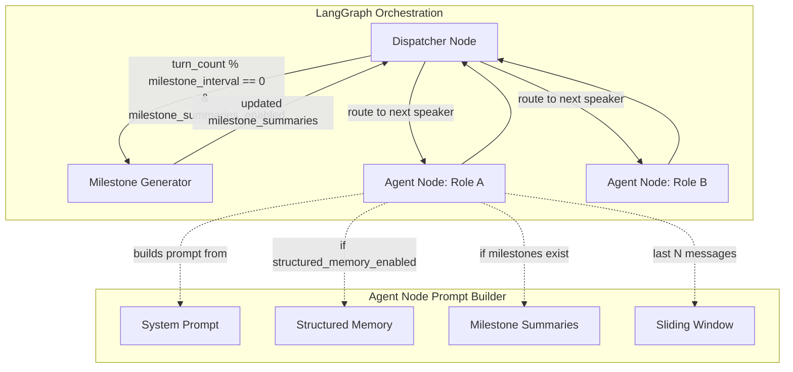

# Design Document — Hybrid Agent Memory (Phase 2)

## Overview

This feature extends the spec 100 Structured Agent Memory with three capabilities that make the system viable for long negotiations (16+ turns):

1. **Milestone summaries** — at configurable turn intervals, a lightweight LLM call generates a compressed strategic summary per agent, capturing key positions, concessions, disputes, and trajectory from that agent's perspective.
2. **Configurable sliding window** — `sliding_window_size` becomes a scenario-level parameter (default 3) instead of a hardcoded constant.
3. **Full history elimination** — once the first milestone summary exists for an agent, the prompt builder stops including raw history beyond the sliding window. Token cost per turn becomes bounded.

The feature is toggled independently via a "Milestone Summaries" toggle in the Advanced Options UI. Enabling it auto-enables structured memory (prerequisite). When disabled, behavior is identical to spec 100.

### Key Design Decisions

- **One LLM call per agent per milestone** — each agent gets a summary from their own perspective, including private reasoning. This preserves information asymmetry.
- **Milestone generation in the dispatcher** — triggered after `_advance_turn_order` increments `turn_count` to a multiple of `milestone_interval`, before the next agent node runs. This keeps the agent node pure (prompt + invoke + parse) and centralizes orchestration logic.
- **Non-blocking failure** — if a milestone LLM call fails, the negotiation continues without that summary. Summaries are a performance optimization, not a correctness requirement.
- **State carries everything** — milestone summaries live in `NegotiationState` and persist through `NegotiationStateModel` to Firestore. The full history remains in `state["history"]` for SSE streaming and UI display.

## Architecture



### Prompt Composition Order (when milestones exist)

1. **System message**: persona, goals, budget, hidden context, output schema, negotiation rules
2. **User message** (in order):
   - Structured memory block (from spec 100)
   - Milestone summaries block (chronological, labeled "Strategic summary as of turn N:")
   - Sliding window block (last `sliding_window_size` raw history entries)
   - Current state (offer, turn count, instructions)

### Prompt Composition (before first milestone / milestones disabled)

Identical to spec 100 behavior — full history included in user message.

## Components and Interfaces

### 1. `NegotiationParams` (scenarios/models.py)

Add two optional fields with defaults:

```python
class NegotiationParams(BaseModel):
    # ... existing fields ...
    sliding_window_size: int = Field(default=3, ge=1)
    milestone_interval: int = Field(default=4, ge=2)
```

Backward compatible — existing scenario JSONs omit these fields and get defaults.

### 2. `NegotiationState` (orchestrator/state.py)

Add fields to the TypedDict:

```python
class NegotiationState(TypedDict):
    # ... existing fields ...
    milestone_summaries_enabled: bool
    milestone_summaries: dict[str, list[dict[str, Any]]]
    sliding_window_size: int
    milestone_interval: int
```

Update `create_initial_state` to accept and initialize these fields. When `milestone_summaries_enabled=True`, also force `structured_memory_enabled=True`.

### 3. `NegotiationStateModel` (models/negotiation.py)

Add persistence fields with defaults for backward compatibility:

```python
class NegotiationStateModel(BaseModel):
    # ... existing fields ...
    milestone_summaries_enabled: bool = Field(default=False)
    milestone_summaries: dict[str, list[dict[str, Any]]] = Field(default_factory=dict)
    sliding_window_size: int = Field(default=3, ge=1)
    milestone_interval: int = Field(default=4, ge=2)
```

The `extra="ignore"` config already handles unknown fields from Firestore.

### 4. `MilestoneGenerator` (new module: orchestrator/milestone_generator.py)

```python
async def generate_milestones(
    state: NegotiationState,
) -> dict[str, Any]:
    """Generate milestone summaries for all agents.
    
    Returns a state delta with updated milestone_summaries and total_tokens_used.
    """
```

Responsibilities:
- For each agent in `scenario_config["agents"]`, make one LLM call using that agent's `model_id`
- Prompt includes: full history up to current turn, existing milestones, agent's private context
- Instructs LLM to produce a ≤300 token summary capturing: key positions, major concessions, unresolved disputes, regulatory concerns, trajectory
- Stores result as `{"turn_number": int, "summary": str}` in `milestone_summaries[role]`
- On LLM failure for one agent, logs error and continues with remaining agents
- Tracks and returns token usage

### 5. Dispatcher Integration (orchestrator/graph.py)

Modify `_dispatcher` to check milestone trigger condition after turn advancement:

```python
# In dispatcher or as a separate check after _advance_turn_order
if (
    state["milestone_summaries_enabled"]
    and state["turn_count"] > 0
    and state["turn_count"] % state["milestone_interval"] == 0
):
    # trigger milestone generation
```

Since milestone generation requires async LLM calls, the cleanest approach is to add a `milestone_generator` node to the graph that sits between the dispatcher and agent nodes, activated conditionally.

### 6. Agent Node Prompt Builder (orchestrator/agent_node.py)

Modify `_build_prompt` to:
- Use `state["sliding_window_size"]` instead of hardcoded 3
- When milestones exist for the current agent: exclude full history, include milestone summaries section + sliding window only
- When no milestones exist yet: include full history (spec 100 behavior)

### 7. Converters (orchestrator/converters.py)

Update `to_pydantic` and `from_pydantic` to pass through the new fields.

### 8. Frontend Toggle (components/arena/InformationToggle.tsx area)

Add a "Milestone Summaries" toggle in the Advanced Options section:
- Below the "Structured Agent Memory" toggle
- Disabled (grayed out) when structured memory is off
- Auto-enables structured memory when turned on
- Auto-disables when structured memory is turned off
- Resets to off on scenario change
- Description: "Generate periodic strategic summaries to compress negotiation history and cap token usage for long negotiations"

### 9. StartNegotiationRequest (routers/negotiation.py)

Add `milestone_summaries_enabled: bool = False` to the request model. Backend enforces the dependency: if `milestone_summaries_enabled=True`, force `structured_memory_enabled=True`.

### 10. Frontend API Client (lib/api.ts)

Update `startNegotiation` to include `milestone_summaries_enabled` in the request body.

## Data Models

### Milestone Summary Entry

```python
{
    "turn_number": 4,       # int — the turn cycle when this summary was generated
    "summary": "..."        # str — compressed strategic summary, max ~300 tokens
}
```

### milestone_summaries Structure

```python
# Keyed by agent role, each value is a chronological list of summary entries
{
    "Recruiter": [
        {"turn_number": 4, "summary": "After 4 turns, the candidate..."},
        {"turn_number": 8, "summary": "Significant progress on salary..."},
    ],
    "Candidate": [
        {"turn_number": 4, "summary": "The recruiter opened at €110k..."},
        {"turn_number": 8, "summary": "I've moved them to €125k..."},
    ],
    "Regulator": [
        {"turn_number": 4, "summary": "Two warnings issued regarding..."},
        {"turn_number": 8, "summary": "Compliance concerns remain on..."},
    ],
}
```

### NegotiationState (updated TypedDict)

| Field | Type | Default | Description |
|-------|------|---------|-------------|
| `milestone_summaries_enabled` | `bool` | `False` | Feature toggle |
| `milestone_summaries` | `dict[str, list[dict[str, Any]]]` | `{}` | Summaries keyed by role |
| `sliding_window_size` | `int` | `3` | From scenario params |
| `milestone_interval` | `int` | `4` | From scenario params |

### NegotiationStateModel (updated Pydantic)

Same fields as above with Pydantic Field defaults. `extra="ignore"` ensures old Firestore documents without these fields load cleanly.

### Milestone Generator Prompt Template

```
You are summarizing a negotiation from the perspective of {agent_name} ({agent_role}).

Produce a concise strategic summary (max 300 tokens) covering:
1. Key positions taken by all parties
2. Major concessions made and received
3. Unresolved disputes or sticking points
4. Regulatory concerns raised (if any)
5. Overall trajectory — is the deal moving toward agreement or deadlock?

Include your private strategic assessment based on your goals and reasoning.

Negotiation history:
{formatted_history}

{existing_milestones_section}

Your private context:
{agent_inner_thoughts_and_goals}

Respond with ONLY the summary text, no JSON wrapping.
```

