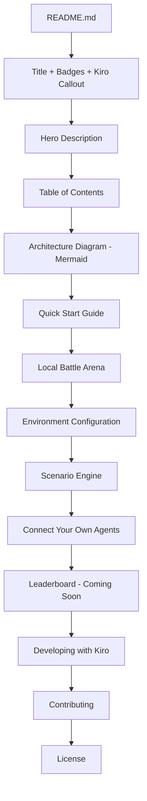
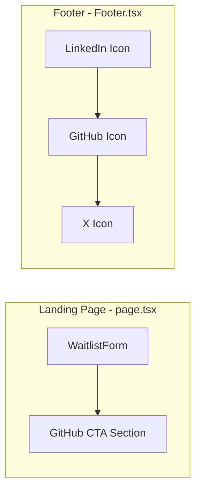

# Design Document — World-Class README & Contributor Hub

## Overview

This feature delivers four concrete artifacts:

1. A monorepo root `README.md` (~600–800 lines) that serves as the single entry point for all GitHub visitors — covering project identity, architecture, quick start, scenario engine, agent connection, Local Battle Arena, environment config, contributing guidelines, leaderboard teaser, Kiro attribution, and Developing with Kiro guidance.
2. A GitHub CTA component on the landing page (`frontend/app/page.tsx`) positioned below the waitlist form.
3. A GitHub icon link added to the existing footer social icons row (`frontend/components/Footer.tsx`).
4. No new backend code — this is purely documentation + two small frontend component changes.

### Design Rationale

The README is a static Markdown file, not a generated artifact. The two frontend changes are minimal additions to existing components. There is no new API, no new data model, no new service. The complexity lives in content structure and correctness of the Markdown rendering on GitHub.

The GitHub CTA and footer icon are intentionally simple — an anchor tag with an inline SVG, styled with Tailwind, matching the existing pattern in `Footer.tsx`. No new component files are needed; the CTA is added inline to `page.tsx` and the icon is added to the existing `Footer.tsx` social icons row.

## Architecture

### README Structure (Markdown)

The README is a single `README.md` file at the monorepo root. It has no build step, no templating, no generation. It renders via GitHub's Markdown renderer.



### Frontend Changes



Both changes follow the existing inline SVG pattern. No new component files, no new dependencies.

## Components and Interfaces

### 1. README.md (New File — Monorepo Root)

A static Markdown file. No programmatic interface. Key structural constraints:

- Total length: under 800 lines
- Kiro attribution: within first 30 lines (badge + callout block)
- Collapsible `<details>` sections for: full scenario JSON example, complete env var table
- Mermaid diagram for architecture (GitHub renders Mermaid natively)
- Table of contents with anchor links
- Emoji section markers for visual scanning

### 2. GitHub CTA (Modification to `frontend/app/page.tsx`)

Added as a new `<section>` element after the `<WaitlistForm />` div. Structure:

```tsx
<section className="mt-8 flex w-full max-w-md flex-col items-center text-center">
  <a
    href="https://github.com/Juntoai"
    target="_blank"
    rel="noopener noreferrer"
    aria-label="Contribute to JuntoAI on GitHub"
    className="..."
  >
    {/* GitHub SVG icon */}
    <span>Contribute on GitHub</span>
  </a>
</section>
```

Design decisions:
- Uses inline SVG (not Lucide React) to match the Footer's existing icon pattern and avoid adding a dependency import for a single icon. Both Footer icons are inline SVGs, so consistency wins here.
- `aria-label` on the link for screen reader accessibility.
- Brand colors: `text-brand-charcoal` with `hover:text-brand-blue` transition.
- Responsive: `max-w-md` container, flexbox centering, works from 320px up.

### 3. Footer GitHub Icon (Modification to `frontend/components/Footer.tsx`)

Added as a new `<a>` element in the existing social icons `<div>` between LinkedIn and X icons. Structure:

```tsx
<a
  href="https://github.com/Juntoai"
  target="_blank"
  rel="noopener noreferrer"
  aria-label="GitHub"
  className="text-gray-400 hover:text-brand-charcoal transition-colors"
>
  <svg className="h-4 w-4" fill="currentColor" viewBox="0 0 24 24">
    <path d="M12 .297c-6.63 0-12 5.373-12 12 0 5.303 3.438 9.8 8.205 11.385.6.113.82-.258.82-.577 0-.285-.01-1.04-.015-2.04-3.338.724-4.042-1.61-4.042-1.61C4.422 18.07 3.633 17.7 3.633 17.7c-1.087-.744.084-.729.084-.729 1.205.084 1.838 1.236 1.838 1.236 1.07 1.835 2.809 1.305 3.495.998.108-.776.417-1.305.76-1.605-2.665-.3-5.466-1.332-5.466-5.93 0-1.31.465-2.38 1.235-3.22-.135-.303-.54-1.523.105-3.176 0 0 1.005-.322 3.3 1.23.96-.267 1.98-.399 3-.405 1.02.006 2.04.138 3 .405 2.28-1.552 3.285-1.23 3.285-1.23.645 1.653.24 2.873.12 3.176.765.84 1.23 1.91 1.23 3.22 0 4.61-2.805 5.625-5.475 5.92.42.36.81 1.096.81 2.22 0 1.606-.015 2.896-.015 3.286 0 .315.21.69.825.57C20.565 22.092 24 17.592 24 12.297c0-6.627-5.373-12-12-12"/>
  </svg>
</a>
```

Design decisions:
- Positioned between LinkedIn and X to maintain visual balance (GitHub is the most relevant social link for an open-source project).
- Hover color: `hover:text-brand-charcoal` (same as X icon) rather than `hover:text-brand-blue` (LinkedIn) — GitHub's brand is dark, charcoal feels right.
- Same `h-4 w-4`, `fill="currentColor"`, `transition-colors` pattern as existing icons.

## Data Models

No new data models. This feature creates/modifies:

1. `README.md` — static Markdown, no schema
2. `frontend/app/page.tsx` — adds JSX elements, no new props or state
3. `frontend/components/Footer.tsx` — adds JSX elements, no new props or state

The README references existing data models (specifically `ArenaScenario` from `backend/app/scenarios/models.py`) in its documentation but does not create or modify any.

### Scenario Config Schema (Documented in README, Not Created)

The README's "Connect Your Own Agents" section will document the existing Pydantic schema from `backend/app/scenarios/models.py`:

| Field | Type | Description |
|-------|------|-------------|
| `id` | string | Unique scenario identifier |
| `name` | string | Display name |
| `description` | string | Scenario description |
| `agents` | AgentDefinition[] | Array of agent configs (min 2) |
| `toggles` | ToggleDefinition[] | Investor-facing toggles (min 1) |
| `negotiation_params` | NegotiationParams | Turn limits, threshold, order |
| `outcome_receipt` | OutcomeReceipt | Post-negotiation display metadata |

This is documentation of existing models, not new models.


## Correctness Properties

*A property is a characteristic or behavior that should hold true across all valid executions of a system — essentially, a formal statement about what the system should do. Properties serve as the bridge between human-readable specifications and machine-verifiable correctness guarantees.*

### Property 1: README section ordering

*For any* README produced by this spec, extracting the top-level Markdown headings (##) in document order should yield a sequence that matches the required order: Quick Start before Local Battle Arena, Local Battle Arena before Environment Configuration, Environment Configuration before Scenario Engine / Connect Your Own Agents, Connect Your Own Agents before Leaderboard, Leaderboard before Developing with Kiro, Developing with Kiro before Contributing, Contributing before License.

**Validates: Requirements 1.1**

### Property 2: Quick start code blocks use bash language identifier

*For any* fenced code block within the Quick Start section of the README, the language identifier should be `bash`.

**Validates: Requirements 2.3**

### Property 3: Scenario schema documentation completeness

*For any* required top-level field in the ArenaScenario Pydantic model (`id`, `name`, `description`, `agents`, `toggles`, `negotiation_params`, `outcome_receipt`), the "Connect Your Own Agents" section of the README should contain documentation of that field name.

**Validates: Requirements 5.2**

### Property 4: Agent schema documentation completeness

*For any* required field in the AgentDefinition Pydantic model (`role`, `name`, `type`, `persona_prompt`, `goals`, `budget`, `tone`, `output_fields`, `model_id`, `fallback_model_id`), the agent connection section of the README should contain documentation of that field name.

**Validates: Requirements 5.3**

### Property 5: Example scenario JSON validates against schema

*For any* JSON code block in the "Connect Your Own Agents" section that represents a complete scenario config, parsing it with the `ArenaScenario` Pydantic model should succeed without validation errors.

**Validates: Requirements 5.4**

### Property 6: GitHub CTA link has accessibility attributes

*For any* render of the Landing Page component, the GitHub CTA link element should have a non-empty `aria-label` attribute, an `href` pointing to `https://github.com/Juntoai`, `target="_blank"`, and `rel="noopener noreferrer"`.

**Validates: Requirements 7.2, 7.6**

### Property 7: Footer GitHub link has correct attributes

*For any* render of the Footer component, the GitHub link element should have `aria-label="GitHub"`, `href="https://github.com/Juntoai"`, `target="_blank"`, and `rel="noopener noreferrer"`, and contain an SVG element with `className="h-4 w-4"` and `fill="currentColor"`.

**Validates: Requirements 8.1, 8.2, 8.3, 8.4, 8.5**

### Property 8: README section headings contain emoji markers

*For any* top-level section heading (##) in the README, the heading text should contain at least one emoji or Unicode symbol character as a visual marker.

**Validates: Requirements 10.2**

### Property 9: Table of contents links resolve to actual headings

*For any* anchor link in the README's table of contents section, there should exist a corresponding heading in the document whose GitHub-generated anchor matches the link target.

**Validates: Requirements 10.3**

### Property 10: README line count under 800

*For any* README produced by this spec, the total line count should be strictly less than 800.

**Validates: Requirements 10.5**

### Property 11: Kiro directory documentation completeness

*For any* required element of the `.kiro/` directory structure — the three subdirectories (`steering/`, `specs/`, `hooks/`) and the five steering files (`tech.md`, `styling.md`, `testing.md`, `deployment.md`, `product.md`) — the "Developing with Kiro" section should contain a mention of that element.

**Validates: Requirements 12.2, 12.3**

## Error Handling

This feature has minimal error surface since it's primarily static content (Markdown) and two small JSX additions.

### README Errors

| Error Scenario | Handling |
|---|---|
| Mermaid diagram doesn't render on GitHub | Use a fenced `mermaid` code block (GitHub-native rendering). Provide a text fallback description above the diagram for clients that don't support Mermaid. |
| Relative links break when repo structure changes | Use relative paths from repo root (`./backend/`, `./frontend/`). These are validated by Property 9 (TOC links). |
| Example scenario JSON becomes stale as schema evolves | Property 5 validates the example against the live Pydantic schema — CI will catch drift. |
| README exceeds 800 lines during future edits | Property 10 enforces the line count invariant in CI. |

### Frontend Errors

| Error Scenario | Handling |
|---|---|
| GitHub SVG icon fails to render | Inline SVG has no external dependency — it's embedded in the JSX. No network request, no CDN. If the SVG path data is malformed, it simply won't render (graceful degradation). |
| GitHub link URL changes | The URL `https://github.com/Juntoai` is hardcoded. If the org URL changes, it's a single-line update in two files. Property 6 and 7 validate the URL in tests. |
| Accessibility regression (missing aria-label) | Properties 6 and 7 enforce aria-label presence in tests. |

## Testing Strategy

### Dual Testing Approach

This feature uses both unit tests (specific examples, edge cases) and property-based tests (universal properties across generated inputs).

- **Unit tests**: Verify specific rendering behavior, exact attribute values, content presence checks for README sections
- **Property tests**: Verify universal invariants (section ordering, schema completeness, line count bounds, accessibility attributes)

### README Tests (Python — pytest + Hypothesis)

The README is a static Markdown file, so tests parse it and verify structural properties. These tests run in the backend test suite since the README references backend schemas.

**Property-based testing library**: [Hypothesis](https://hypothesis.readthedocs.io/) (already in the Python ecosystem per testing guidelines)

**Configuration**: Minimum 100 examples per property test where randomization applies. For properties that test a static file (README), the "for all" quantification is over the set of required elements (fields, headings, links) rather than random generation.

**Test file**: `backend/tests/unit/test_readme_properties.py`

Property tests with tags:
- **Feature: world-class-readme-contributor-hub, Property 1: README section ordering** — Parse headings, verify order
- **Feature: world-class-readme-contributor-hub, Property 2: Quick start code blocks use bash** — Extract code blocks from quick start section, verify language
- **Feature: world-class-readme-contributor-hub, Property 3: Scenario schema documentation completeness** — For each ArenaScenario field, verify presence in README
- **Feature: world-class-readme-contributor-hub, Property 4: Agent schema documentation completeness** — For each AgentDefinition field, verify presence in README
- **Feature: world-class-readme-contributor-hub, Property 5: Example scenario JSON validates** — Extract JSON from README, parse with ArenaScenario
- **Feature: world-class-readme-contributor-hub, Property 8: Section headings contain emoji** — For each heading, verify emoji presence
- **Feature: world-class-readme-contributor-hub, Property 9: TOC links resolve** — For each TOC link, verify matching heading exists
- **Feature: world-class-readme-contributor-hub, Property 10: Line count under 800** — Count lines, assert < 800
- **Feature: world-class-readme-contributor-hub, Property 11: Kiro directory documentation completeness** — For each required .kiro element, verify presence

### Frontend Tests (Vitest + React Testing Library)

**Property-based testing library**: [fast-check](https://fast-check.dev/) (standard PBT library for JavaScript/TypeScript)

**Configuration**: Minimum 100 iterations per property test.

**Test files**:
- `frontend/__tests__/components/Footer.test.tsx` (extend existing or create)
- `frontend/__tests__/components/GitHubCTA.test.tsx`

Property tests with tags:
- **Feature: world-class-readme-contributor-hub, Property 6: GitHub CTA link accessibility** — Render Landing Page, verify CTA link attributes
- **Feature: world-class-readme-contributor-hub, Property 7: Footer GitHub link attributes** — Render Footer, verify GitHub link attributes

Unit tests (specific examples):
- Footer renders three social icons (LinkedIn, GitHub, X) in the correct order
- GitHub CTA appears after WaitlistForm in the DOM
- GitHub CTA text contains "GitHub" or "Contribute"
- Footer GitHub icon SVG has the correct viewBox and path data

### What NOT to Test

- Visual rendering, WCAG contrast ratios, responsive layout — these require visual regression tools (Playwright, Chromatic), not unit/property tests
- README content quality ("positions as a config-driven scenario engine") — subjective, not automatable
- `docker compose up` actually works — integration/E2E test, not in scope for this spec's test suite
- Mermaid diagram correctness — GitHub renders this; we verify the code block exists, not that it's visually correct

### Each Correctness Property Maps to a Single Property-Based Test

Every property listed in the Correctness Properties section above is implemented by exactly one property-based test. No property is split across multiple tests, and no test covers multiple properties (except where properties are explicitly combined, e.g., Property 7 covers multiple Footer requirements).
