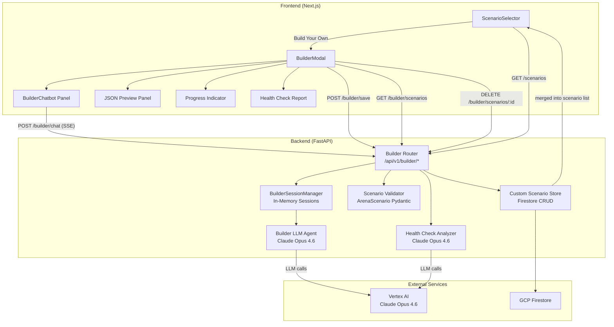

# Design Document: AI Scenario Builder

## Overview

The AI Scenario Builder adds a guided, AI-powered workflow for creating custom `ArenaScenario` JSON configurations through a conversational chatbot interface. Users access it via a "Build Your Own Scenario" entry point in the existing `ScenarioSelector`, which opens a full-screen split-screen modal. The left panel hosts a streaming chatbot (Claude Opus 4.6 via Vertex AI), and the right panel shows a live-updating JSON preview with syntax highlighting. A progress indicator tracks completion across the 7 top-level ArenaScenario sections.

The backend introduces a new FastAPI router (`/api/v1/builder/*`) with 4 endpoints: chat (SSE streaming), save, list, and delete. Chat sessions are managed in-memory with LangGraph state, and completed scenarios are persisted to a `custom_scenarios` Firestore collection keyed by user email + scenario ID. The system enforces the existing 100 tokens/day budget — each builder message costs 1 token.

Before saving, every scenario passes through two validation gates: (1) full Pydantic `ArenaScenario` validation with cross-reference checks, and (2) an AI-powered Health Check Analyzer that evaluates prompt quality, goal tension, budget overlap, toggle effectiveness, turn sanity, stall risk, and regulator feasibility. The health check produces a 0-100 readiness score streamed progressively via SSE. Scenarios scoring below 60 trigger recommendations to iterate before saving.

LinkedIn persona generation is embedded in the chatbot flow — pasting a LinkedIn URL during agent definition triggers Claude to generate a persona from the profile's professional background.

## Architecture



### Key Design Decisions

1. **In-memory session storage, not Firestore**: Builder chat sessions are ephemeral — they exist only while the modal is open. Persisting conversation history to Firestore adds latency and cost for data that's discarded on close. The `BuilderSessionManager` holds sessions in a dict keyed by `session_id`, with a TTL cleanup to prevent memory leaks from abandoned sessions.

2. **Single LLM model for both chatbot and health check**: Both use Claude Opus 4.6 via Vertex AI. This simplifies the Vertex AI integration (one model endpoint) and ensures the health check analyzer has the same reasoning capability as the builder chatbot. The health check uses a separate system prompt with few-shot examples from the gold-standard scenarios.

3. **SSE streaming with typed event discriminators**: Following the existing `event_type` pattern from `models/events.py`, builder events use `builder_token`, `builder_json_delta`, `builder_complete`, `builder_error`, and health check events use `builder_health_check_start`, `builder_health_check_finding`, `builder_health_check_complete`. This lets the frontend route events to the correct panel without parsing the payload.

4. **Scenario validation as a pure function**: The `validate_and_roundtrip` function takes a dict, validates it against `ArenaScenario`, serializes via `pretty_print`, re-parses, and confirms equivalence. This is the same round-trip property used in existing tests, now enforced at save time.

5. **Custom scenarios merged at the API layer, not the registry**: The `ScenarioRegistry` remains read-only for file-based scenarios. Custom scenarios are fetched from Firestore and merged into the scenario list response by the builder router. This avoids mutating the in-memory registry and keeps the separation clean.

## Components and Interfaces

### Backend Components

#### 1. Builder Router (`backend/app/routers/builder.py`)

New FastAPI router mounted at `/api/v1/builder`.

```python
# POST /builder/chat — SSE streaming chat
class BuilderChatRequest(BaseModel):
    email: str = Field(..., min_length=1)
    session_id: str = Field(..., min_length=1)
    message: str = Field(..., min_length=1, max_length=5000)

# POST /builder/save — validate + health check + persist
class BuilderSaveRequest(BaseModel):
    email: str = Field(..., min_length=1)
    scenario_json: dict

class BuilderSaveResponse(BaseModel):
    scenario_id: str
    name: str
    readiness_score: float
    tier: str

# GET /builder/scenarios?email=... — list user's custom scenarios
# DELETE /builder/scenarios/{scenario_id}?email=... — delete one
```

#### 2. Builder Session Manager (`backend/app/builder/session_manager.py`)

In-memory session store with TTL-based cleanup.

```python
class BuilderSession:
    session_id: str
    email: str
    conversation_history: list[dict]  # {"role": "user"|"assistant", "content": str}
    partial_scenario: dict            # Current scenario JSON being built
    message_count: int                # Enforces 50-message limit
    created_at: datetime
    last_activity: datetime

class BuilderSessionManager:
    def create_session(email: str) -> BuilderSession
    def get_session(session_id: str) -> BuilderSession | None
    def add_message(session_id: str, role: str, content: str) -> None
    def update_scenario(session_id: str, section: str, data: dict) -> None
    def delete_session(session_id: str) -> None
    def cleanup_stale(max_age_minutes: int = 60) -> int
```

#### 3. Builder LLM Agent (`backend/app/builder/llm_agent.py`)

Wraps Claude Opus 4.6 via Vertex AI for the guided conversation.

```python
class BuilderLLMAgent:
    async def stream_response(
        conversation_history: list[dict],
        partial_scenario: dict,
        system_prompt: str,
    ) -> AsyncIterator[BuilderSSEEvent]
```

The system prompt instructs Claude to:
- Follow the structured collection order (metadata → agents → toggles → params → receipt)
- Emit JSON deltas as structured tool calls when enough info is gathered for a section
- Ask targeted follow-up questions for ambiguous/missing fields
- Recognize LinkedIn URLs and generate personas
- Enforce minimum 2 agents with at least 1 negotiator before proceeding past agents

#### 4. Health Check Analyzer (`backend/app/builder/health_check.py`)

AI-powered simulation readiness analysis.

```python
class HealthCheckAnalyzer:
    async def analyze(
        scenario: ArenaScenario,
        gold_standard_scenarios: list[ArenaScenario],
    ) -> AsyncIterator[HealthCheckSSEEvent]
```

Performs 7 checks in sequence, streaming findings as they're produced:
1. Prompt quality analysis (per-agent `prompt_quality_score` 0-100)
2. Goal conflict and tension validation (`tension_score`)
3. Budget overlap analysis (`budget_overlap_score`)
4. Toggle effectiveness check (`toggle_effectiveness_score`)
5. Turn order and turn limit sanity (`turn_sanity_score`)
6. Stall risk assessment (`stall_risk_score` 0-100)
7. Regulator feasibility check

Final `readiness_score` = weighted composite:
- prompt_quality: 25%
- tension: 20%
- budget_overlap: 20%
- toggle_effectiveness: 15%
- turn_sanity: 10%
- inverse stall_risk: 10%

#### 5. Custom Scenario Store (`backend/app/builder/scenario_store.py`)

Firestore CRUD for user-created scenarios.

```python
class CustomScenarioStore:
    COLLECTION = "custom_scenarios"
    MAX_PER_USER = 20

    async def save(email: str, scenario: ArenaScenario) -> str
    async def list_by_email(email: str) -> list[dict]
    async def get(email: str, scenario_id: str) -> dict | None
    async def delete(email: str, scenario_id: str) -> bool
    async def count_by_email(email: str) -> int
```

Documents keyed by `{email}_{scenario_id}` with fields:
- `scenario_json`: full ArenaScenario dict
- `email`: owner
- `created_at`: UTC timestamp
- `updated_at`: UTC timestamp

### Frontend Components

#### 1. BuilderModal (`frontend/components/builder/BuilderModal.tsx`)

Full-screen overlay containing the split-screen layout.

```typescript
interface BuilderModalProps {
  isOpen: boolean;
  onClose: () => void;
  onScenarioSaved: (scenarioId: string) => void;
  email: string;
  tokenBalance: number;
}
```

- Split-screen: chatbot left, JSON preview right (stacked below 1024px)
- Progress indicator at top
- Close button with unsaved-progress confirmation dialog
- Token balance display

#### 2. BuilderChat (`frontend/components/builder/BuilderChat.tsx`)

Chat interface with SSE streaming.

```typescript
interface BuilderChatProps {
  sessionId: string;
  email: string;
  onJsonDelta: (section: string, data: object) => void;
  onHealthReport: (report: HealthCheckReport) => void;
}
```

- Message list with user/assistant bubbles
- Input field with Enter-to-send
- Streaming token display (typewriter effect)
- LinkedIn URL detection visual indicator

#### 3. JsonPreview (`frontend/components/builder/JsonPreview.tsx`)

Live JSON preview with syntax highlighting.

```typescript
interface JsonPreviewProps {
  scenarioJson: Partial<ArenaScenario>;
  highlightedSection: string | null;
}
```

- 2-space indented JSON display
- Syntax highlighting (keys, strings, numbers, booleans)
- Section highlight animation (2-second fade on update)
- Placeholder markers for unpopulated sections

#### 4. ProgressIndicator (`frontend/components/builder/ProgressIndicator.tsx`)

```typescript
interface ProgressIndicatorProps {
  scenarioJson: Partial<ArenaScenario>;
  isValid: boolean;
  onSave: () => void;
}
```

Tracks 7 sections: id, name, description, agents, toggles, negotiation_params, outcome_receipt. Shows "Save Scenario" button when 100% and valid.

#### 5. HealthCheckReport (`frontend/components/builder/HealthCheckReport.tsx`)

Progressive rendering of health check findings.

```typescript
interface HealthCheckReportProps {
  findings: HealthCheckFinding[];
  report: HealthCheckFullReport | null;
  isAnalyzing: boolean;
}
```

### Updated Existing Components

#### ScenarioSelector Enhancement

The existing `ScenarioSelector` gains:
- A "My Scenarios" `<optgroup>` for custom scenarios (between pre-built and "Build Your Own")
- A "Build Your Own Scenario" option at the bottom, visually separated with a divider
- New props: `customScenarios`, `onBuildOwn`

```typescript
interface ScenarioSelectorProps {
  scenarios: ScenarioSummary[];
  customScenarios: ScenarioSummary[];  // NEW
  selectedId: string | null;
  onSelect: (scenarioId: string) => void;
  onBuildOwn: () => void;              // NEW
  isLoading: boolean;
  error: string | null;
}
```

## Data Models

### Backend Pydantic Models

#### Builder SSE Events (`backend/app/builder/events.py`)

```python
class BuilderTokenEvent(BaseModel):
    event_type: Literal["builder_token"]
    token: str

class BuilderJsonDeltaEvent(BaseModel):
    event_type: Literal["builder_json_delta"]
    section: str  # "agents", "toggles", "negotiation_params", etc.
    data: dict    # Updated JSON for that section

class BuilderCompleteEvent(BaseModel):
    event_type: Literal["builder_complete"]

class BuilderErrorEvent(BaseModel):
    event_type: Literal["builder_error"]
    message: str

class HealthCheckStartEvent(BaseModel):
    event_type: Literal["builder_health_check_start"]

class HealthCheckFindingEvent(BaseModel):
    event_type: Literal["builder_health_check_finding"]
    check_name: str       # "prompt_quality", "budget_overlap", etc.
    severity: Literal["critical", "warning", "info"]
    agent_role: str | None = None
    message: str

class HealthCheckCompleteEvent(BaseModel):
    event_type: Literal["builder_health_check_complete"]
    report: dict  # Full structured report JSON
```

#### Health Check Report Model (`backend/app/builder/models.py`)

```python
class AgentPromptScore(BaseModel):
    role: str
    name: str
    prompt_quality_score: int = Field(ge=0, le=100)
    findings: list[str]

class BudgetOverlapResult(BaseModel):
    overlap_zone: tuple[float, float] | None
    overlap_percentage: float
    target_gap: float
    agreement_threshold: float
    threshold_ratio: float  # gap / agreement_threshold

class StallRiskResult(BaseModel):
    stall_risk_score: int = Field(ge=0, le=100)
    risks: list[str]

class HealthCheckReport(BaseModel):
    readiness_score: int = Field(ge=0, le=100)
    tier: Literal["Ready", "Needs Work", "Not Ready"]
    prompt_quality_scores: list[AgentPromptScore]
    tension_score: int = Field(ge=0, le=100)
    budget_overlap_score: int = Field(ge=0, le=100)
    budget_overlap_detail: BudgetOverlapResult
    toggle_effectiveness_score: int = Field(ge=0, le=100)
    turn_sanity_score: int = Field(ge=0, le=100)
    stall_risk: StallRiskResult
    findings: list[HealthCheckFindingEvent]
    recommendations: list[str]  # Ordered by impact
```

#### Custom Scenario Firestore Document

```python
class CustomScenarioDocument(BaseModel):
    scenario_id: str
    email: str
    scenario_json: dict  # Full ArenaScenario.model_dump()
    created_at: datetime
    updated_at: datetime
```

### Frontend TypeScript Types

```typescript
// Builder SSE event types
type BuilderEventType =
  | "builder_token"
  | "builder_json_delta"
  | "builder_complete"
  | "builder_error"
  | "builder_health_check_start"
  | "builder_health_check_finding"
  | "builder_health_check_complete";

interface BuilderTokenEvent {
  event_type: "builder_token";
  token: string;
}

interface BuilderJsonDeltaEvent {
  event_type: "builder_json_delta";
  section: string;
  data: Record<string, unknown>;
}

interface HealthCheckFinding {
  check_name: string;
  severity: "critical" | "warning" | "info";
  agent_role: string | null;
  message: string;
}

interface HealthCheckFullReport {
  readiness_score: number;
  tier: "Ready" | "Needs Work" | "Not Ready";
  prompt_quality_scores: Array<{
    role: string;
    name: string;
    prompt_quality_score: number;
    findings: string[];
  }>;
  tension_score: number;
  budget_overlap_score: number;
  toggle_effectiveness_score: number;
  turn_sanity_score: number;
  stall_risk: { stall_risk_score: number; risks: string[] };
  findings: HealthCheckFinding[];
  recommendations: string[];
}
```


## Correctness Properties

*A property is a characteristic or behavior that should hold true across all valid executions of a system — essentially, a formal statement about what the system should do. Properties serve as the bridge between human-readable specifications and machine-verifiable correctness guarantees.*

### Property 1: ArenaScenario pretty_print round-trip

*For any* valid `ArenaScenario` object, serializing it via `pretty_print` (JSON with 2-space indent), then parsing the resulting JSON string, then validating via `ArenaScenario.model_validate` should produce an `ArenaScenario` whose `model_dump()` is equal to the original's `model_dump()`.

**Validates: Requirements 6.4, 13.1**

### Property 2: ArenaScenario model_dump round-trip

*For any* valid `ArenaScenario` object, calling `model_dump()` then `load_scenario_from_dict()` on the result should produce an equivalent `ArenaScenario` whose `model_dump()` is equal to the original's `model_dump()`.

**Validates: Requirements 13.2**

### Property 3: Builder SSE event structure and wire format

*For any* builder SSE event model (BuilderTokenEvent, BuilderJsonDeltaEvent, BuilderCompleteEvent, BuilderErrorEvent, HealthCheckStartEvent, HealthCheckFindingEvent, HealthCheckCompleteEvent), formatting it via `format_sse_event` should produce a string matching the pattern `data: <valid JSON>\n\n`, and the parsed JSON should contain an `event_type` field with the correct literal value and all required fields for that event type.

**Validates: Requirements 12.1, 12.2, 12.3, 23.1, 23.2, 23.3, 23.4**

### Property 4: Progress percentage computation

*For any* subset of the 7 top-level ArenaScenario sections (id, name, description, agents, toggles, negotiation_params, outcome_receipt) being populated in a partial scenario dict, the computed progress percentage should equal `(number of populated sections / 7) * 100`, rounded to the nearest integer.

**Validates: Requirements 5.1**

### Property 5: Agent minimum validation

*For any* partial scenario with an agents list containing fewer than 2 agents, or containing 2+ agents but none with type "negotiator", the builder validation should reject the scenario and not allow proceeding past the agents section.

**Validates: Requirements 3.7**

### Property 6: ArenaScenario validation error specificity

*For any* invalid scenario dict that fails `ArenaScenario` Pydantic validation, the returned validation errors should contain at least one error with a specific `loc` (field path) and `msg` (human-readable description) identifying the exact field and constraint that failed.

**Validates: Requirements 6.1, 6.2**

### Property 7: Scenario persistence round-trip

*For any* valid `ArenaScenario` and valid email string, saving the scenario to the `CustomScenarioStore` then retrieving it by email and scenario_id should return a document containing `scenario_json`, `email`, `created_at`, and `updated_at` fields, and `load_scenario_from_dict(doc["scenario_json"])` should produce an equivalent `ArenaScenario`.

**Validates: Requirements 7.1, 7.2**

### Property 8: Custom scenario limit enforcement

*For any* user email that already has 20 custom scenarios stored, attempting to save a 21st scenario should be rejected with an appropriate error, and the total count should remain 20.

**Validates: Requirements 7.5**

### Property 9: Custom scenario usability for negotiation

*For any* valid custom scenario retrieved from the `CustomScenarioStore`, calling `create_initial_state(session_id, scenario_json)` should produce a valid `NegotiationState` with all required fields populated and `turn_order` containing only roles defined in the scenario's agents.

**Validates: Requirements 7.4**

### Property 10: LinkedIn URL pattern recognition

*For any* string matching the regex pattern `https://www\.linkedin\.com/in/.+`, the LinkedIn URL detector should return `True`. *For any* string not matching this pattern, it should return `False`.

**Validates: Requirements 8.1**

### Property 11: Session conversation history preservation

*For any* sequence of N messages added to a `BuilderSession` (alternating user/assistant), the session's `conversation_history` should contain exactly N entries in the order they were added, with each entry's role and content matching the input.

**Validates: Requirements 9.1**

### Property 12: Session message limit enforcement

*For any* `BuilderSession` that has received 50 user messages, the 51st user message should be rejected, and the session's `message_count` should remain at 50.

**Validates: Requirements 9.4**

### Property 13: Token budget enforcement

*For any* user with token balance N > 0, sending a builder chat message should result in a token balance of N-1. *For any* user with token balance 0, sending a builder chat message should return HTTP 429.

**Validates: Requirements 10.1, 10.2**

### Property 14: Missing email returns 401

*For any* builder API endpoint (chat, save, list, delete), a request without a valid email parameter should return HTTP 401.

**Validates: Requirements 11.5**

### Property 15: Budget overlap computation and flagging

*For any* two negotiator budget ranges `[min1, max1]` and `[min2, max2]`, the computed overlap zone should be `[max(min1, min2), min(max1, max2)]` if `max(min1, min2) <= min(max1, max2)`, otherwise no overlap. If no overlap exists, the system should flag "no_overlap". If the overlap exceeds 50% of both agents' total ranges, the system should flag "excessive_overlap".

**Validates: Requirements 17.1, 17.2, 17.3**

### Property 16: Agreement threshold vs target gap analysis

*For any* scenario with negotiator agents, the computed gap between the highest and lowest target prices should be reported alongside the agreement_threshold. If the gap is less than 3 times the agreement_threshold, the system should flag that the negotiation may converge too quickly.

**Validates: Requirements 17.4, 17.5**

### Property 17: Turn order completeness and cycle validation

*For any* scenario, every agent role defined in the agents list should appear at least once in `turn_order` (missing negotiators flagged as "missing_from_turn_order" critical). `max_turns` should be at least `2 * len(set(turn_order))` (otherwise flagged as "insufficient_turns" warning). Regulator agents should appear at least once per cycle in the turn_order.

**Validates: Requirements 19.1, 19.2, 19.3, 19.4, 19.5**

### Property 18: Stall risk assessment

*For any* scenario, the stall risk assessment should evaluate all applicable patterns: if negotiator target prices are within `agreement_threshold` of each other, flag "instant_convergence_risk"; if any negotiator's budget range `(max - min)` is less than `3 * agreement_threshold`, flag "price_stagnation_risk". The `stall_risk_score` should be in range [0, 100].

**Validates: Requirements 20.1, 20.2, 20.4**

### Property 19: Readiness score computation and tier classification

*For any* set of sub-scores (prompt_quality, tension, budget_overlap, toggle_effectiveness, turn_sanity each in [0,100] and stall_risk in [0,100]), the `readiness_score` should equal `round(prompt_quality*0.25 + tension*0.20 + budget_overlap*0.20 + toggle_effectiveness*0.15 + turn_sanity*0.10 + (100-stall_risk)*0.10)`. The tier should be "Ready" for scores 80-100, "Needs Work" for 60-79, and "Not Ready" for 0-59.

**Validates: Requirements 22.1, 22.2, 14.4, 14.5**

### Property 20: Health check report structure completeness

*For any* health check report, it should contain: `readiness_score` (0-100), `tier`, per-agent `prompt_quality_scores` (each 0-100), all sub-scores, a `findings` list, and an `ordered recommendations` list. Every finding with severity "critical" or "warning" should have a corresponding recommendation. Recommendations should be ordered with critical findings first, then warnings.

**Validates: Requirements 22.3, 22.4, 22.5, 15.4, 20.5**

### Property 21: JSON preview placeholder rendering

*For any* partial scenario JSON where a subset of the 7 top-level sections are populated, the JSON preview output should contain placeholder markers for every unpopulated section and valid JSON content for every populated section.

**Validates: Requirements 4.2**

### Property 22: JSON preview 2-space indentation

*For any* partial or complete scenario JSON rendered in the preview, the output should use 2-space indentation consistent with the `pretty_print` function's output format.

**Validates: Requirements 4.4**

## Error Handling

### Backend Error Handling

| Error Condition | HTTP Status | Response | Recovery |
|---|---|---|---|
| Missing/empty email on any builder endpoint | 401 | `{"detail": "Valid email required"}` | Client prompts user to authenticate |
| Token balance exhausted | 429 | `{"detail": "Daily token limit reached. Resets at midnight UTC."}` | Builder_Modal displays limit message, disables input |
| Session not found (invalid session_id) | 404 | `{"detail": "Builder session not found"}` | Client starts a new session |
| Session message limit exceeded (50 messages) | 429 | `{"detail": "Session message limit reached (50). Please save or start a new session."}` | Builder_Chatbot displays limit message |
| Custom scenario limit exceeded (20 per user) | 409 | `{"detail": "Maximum 20 custom scenarios. Delete an existing scenario to save a new one."}` | Client shows delete option |
| ArenaScenario validation failure | 422 | `{"detail": "Validation failed", "errors": [...]}` | Builder_Chatbot explains errors in plain language |
| Scenario not found for delete | 404 | `{"detail": "Scenario not found or not owned by this email"}` | Client refreshes scenario list |
| Vertex AI / LLM call failure | 503 | SSE `builder_error` event with message | Builder_Chatbot displays retry option |
| Firestore write failure | 503 | `{"detail": "Database unavailable. Please try again."}` | Client retries with exponential backoff |
| Invalid LinkedIn URL or insufficient profile | N/A | Builder_Chatbot informs user via chat message | User provides agent details manually |
| SSE connection dropped mid-stream | N/A | Client detects EventSource close | Client can resend last message to resume |

### Frontend Error Handling

- **SSE connection errors**: `EventSource.onerror` triggers reconnection with exponential backoff (max 3 retries). After 3 failures, display "Connection lost" message with manual retry button.
- **JSON parse errors in SSE events**: Log to console, skip the malformed event, continue processing subsequent events.
- **Unsaved progress on close**: Confirmation dialog with "Continue Building" / "Discard & Close" options. No auto-save — sessions are ephemeral.
- **Health check timeout**: If no `builder_health_check_complete` event received within 60 seconds of `builder_health_check_start`, display "Health check timed out" with option to save anyway or retry.

### Session Cleanup

The `BuilderSessionManager` runs a background cleanup task every 5 minutes, removing sessions with `last_activity` older than 60 minutes. This prevents memory leaks from abandoned sessions (user closes browser tab without clicking close button).

## Testing Strategy

### Property-Based Testing

**Library**: [Hypothesis](https://hypothesis.readthedocs.io/) (Python) for backend property tests.

**Configuration**: Minimum 100 examples per property test via `@settings(max_examples=100)`.

**Tag format**: Each test tagged with a comment: `# Feature: ai-scenario-builder, Property {N}: {title}`

Property tests cover:
- ArenaScenario round-trip serialization (Properties 1, 2)
- SSE event structure and wire format (Property 3)
- Progress percentage computation (Property 4)
- Budget overlap computation (Property 15)
- Agreement threshold analysis (Property 16)
- Turn order validation (Property 17)
- Stall risk assessment (Property 18)
- Readiness score computation and tier classification (Property 19)
- Health check report structure (Property 20)

Hypothesis strategies needed:
- `st_arena_scenario()`: Generates valid `ArenaScenario` objects with random but valid agents, toggles, params, and receipt. Must satisfy all cross-reference constraints.
- `st_budget()`: Generates `Budget` with `min <= target <= max`, all >= 0.
- `st_builder_sse_event()`: Generates random builder SSE events of all types.
- `st_sub_scores()`: Generates tuples of 6 integers in [0, 100] for readiness score computation.
- `st_budget_pair()`: Generates pairs of `Budget` objects for overlap testing.

### Unit Testing

**Framework**: pytest + pytest-asyncio (backend), Vitest + React Testing Library (frontend).

Backend unit tests:
- `BuilderSessionManager`: create, get, add_message, update_scenario, delete, cleanup_stale, message limit enforcement
- `CustomScenarioStore`: save, list, get, delete, count, limit enforcement (mocked Firestore)
- Builder SSE event models: construction, serialization, field validation
- Health check sub-computations: budget overlap, turn order checks, stall risk flags, readiness score formula
- LinkedIn URL pattern detection
- Progress percentage calculation
- Validation error formatting

Frontend unit tests:
- `BuilderModal`: renders split-screen layout, responsive stacking, close confirmation
- `BuilderChat`: message rendering, SSE event handling, input validation
- `JsonPreview`: syntax highlighting, placeholder rendering, section highlight animation
- `ProgressIndicator`: percentage calculation, save button enable/disable
- `HealthCheckReport`: finding rendering, score display, tier badge
- `ScenarioSelector`: "My Scenarios" group, "Build Your Own" option, callback routing

### Integration Testing

Backend integration tests (FastAPI TestClient):
- `POST /builder/chat`: valid request returns SSE stream, missing email returns 401, zero tokens returns 429
- `POST /builder/save`: valid scenario saves and returns summary, invalid scenario returns 422 with errors
- `GET /builder/scenarios`: returns user's scenarios, empty list for new user
- `DELETE /builder/scenarios/{id}`: deletes owned scenario, 404 for non-existent
- Round-trip: save via `/builder/save` then retrieve via `/builder/scenarios` then load into `create_initial_state`

### Test File Structure

```
backend/tests/
├── unit/
│   ├── builder/
│   │   ├── test_session_manager.py
│   │   ├── test_scenario_store.py
│   │   ├── test_health_check.py
│   │   ├── test_builder_events.py
│   │   ├── test_linkedin_detector.py
│   │   └── test_progress.py
│   └── ...
├── property/
│   ├── test_builder_properties.py      # Properties 1-6, 10-12, 21-22
│   ├── test_health_check_properties.py # Properties 15-20
│   └── ...
├── integration/
│   ├── test_builder_router.py          # Properties 7-9, 13-14
│   └── ...

frontend/__tests__/
├── components/
│   ├── builder/
│   │   ├── BuilderModal.test.tsx
│   │   ├── BuilderChat.test.tsx
│   │   ├── JsonPreview.test.tsx
│   │   ├── ProgressIndicator.test.tsx
│   │   ├── HealthCheckReport.test.tsx
│   │   └── ScenarioSelector.test.tsx
│   └── ...
```
