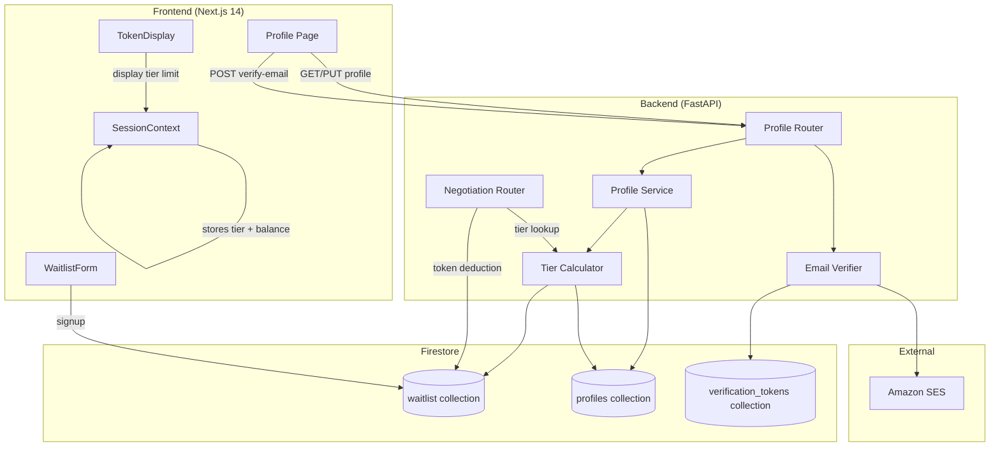
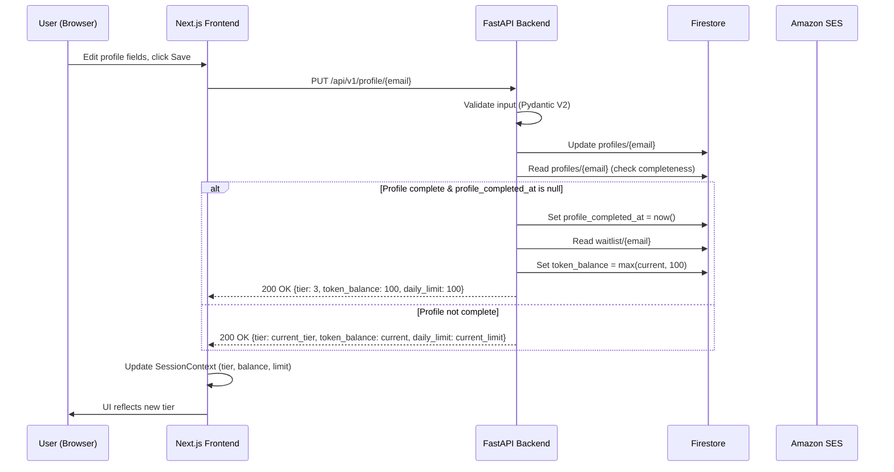
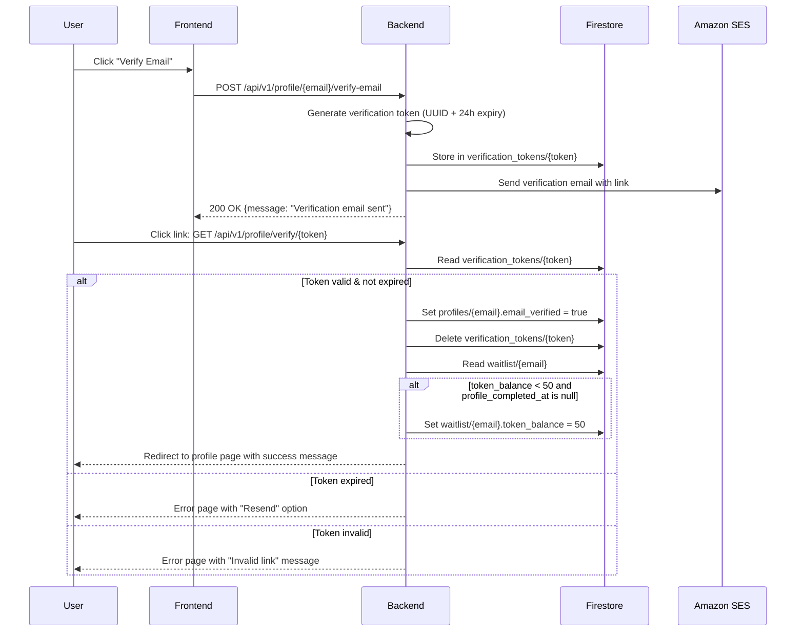

# Design Document: User Profile Token Upgrade

## Overview

This feature introduces a 3-tier daily token system that rewards user engagement. Currently, all users receive a flat 100 tokens/day. The new system gates token allowances behind progressive profile milestones:

- **Tier 1 (Unverified):** 20 tokens/day — assigned at waitlist signup
- **Tier 2 (Verified Email):** 50 tokens/day — after clicking an email verification link
- **Tier 3 (Full Profile):** 100 tokens/day — verified email + display name + professional link (GitHub or LinkedIn)

Tier 3 is permanent once earned (`profile_completed_at` timestamp). The system introduces a new `profiles` Firestore collection, email verification via Amazon SES, a profile management page, and tier-aware token reset logic.

### Key Design Decisions

1. **Separate `profiles` collection** rather than extending `waitlist` documents — keeps profile data decoupled and supports future user-centric features (preferences, custom scenarios).
2. **Permanent Tier 3** — once `profile_completed_at` is set, it's never cleared. This avoids punishing users who later edit their profile and simplifies tier determination to a single timestamp check.
3. **Backend-authoritative tier calculation** — the frontend never computes tier. It always fetches the tier from the backend to prevent client-side manipulation.
4. **Amazon SES for email** — aligns with existing AWS usage patterns and avoids adding a new third-party dependency.

## Architecture



### Request Flow: Profile Update with Tier Upgrade



### Request Flow: Email Verification



## Components and Interfaces

### Backend Components

#### 1. Profile Pydantic Models (`backend/app/models/profile.py`)

```python
from pydantic import BaseModel, Field, field_validator
from datetime import datetime
import re

class ProfileDocument(BaseModel):
    """Firestore profile document schema."""
    display_name: str = ""
    email_verified: bool = False
    github_url: str | None = None
    linkedin_url: str | None = None
    profile_completed_at: datetime | None = None
    created_at: datetime | None = None

class ProfileUpdateRequest(BaseModel):
    """Request body for PUT /api/v1/profile/{email}."""
    display_name: str | None = None
    github_url: str | None = None
    linkedin_url: str | None = None

    @field_validator("display_name")
    @classmethod
    def validate_display_name(cls, v: str | None) -> str | None:
        if v is None:
            return v
        v = v.strip()
        if len(v) < 2 or len(v) > 100:
            raise ValueError("Display name must be between 2 and 100 characters")
        return v

    @field_validator("github_url")
    @classmethod
    def validate_github_url(cls, v: str | None) -> str | None:
        if v is None:
            return v
        pattern = r"^https://github\.com/[a-zA-Z0-9\-]{1,39}$"
        if not re.match(pattern, v):
            raise ValueError("GitHub URL must match https://github.com/{username}")
        return v

    @field_validator("linkedin_url")
    @classmethod
    def validate_linkedin_url(cls, v: str | None) -> str | None:
        if v is None:
            return v
        pattern = r"^https://(www\.)?linkedin\.com/in/[a-zA-Z0-9\-]{3,100}$"
        if not re.match(pattern, v):
            raise ValueError("LinkedIn URL must match https://linkedin.com/in/{slug}")
        return v

class ProfileResponse(BaseModel):
    """Response body for profile endpoints."""
    display_name: str
    email_verified: bool
    github_url: str | None
    linkedin_url: str | None
    profile_completed_at: datetime | None
    created_at: datetime | None
    tier: int
    daily_limit: int
    token_balance: int
```

#### 2. Tier Calculator (`backend/app/services/tier_calculator.py`)

Pure function, no side effects — easy to test:

```python
def calculate_tier(profile_completed_at: datetime | None, email_verified: bool) -> int:
    """Return tier (1, 2, or 3) based on profile state."""
    if profile_completed_at is not None:
        return 3
    if email_verified:
        return 2
    return 1

TIER_LIMITS = {1: 20, 2: 50, 3: 100}

def get_daily_limit(tier: int) -> int:
    """Return daily token limit for a given tier."""
    return TIER_LIMITS.get(tier, 20)

def is_profile_complete(display_name: str, email_verified: bool, github_url: str | None, linkedin_url: str | None) -> bool:
    """Check if profile meets Tier 3 requirements."""
    has_display_name = bool(display_name and display_name.strip())
    has_professional_link = bool(github_url) or bool(linkedin_url)
    return has_display_name and email_verified and has_professional_link
```

#### 3. Profile Router (`backend/app/routers/profile.py`)

Endpoints:
- `GET /api/v1/profile/{email}` — returns profile + tier info
- `PUT /api/v1/profile/{email}` — updates profile, evaluates completeness, triggers tier upgrade
- `POST /api/v1/profile/{email}/verify-email` — sends verification email
- `GET /api/v1/profile/verify/{token}` — validates verification token

#### 4. Email Verifier Service (`backend/app/services/email_verifier.py`)

- Generates UUID-based verification tokens with 24h TTL
- Stores tokens in `verification_tokens` Firestore collection
- Sends email via Amazon SES (boto3)
- Validates tokens on click-through

#### 5. Profile Firestore Client (`backend/app/db/profile_client.py`)

- CRUD operations on `profiles` collection
- CRUD operations on `verification_tokens` collection
- Uses existing Firestore AsyncClient pattern from `firestore_client.py`

### Frontend Components

#### 1. Profile Page (`frontend/app/(protected)/profile/page.tsx`)

- Form with fields: display name, GitHub URL, LinkedIn URL
- Email verification status + "Verify Email" button
- Progress indicator showing completion steps
- Save button triggers `PUT /api/v1/profile/{email}`

#### 2. Updated TokenDisplay (`frontend/components/TokenDisplay.tsx`)

- Reads `dailyLimit` from SessionContext instead of hardcoded 100
- Displays `Tokens: X / {dailyLimit}`

#### 3. Updated SessionContext (`frontend/context/SessionContext.tsx`)

- New fields: `tier`, `dailyLimit`
- New method: `updateTier(tier: number, dailyLimit: number, tokenBalance: number)`

#### 4. Updated Protected Layout (`frontend/app/(protected)/layout.tsx`)

- Email in header becomes a clickable link to `/profile`

#### 5. Updated WaitlistForm (`frontend/components/WaitlistForm.tsx`)

- Sets initial token balance to 20 (Tier 1) instead of 100
- Stores tier info in SessionContext on login

#### 6. Updated Token Functions (`frontend/lib/tokens.ts`)

- `resetTokens` accepts `dailyLimit` parameter instead of hardcoded 100
- `formatTokenDisplay` accepts `dailyLimit` parameter

## Data Models

### Firestore Collections

#### `profiles` Collection (NEW)

| Field | Type | Default | Description |
|-------|------|---------|-------------|
| `display_name` | string | `""` | User's display name (2-100 chars) |
| `email_verified` | boolean | `false` | Whether email has been verified |
| `github_url` | string \| null | `null` | GitHub profile URL |
| `linkedin_url` | string \| null | `null` | LinkedIn profile URL |
| `profile_completed_at` | timestamp \| null | `null` | When Tier 3 was first achieved (permanent) |
| `created_at` | timestamp | server timestamp | Document creation time |

Document key: user's email address (lowercase, trimmed)

#### `verification_tokens` Collection (NEW)

| Field | Type | Description |
|-------|------|-------------|
| `email` | string | The email address being verified |
| `created_at` | timestamp | Token creation time |
| `expires_at` | timestamp | Token expiry (created_at + 24 hours) |

Document key: UUID verification token

#### `waitlist` Collection (EXISTING — no schema changes)

| Field | Type | Description |
|-------|------|-------------|
| `email` | string | User's email |
| `signed_up_at` | timestamp | Signup time |
| `token_balance` | number | Current token balance |
| `last_reset_date` | string | Last reset date "YYYY-MM-DD" |

The `token_balance` field now resets to the tier-appropriate limit (20, 50, or 100) instead of always 100.

### Tier Determination Logic

```
if profile_completed_at is not null → Tier 3 (100 tokens/day)
else if email_verified is true      → Tier 2 (50 tokens/day)
else                                 → Tier 1 (20 tokens/day)
```

This is evaluated:
1. On every profile GET (for display)
2. On every profile PUT (to check for tier upgrade)
3. On token reset (to determine correct daily limit)
4. On negotiation start (to display correct limit)

## Correctness Properties

*A property is a characteristic or behavior that should hold true across all valid executions of a system — essentially, a formal statement about what the system should do. Properties serve as the bridge between human-readable specifications and machine-verifiable correctness guarantees.*

### Property 1: Profile initialization defaults

*For any* valid email address, when a new profile document is created, the resulting document SHALL have `display_name` equal to `""`, `email_verified` equal to `false`, `github_url` equal to `null`, `linkedin_url` equal to `null`, `profile_completed_at` equal to `null`, and `created_at` set to a non-null timestamp.

**Validates: Requirements 1.1, 1.2**

### Property 2: Profile get-or-create idempotency

*For any* existing profile document that has been modified (display name set, URLs added, email verified), calling the get-or-create operation again SHALL return the existing document with all modifications preserved — the operation is idempotent.

**Validates: Requirements 1.3**

### Property 3: Display name length validation

*For any* string input, the display name validator SHALL accept the input if and only if the trimmed string length is between 2 and 100 characters (inclusive). Strings outside this range (including all-whitespace strings that trim to fewer than 2 characters) SHALL be rejected with a validation error.

**Validates: Requirements 3.1, 3.3**

### Property 4: Display name whitespace trimming

*For any* valid display name string with arbitrary leading and trailing whitespace, the stored value SHALL equal the input with leading and trailing whitespace removed (i.e., `stored == input.strip()`).

**Validates: Requirements 3.4**

### Property 5: URL format validation

*For any* string input, the GitHub URL validator SHALL accept the input if and only if it matches `https://github.com/{username}` where `{username}` is 1-39 alphanumeric/hyphen characters. The LinkedIn URL validator SHALL accept the input if and only if it matches `https://linkedin.com/in/{slug}` or `https://www.linkedin.com/in/{slug}` where `{slug}` is 3-100 alphanumeric/hyphen characters. All non-matching inputs SHALL be rejected.

**Validates: Requirements 5.1, 5.2, 5.4**

### Property 6: Profile field persistence round-trip

*For any* valid profile update (valid display name, valid GitHub URL, valid LinkedIn URL), storing the update and then reading the profile back SHALL return the same field values that were submitted.

**Validates: Requirements 3.2, 5.3**

### Property 7: Tier determination

*For any* combination of `profile_completed_at` (null or non-null) and `email_verified` (true or false), the tier calculation SHALL return: 3 if `profile_completed_at` is non-null (regardless of other fields), 2 if `profile_completed_at` is null and `email_verified` is true, 1 otherwise. The daily limit SHALL be 100 for tier 3, 50 for tier 2, and 20 for tier 1.

**Validates: Requirements 6.7, 7.1, 7.2**

### Property 8: Profile completeness evaluation

*For any* combination of `display_name`, `email_verified`, `github_url`, and `linkedin_url`, the profile completeness check SHALL return true if and only if all three conditions are met: (1) `display_name` is a non-empty string after trimming, (2) `email_verified` is true, and (3) at least one of `github_url` or `linkedin_url` is non-null.

**Validates: Requirements 5.5, 6.6**

### Property 9: Tier upgrade on profile completion

*For any* profile that transitions from incomplete to complete (all three conditions met for the first time), the system SHALL set `profile_completed_at` to a non-null timestamp AND set the waitlist `token_balance` to `max(current_balance, 100)`.

**Validates: Requirements 6.3, 6.4, 6.5**

### Property 10: Email verification triggers tier 2 upgrade

*For any* valid, non-expired verification token, verifying it SHALL set `email_verified` to true in the profile document AND set the waitlist `token_balance` to `max(current_balance, 50)` when `profile_completed_at` is null.

**Validates: Requirements 4.3, 4.4, 6.2**

### Property 11: Verification token generation

*For any* email verification request, the generated token SHALL be unique (no collisions across multiple generations) and SHALL have an `expires_at` timestamp exactly 24 hours after `created_at`.

**Validates: Requirements 4.1, 4.2**

### Property 12: Tier-aware token reset

*For any* user, when tokens are reset, the new `token_balance` SHALL equal the daily limit for the user's current tier: 100 if `profile_completed_at` is non-null, 50 if `email_verified` is true and `profile_completed_at` is null, 20 otherwise.

**Validates: Requirements 10.2, 10.3, 10.4**

### Property 13: Token display format

*For any* token balance and daily limit pair, the `formatTokenDisplay` function SHALL return the string `"Tokens: {balance} / {dailyLimit}"` where balance is clamped to a minimum of 0.

**Validates: Requirements 8.1, 8.2, 8.3**

### Property 14: Waitlist signup initial balance

*For any* new waitlist signup, the initial `token_balance` SHALL be set to 20 (Tier 1 default).

**Validates: Requirements 6.1**

## Error Handling

### Backend Error Responses

| Scenario | HTTP Status | Response Body |
|----------|-------------|---------------|
| Profile not found | 404 | `{"detail": "Profile not found for {email}"}` |
| Invalid display name length | 422 | `{"detail": "Display name must be between 2 and 100 characters"}` |
| Invalid GitHub URL format | 422 | `{"detail": "GitHub URL must match https://github.com/{username}"}` |
| Invalid LinkedIn URL format | 422 | `{"detail": "LinkedIn URL must match https://linkedin.com/in/{slug}"}` |
| Expired verification token | 410 | `{"detail": "Verification link has expired", "resend": true}` |
| Invalid verification token | 404 | `{"detail": "Invalid verification link"}` |
| SES email delivery failure | 502 | `{"detail": "Failed to send verification email. Please try again."}` |
| Firestore unavailable | 503 | `{"detail": "Database unavailable"}` |

### Frontend Error Handling

- Profile API errors display inline validation messages below the relevant form field
- Network errors show a toast notification with retry option
- Email verification errors show a dedicated error state with "Resend" button
- Session expiry redirects to landing page

### Resilience Patterns

- **SES failure**: Return error to user, do not mark email as verified. User can retry.
- **Firestore failure during tier upgrade**: Use Firestore transaction to ensure atomicity — either both profile and waitlist updates succeed, or neither does.
- **Race condition on profile completion**: Use Firestore transaction with conditional check on `profile_completed_at` being null before setting it, preventing double-upgrade.

## Testing Strategy

### Dual Testing Approach

This feature requires both unit tests and property-based tests:

- **Unit tests**: Specific examples, edge cases, API integration tests, error conditions
- **Property tests**: Universal properties across all valid inputs using randomized generation

### Backend Testing (Python)

**Framework**: pytest + pytest-asyncio + hypothesis

**Property-Based Testing Library**: [Hypothesis](https://hypothesis.readthedocs.io/) (already in use in the project)

**Configuration**: Each property test runs a minimum of 100 iterations via `@settings(max_examples=100)`.

**Tag format**: Each property test includes a comment: `# Feature: user-profile-token-upgrade, Property {N}: {title}`

**Property tests** (one test per correctness property):

| Test | Property | Description |
|------|----------|-------------|
| `test_prop_profile_defaults` | Property 1 | Generate random emails, verify all default fields |
| `test_prop_profile_idempotency` | Property 2 | Create profile, modify, re-create, verify preserved |
| `test_prop_display_name_validation` | Property 3 | Generate random strings, verify accept/reject boundary |
| `test_prop_display_name_trimming` | Property 4 | Generate strings with whitespace padding, verify trim |
| `test_prop_url_validation` | Property 5 | Generate random URLs, verify GitHub/LinkedIn pattern matching |
| `test_prop_profile_round_trip` | Property 6 | Generate valid updates, store, read back, verify equality |
| `test_prop_tier_determination` | Property 7 | Generate all combos of profile_completed_at/email_verified |
| `test_prop_profile_completeness` | Property 8 | Generate all combos of profile fields, verify completeness logic |
| `test_prop_tier_upgrade_on_completion` | Property 9 | Generate profiles transitioning to complete, verify upgrade |
| `test_prop_email_verification_upgrade` | Property 10 | Generate valid tokens, verify email_verified + balance upgrade |
| `test_prop_verification_token_gen` | Property 11 | Generate multiple tokens, verify uniqueness + 24h expiry |
| `test_prop_tier_aware_reset` | Property 12 | Generate users at each tier, verify correct reset balance |
| `test_prop_token_display_format` | Property 13 | Generate random balance/limit pairs, verify format string |
| `test_prop_signup_initial_balance` | Property 14 | Generate random emails, verify initial balance is 20 |

Each correctness property MUST be implemented by a SINGLE property-based test.

**Unit tests**:

- API endpoint integration tests (GET/PUT profile, verify-email, verify token)
- 404 for non-existent profiles
- Expired/invalid verification token handling
- Pydantic model serialization round-trips
- SES mock integration for email sending

### Frontend Testing (TypeScript)

**Framework**: Vitest + React Testing Library + fast-check

**Property-Based Testing Library**: [fast-check](https://fast-check.dev/) (already installed in node_modules)

**Configuration**: Each property test runs a minimum of 100 iterations via `fc.assert(property, { numRuns: 100 })`.

**Property tests**:

| Test | Property | Description |
|------|----------|-------------|
| `test_prop_format_token_display` | Property 13 | Generate random balance/limit, verify format output |

**Unit/Component tests**:

- Profile page renders all fields (example tests for 2.1-2.4)
- TokenDisplay shows correct tier limit (example tests for 8.1-8.3)
- WaitlistForm sets initial balance to 20
- SessionContext stores and retrieves tier/dailyLimit
- Protected layout email links to /profile
- Unauthenticated redirect (2.5)
- Tier upgrade updates display without refresh (8.4)
