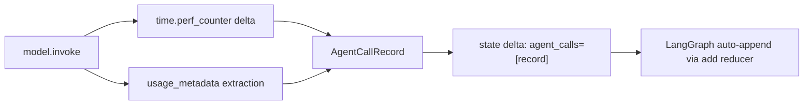

# Design Document: Per-Model Telemetry

## Overview

Add per-LLM-call telemetry to the negotiation orchestrator. Currently, only aggregate `total_tokens_used` is tracked. This spec instruments the agent node to capture a structured `AgentCallRecord` for every `model.invoke()` call — recording model_id, latency, token breakdown, error status, and timing. Records accumulate in an append-only `agent_calls` list on the session state using the same `Annotated[list, add]` pattern as `history`.

This is a prerequisite for Spec 150 (Admin Dashboard) which reads `agent_calls` for per-model performance metrics.

## Architecture

No new services or infrastructure. This is a pure instrumentation change within the existing agent node pipeline.



**Data flow**: Each agent node execution produces 1-2 `AgentCallRecord` dicts (1 for the initial call, optionally 1 for a retry). These are included in the state delta as `{"agent_calls": [record1, ...]}`. LangGraph's `add` reducer on the `agent_calls` field auto-appends them to the session-level list, identical to how `history` entries accumulate.

## Components and Interfaces

### AgentCallRecord (new Pydantic model)

Location: `backend/app/orchestrator/outputs.py`

```python
class AgentCallRecord(BaseModel):
    agent_role: str
    agent_type: str  # "negotiator" | "regulator" | "observer"
    model_id: str
    latency_ms: int = Field(ge=0)
    input_tokens: int = Field(default=0, ge=0)
    output_tokens: int = Field(default=0, ge=0)
    error: bool = Field(default=False)
    turn_number: int = Field(ge=0)
    timestamp: str  # UTC ISO 8601
```

### State Changes

**`NegotiationState` TypedDict** (`state.py`):
```python
agent_calls: Annotated[list[dict[str, Any]], add]
```

**`NegotiationStateModel` Pydantic** (`negotiation.py`):
```python
agent_calls: list[dict[str, Any]] = Field(default_factory=list)
```

**`create_initial_state()`** (`state.py`):
```python
agent_calls=[]
```

**Converters** (`converters.py`):
- `to_pydantic()`: `agent_calls=state.get("agent_calls", [])`
- `from_pydantic()`: `agent_calls=model.agent_calls`

### Agent Node Instrumentation

Location: `backend/app/orchestrator/agent_node.py` — inside `_node()` closure.

**High-level change**: Wrap each `model.invoke()` call with `time.perf_counter()` timing, extract tokens from `usage_metadata`, build an `AgentCallRecord`, and include all records in the state delta.

**Low-level pseudocode for `_node()`**:

```python
import time
from datetime import datetime, timezone

# ... existing code up to step 4 ...

# 4. Invoke LLM — INSTRUMENTED
call_records: list[dict[str, Any]] = []

try:
    t0 = time.perf_counter()
    response: AIMessage = model.invoke(messages)
    latency_ms = int((time.perf_counter() - t0) * 1000)
    response_text = _extract_text_from_content(response.content)

    input_tok, output_tok = _extract_tokens(response)
    tokens_used = input_tok + output_tok

    call_records.append(AgentCallRecord(
        agent_role=agent_role,
        agent_type=agent_type,
        model_id=effective_model_id,
        latency_ms=latency_ms,
        input_tokens=input_tok,
        output_tokens=output_tok,
        error=False,
        turn_number=effective_state.get("turn_count", 0),
        timestamp=datetime.now(timezone.utc).isoformat(),
    ).model_dump())
except Exception:
    logger.warning("Telemetry capture failed for first call", exc_info=True)

# 5. Parse output (retry once on failure) — INSTRUMENTED
try:
    parsed = _parse_output(response_text, agent_type, agent_name)
except AgentOutputParseError:
    # ... existing retry messages setup ...
    try:
        t0 = time.perf_counter()
        response = model.invoke(messages)
        latency_ms = int((time.perf_counter() - t0) * 1000)
        response_text = _extract_text_from_content(response.content)

        input_tok, output_tok = _extract_tokens(response)
        tokens_used += input_tok + output_tok
        retry_error = False

        try:
            parsed = _parse_output(response_text, agent_type, agent_name)
        except Exception:
            parsed = _fallback_output(...)
            retry_error = True

        try:
            call_records.append(AgentCallRecord(
                agent_role=agent_role,
                agent_type=agent_type,
                model_id=effective_model_id,
                latency_ms=latency_ms,
                input_tokens=input_tok,
                output_tokens=output_tok,
                error=retry_error,
                turn_number=effective_state.get("turn_count", 0),
                timestamp=datetime.now(timezone.utc).isoformat(),
            ).model_dump())
        except Exception:
            logger.warning("Telemetry capture failed for retry call", exc_info=True)
    except Exception as retry_exc:
        parsed = _fallback_output(...)
        # Record failed retry with error=True
        try:
            call_records.append(AgentCallRecord(
                agent_role=agent_role,
                agent_type=agent_type,
                model_id=effective_model_id,
                latency_ms=0,
                input_tokens=0,
                output_tokens=0,
                error=True,
                turn_number=effective_state.get("turn_count", 0),
                timestamp=datetime.now(timezone.utc).isoformat(),
            ).model_dump())
        except Exception:
            logger.warning("Telemetry capture failed for fallback", exc_info=True)

# 8. Merge deltas — add agent_calls
merged["agent_calls"] = call_records  # LangGraph appends via add reducer
```

**Helper function** (new, in `agent_node.py`):
```python
def _extract_tokens(response: AIMessage) -> tuple[int, int]:
    """Extract (input_tokens, output_tokens) from response.usage_metadata."""
    usage = getattr(response, "usage_metadata", None)
    if usage is None:
        return 0, 0
    if isinstance(usage, dict):
        return usage.get("input_tokens", 0), usage.get("output_tokens", 0)
    return getattr(usage, "input_tokens", 0), getattr(usage, "output_tokens", 0)
```

This replaces the inline token extraction that currently exists in `_node()`.

### Key Design Decisions

1. **`time.perf_counter()` over `time.time()`**: Higher resolution monotonic clock, not affected by system clock adjustments. Ideal for measuring wall-clock latency of a single call.

2. **Records as dicts in state, not Pydantic objects**: The `AgentCallRecord` Pydantic model is used for validation and construction, then `.model_dump()` converts to a plain dict for state storage. This matches the `history` pattern and avoids serialization issues in LangGraph.

3. **try/except around all telemetry code**: Telemetry failures must never break negotiation logic. Each telemetry block is independently wrapped so a failure in one doesn't prevent the other from executing.

4. **Separate records for initial call and retry**: Rather than merging into one record, each LLM invocation gets its own record. This gives the admin dashboard granular visibility into retry rates and retry-specific latency.

5. **`error` field semantics**: `error=True` means the call's response could not be parsed and the system fell back. The initial call record always has `error=False` (even if parsing fails) because the LLM call itself succeeded — the error is on the retry record or when both fail.

## Data Models

### AgentCallRecord

| Field | Type | Constraints | Description |
|-------|------|-------------|-------------|
| agent_role | str | required | Role identifier (e.g. "Buyer") |
| agent_type | str | required | One of "negotiator", "regulator", "observer" |
| model_id | str | required | Effective model ID after overrides |
| latency_ms | int | >= 0 | Wall-clock milliseconds for model.invoke() |
| input_tokens | int | >= 0, default 0 | Input tokens from usage_metadata |
| output_tokens | int | >= 0, default 0 | Output tokens from usage_metadata |
| error | bool | default False | True if call required fallback |
| turn_number | int | >= 0 | Turn number at time of call |
| timestamp | str | required | UTC ISO 8601 string |

### State Field: agent_calls

- **TypedDict**: `Annotated[list[dict[str, Any]], add]` — auto-appends per node
- **Pydantic**: `list[dict[str, Any]]` with `default_factory=list`
- **Backward compat**: Missing field treated as `[]` via `.get("agent_calls", [])`


## Correctness Properties

*A property is a characteristic or behavior that should hold true across all valid executions of a system — essentially, a formal statement about what the system should do. Properties serve as the bridge between human-readable specifications and machine-verifiable correctness guarantees.*

### Property 1: AgentCallRecord round-trip serialization

*For any* valid `AgentCallRecord` instance (with arbitrary agent_role, agent_type, model_id, non-negative latency_ms, non-negative input/output tokens, any boolean error, non-negative turn_number, and any timestamp string), serializing to JSON via `.model_dump_json()` and deserializing back via `AgentCallRecord.model_validate_json()` SHALL produce an equivalent object.

**Validates: Requirements 1.2**

### Property 2: Converter round-trip preserves agent_calls

*For any* list of valid `AgentCallRecord` dicts placed in a `NegotiationState`, converting via `to_pydantic()` then `from_pydantic()` SHALL produce a state where `agent_calls` is equal to the original list.

**Validates: Requirements 2.4**

### Property 3: Token extraction correctness

*For any* non-negative integer pair `(input_tokens, output_tokens)`, when `usage_metadata` contains those values (as dict or object), `_extract_tokens()` SHALL return the same pair. When `usage_metadata` is `None`, it SHALL return `(0, 0)`.

**Validates: Requirements 3.2**

## Error Handling

| Scenario | Handling | Impact on Negotiation |
|----------|----------|----------------------|
| `time.perf_counter()` fails | Catch exception, log WARNING, skip record | None — state delta returned without agent_calls entry |
| `AgentCallRecord` validation fails | Catch exception, log WARNING, skip record | None |
| `usage_metadata` missing or malformed | Default to `input_tokens=0, output_tokens=0` | Record created with zero tokens |
| `datetime.now()` fails | Catch exception, log WARNING, skip record | None |
| Entire telemetry block throws | Outer try/except catches, logs WARNING | State delta returned with `agent_calls=[]` |

All telemetry code is wrapped in try/except. The agent node's existing behavior (history, turn advancement, token aggregation, deal status) is never affected by telemetry failures.

## Testing Strategy

### Property-Based Tests (Hypothesis)

- **Library**: Hypothesis (already used in the project)
- **Iterations**: Minimum 100 per property (`@settings(max_examples=100)`)
- **Location**: `backend/tests/property/test_telemetry_properties.py`

| Property | Test |
|----------|------|
| Property 1: AgentCallRecord round-trip | Generate random AgentCallRecord, serialize/deserialize, assert equality |
| Property 2: Converter round-trip | Generate random agent_calls lists, round-trip through converters, assert equality |
| Property 3: Token extraction | Generate random (input_tokens, output_tokens) pairs, mock usage_metadata in dict/object/None forms, assert _extract_tokens returns correct values |

Each test tagged with: `Feature: per-model-telemetry, Property {N}: {title}`

### Unit Tests

- **Location**: `backend/tests/unit/orchestrator/test_agent_node_telemetry.py`

| Test | Validates |
|------|-----------|
| AgentCallRecord rejects negative latency_ms | Req 1.1 |
| AgentCallRecord rejects negative token counts | Req 1.1 |
| NegotiationState has agent_calls with add reducer | Req 2.1 |
| create_initial_state() initializes agent_calls=[] | Req 2.2 |
| NegotiationStateModel defaults agent_calls to [] | Req 2.3 |
| Successful LLM call produces 1 AgentCallRecord in state delta | Req 3.1, 3.5 |
| Retry produces 2 AgentCallRecords | Req 3.3 |
| Fallback sets error=True on retry record | Req 3.4 |
| Timestamp is valid UTC ISO 8601 | Req 3.6 |
| model_id reflects model_overrides | Req 3.7 |
| Telemetry failure doesn't break agent node | Req 5.1 |
| State delta non-telemetry fields unchanged | Req 5.2 |
| Missing agent_calls treated as empty list | Req 4.3 |

### Integration Tests

| Test | Validates |
|------|-----------|
| Full negotiation run includes agent_calls in final state | Req 4.1, 4.2 |
