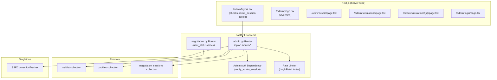

# Design Document: Admin Dashboard

## Overview

Internal admin dashboard for the JuntoAI A2A negotiation platform. Cloud-only (`RUN_MODE=cloud`). Provides user management, simulation oversight, system health monitoring, and data export via a FastAPI backend (`/api/v1/admin/*`) and Next.js server-rendered frontend (`/admin/*`).

Authentication is a single shared password (`ADMIN_PASSWORD` env var) with `itsdangerous` signed session cookies. No user accounts, no OAuth. Rate limiting on login via in-memory dict with TTL cleanup.

### Key Design Decisions

1. **Single router file** — All admin endpoints live in `backend/app/routers/admin.py`. The feature is self-contained and doesn't warrant splitting into sub-routers.
2. **No new Firestore collections** — All data comes from existing `waitlist`, `profiles`, and `negotiation_sessions` collections. `user_status` is a new field on `waitlist` documents.
3. **Server-side rendering** — Admin pages use Next.js App Router with server components. No client-side data fetching for admin data. The admin cookie is forwarded from the browser to the backend API via `fetch` in server components.
4. **Conditional router registration** — If `ADMIN_PASSWORD` is unset/empty, the admin router is not registered. Non-admin routes are unaffected.
5. **503 for local mode** — A single FastAPI dependency checks `RUN_MODE` and short-circuits all admin endpoints with 503.

## Architecture



### Request Flow

1. Browser hits `/admin/*` → Next.js server component checks `admin_session` cookie
2. If no cookie → render login form
3. If cookie present → server component calls `GET /api/v1/admin/*` with cookie forwarded
4. FastAPI `verify_admin_session` dependency validates the `itsdangerous` signed cookie (max_age=28800s)
5. If valid → endpoint executes Firestore queries and returns JSON
6. If invalid/expired → 401

## Components and Interfaces

### Backend Components

#### 1. Admin Router (`backend/app/routers/admin.py`)

Single FastAPI `APIRouter` with prefix `/admin`. Endpoints:

| Method | Path | Auth | Description |
|--------|------|------|-------------|
| `POST` | `/admin/login` | Rate-limited only | Validate password, set signed cookie |
| `POST` | `/admin/logout` | Cookie required | Clear cookie |
| `GET` | `/admin/overview` | Cookie required | All dashboard metrics in one response |
| `GET` | `/admin/users` | Cookie required | Paginated user list with tier + status |
| `PATCH` | `/admin/users/{email}/tokens` | Cookie required | Adjust token balance |
| `PATCH` | `/admin/users/{email}/status` | Cookie required | Change user status |
| `GET` | `/admin/simulations` | Cookie required | Paginated simulation list |
| `GET` | `/admin/simulations/{session_id}/transcript` | Cookie required | Plain text transcript download |
| `GET` | `/admin/simulations/{session_id}/json` | Cookie required | Raw JSON session download |
| `GET` | `/admin/export/users` | Cookie required | CSV user export |
| `GET` | `/admin/export/simulations` | Cookie required | CSV simulation export |

#### 2. Admin Auth Dependency (`verify_admin_session`)

A FastAPI `Depends` function that:
1. Checks `RUN_MODE == "local"` → raises `HTTPException(503)`
2. Reads `admin_session` cookie from the request
3. Deserializes with `itsdangerous.URLSafeTimedSerializer` using `ADMIN_PASSWORD` as secret, `max_age=28800`
4. On failure → raises `HTTPException(401, "Unauthorized")`

```python
from itsdangerous import URLSafeTimedSerializer, BadSignature, SignatureExpired

def verify_admin_session(request: Request) -> str:
    if settings.RUN_MODE == "local":
        raise HTTPException(503, "Admin dashboard is not available in local mode")
    cookie = request.cookies.get("admin_session")
    if not cookie:
        raise HTTPException(401, "Unauthorized")
    s = URLSafeTimedSerializer(settings.ADMIN_PASSWORD)
    try:
        data = s.loads(cookie, max_age=28800)
    except (BadSignature, SignatureExpired):
        raise HTTPException(401, "Unauthorized")
    return data
```

#### 3. Login Rate Limiter (`LoginRateLimiter`)

In-memory rate limiter class in `admin.py`:

```python
import time

class LoginRateLimiter:
    def __init__(self, max_attempts: int = 10, window_seconds: int = 300):
        self.max_attempts = max_attempts
        self.window_seconds = window_seconds
        self._attempts: dict[str, list[float]] = {}

    def is_rate_limited(self, ip: str) -> bool:
        now = time.time()
        cutoff = now - self.window_seconds
        # TTL cleanup: remove expired entries
        attempts = [t for t in self._attempts.get(ip, []) if t > cutoff]
        self._attempts[ip] = attempts
        return len(attempts) >= self.max_attempts

    def record_attempt(self, ip: str) -> None:
        now = time.time()
        cutoff = now - self.window_seconds
        attempts = [t for t in self._attempts.get(ip, []) if t > cutoff]
        attempts.append(now)
        self._attempts[ip] = attempts
```

#### 4. Cloud-Only Guard Dependency (`require_cloud_mode`)

Separate lightweight dependency applied to the login endpoint (which doesn't need cookie auth but still needs the cloud-mode check):

```python
def require_cloud_mode():
    if settings.RUN_MODE == "local":
        raise HTTPException(503, "Admin dashboard is not available in local mode")
```

#### 5. Tier Computation (reuses Spec 140 logic)

```python
def compute_tier(profile: dict | None) -> int:
    """Determine token tier from profile document. Reuses Spec 140 Req 7 logic."""
    if profile and profile.get("profile_completed_at"):
        return 3  # 100 tokens/day
    if profile and profile.get("email_verified"):
        return 2  # 50 tokens/day
    return 1  # 20 tokens/day
```

#### 6. Transcript Reconstruction

Converts the `history` array from a session document into a human-readable plain text transcript:

```
=== Negotiation Transcript ===
Session: {session_id}
Scenario: {scenario_id}
Date: {created_at}
Status: {deal_status}
=====================================

--- Turn 1 ---
[Buyer]
Thought: {inner_thought}
Message: {public_message}

[Regulator]
Thought: {reasoning}
Message: {public_message}
Status: {status}

--- Turn 2 ---
...
```

Each history entry has: `role`, `agent_type`, `content` (dict with `inner_thought`/`reasoning`/`observation`, `public_message`, optionally `proposed_price`, `status`).

The format is deterministic and parseable: turn headers match `--- Turn (\d+) ---`, role headers match `\[(.+)\]`, field lines match `(Thought|Message|Status|Price): (.+)`.

#### 7. Session Metadata Additions to Negotiation Router

Modifications to `backend/app/routers/negotiation.py`:

**In `start_negotiation()`** — Add `created_at` to the session document:
```python
from datetime import datetime, timezone

# After building doc_data / state:
doc_data["created_at"] = datetime.now(timezone.utc).isoformat()
```

**In `event_stream()` finally block** — Add `completed_at` and `duration_seconds`:
```python
# In the finally block, after token deduction:
if settings.RUN_MODE == "cloud":
    try:
        completed_at = datetime.now(timezone.utc).isoformat()
        created_at_str = raw_doc.get("created_at")
        duration_seconds = None
        if created_at_str:
            created_dt = datetime.fromisoformat(created_at_str)
            duration_seconds = int((datetime.now(timezone.utc) - created_dt).total_seconds())
        updates = {"completed_at": completed_at}
        if duration_seconds is not None:
            updates["duration_seconds"] = duration_seconds
        await db.update_session(session_id, updates)
    except Exception:
        logger.warning("Failed to write session metadata for %s", session_id)
```

#### 8. User Status Check in Negotiation Router

Add a check at the top of `start_negotiation()` (cloud mode only):

```python
if settings.RUN_MODE == "cloud":
    wl_ref = db._db.collection("waitlist").document(body.email.lower().strip())
    wl_doc = await wl_ref.get()
    if wl_doc.exists:
        status = wl_doc.to_dict().get("user_status", "active")
        if status == "suspended":
            return JSONResponse(status_code=403, content={"detail": "Account suspended"})
        if status == "banned":
            return JSONResponse(status_code=403, content={"detail": "Account banned"})
```

### Frontend Components

#### 1. Admin Layout (`frontend/app/admin/layout.tsx`)

Server component. Reads `admin_session` cookie from the request. If absent, renders the login form. If present, renders the admin shell (sidebar nav + content area).

This is a separate route group from `(protected)` — admin auth is cookie-based against the backend, not the user session context.

#### 2. Admin Login Page (`frontend/app/admin/login/page.tsx`)

Server-rendered form. `POST`s to `/api/v1/admin/login`. On success, the backend sets the `admin_session` cookie and the page redirects to `/admin`. On failure, displays "Invalid password" error.

#### 3. Admin Overview Page (`frontend/app/admin/page.tsx`)

Server component. Calls `GET /api/v1/admin/overview` with the admin cookie forwarded. Renders:
- Stat cards: total users, simulations today, active SSE connections, AI tokens today
- Scenario analytics table: runs per scenario, avg tokens per scenario
- Model performance table: avg latency, avg tokens, error count per model
- Recent simulations feed (last 50)

#### 4. Admin Users Page (`frontend/app/admin/users/page.tsx`)

Server component with client-side pagination controls. Renders user table with columns: email, tier, token balance, status, signed up date, actions (token adjust, status change).

Filter controls for tier and status. Pagination via cursor (load more button).

#### 5. Admin Simulations Page (`frontend/app/admin/simulations/page.tsx`)

Server component with client-side pagination. Table with columns: session ID (truncated to 8 chars), scenario, user email, outcome, turns, AI tokens, created date. Click row → detail view.

#### 6. Simulation Detail Page (`frontend/app/admin/simulations/[id]/page.tsx`)

Server component. Shows full session metadata, agent configuration, and download buttons for transcript (.txt) and raw JSON.

### Config Changes

Add to `backend/app/config.py` `Settings` class:

```python
ADMIN_PASSWORD: str = ""
```

### Router Registration in `main.py`

Conditional registration:

```python
if settings.ADMIN_PASSWORD:
    from app.routers.admin import router as admin_router
    api_router.include_router(admin_router)
else:
    logger.error("ADMIN_PASSWORD not set — admin routes disabled")
```

### Next.js Middleware Update

Add `/admin/:path*` to the middleware matcher, but with different logic: check for `admin_session` cookie instead of `junto_session`. If missing, redirect to `/admin/login`.

```typescript
// In middleware.ts, add to matcher:
export const config = {
  matcher: ["/arena/:path*", "/admin/:path*"],
};

// In middleware function, handle /admin routes separately:
if (request.nextUrl.pathname.startsWith("/admin")) {
  // Skip login page itself
  if (request.nextUrl.pathname === "/admin/login") return NextResponse.next();
  const adminCookie = request.cookies.get("admin_session");
  if (!adminCookie?.value) {
    return NextResponse.redirect(new URL("/admin/login", request.url));
  }
  return NextResponse.next();
}
```


## Data Models

### Backend Pydantic Models (`backend/app/models/admin.py`)

```python
from datetime import datetime
from enum import Enum
from typing import Literal

from pydantic import BaseModel, Field, field_validator


# --- Enums ---

class UserStatus(str, Enum):
    active = "active"
    suspended = "suspended"
    banned = "banned"


# --- Request Models ---

class AdminLoginRequest(BaseModel):
    password: str = Field(..., min_length=1)


class TokenAdjustRequest(BaseModel):
    token_balance: int = Field(..., ge=0)


class StatusChangeRequest(BaseModel):
    user_status: UserStatus


# --- Response Models ---

class ScenarioAnalytics(BaseModel):
    scenario_id: str
    run_count: int
    avg_tokens_used: float


class ModelPerformance(BaseModel):
    model_id: str
    avg_latency_ms: float
    avg_input_tokens: float
    avg_output_tokens: float
    error_count: int
    total_calls: int


class RecentSimulation(BaseModel):
    session_id: str
    scenario_id: str
    deal_status: str
    turn_count: int
    total_tokens_used: int
    owner_email: str | None = None
    created_at: str | None = None


class OverviewResponse(BaseModel):
    total_users: int
    simulations_today: int
    active_sse_connections: int
    ai_tokens_today: int
    scenario_analytics: list[ScenarioAnalytics]
    model_performance: list[ModelPerformance]
    recent_simulations: list[RecentSimulation]


class UserListItem(BaseModel):
    email: str
    signed_up_at: str | None = None
    token_balance: int = 0
    last_reset_date: str | None = None
    tier: int = 1
    user_status: str = "active"


class UserListResponse(BaseModel):
    users: list[UserListItem]
    next_cursor: str | None = None
    total_count: int | None = None


class SimulationListItem(BaseModel):
    session_id: str
    scenario_id: str
    owner_email: str | None = None
    deal_status: str
    turn_count: int = 0
    max_turns: int = 15
    total_tokens_used: int = 0
    active_toggles: list[str] = Field(default_factory=list)
    model_overrides: dict[str, str] = Field(default_factory=dict)
    created_at: str | None = None


class SimulationListResponse(BaseModel):
    simulations: list[SimulationListItem]
    next_cursor: str | None = None


# --- Query Parameter Models ---

class UserListParams(BaseModel):
    cursor: str | None = None
    page_size: int = Field(default=50, ge=1, le=200)
    tier: int | None = Field(default=None, ge=1, le=3)
    status: UserStatus | None = None


class SimulationListParams(BaseModel):
    cursor: str | None = None
    page_size: int = Field(default=50, ge=1, le=200)
    scenario_id: str | None = None
    deal_status: str | None = None
    owner_email: str | None = None
    order: Literal["asc", "desc"] = "desc"
```

### Firestore Document Schemas (Reference)

**waitlist/{email}** (existing + new `user_status` field):
```
{
  "email": "user@example.com",
  "signed_up_at": "2024-01-15T10:30:00Z",
  "token_balance": 50,
  "last_reset_date": "2024-06-01",
  "user_status": "active"          // NEW — missing = "active"
}
```

**profiles/{email}** (from Spec 140):
```
{
  "display_name": "Jane Doe",
  "email_verified": true,
  "github_url": "https://github.com/janedoe",
  "linkedin_url": null,
  "profile_completed_at": "2024-02-01T12:00:00Z",
  "created_at": "2024-01-15T10:30:00Z",
  "password_hash": "$2b$12$...",
  "country": "US",
  "google_oauth_id": null
}
```

**negotiation_sessions/{session_id}** (existing + new metadata fields):
```
{
  "session_id": "abc123",
  "scenario_id": "talent-war",
  "owner_email": "user@example.com",
  "deal_status": "Agreed",
  "turn_count": 6,
  "max_turns": 15,
  "total_tokens_used": 12500,
  "active_toggles": ["competing-offer"],
  "model_overrides": {"Buyer": "gemini-2.5-flash", "Seller": "claude-sonnet-4"},
  "history": [...],
  "agent_calls": [...],            // From Spec 145
  "created_at": "2024-06-01T14:00:00Z",     // NEW
  "completed_at": "2024-06-01T14:05:30Z",   // NEW
  "duration_seconds": 330                     // NEW
}
```

### Cursor-Based Pagination Design

**Users**: Sorted by `signed_up_at` descending. Cursor = ISO 8601 timestamp of the last item. Firestore query uses `.order_by("signed_up_at", direction=firestore.Query.DESCENDING).start_after({"signed_up_at": cursor}).limit(page_size)`.

**Simulations**: Sorted by `created_at` descending (default) or ascending. Same cursor pattern using `created_at`.

For tier filtering: since tier is computed from the `profiles` collection (not stored on `waitlist`), tier filtering requires a two-step approach:
1. Fetch all `profiles` documents to build an email→tier map
2. Query `waitlist` with pagination
3. Filter results by tier in application code
4. Continue fetching until `page_size` results are collected or no more documents

This is acceptable for MVP scale (< 10K users). For larger scale, a denormalized `tier` field on `waitlist` would be needed.

### CSV Export Format

Uses Python's `csv` module with `csv.writer` writing to a `StringIO` buffer. RFC 4180 compliance is handled by the stdlib `csv` module (proper quoting of commas, quotes, newlines).

Response uses `StreamingResponse` with `media_type="text/csv"` and `Content-Disposition: attachment` header.

### Admin Session Cookie Attributes

```python
response.set_cookie(
    key="admin_session",
    value=signed_token,
    httponly=True,
    secure=settings.ENVIRONMENT != "development",
    samesite="strict",
    path="/api/v1/admin",
    max_age=28800,  # 8 hours
)
```

Note: `Path=/api/v1/admin` means the cookie is only sent to admin API endpoints. The frontend reads the cookie existence via Next.js middleware (which has access to all cookies regardless of path). For the server components to forward the cookie to the backend, the frontend needs to read it and include it in fetch headers. Since `Path=/api/v1/admin` restricts browser auto-sending, we have two options:

**Decision**: Set `Path=/` so the cookie is available to both the Next.js middleware and the backend API. The `HttpOnly` + `SameSite=Strict` attributes provide sufficient security. The cookie name `admin_session` is distinct from the user `junto_session` cookie.

Revised:
```python
response.set_cookie(
    key="admin_session",
    value=signed_token,
    httponly=True,
    secure=settings.ENVIRONMENT != "development",
    samesite="strict",
    path="/",
    max_age=28800,
)
```


## Correctness Properties

*A property is a characteristic or behavior that should hold true across all valid executions of a system — essentially, a formal statement about what the system should do. Properties serve as the bridge between human-readable specifications and machine-verifiable correctness guarantees.*

### Property 1: Rate limiter blocks after threshold

*For any* IP address and any sequence of failed login attempts, if the number of attempts from that IP within the last 5 minutes exceeds 10, then `is_rate_limited(ip)` SHALL return `True`. If the number of attempts is 10 or fewer, it SHALL return `False`. Additionally, attempts older than 5 minutes SHALL be ignored (TTL cleanup).

**Validates: Requirements 1.5**

### Property 2: Scenario analytics aggregation correctness

*For any* list of session documents with varying `scenario_id` and `total_tokens_used` values, the computed scenario analytics SHALL produce a `run_count` per `scenario_id` equal to the actual count of sessions with that `scenario_id`, and an `avg_tokens_used` per `scenario_id` equal to the arithmetic mean of `total_tokens_used` across those sessions.

**Validates: Requirements 3.5**

### Property 3: Model performance aggregation correctness

*For any* list of `agent_calls` records with varying `model_id`, `latency_ms`, `input_tokens`, `output_tokens`, and `error` values, the computed model performance metrics SHALL produce per-model averages and error counts that match the actual arithmetic means and counts from the input data. Sessions lacking `agent_calls` data SHALL be excluded.

**Validates: Requirements 3.6**

### Property 4: Tier computation correctness

*For any* profile document (or absence thereof), the computed tier SHALL be: 3 if `profile_completed_at` is non-null, 2 if `email_verified` is true and `profile_completed_at` is null, and 1 otherwise. This matches Spec 140 Requirement 7 logic.

**Validates: Requirements 4.2**

### Property 5: Cursor-based pagination correctness

*For any* ordered list of documents (users sorted by `signed_up_at` or simulations sorted by `created_at`), any valid cursor value, any page_size between 1 and 200, and any sort direction (asc/desc), the returned page SHALL: (a) contain at most `page_size` items, (b) contain only items that come strictly after the cursor in the specified sort order, (c) be correctly ordered, and (d) the `next_cursor` (if present) SHALL equal the sort field of the last item in the page.

**Validates: Requirements 4.3, 5.3, 5.5**

### Property 6: Collection filtering correctness

*For any* list of user or simulation documents and any combination of filter criteria (tier + status for users; scenario_id + deal_status + owner_email for simulations), every item in the filtered result SHALL match all specified filter criteria, and no item matching all criteria SHALL be excluded from the result.

**Validates: Requirements 4.9, 5.4**

### Property 7: Transcript round-trip

*For any* valid session history array (list of entries with `role`, `agent_type`, `content` containing `inner_thought`/`reasoning`/`observation` and `public_message`), formatting the history into a Simulation_Transcript and then parsing the transcript back into structured entries SHALL preserve the agent role, turn number, and public message of each entry.

**Validates: Requirements 6.7, 6.2**

### Property 8: CSV serialization round-trip

*For any* set of user or simulation records (including field values containing commas, double quotes, newlines, and Unicode characters), serializing to CSV and parsing the CSV back into records SHALL produce field values identical to the original data.

**Validates: Requirements 7.9, 7.8**

### Property 9: Duration computation correctness

*For any* valid `created_at` ISO 8601 timestamp and any `completed_at` timestamp that is equal to or later than `created_at`, the computed `duration_seconds` SHALL equal the integer difference in seconds between `completed_at` and `created_at`.

**Validates: Requirements 8.3**

## Error Handling

### Backend Error Handling

| Scenario | HTTP Status | Response Body | Notes |
|----------|-------------|---------------|-------|
| `RUN_MODE=local` on any admin endpoint | 503 | `{"detail": "Admin dashboard is not available in local mode"}` | Cloud-only guard |
| Missing/invalid/expired admin cookie | 401 | `{"detail": "Unauthorized"}` | Auth dependency |
| Wrong password on login | 401 | `{"detail": "Invalid password"}` | No info leakage |
| Rate limited (>10 attempts/5min) | 429 | `{"detail": "Too many login attempts"}` | Per-IP rate limit |
| `ADMIN_PASSWORD` not set | N/A | Admin routes not registered; error logged | Non-admin routes unaffected |
| Session not found (transcript/json) | 404 | `{"detail": "Session not found"}` | Reuses existing exception handler |
| User not found (token/status update) | 404 | `{"detail": "User not found"}` | Email not in waitlist |
| Invalid token balance (negative) | 422 | Pydantic validation error | Automatic from model |
| Invalid user_status value | 422 | Pydantic validation error | Enum validation |
| Invalid page_size (>200 or <1) | 422 | Pydantic validation error | Query param model |
| Firestore query failure | 500 | `{"detail": "Internal server error"}` | Logged, generic response |

### Frontend Error Handling

- API errors from admin endpoints are caught in server components and displayed as error banners
- 401 responses trigger redirect to `/admin/login` (session expired)
- 503 responses show "Admin dashboard is not available in local mode" message
- Network errors show a generic "Failed to load data" message with retry button

### Backward Compatibility

- `user_status` field missing from waitlist documents → treated as `"active"` (Req 4.10)
- `agent_calls` field missing from session documents → treated as empty list, excluded from model performance metrics (Req 3.6)
- `created_at` field missing from session documents → `None` in responses, excluded from duration calculations
- `completed_at` / `duration_seconds` missing → `None` in responses

## Testing Strategy

### Property-Based Tests (Hypothesis)

Library: `hypothesis` (already in use in the project — see `.hypothesis/` directory and `backend/tests/property/`).

Each property test runs minimum 100 iterations. Tests are tagged with the design property they validate.

| Property | Test File | Strategy |
|----------|-----------|----------|
| P1: Rate limiter | `backend/tests/property/test_admin_properties.py` | Generate random (IP, timestamp) sequences. Verify threshold behavior. |
| P2: Scenario analytics | `backend/tests/property/test_admin_properties.py` | Generate random session lists. Verify per-scenario counts and averages. |
| P3: Model performance | `backend/tests/property/test_admin_properties.py` | Generate random agent_calls lists. Verify per-model aggregations. |
| P4: Tier computation | `backend/tests/property/test_admin_properties.py` | Generate random profile documents (with/without fields). Verify tier. |
| P5: Cursor pagination | `backend/tests/property/test_admin_properties.py` | Generate random document lists + cursor + page_size. Verify page correctness. |
| P6: Collection filtering | `backend/tests/property/test_admin_properties.py` | Generate random documents + filter combos. Verify filter correctness. |
| P7: Transcript round-trip | `backend/tests/property/test_admin_properties.py` | Generate random history arrays. Format → parse → compare. |
| P8: CSV round-trip | `backend/tests/property/test_admin_properties.py` | Generate random records with special chars. Serialize → parse → compare. |
| P9: Duration computation | `backend/tests/property/test_admin_properties.py` | Generate random timestamp pairs. Verify duration. |

Configuration:
```python
from hypothesis import given, settings, strategies as st

@settings(max_examples=100)
```

Tag format: `# Feature: admin-dashboard, Property N: <property_text>`

### Unit Tests (pytest)

| Area | Test File | Coverage |
|------|-----------|----------|
| Auth dependency | `backend/tests/unit/test_admin_auth.py` | Missing cookie → 401, invalid cookie → 401, expired cookie → 401, valid cookie → passes |
| Login endpoint | `backend/tests/unit/test_admin_login.py` | Correct password → 200 + cookie, wrong password → 401, rate limited → 429 |
| Logout endpoint | `backend/tests/unit/test_admin_login.py` | Cookie cleared, 200 returned |
| Cloud-only guard | `backend/tests/unit/test_admin_auth.py` | RUN_MODE=local → 503 on all endpoints |
| Token adjustment | `backend/tests/unit/test_admin_users.py` | Valid update, negative rejected, user not found |
| Status change | `backend/tests/unit/test_admin_users.py` | Valid status values, invalid rejected, user not found |
| User status check in negotiation | `backend/tests/unit/test_admin_users.py` | Suspended → 403, banned → 403, active → proceeds |
| Backward compat (missing user_status) | `backend/tests/unit/test_admin_users.py` | Missing field → "active" |
| Session metadata (created_at) | `backend/tests/unit/test_admin_sessions.py` | Verify created_at set on start_negotiation |
| Overview endpoint | `backend/tests/integration/test_admin_overview.py` | Mock Firestore, verify all metrics |
| Transcript download | `backend/tests/integration/test_admin_downloads.py` | Verify Content-Disposition, text format |
| JSON download | `backend/tests/integration/test_admin_downloads.py` | Verify Content-Disposition, JSON format |
| CSV export | `backend/tests/integration/test_admin_downloads.py` | Verify headers, column names, Content-Disposition |

### Integration Tests

| Area | Test File | Coverage |
|------|-----------|----------|
| Full admin auth flow | `backend/tests/integration/test_admin_auth_flow.py` | Login → authenticated request → logout → 401 |
| Admin routes not registered | `backend/tests/integration/test_admin_auth_flow.py` | Empty ADMIN_PASSWORD → 404 on admin routes |
| End-to-end user management | `backend/tests/integration/test_admin_users_flow.py` | List → adjust tokens → change status → verify |
| End-to-end simulation browsing | `backend/tests/integration/test_admin_simulations_flow.py` | List → paginate → download transcript → download JSON |

### Frontend Tests (Vitest)

| Area | Test File | Coverage |
|------|-----------|----------|
| Admin middleware redirect | `frontend/__tests__/middleware/admin-middleware.test.ts` | No cookie → redirect to /admin/login |
| Login form | `frontend/__tests__/pages/admin-login.test.tsx` | Submit → success redirect, error display |
| Overview page rendering | `frontend/__tests__/pages/admin-overview.test.tsx` | Stat cards, tables render with mock data |
| User table | `frontend/__tests__/pages/admin-users.test.tsx` | Columns, pagination, filter controls |
| Simulation table | `frontend/__tests__/pages/admin-simulations.test.tsx` | Columns, pagination, detail link |

### Mocking Strategy

- **Firestore**: Mock `google.cloud.firestore.AsyncClient` — return controlled document snapshots
- **SSEConnectionTracker**: Mock `total_active_connections` property
- **itsdangerous**: Use real serializer in tests (fast, no external deps)
- **Settings**: Override via `monkeypatch` or test-specific env vars
