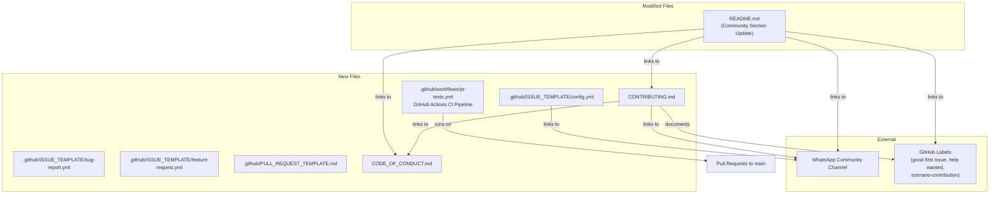

# Design Document — Developer Community Infrastructure

## Overview

This design covers the files, workflows, and documentation needed to transform the JuntoAI A2A public repo into a contributor-ready open-source project. The work involves:

1. A GitHub Actions PR CI pipeline (`.github/workflows/pr-tests.yml`) that runs backend pytest and frontend Vitest in parallel on every PR to `main`, enforcing 70% coverage
2. A contribution guide (`CONTRIBUTING.md`) documenting the fork-and-PR workflow, local setup, test commands, and contribution types
3. A code of conduct (`CODE_OF_CONDUCT.md`) based on Contributor Covenant v2.1
4. GitHub issue templates (`.github/ISSUE_TEMPLATE/bug-report.yml`, `feature-request.yml`, `config.yml`) using YAML form format
5. A PR template (`.github/PULL_REQUEST_TEMPLATE.md`) with checklist and change type section
6. Label documentation in CONTRIBUTING.md for `good first issue`, `scenario-contribution`, and `help wanted`
7. Updated README community section linking to all new resources and the WhatsApp community channel
8. WhatsApp community channel link integrated across CONTRIBUTING.md, README, and issue template config
9. Branch protection guidance documented in CONTRIBUTING.md

Currently, the repo has none of these files. The `.github/` directory does not exist. The README has a basic "Contributing" section that lists contribution types and branch strategy but lacks links to a contribution guide, code of conduct, or community channel.

## Architecture

This feature is entirely file-based — no application code changes, no new runtime components. All artifacts are static configuration and documentation files.



### File Creation Order

Files should be created in dependency order:

1. **CODE_OF_CONDUCT.md** — No dependencies, referenced by everything else
2. **CONTRIBUTING.md** — References CODE_OF_CONDUCT.md and WhatsApp link
3. **.github/workflows/pr-tests.yml** — Standalone CI config
4. **.github/ISSUE_TEMPLATE/bug-report.yml** — Standalone
5. **.github/ISSUE_TEMPLATE/feature-request.yml** — Standalone
6. **.github/ISSUE_TEMPLATE/config.yml** — References WhatsApp link
7. **.github/PULL_REQUEST_TEMPLATE.md** — References CONTRIBUTING.md
8. **README.md update** — References all of the above

## Components and Interfaces

### GitHub Actions PR CI Pipeline (`.github/workflows/pr-tests.yml`)

The workflow triggers on pull requests targeting `main` and runs two parallel jobs:

```yaml
# Trigger: pull_request events (opened, synchronize, reopened) targeting main
# Jobs:
#   backend-tests:
#     - runs-on: ubuntu-latest
#     - Python 3.11
#     - pip install -r backend/requirements.txt
#     - pytest --cov=app --cov-fail-under=70 in /backend
#   frontend-tests:
#     - runs-on: ubuntu-latest
#     - Node.js 20
#     - npm ci in /frontend
#     - npx vitest run --coverage in /frontend
```

**Key decisions:**

- Both jobs run in parallel (no `needs` dependency between them) to minimize total pipeline time
- No path filtering — even `/infra`-only changes trigger all tests (Requirement 1.10) to prevent configuration drift
- Uses `actions/checkout@v4`, `actions/setup-python@v5`, `actions/setup-node@v4` for reproducible environments
- Coverage enforcement happens at the test command level (`--cov-fail-under=70` for pytest, vitest config for frontend)
- No caching of dependencies in v1 — simplicity over speed. Can add pip/npm caching later if CI times become a problem

### CONTRIBUTING.md

Structured as a single markdown file with these sections:

1. **Welcome** — Brief intro, link to Code of Conduct
2. **Getting Started** — Fork, clone, branch workflow
3. **Local Development Setup** — Prerequisites, `docker compose up`, independent test commands
4. **Running Tests** — Exact backend and frontend test commands with coverage
5. **Types of Contributions** — Scenario configs, bug fixes, features, docs, agent strategies
6. **Scenario Contributions** — JSON-only workflow, drop file in `backend/app/scenarios/data/`
7. **Pull Request Process** — PR expectations, CI pipeline, coverage threshold
8. **Branch Protection** — `main` is protected, all changes via PR, CI must pass
9. **Labels** — `good first issue`, `scenario-contribution`, `help wanted` explained
10. **Community** — WhatsApp link, Code of Conduct link

**Key decisions:**

- Single file, no subdirectory structure — keeps it simple and discoverable
- Branch protection guidance is documented here (Requirement 9) rather than in a separate file, since it's relevant context for contributors and maintainers alike
- Label documentation is inline rather than a separate file — contributors need to see it in the same flow as the contribution guide

### CODE_OF_CONDUCT.md

Based on Contributor Covenant v2.1 with project-specific customizations:

- Enforcement contact: placeholder email `[conduct@juntoai.org]` (to be replaced with actual email)
- Scope: GitHub issues, PRs, discussions, and WhatsApp community channel
- Standard Contributor Covenant sections: Pledge, Standards, Responsibilities, Scope, Enforcement, Attribution

**Key decision:** Use the full Contributor Covenant v2.1 text rather than a summary. This is the industry standard and contributors expect the complete document.

### GitHub Issue Templates

**bug-report.yml:**

```yaml
# Form fields:
# - description (textarea, required): What happened?
# - steps-to-reproduce (textarea, required): Step-by-step reproduction
# - expected-behavior (textarea, required): What should have happened?
# - actual-behavior (textarea, required): What actually happened?
# - environment (dropdown + textarea, required): OS, Docker version, LLM provider
```

**feature-request.yml:**

```yaml
# Form fields:
# - description (textarea, required): Describe the feature
# - problem (textarea, required): What problem does it solve?
# - proposed-solution (textarea, required): How should it work?
```

**config.yml:**

```yaml
# blank_issues_enabled: false
# contact_links:
#   - name: Community Chat (WhatsApp)
#     url: <whatsapp-invite-url>
#     about: Ask questions and coordinate with other contributors
```

**Key decisions:**

- YAML form format (not markdown templates) — provides structured input, better triage
- `blank_issues_enabled: false` — forces contributors to use templates or the WhatsApp link
- Environment field uses a combination of dropdown (OS) and free text (Docker version, LLM provider) since the combinations are too varied for pure dropdowns

### PR Template (`.github/PULL_REQUEST_TEMPLATE.md`)

```markdown
# Sections:
# - Description: What changes were made and why
# - Related Issues: Closes #XX or Relates to #XX
# - Type of Change: checkboxes for bug fix, feature, scenario config, documentation, other
# - Checklist:
#   - [ ] Tests pass locally
#   - [ ] Coverage meets 70% threshold
#   - [ ] Code follows existing patterns
#   - [ ] I have read CONTRIBUTING.md
```

### README Community Section Update

The existing `## 🤝 Contributing` section in README.md will be updated to include:

- Link to `CONTRIBUTING.md` (primary call to action)
- Link to `CODE_OF_CONDUCT.md`
- Link to WhatsApp community channel
- Link to `good first issue` filtered view (`/issues?q=label:"good first issue"`)
- Mention that PRs are automatically tested by GitHub Actions CI
- Retain existing contribution types list (scenario configs, bug reports, features, docs, agent strategies)

**Key decision:** Update the existing section in-place rather than adding a new section. The current section already has the right heading and position in the README.

## Data Models

No data models are introduced. This feature creates only static files (markdown, YAML) and modifies the README. No database changes, no API changes, no runtime code changes.

### File Inventory

| File | Type | Status |
| ---- | ---- | ------ |
| `.github/workflows/pr-tests.yml` | GitHub Actions YAML | New |
| `.github/ISSUE_TEMPLATE/bug-report.yml` | GitHub Issue Form YAML | New |
| `.github/ISSUE_TEMPLATE/feature-request.yml` | GitHub Issue Form YAML | New |
| `.github/ISSUE_TEMPLATE/config.yml` | GitHub Config YAML | New |
| `.github/PULL_REQUEST_TEMPLATE.md` | Markdown | New |
| `CONTRIBUTING.md` | Markdown | New |
| `CODE_OF_CONDUCT.md` | Markdown | New |
| `README.md` | Markdown | Modified |

## Correctness Properties

Property-based testing is **not applicable** to this feature. All deliverables are static documentation and configuration files:

- Markdown documents (CONTRIBUTING.md, CODE_OF_CONDUCT.md, PR template)
- YAML configuration files (GitHub Actions workflow, issue templates)
- README content updates

There are no pure functions, data transformations, parsers, serialization logic, or algorithmic behavior to test. There are no universal properties that hold across a wide input space. The acceptance criteria are about file existence, content structure, and correct cross-references — all verifiable through example-based checks and linting.

## Error Handling

This feature has minimal error surface since all artifacts are static files:

1. **CI Pipeline Failures**: If `pr-tests.yml` has syntax errors, GitHub Actions will report a workflow parse error on the PR. This is self-correcting — the contributor fixes the YAML and pushes again. The workflow should be validated locally using `act` or by reviewing GitHub's workflow syntax documentation.

2. **Invalid Issue Template YAML**: GitHub validates issue form YAML on push. Malformed YAML will cause the template to not appear in the issue creation UI. Validate YAML structure before merging.

3. **Broken Links in Documentation**: Cross-references between CONTRIBUTING.md, CODE_OF_CONDUCT.md, and README.md could break if files are renamed or moved. Use relative links (`./CONTRIBUTING.md`) for in-repo references to minimize breakage.

4. **WhatsApp Invite Link Expiration**: WhatsApp group invite links can expire or be revoked. Use a permanent invite link or a redirect URL (e.g., `juntoai.org/community`) that can be updated without changing documentation files. For v1, use the direct WhatsApp link with a `<!-- TODO: replace with permanent redirect -->` comment.

5. **Coverage Threshold Mismatch**: If the vitest config doesn't enforce 70% coverage at the config level, the CI pipeline might pass even when coverage is below threshold. The pytest `--cov-fail-under=70` flag handles backend enforcement. For frontend, ensure `vitest.config.ts` has coverage thresholds configured, or add `--coverage.thresholds.lines=70` to the CI command.

## Testing Strategy

### Approach

This feature produces static files, not application code. Traditional unit tests and property-based tests are not applicable. Instead, validation uses:

1. **CI Pipeline Validation**: The `pr-tests.yml` workflow is validated by opening a test PR against `main`. If the workflow triggers, runs both jobs in parallel, and reports status correctly, it works. This is a manual integration test performed once during implementation.

2. **YAML Lint**: Issue templates and the GitHub Actions workflow should pass YAML linting. Use `yamllint` or a YAML validator to catch syntax errors before committing.

3. **Link Validation**: Cross-references between documents should be verified. A simple grep-based check can confirm that all referenced files exist:
   - CONTRIBUTING.md links to CODE_OF_CONDUCT.md ✓
   - README.md links to CONTRIBUTING.md ✓
   - README.md links to CODE_OF_CONDUCT.md ✓
   - config.yml links to WhatsApp URL ✓

4. **Content Checklist**: Each file is verified against its acceptance criteria manually during PR review. The acceptance criteria are specific enough to serve as a review checklist.

5. **GitHub Actions Dry Run**: After merging the workflow file, open a test PR to verify:
   - Workflow triggers on PR open
   - Backend tests job runs with Python 3.11
   - Frontend tests job runs with Node.js 20
   - Jobs run in parallel
   - Status check reports correctly on the PR

### What We Don't Test

- We don't write unit tests for markdown or YAML files — there's no code to test
- We don't write property-based tests — there are no functions or data transformations
- We don't test GitHub's issue template rendering — that's GitHub's responsibility
- We don't test branch protection rules — those are configured in GitHub repo settings, not in code
