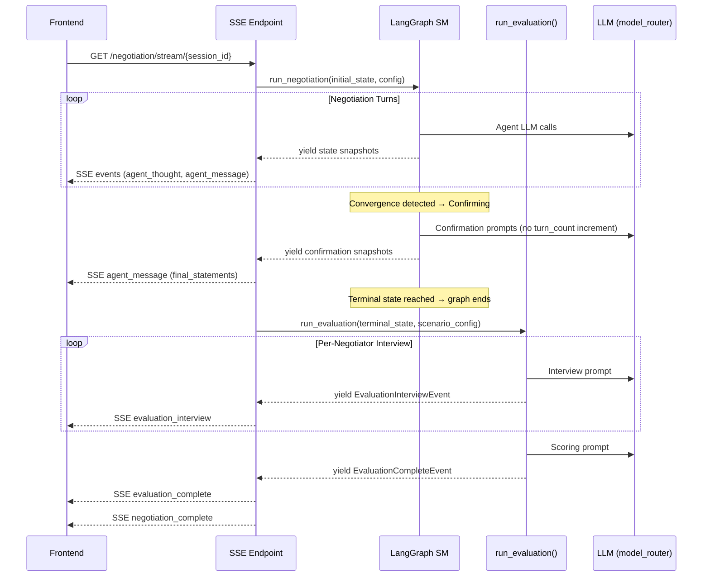
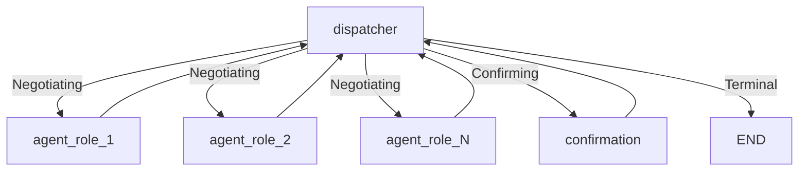

# Design Document: Negotiation Evaluator

## Overview

This design adds two capabilities to the JuntoAI negotiation engine:

1. **Closure Protocol** — When price convergence is detected, the dispatcher transitions to a `"Confirming"` state instead of immediately marking `"Agreed"`. A new `confirmation` graph node prompts each negotiator for explicit accept/reject. This is modeled as a LangGraph node but does NOT increment `turn_count`.

2. **Post-Negotiation Evaluator** — After the LangGraph state machine terminates (any terminal state: Agreed, Blocked, Failed), a standalone `run_evaluation()` async function runs OUTSIDE the graph. It interviews each negotiator independently, produces a multi-dimensional quality score, and emits its own SSE events. This happens in the streaming endpoint between `run_negotiation()` completing and the `negotiation_complete` SSE event being emitted.

The evaluator is adversarial by design — it defaults to 5/10 and requires evidence to score higher. This reinforces JuntoAI's thesis that negotiation quality is about mutual respect and win-win outcomes, not just price convergence.

### Key Architectural Constraint

The evaluation is NOT a turn. The evaluator runs as a completely separate post-negotiation phase:
- It is NOT a node in the LangGraph graph
- It does NOT increment `turn_count`
- It does NOT use the `turn_order` mechanism
- It runs as a standalone async function called from the streaming endpoint AFTER `run_negotiation()` completes and BEFORE the `negotiation_complete` SSE event is emitted

Similarly, the Confirmation Round does NOT increment `turn_count` for confirmation prompts. It is a confirmation phase, not additional negotiation turns.

## Architecture

### High-Level Flow



### Graph Topology Changes



The `confirmation` node is added to the graph. When `_check_agreement` detects convergence, the dispatcher sets `deal_status = "Confirming"` instead of `"Agreed"`. The `_route_dispatcher` routes to the `confirmation` node. After confirmation completes, it returns to the dispatcher which either terminates (`"Agreed"`) or resumes negotiation (`"Negotiating"`).

## Components and Interfaces

### 1. Modified Components

#### `backend/app/orchestrator/graph.py` — Dispatcher & Graph Builder

**Changes to `build_graph()`:**
- Add a `confirmation` node to the `StateGraph`
- Add `confirmation → dispatcher` edge
- Add `"confirmation"` to the `route_map` for conditional edges

**Changes to `_dispatcher()`:**
- When `_check_agreement()` returns `True` AND `deal_status == "Negotiating"`, set `deal_status = "Confirming"` and populate `confirmation_pending` with all negotiator roles
- When `deal_status == "Confirming"` and `confirmation_pending` is empty, resolve based on confirmation results

**Changes to `_route_dispatcher()`:**
- When `deal_status == "Confirming"`, return `"confirmation"`

```python
# Pseudocode for dispatcher confirmation logic
async def _dispatcher(state: NegotiationState) -> dict[str, Any]:
    # ... existing terminal checks ...

    if state["deal_status"] == "Confirming":
        return _resolve_confirmation(state)

    if _check_agreement(state):
        negotiator_roles = [
            role for role, info in state["agent_states"].items()
            if info.get("agent_type") == "negotiator"
        ]
        return {
            "deal_status": "Confirming",
            "confirmation_pending": negotiator_roles,
            "closure_status": "",
        }
    # ... rest unchanged ...
```

```python
def _resolve_confirmation(state: NegotiationState) -> dict[str, Any]:
    """Resolve confirmation round results after all negotiators have responded."""
    if state["confirmation_pending"]:
        # Still waiting for confirmations
        return {}

    # Analyze confirmation history entries
    confirmations = [
        e for e in state["history"]
        if e.get("agent_type") == "confirmation"
    ]

    all_accepted = all(e["content"]["accept"] for e in confirmations)
    any_conditions = any(e["content"].get("conditions", []) for e in confirmations)

    if all_accepted and not any_conditions:
        return {"deal_status": "Agreed", "closure_status": "Confirmed"}
    elif not all_accepted:
        # Resume negotiation — rejection
        return {"deal_status": "Negotiating", "closure_status": "Rejected"}
    else:
        # All accepted but with conditions — resume
        return {"deal_status": "Negotiating", "closure_status": "Conditional"}
```

#### `backend/app/orchestrator/state.py` — NegotiationState

**New fields:**
```python
class NegotiationState(TypedDict):
    # ... existing fields ...
    closure_status: str           # "", "Confirmed", "Rejected", "Conditional"
    confirmation_pending: list[str]  # roles not yet confirmed
```

**Changes to `create_initial_state()`:**
- Initialize `closure_status = ""` and `confirmation_pending = []`

#### `backend/app/models/negotiation.py` — NegotiationStateModel

**Changes:**
```python
class NegotiationStateModel(BaseModel):
    # ... existing fields ...
    deal_status: Literal["Negotiating", "Agreed", "Blocked", "Failed", "Confirming"]
    closure_status: str = Field(default="")
    confirmation_pending: list[str] = Field(default_factory=list)
```

#### `backend/app/models/events.py` — SSE Events

**New events:**
```python
class EvaluationInterviewEvent(BaseModel):
    event_type: Literal["evaluation_interview"]
    agent_name: str
    turn_number: int  # evaluation step index (1-based)
    status: Literal["interviewing", "complete"]
    satisfaction_rating: int | None = None
    felt_respected: bool | None = None
    is_win_win: bool | None = None

class EvaluationCompleteEvent(BaseModel):
    event_type: Literal["evaluation_complete"]
    dimensions: dict[str, int]  # fairness, mutual_respect, value_creation, satisfaction
    overall_score: int
    verdict: str
    participant_interviews: list[dict[str, Any]]
    deal_status: str
```

#### `backend/app/routers/negotiation.py` — Streaming Endpoint

**Changes to `event_stream()` generator:**
```python
async def event_stream():
    # ... existing negotiation loop (unchanged) ...
    # After run_negotiation() completes, BEFORE emitting negotiation_complete:

    # Intercept: hold back NegotiationCompleteEvent
    # Run evaluation if enabled
    if evaluator_enabled:
        async for eval_event in run_evaluation(terminal_state, scenario_config):
            json_data = eval_event.model_dump_json()
            eid = await event_buffer.append(session_id, json_data)
            yield format_sse_event(eval_event, event_id=eid)
        # Attach evaluation to the negotiation_complete summary
        complete_event.final_summary["evaluation"] = evaluation_report

    # NOW emit negotiation_complete
    yield format_sse_event(complete_event, event_id=eid)
```

The key change: the streaming loop collects events from `run_negotiation()` but holds back the `NegotiationCompleteEvent`. After the graph terminates, it calls `run_evaluation()`, streams those events, then emits the held-back complete event with evaluation data attached.

#### `backend/app/scenarios/models.py` — ArenaScenario

**New model:**
```python
class EvaluatorConfig(BaseModel):
    model_id: str = Field(..., min_length=1)
    fallback_model_id: str | None = None
    enabled: bool = Field(default=True)

class ArenaScenario(BaseModel):
    # ... existing fields ...
    evaluator_config: EvaluatorConfig | None = Field(default=None)
```

#### `backend/app/orchestrator/converters.py` — State Converters

**Changes to `to_pydantic()` and `from_pydantic()`:**
- Map `closure_status` and `confirmation_pending` fields between TypedDict and Pydantic model

### 2. New Components

#### `backend/app/orchestrator/confirmation_node.py` — Confirmation Node

A new LangGraph node that handles the confirmation round. It iterates through `confirmation_pending`, prompts each negotiator for a `ConfirmationOutput`, and removes them from the pending list.

```python
async def confirmation_node(state: NegotiationState) -> dict[str, Any]:
    """Prompt the next pending negotiator for confirmation.

    Does NOT increment turn_count. Processes one negotiator per invocation,
    then returns to dispatcher. Dispatcher re-routes here until
    confirmation_pending is empty.
    """
    pending = list(state.get("confirmation_pending", []))
    if not pending:
        return {}

    role = pending[0]
    remaining = pending[1:]

    # Build confirmation prompt with converged terms
    agent_config = _find_agent_config(role, state)
    model = model_router.get_model(
        agent_config["model_id"],
        fallback_model_id=agent_config.get("fallback_model_id"),
    )

    messages = _build_confirmation_messages(agent_config, state)
    response = await model.ainvoke(messages)

    # Parse ConfirmationOutput (with retry + fallback)
    parsed = _parse_confirmation(response, role)

    # Build history entry (agent_type = "confirmation")
    history_entry = {
        "role": role,
        "agent_type": "confirmation",
        "turn_number": state.get("turn_count", 0),  # same turn, no increment
        "content": parsed.model_dump(),
    }

    return {
        "history": [history_entry],
        "confirmation_pending": remaining,
    }
```

#### `backend/app/orchestrator/outputs.py` — New Output Models

```python
class ConfirmationOutput(BaseModel):
    """Structured output from a negotiator during the confirmation round."""
    accept: bool
    final_statement: str = Field(..., min_length=1)
    conditions: list[str] = Field(default_factory=list)
```

#### `backend/app/orchestrator/evaluator.py` — Evaluator Agent (Standalone)

This is the core new module. It runs OUTSIDE the LangGraph graph as a standalone async generator.

```python
async def run_evaluation(
    terminal_state: dict[str, Any],
    scenario_config: dict[str, Any],
) -> AsyncGenerator[EvaluationInterviewEvent | EvaluationCompleteEvent, None]:
    """Run post-negotiation evaluation. Yields SSE events as it progresses.

    Called from the streaming endpoint AFTER run_negotiation() completes.
    NOT a LangGraph node. Does NOT modify NegotiationState.
    """
    evaluator_config = scenario_config.get("evaluator_config")
    if evaluator_config and not evaluator_config.get("enabled", True):
        return

    model = _resolve_evaluator_model(scenario_config)
    negotiators = _get_negotiator_configs(scenario_config)
    history = terminal_state.get("history", [])
    deal_status = terminal_state.get("deal_status", "")

    interviews: list[dict] = []

    for step, agent_config in enumerate(negotiators, 1):
        role = agent_config["role"]

        # Emit "interviewing" event
        yield EvaluationInterviewEvent(
            event_type="evaluation_interview",
            agent_name=role,
            turn_number=step,
            status="interviewing",
        )

        # Conduct interview
        interview = await _interview_participant(
            model, agent_config, history, terminal_state
        )
        interviews.append({"role": role, **interview.model_dump()})

        # Emit "complete" event with results
        yield EvaluationInterviewEvent(
            event_type="evaluation_interview",
            agent_name=role,
            turn_number=step,
            status="complete",
            satisfaction_rating=interview.satisfaction_rating,
            felt_respected=interview.felt_respected,
            is_win_win=interview.is_win_win,
        )

    # Scoring call — separate LLM invocation
    report = await _score_negotiation(
        model, interviews, history, terminal_state, scenario_config
    )

    yield EvaluationCompleteEvent(
        event_type="evaluation_complete",
        dimensions=report.dimensions,
        overall_score=report.overall_score,
        verdict=report.verdict,
        participant_interviews=interviews,
        deal_status=deal_status,
    )
```

**Interview function:**
```python
async def _interview_participant(
    model: BaseChatModel,
    agent_config: dict[str, Any],
    history: list[dict],
    terminal_state: dict[str, Any],
) -> EvaluationInterview:
    """Conduct a single evaluation interview with one participant."""
    system_prompt = _build_interview_system_prompt(agent_config)
    user_prompt = _build_interview_user_prompt(
        agent_config, history, terminal_state
    )
    messages = [SystemMessage(content=system_prompt), HumanMessage(content=user_prompt)]

    response = model.invoke(messages)
    # Parse with retry + fallback (same pattern as agent_node)
    return _parse_interview_response(response, agent_config["role"])
```

**Scoring function:**
```python
async def _score_negotiation(
    model: BaseChatModel,
    interviews: list[dict],
    history: list[dict],
    terminal_state: dict[str, Any],
    scenario_config: dict[str, Any],
) -> EvaluationReport:
    """Produce the final evaluation score from all interviews + history."""
    system_prompt = _build_scoring_system_prompt()
    user_prompt = _build_scoring_user_prompt(
        interviews, history, terminal_state, scenario_config
    )
    messages = [SystemMessage(content=system_prompt), HumanMessage(content=user_prompt)]

    response = model.invoke(messages)
    return _parse_scoring_response(response)
```

#### `backend/app/orchestrator/evaluator_prompts.py` — Evaluator Prompt Templates

Separated for testability. Contains:

- `_build_interview_system_prompt()` — Instructs the participant LLM to answer honestly. Key line: "If you are unhappy, say so. If you feel you lost, say so."
- `_build_interview_user_prompt()` — Provides full history, persona, goals, final terms, and the 5 interview questions
- `_build_scoring_system_prompt()` — The anti-rubber-stamp prompt:
  - Default to 5, require evidence to go higher
  - Cap at 6 if any participant expresses dissatisfaction
  - Penalize simple price splits by at least 2 points
  - Reserve 9-10 for genuine enthusiasm + novel value creation
  - Cross-reference self-reported satisfaction against objective metrics
- `_build_scoring_user_prompt()` — All interviews + history + deal metrics for holistic scoring

### 3. New Pydantic Models

#### `backend/app/orchestrator/outputs.py` additions

```python
class ConfirmationOutput(BaseModel):
    accept: bool
    final_statement: str = Field(..., min_length=1)
    conditions: list[str] = Field(default_factory=list)

class EvaluationInterview(BaseModel):
    feels_served: bool
    felt_respected: bool
    is_win_win: bool
    criticism: str
    satisfaction_rating: int = Field(..., ge=1, le=10)

class EvaluationReport(BaseModel):
    participant_interviews: list[dict[str, Any]]
    dimensions: dict[str, int]  # fairness, mutual_respect, value_creation, satisfaction
    overall_score: int = Field(..., ge=1, le=10)
    verdict: str
    deal_status: str
```

## Data Models

### State Extensions

```python
# NegotiationState TypedDict additions
closure_status: str                # "" | "Confirmed" | "Rejected" | "Conditional"
confirmation_pending: list[str]    # negotiator roles awaiting confirmation

# NegotiationStateModel Pydantic additions
deal_status: Literal["Negotiating", "Agreed", "Blocked", "Failed", "Confirming"]
closure_status: str = Field(default="")
confirmation_pending: list[str] = Field(default_factory=list)
```

### Scenario Config Extension

```python
class EvaluatorConfig(BaseModel):
    model_id: str = Field(..., min_length=1)
    fallback_model_id: str | None = None
    enabled: bool = Field(default=True)

# Added to ArenaScenario
evaluator_config: EvaluatorConfig | None = Field(default=None)
```

### History Entry Shapes

Confirmation entries:
```json
{
    "role": "Buyer",
    "agent_type": "confirmation",
    "turn_number": 7,
    "content": {
        "accept": true,
        "final_statement": "We accept these terms...",
        "conditions": []
    }
}
```

### SSE Event Payloads

```json
// evaluation_interview (interviewing)
{
    "event_type": "evaluation_interview",
    "agent_name": "Buyer",
    "turn_number": 1,
    "status": "interviewing"
}

// evaluation_interview (complete)
{
    "event_type": "evaluation_interview",
    "agent_name": "Buyer",
    "turn_number": 1,
    "status": "complete",
    "satisfaction_rating": 7,
    "felt_respected": true,
    "is_win_win": true
}

// evaluation_complete
{
    "event_type": "evaluation_complete",
    "dimensions": {"fairness": 7, "mutual_respect": 8, "value_creation": 5, "satisfaction": 7},
    "overall_score": 6,
    "verdict": "A functional deal but lacking creative value...",
    "participant_interviews": [...],
    "deal_status": "Agreed"
}
```

### Evaluation Score Color Mapping (Frontend)

| Score Range | Color        | Tailwind Class |
|-------------|-------------|----------------|
| 1-3         | Red         | `text-red-500` |
| 4-6         | Amber       | `text-amber-500` |
| 7-8         | Green       | `text-green-500` |
| 9-10        | Bright Green| `text-emerald-400` |


## Correctness Properties

*A property is a characteristic or behavior that should hold true across all valid executions of a system — essentially, a formal statement about what the system should do. Properties serve as the bridge between human-readable specifications and machine-verifiable correctness guarantees.*

### Property 1: Convergence triggers Confirming, never Agreed directly

*For any* `NegotiationState` where `deal_status == "Negotiating"` and all negotiator prices have converged within `agreement_threshold`, the dispatcher SHALL set `deal_status` to `"Confirming"` and SHALL NOT set it to `"Agreed"`.

**Validates: Requirements 1.1, 1.2**

### Property 2: Confirmation pending contains exactly negotiator roles

*For any* scenario config with N agents of mixed types (negotiator, regulator, observer), when the dispatcher transitions to `"Confirming"`, the `confirmation_pending` list SHALL contain exactly the roles where `agent_type == "negotiator"`, and no other roles.

**Validates: Requirements 1.3, 12.1**

### Property 3: Confirmation resolution is deterministic and correct

*For any* set of `ConfirmationOutput` entries in the history:
- If all `accept == True` and all `conditions` are empty → `deal_status` becomes `"Agreed"` and `closure_status` becomes `"Confirmed"`
- If any `accept == False` → `deal_status` becomes `"Negotiating"` and `closure_status` becomes `"Rejected"`
- If all `accept == True` but any `conditions` is non-empty → `deal_status` becomes `"Negotiating"` and `closure_status` becomes `"Conditional"`

These three cases are exhaustive and mutually exclusive.

**Validates: Requirements 2.1, 2.2, 2.3**

### Property 4: Confirmation node appends correct history entries

*For any* negotiator role in `confirmation_pending`, after the confirmation node processes that role, the history SHALL contain a new entry with `agent_type == "confirmation"`, the correct `role`, and `turn_number` equal to the current `turn_count` (no increment).

**Validates: Requirements 2.4, 3.3**

### Property 5: Output model serialization round-trip

*For any* valid instance of `ConfirmationOutput`, `EvaluationInterview`, `EvaluationReport`, `NegotiationStateModel` (with new fields), or `ArenaScenario` (with `evaluator_config`), serializing to JSON and deserializing back SHALL produce an equivalent object.

**Validates: Requirements 1.5, 3.1, 4.3, 6.2, 7.1, 7.4, 9.1**

### Property 6: Evaluator interviews exactly N negotiators

*For any* scenario config with N negotiator agents, `run_evaluation()` SHALL yield exactly N `EvaluationInterviewEvent` pairs (one "interviewing" + one "complete" per negotiator) followed by exactly one `EvaluationCompleteEvent`.

**Validates: Requirements 5.2, 12.2**

### Property 7: Interview isolation — no cross-contamination

*For any* participant interview prompt, the prompt SHALL NOT contain the `feels_served`, `felt_respected`, `is_win_win`, `criticism`, or `satisfaction_rating` values from any other participant's interview. Each interview is independent.

**Validates: Requirements 5.3**

### Property 8: Interview prompt contains required context

*For any* participant and terminal state, the interview user prompt SHALL contain: (a) at least one history entry's public_message, (b) the participant's persona_prompt, (c) at least one of the participant's goals, and (d) the current_offer value.

**Validates: Requirements 5.5**

### Property 9: Confirmation prompt contains converged terms

*For any* negotiator being prompted for confirmation, the confirmation prompt SHALL contain the `current_offer` value, the `turn_count`, and at least one public_message from the negotiation history.

**Validates: Requirements 1.4**

### Property 10: Default evaluator model resolution

*For any* scenario config where `evaluator_config` is `None`, `_resolve_evaluator_model()` SHALL return a model instantiated with the `model_id` of the first agent in the scenario's agents list where `type == "negotiator"`.

**Validates: Requirements 9.2**

### Property 11: Scoring prompt includes objective deal metrics

*For any* set of interviews and terminal state with known agent budgets, the scoring user prompt SHALL contain both the self-reported `satisfaction_rating` values and the objective price-vs-budget comparison data (final price relative to each agent's target/min/max).

**Validates: Requirements 11.3**

## Error Handling

### Confirmation Phase Errors

| Error Condition | Handling |
|---|---|
| LLM response fails to parse as `ConfirmationOutput` | Retry once with explicit JSON instruction. If retry fails, treat as rejection with fallback `final_statement`. |
| Confirmation node encounters an unexpected exception | Log error, treat as rejection for that agent, continue with remaining agents. |
| All confirmations fail to parse | All treated as rejections → negotiation resumes (`deal_status = "Negotiating"`). |

### Evaluator Phase Errors

| Error Condition | Handling |
|---|---|
| Interview LLM response fails to parse as `EvaluationInterview` | Retry once. If retry fails, use neutral fallback: `feels_served=True, felt_respected=True, is_win_win=True, criticism="Unable to assess", satisfaction_rating=5`. |
| Scoring LLM response fails to parse as `EvaluationReport` | Retry once. If retry fails, emit `EvaluationCompleteEvent` with all dimensions set to 5, overall_score=5, verdict="Evaluation could not be completed — defaulting to neutral score." |
| `run_evaluation()` raises an unhandled exception | Streaming endpoint catches it, logs the error, skips evaluation entirely, and proceeds to emit `negotiation_complete` without evaluation data. The frontend handles missing evaluation gracefully (Req 10.5). |
| Evaluator model not available (ModelNotAvailableError) | Caught at the streaming endpoint level. Evaluation is skipped. `negotiation_complete` is emitted without evaluation. |
| `evaluator_config.enabled == False` | `run_evaluation()` returns immediately (yields nothing). No evaluation events emitted. |

### Streaming Endpoint Error Boundary

The evaluation phase is wrapped in a try/except in the `event_stream()` generator. Any failure in evaluation MUST NOT prevent the `negotiation_complete` event from being emitted. The negotiation result is always delivered to the frontend.

```python
# Pseudocode for error boundary
try:
    async for eval_event in run_evaluation(terminal_state, scenario_config):
        yield format_sse_event(eval_event, event_id=...)
except Exception:
    logger.exception("Evaluation failed for session %s", session_id)
    # Skip evaluation, proceed to negotiation_complete
```

## Testing Strategy

### Property-Based Testing (Hypothesis)

This feature is well-suited for property-based testing. The core logic involves:
- Pure state transformation functions (dispatcher, confirmation resolution)
- Pydantic model validation (round-trip serialization)
- Prompt construction (verifiable string containment)
- Event generation (countable, orderable outputs)

**Library**: Hypothesis (already in use — see `.hypothesis/` directory and `backend/tests/property/`)

**Configuration**: Minimum 100 iterations per property test (`@settings(max_examples=100)`)

**Tag format**: `# Feature: negotiation-evaluator, Property N: <title>`

Each correctness property maps to a single property-based test:

| Property | Test File | What Varies |
|---|---|---|
| P1: Convergence → Confirming | `test_confirmation_properties.py` | Agent prices, thresholds, number of negotiators |
| P2: Pending = negotiators only | `test_confirmation_properties.py` | Agent configs with mixed types, counts |
| P3: Resolution rules | `test_confirmation_properties.py` | Accept/reject combinations, conditions lists |
| P4: History entries | `test_confirmation_properties.py` | Roles, turn counts, confirmation outputs |
| P5: Model round-trips | `test_evaluator_model_properties.py` | All fields of all new Pydantic models |
| P6: Interview count | `test_evaluator_properties.py` | Scenario configs with 2-5 negotiators |
| P7: Interview isolation | `test_evaluator_properties.py` | Interview results, participant order |
| P8: Interview prompt context | `test_evaluator_properties.py` | History lengths, agent configs, offers |
| P9: Confirmation prompt context | `test_confirmation_properties.py` | Offers, turn counts, history entries |
| P10: Default model resolution | `test_evaluator_properties.py` | Scenario configs with/without evaluator_config |
| P11: Scoring prompt metrics | `test_evaluator_properties.py` | Interviews, budgets, final prices |

### Unit Tests (pytest)

Focused on specific examples and edge cases not covered by property tests:

- **Confirmation parse retry + fallback** (Req 3.2): Invalid JSON → retry → fallback rejection
- **Interview parse retry + fallback** (Req 6.3): Invalid JSON → retry → neutral fallback (satisfaction=5)
- **Scoring parse retry + fallback**: Invalid JSON → retry → neutral report (all 5s)
- **Evaluator disabled** (Req 9.3): `enabled=False` → no events yielded
- **SSE event format** (Req 8.1-8.3): Verify event shapes for interviewing/complete/evaluation_complete
- **Prompt content checks** (Req 5.4, 6.1, 7.3, 11.1, 11.2): Verify specific strings in prompts
- **deal_status="Confirming" accepted** (Req 4.4): NegotiationStateModel validation
- **Multi-party scoring prompt** (Req 12.3): 3+ negotiators → prompt mentions multi-party fairness
- **Snapshot-to-events for confirmation entries** (Req 2.6): Confirmation history → AgentMessageEvent

### Integration Tests

- **Full negotiation with confirmation**: Run `build_graph()` with mocked LLM that converges, verify Confirming → Agreed flow
- **Confirmation rejection resumes negotiation**: Mock LLM rejects in confirmation, verify negotiation resumes
- **Evaluation event ordering** (Req 8.4): Full stream test verifying `evaluation_complete` before `negotiation_complete`
- **Evaluation failure graceful degradation**: Mock evaluator to raise, verify `negotiation_complete` still emitted

### Frontend Tests (Vitest + React Testing Library)

- **OutcomeReceipt with evaluation**: Render with evaluation data, verify score display, color coding, dimensions, verdict
- **OutcomeReceipt without evaluation**: Render without evaluation, verify graceful fallback
- **Score color mapping**: Verify 1-3=red, 4-6=amber, 7-8=green, 9-10=bright green

### Test File Structure

```
backend/tests/
├── property/
│   ├── test_confirmation_properties.py    # P1-P4, P9
│   ├── test_evaluator_properties.py       # P6-P8, P10-P11
│   └── test_evaluator_model_properties.py # P5
├── unit/
│   ├── orchestrator/
│   │   ├── test_confirmation_node.py
│   │   ├── test_evaluator.py
│   │   └── test_evaluator_prompts.py
│   └── models/
│       └── test_evaluation_events.py
└── integration/
    └── orchestrator/
        ├── test_confirmation_integration.py
        └── test_evaluator_integration.py
```
