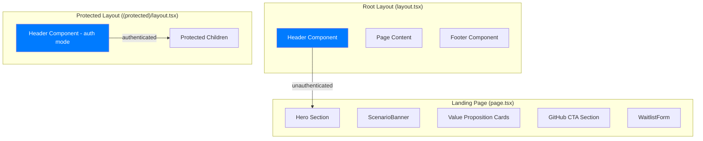

# Design Document — Landing Page Redesign

## Overview

This design covers the visual and structural redesign of the JuntoAI A2A landing page and app shell to align with the JuntoAI brand family (juntoai.org, echo.juntoai.org, kinetic.juntoai.org). The work involves:

1. Creating a shared `Header` component with logo, navigation links, and auth-aware right-side content
2. Restructuring the landing page layout to a brand-aligned single-column centered design with max-width 1200px
3. Adding a dedicated GitHub community CTA section
4. Redesigning value proposition cards with Lucide icons and brand styling
5. Integrating the header into both the root layout (public) and the protected layout (authenticated)
6. Aligning all CSS to use brand custom properties and Tailwind theme tokens exclusively

The current `page.tsx` is a single monolithic page component. The protected layout has a minimal inline header bar. Neither uses the logo or a persistent navigation header. This redesign extracts a shared `Header` component and restructures the page into clearly separated sections.

## Architecture



### Layout Strategy

The `Header` component is placed in the root `layout.tsx` so it appears on every page. It accepts auth state from `SessionContext` and renders differently:

- **Unauthenticated**: Logo + nav links + "Join Waitlist" CTA button
- **Authenticated**: Logo + nav links + email + token balance + logout button

The protected layout (`(protected)/layout.tsx`) currently renders its own inline header bar. This will be removed — the shared `Header` handles everything. The protected layout becomes a simple auth-guard wrapper.

### Page Section Order (Landing Page)

1. Header (via layout, fixed top)
2. Hero section (headline, subheadline, WaitlistForm)
3. ScenarioBanner (infinite scroll)
4. Value Proposition Cards (3 cards, responsive grid)
5. GitHub CTA Section (visually distinct)
6. Footer (via layout)

## Components and Interfaces

### Header Component (`components/Header.tsx`)

```typescript
// New shared header component
interface HeaderProps {}

// Reads auth state from SessionContext internally
// Renders:
// - Logo (a2a-logo-400x200.png) top-left, links to "/"
// - Nav links: JuntoAI homepage, GitHub repo
// - Right side: auth-dependent (CTA button or user info + logout)
// - Fixed position, z-50, full-width
// - Mobile: compact layout below 768px (links collapse or stack)
```

**Key decisions:**
- The Header is a client component (`"use client"`) because it reads `useSession()` for auth state
- Logo rendered as `next/image` with `height={36}` to stay within 40px constraint
- Mobile layout uses a simple horizontal compact arrangement (no hamburger menu needed — only 2-3 nav items)
- Fixed positioning with `sticky top-0` for scroll persistence

### Updated Landing Page (`app/page.tsx`)

The page restructures into clearly separated sections within a `max-w-[1200px]` centered container:

```typescript
// Section structure:
// 1. Hero: headline + subheadline + WaitlistForm
// 2. ScenarioBanner: full-width breakout
// 3. ValuePropositionCards: 3 cards with Lucide icons
// 4. GitHubCTA: dedicated section with GitHub icon + button + supporting text
```

**Key decisions:**
- ScenarioBanner breaks out of the max-width container (full viewport width) for visual impact
- Value proposition cards use Lucide React icons instead of emoji for brand consistency
- GitHub CTA is a visually distinct section with gradient accent border or background tint

### GitHubCTA Section (inline in `page.tsx`)

Not extracted as a separate component — it's a single-use section with static content. Keeping it inline reduces file count.

```typescript
// Renders:
// - Heading: "Built in Public. Join the Community."
// - GitHub icon (SVG or Lucide Github icon)
// - Primary button linking to GitHub repo (opens new tab)
// - Supporting text: clone, run locally, contribute scenarios
// - Visually distinct: uses brand gradient border or light blue/green tint background
```

### Value Proposition Cards (inline in `page.tsx`)

```typescript
// Each card:
// - Lucide icon (e.g., Handshake, Eye, SlidersHorizontal)
// - Title: max 5 words
// - Description: max 25 words
// - Brand colors for icon backgrounds (brand-blue/10, brand-green/10)
// - Consistent padding, rounded-xl, shadow-sm
// - Responsive: single column < 640px, 3-column row >= 640px
```

### Updated Protected Layout (`app/(protected)/layout.tsx`)

```typescript
// Simplified to auth-guard only:
// - Removes inline header bar (email, token display, logout)
// - Header component in root layout handles all header rendering
// - Only responsibility: redirect unauthenticated users
```

## Data Models

No new data models are introduced. This redesign is purely presentational. Existing models used:

- **SessionContext**: `email`, `isAuthenticated`, `isHydrated`, `tokenBalance`, `lastResetDate`, `login()`, `logout()`
- **WaitlistForm**: Uses existing `joinWaitlist()` and token management functions
- **ScenarioBanner**: Uses existing hardcoded `SCENARIOS` array

### CSS Custom Properties (globals.css)

Already defined and sufficient:
```css
:root {
  --primary-blue: #007BFF;
  --secondary-green: #00E676;
  --dark-charcoal: #1C1C1E;
  --light-gray: #F4F4F6;
  --off-white: #FAFAFA;
  --gradient: linear-gradient(135deg, #007BFF 0%, #00E676 100%);
}
```

### Tailwind Theme Tokens (tailwind.config.ts)

Already defined and sufficient:
```typescript
colors: {
  brand: {
    blue: '#007BFF',
    green: '#00E676',
    charcoal: '#1C1C1E',
    gray: '#F4F4F6',
    offwhite: '#FAFAFA',
  },
}
```

No new tokens needed. The `--gradient` CSS variable is already defined for accent elements.


## Correctness Properties

Property-based testing is **not applicable** to this feature. This is a UI rendering and layout redesign — all acceptance criteria are about:

- Component rendering (does element X exist in the DOM?)
- CSS class presence (are the right Tailwind classes applied?)
- Conditional rendering based on auth state
- Static content structure (3 cards, specific links, specific text)

None of the criteria involve pure functions with varying inputs, data transformations, serialization, or algorithmic logic. There are no universal properties that hold across a wide input space. Example-based unit tests and smoke tests are the appropriate testing strategy.

## Error Handling

This feature is presentational with minimal error surface:

1. **Logo image fails to load**: The `next/image` component handles this gracefully. Add `alt` text ("JuntoAI logo") so screen readers still convey meaning. No fallback image needed — the alt text is sufficient.

2. **SessionContext not available**: The Header reads auth state from `useSession()`. If the context is not yet hydrated (`isHydrated === false`), the Header should render the unauthenticated state (CTA button) as a safe default. No loading spinner needed — the header should never be empty.

3. **External links unreachable**: GitHub and juntoai.org links open in new tabs (`target="_blank"`). If the external site is down, that's outside our control. No error handling needed — standard browser behavior applies.

4. **Missing logo file**: If `a2a-logo-400x200.png` is deleted from `public/`, the `next/image` component will show a broken image. This is a deployment issue, not a runtime error. The build process should catch missing static assets.

## Testing Strategy

### Approach

All testing for this feature uses **example-based unit tests** with Vitest + React Testing Library. No property-based tests are needed (see Correctness Properties section above).

### Test Structure

Tests go in `frontend/__tests__/components/` following the existing project convention.

### Test Plan

**Header Component (`Header.test.tsx`)**:
- Renders logo image with correct src and alt text
- Logo links to "/" (home)
- Contains link to juntoai.org
- Contains link to GitHub repo
- Shows CTA button when unauthenticated
- Shows email, token balance, and logout button when authenticated
- Has sticky/fixed positioning classes
- Logo height does not exceed 40px

**Landing Page (`page.test.tsx`)**:
- Renders hero section with headline and WaitlistForm
- Renders ScenarioBanner
- Renders exactly 3 value proposition cards
- Each card has an icon, title, and description
- Card titles are max 5 words, descriptions max 25 words
- Renders GitHub CTA section with heading, button, icon, and supporting text
- GitHub CTA button links to correct repo URL with target="_blank"
- Main container has max-width 1200px class
- Uses brand color classes (no inline hex values in rendered output)
- Value proposition cards have responsive grid classes (sm:grid-cols-3)

**Protected Layout (`layout.test.tsx`)**:
- No longer renders its own header bar (email, tokens, logout removed)
- Still redirects unauthenticated users

### CSS Architecture Smoke Tests

These can be verified via grep/lint rather than runtime tests:
- No inline hex color values in `page.tsx` or `Header.tsx` JSX
- `globals.css` defines `--gradient` variable
- All brand colors referenced via `brand-*` Tailwind classes or `var(--*)` custom properties

### Tools

- **Framework**: Vitest + React Testing Library (per project convention)
- **Coverage**: @vitest/coverage-v8, 70% threshold
- **Environment**: jsdom
- **Mocking**: Mock `useSession()` from SessionContext for auth state, mock `next/navigation` for router
