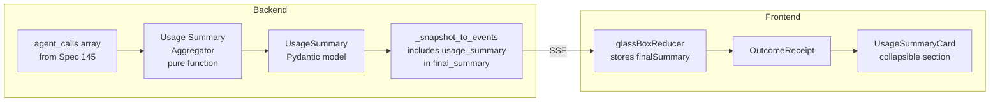

# Design Document: LLM Usage Summary

## Overview

This feature adds a "Behind the Curtain" stats card to the outcome receipt (Screen 4) that surfaces per-persona token breakdowns, per-model usage, average latency, and efficiency metrics after a negotiation completes.

The implementation is a pure consumer of the `agent_calls` telemetry array produced by Spec 145. It adds:
1. A pure aggregation function on the backend (`usage_summary.py`)
2. Pydantic V2 schema models for the data contract
3. Integration into `_snapshot_to_events` to include `usage_summary` in `NegotiationCompleteEvent.final_summary`
4. A collapsible React component on the frontend outcome receipt

No new data collection is introduced — only aggregation and display.

## Architecture



The aggregator is a stateless pure function that takes `list[dict]` → `UsageSummary`. It runs in-process on the already-accumulated `agent_calls` data — no DB queries, no LLM calls, no side effects.

## Components and Interfaces

### Backend

#### `backend/app/orchestrator/usage_summary.py`

New module containing:

```python
def compute_usage_summary(agent_calls: list[dict]) -> dict:
    """Pure function: aggregate AgentCallRecord dicts into a UsageSummary dict."""
```

- Groups records by `agent_role` → `PersonaUsageStats`
- Groups records by `model_id` → `ModelUsageStats`
- Computes session-wide totals
- Handles empty input (returns zero-valued summary)
- Handles division-by-zero for `tokens_per_message` when all calls are errors
- Returns `UsageSummary.model_dump()` dict for JSON serialization

#### `backend/app/models/usage_summary.py`

New module containing Pydantic V2 models:

```python
class PersonaUsageStats(BaseModel):
    agent_role: str
    agent_type: str
    model_id: str
    total_input_tokens: int = Field(ge=0)
    total_output_tokens: int = Field(ge=0)
    total_tokens: int = Field(ge=0)
    call_count: int = Field(ge=0)
    error_count: int = Field(ge=0)
    avg_latency_ms: int = Field(ge=0)
    tokens_per_message: int = Field(ge=0)

class ModelUsageStats(BaseModel):
    model_id: str
    total_input_tokens: int = Field(ge=0)
    total_output_tokens: int = Field(ge=0)
    total_tokens: int = Field(ge=0)
    call_count: int = Field(ge=0)
    error_count: int = Field(ge=0)
    avg_latency_ms: int = Field(ge=0)
    tokens_per_message: int = Field(ge=0)

class UsageSummary(BaseModel):
    per_persona: list[PersonaUsageStats] = Field(default_factory=list)
    per_model: list[ModelUsageStats] = Field(default_factory=list)
    total_input_tokens: int = Field(ge=0, default=0)
    total_output_tokens: int = Field(ge=0, default=0)
    total_tokens: int = Field(ge=0, default=0)
    total_calls: int = Field(ge=0, default=0)
    total_errors: int = Field(ge=0, default=0)
    avg_latency_ms: int = Field(ge=0, default=0)
    negotiation_duration_ms: int = Field(ge=0, default=0)
```

#### Integration point: `backend/app/routers/negotiation.py`

In `_snapshot_to_events`, at each location where `final_summary` dict is built before emitting `NegotiationCompleteEvent`:

```python
from app.orchestrator.usage_summary import compute_usage_summary

# Inside final_summary construction:
agent_calls = state.get("agent_calls", [])
summary["usage_summary"] = compute_usage_summary(agent_calls)
```

The existing `ai_tokens_used` field continues to be populated from `total_tokens_used` — `usage_summary` is additive.

### Frontend

#### `frontend/components/glassbox/UsageSummaryCard.tsx`

New component rendered inside `OutcomeReceipt` when `finalSummary.usage_summary` exists and has `total_calls > 0`.

Props:
```typescript
interface UsageSummaryCardProps {
  usageSummary: {
    per_persona: PersonaUsageStats[];
    per_model: ModelUsageStats[];
    total_input_tokens: number;
    total_output_tokens: number;
    total_tokens: number;
    total_calls: number;
    total_errors: number;
    avg_latency_ms: number;
    negotiation_duration_ms: number;
  };
}
```

Behavior:
- Collapsed by default, toggle button with `data-testid="usage-summary-toggle"`
- Section wrapper with `data-testid="usage-summary-section"`
- Per-persona table sorted by `total_tokens` descending
- Input:output ratio displayed as `"X.Y:1"` per persona
- Most verbose badge (`data-testid="most-verbose-badge"`) on persona with highest `tokens_per_message` (only when 2+ personas)
- Per-model table
- Session-wide totals row (errors shown only if > 0, duration formatted as seconds with 1 decimal)
- Responsive: stacked on mobile, side-by-side tables at ≥1024px

#### Integration: `OutcomeReceipt.tsx`

Add conditional render of `UsageSummaryCard` between participant summaries and performance metrics sections:

```tsx
{finalSummary.usage_summary && 
 (finalSummary.usage_summary as any).total_calls > 0 && (
  <UsageSummaryCard usageSummary={finalSummary.usage_summary as any} />
)}
```

## Data Models

### AgentCallRecord (input — from Spec 145)

```python
{
    "agent_role": str,      # e.g. "Buyer", "Seller"
    "agent_type": str,      # "negotiator", "regulator", "observer"
    "model_id": str,        # e.g. "gemini-2.5-flash"
    "latency_ms": int,      # wall-clock ms for the LLM call
    "input_tokens": int,    # prompt tokens
    "output_tokens": int,   # completion tokens
    "error": bool,          # True if the call errored
    "turn_number": int,
    "timestamp": str,       # ISO 8601 timestamp
}
```

### UsageSummary (output)

See Pydantic models above. Key computation rules:
- `total_tokens = total_input_tokens + total_output_tokens`
- `avg_latency_ms = round(sum(latency_ms) / call_count)` (0 if no calls)
- `tokens_per_message = round(total_tokens / non_error_call_count)` (0 if no non-error calls)
- `negotiation_duration_ms = max(timestamp) - min(timestamp)` in milliseconds (0 if ≤1 record)

### Frontend TypeScript types

```typescript
interface PersonaUsageStats {
  agent_role: string;
  agent_type: string;
  model_id: string;
  total_input_tokens: number;
  total_output_tokens: number;
  total_tokens: number;
  call_count: number;
  error_count: number;
  avg_latency_ms: number;
  tokens_per_message: number;
}

interface ModelUsageStats {
  model_id: string;
  total_input_tokens: number;
  total_output_tokens: number;
  total_tokens: number;
  call_count: number;
  error_count: number;
  avg_latency_ms: number;
  tokens_per_message: number;
}

interface UsageSummary {
  per_persona: PersonaUsageStats[];
  per_model: ModelUsageStats[];
  total_input_tokens: number;
  total_output_tokens: number;
  total_tokens: number;
  total_calls: number;
  total_errors: number;
  avg_latency_ms: number;
  negotiation_duration_ms: number;
}
```

## Correctness Properties

*A property is a characteristic or behavior that should hold true across all valid executions of a system — essentially, a formal statement about what the system should do. Properties serve as the bridge between human-readable specifications and machine-verifiable correctness guarantees.*

### Property 1: Aggregation correctness — per-persona and per-model sums match input

*For any* list of AgentCallRecord dicts, the UsageSummary returned by `compute_usage_summary` SHALL satisfy:
- For each `agent_role` group: `total_input_tokens` equals the sum of `input_tokens` across records with that role, `total_output_tokens` equals the sum of `output_tokens`, `call_count` equals the number of records, `error_count` equals the number of records where `error` is True, and `tokens_per_message` equals `round(total_tokens / non_error_count)` (or 0 if all calls errored).
- For each `model_id` group: the same summation invariants hold.
- Session-wide totals equal the sum across all records.
- `negotiation_duration_ms` equals the difference between the latest and earliest `timestamp` values (0 if ≤1 record).

**Validates: Requirements 1.2, 1.3, 1.4, 1.5, 1.6**

### Property 2: UsageSummary JSON round-trip

*For any* valid `UsageSummary` instance (including nested `PersonaUsageStats` and `ModelUsageStats`), serializing via `model_dump_json()` and deserializing via `UsageSummary.model_validate_json()` SHALL produce an object equal to the original.

**Validates: Requirements 2.1, 2.2, 2.3, 2.4**

### Property 3: Usage section renders all data when total_calls > 0

*For any* valid `UsageSummary` with `total_calls > 0`, the rendered `UsageSummaryCard` component SHALL contain: every persona's `agent_role` from `per_persona`, every model's `model_id` from `per_model`, and the session-wide `total_tokens` value.

**Validates: Requirements 4.1, 4.2, 4.3, 4.4**

### Property 4: Personas sorted by total_tokens descending

*For any* `per_persona` list with 2+ entries, the rendered per-persona table SHALL display personas in descending order of `total_tokens`.

**Validates: Requirements 5.1**

### Property 5: Input-to-output ratio correctness

*For any* `PersonaUsageStats` with `total_output_tokens > 0`, the displayed ratio string SHALL equal `"{(total_input_tokens / total_output_tokens).toFixed(1)}:1"`.

**Validates: Requirements 5.2**

### Property 6: Most verbose badge on correct persona

*For any* `per_persona` list with 2+ entries, exactly one persona SHALL have the `most-verbose-badge`, and it SHALL be the persona with the highest `tokens_per_message` value.

**Validates: Requirements 5.3**

## Error Handling

| Scenario | Handling |
|---|---|
| `agent_calls` is `None` or missing from state | Treat as empty list → zero-valued UsageSummary |
| `agent_calls` is empty list | Return zero-valued UsageSummary (all zeros, empty per_persona/per_model) |
| All calls for a persona are errors (`error: True`) | `tokens_per_message = 0` (avoid division by zero) |
| Malformed timestamp strings | Skip duration calculation, set `negotiation_duration_ms = 0` |
| `usage_summary` absent from `final_summary` (pre-Spec-145 sessions) | Frontend does not render UsageSummaryCard |
| `usage_summary.total_calls == 0` | Frontend does not render UsageSummaryCard |
| Single AgentCallRecord in array | `negotiation_duration_ms = 0` (no range to compute) |

## Testing Strategy

### Backend — Property-Based Tests (Hypothesis)

Library: `hypothesis` (already in use — see `backend/tests/property/`)

| Test | Property | Min Iterations |
|---|---|---|
| `test_aggregation_correctness` | Property 1 | 100 |
| `test_usage_summary_round_trip` | Property 2 | 100 |

Strategy generators:
- `agent_call_record_strategy()`: generates random `AgentCallRecord` dicts with valid field ranges
- `usage_summary_strategy()`: generates random `UsageSummary` instances with nested models

Each test tagged with: `Feature: 190_llm-usage-summary, Property {N}: {title}`

### Backend — Unit Tests (pytest)

- Empty `agent_calls` → zero-valued summary
- All-error persona → `tokens_per_message = 0`
- Single record → `negotiation_duration_ms = 0`
- Integration: `_snapshot_to_events` includes `usage_summary` in `final_summary`
- Backward compat: `ai_tokens_used` still populated alongside `usage_summary`

### Frontend — Property-Based Tests (fast-check)

Library: `fast-check` (already in use — see `frontend/__tests__/properties/`)

| Test | Property | Min Iterations |
|---|---|---|
| `test_usage_section_renders_all_data` | Property 3 | 100 |
| `test_personas_sorted_descending` | Property 4 | 100 |
| `test_ratio_correctness` | Property 5 | 100 |
| `test_most_verbose_badge` | Property 6 | 100 |

### Frontend — Unit Tests (Vitest + RTL)

- Section not rendered when `usage_summary` absent
- Section not rendered when `total_calls == 0`
- Collapsed by default, expandable via toggle
- Errors count hidden when 0
- Duration formatted as seconds with 1 decimal
- Responsive layout classes present
