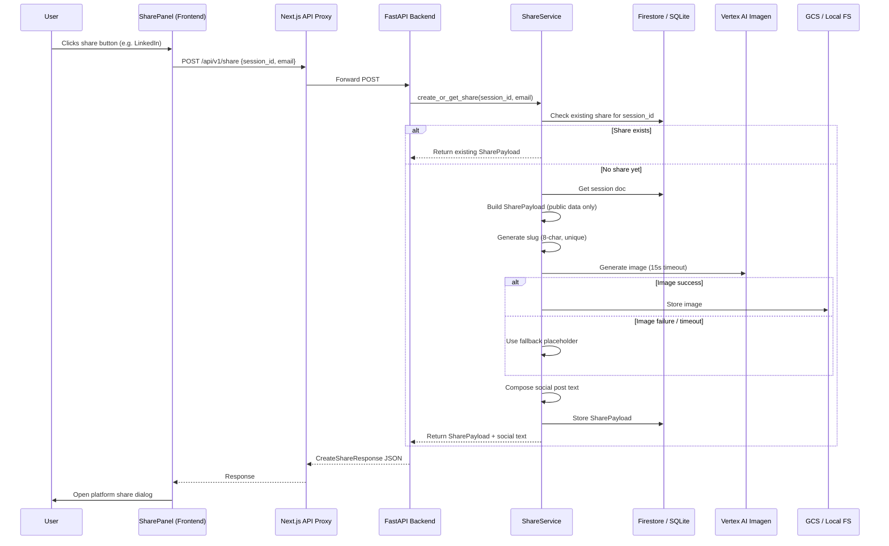
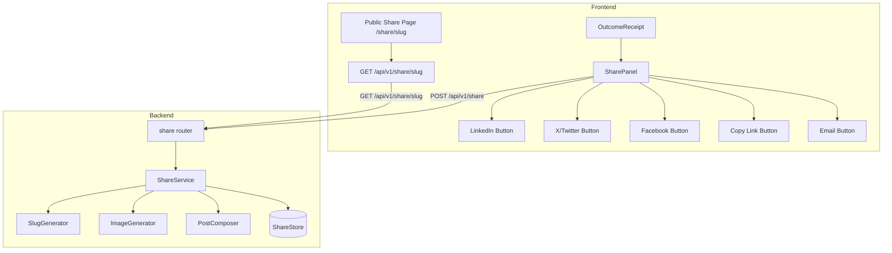

# Design Document: Social Sharing

## Overview

This feature adds social sharing capabilities to the JuntoAI A2A Outcome Receipt (Screen 4). When a negotiation reaches a terminal state (Agreed, Blocked, or Failed), users can share their results via LinkedIn, X/Twitter, Facebook, direct URL copy, or email.

The system follows a lazy-creation pattern: no share data is persisted until the user explicitly clicks a share button. At that point, the backend creates a `SharePayload` document keyed by a short, URL-safe slug, optionally generates an AI image via Vertex AI Imagen, composes platform-specific social post text, and returns everything the frontend needs to open share dialogs.

A public, unauthenticated Next.js page at `/share/{slug}` renders the negotiation summary with Open Graph and Twitter Card meta tags so that link previews display correctly on social platforms.

### Key Design Decisions

1. **Lazy share creation** — The share payload is not created when the negotiation completes. It's created on-demand when the user clicks any share button. This avoids unnecessary writes for users who never share.
2. **Slug-based public access** — An 8-character alphanumeric slug (not the session_id UUID) is used in public URLs to keep them short and avoid exposing internal identifiers.
3. **Idempotent creation** — If a share already exists for a session, the existing slug is returned. No duplicates.
4. **Sensitive data firewall** — The SharePayload and image prompt are built exclusively from public-facing summary data. Raw history, hidden context, custom prompts, and model overrides are never included.
5. **Image generation with fallback** — Vertex AI Imagen is attempted with a 15-second timeout. On failure or timeout, a static branded placeholder image is used. Sharing is never blocked by image generation.

## Architecture





## Components and Interfaces

### Backend Components

#### 1. Share Models (`backend/app/models/share.py`)

Pydantic V2 models defining the share data contract:

- `ParticipantSummary` — role, name, agent_type, summary
- `SharePayload` — the full persisted share document
- `CreateShareRequest` — POST body: session_id + email
- `CreateShareResponse` — POST response: slug, URL, social text, image URL
- `SocialPostText` — platform-specific text variants (twitter ≤ 280, linkedin/facebook ≤ 3000)

#### 2. Share Service (`backend/app/services/share_service.py`)

Core business logic:

- `create_or_get_share(session_id, email) -> CreateShareResponse` — Idempotent share creation. Checks for existing share, builds payload from session data, generates slug, triggers image generation, composes social text.
- `get_share(share_slug) -> SharePayload` — Retrieves a share by slug.
- `_generate_slug(existing_slugs) -> str` — Generates a unique 8-char alphanumeric slug.
- `_build_share_payload(session_doc, scenario, slug) -> SharePayload` — Extracts only public-facing data from the session.
- `_build_image_prompt(payload) -> str` — Builds an image generation prompt from public summary data only.
- `_compose_social_text(payload, share_url) -> SocialPostText` — Composes platform-specific post text with branding and hashtags.

#### 3. Share Store Protocol (`backend/app/db/base.py` — extended)

New `ShareStore` protocol alongside the existing `SessionStore`:

```python
@runtime_checkable
class ShareStore(Protocol):
    async def create_share(self, payload: SharePayload) -> None: ...
    async def get_share(self, share_slug: str) -> SharePayload | None: ...
    async def get_share_by_session(self, session_id: str) -> SharePayload | None: ...
```

Implemented by:
- `FirestoreShareClient` — uses `shared_negotiations` collection
- `SQLiteShareClient` — uses `shared_negotiations` table

#### 4. Image Generator (`backend/app/services/image_generator.py`)

- `generate_share_image(prompt, share_slug) -> str` — Calls Vertex AI Imagen, stores result, returns public URL. Falls back to placeholder on failure/timeout (15s).
- Cloud mode: stores in GCS bucket, returns `https://storage.googleapis.com/{bucket}/{slug}.png`
- Local mode: stores in `data/share_images/`, returns `/api/v1/share/images/{slug}.png`

#### 5. Share Router (`backend/app/routers/share.py`)

Two endpoints:
- `POST /api/v1/share` — Creates or retrieves a share. Validates session ownership via email.
- `GET /api/v1/share/{share_slug}` — Returns SharePayload JSON. No auth required.

### Frontend Components

#### 6. SharePanel (`frontend/components/glassbox/SharePanel.tsx`)

UI component rendered inside OutcomeReceipt below the existing action buttons:

- 5 share buttons: LinkedIn, X, Facebook, Copy Link, Email
- Lazy creation: first click triggers `POST /api/v1/share`
- Loading state: spinner on clicked button, all buttons disabled during API call
- After creation: opens platform-specific share dialog or copies URL
- Responsive: horizontal row on desktop (≥1024px), 2-column grid on mobile

#### 7. Public Share Page (`frontend/app/share/[slug]/page.tsx`)

Server-rendered Next.js page (App Router):

- Fetches SharePayload via `GET /api/v1/share/{slug}` at request time
- Renders negotiation summary with status-appropriate styling
- Generates Open Graph + Twitter Card meta tags via `generateMetadata()`
- Shows branded header with JuntoAI logo and "Try JuntoAI A2A" CTA
- 404 state: "Negotiation not found" with CTA to landing page
- No auth required — this is a public route outside the `(protected)` layout

#### 8. Share API Client (`frontend/lib/share.ts`)

Frontend API functions:
- `createShare(sessionId, email) -> CreateShareResponse`
- `getShare(slug) -> SharePayload`

## Data Models

### SharePayload (Firestore document / SQLite row)

```python
class ParticipantSummary(BaseModel):
    role: str
    name: str
    agent_type: str
    summary: str

class SharePayload(BaseModel):
    share_slug: str = Field(min_length=8, max_length=8)
    session_id: str
    scenario_name: str
    scenario_description: str
    deal_status: Literal["Agreed", "Blocked", "Failed"]
    outcome_text: str
    final_offer: float = Field(ge=0)
    turns_completed: int = Field(ge=0)
    warning_count: int = Field(ge=0)
    participant_summaries: list[ParticipantSummary]
    elapsed_time_ms: int = Field(ge=0)
    share_image_url: str
    created_at: datetime
```

### SocialPostText

```python
class SocialPostText(BaseModel):
    twitter: str = Field(max_length=280)
    linkedin: str = Field(max_length=3000)
    facebook: str = Field(max_length=3000)
```

### CreateShareRequest / CreateShareResponse

```python
class CreateShareRequest(BaseModel):
    session_id: str = Field(min_length=1)
    email: str = Field(min_length=1)

class CreateShareResponse(BaseModel):
    share_slug: str
    share_url: str
    social_post_text: SocialPostText
    share_image_url: str
```

### Storage Layout

**Firestore (cloud mode):**
- Collection: `shared_negotiations`
- Document ID: `{share_slug}`
- Fields: all SharePayload fields
- Secondary index on `session_id` for idempotency lookup

**SQLite (local mode):**
```sql
CREATE TABLE shared_negotiations (
    share_slug TEXT PRIMARY KEY,
    session_id TEXT NOT NULL UNIQUE,
    data JSON NOT NULL,
    created_at TIMESTAMP DEFAULT CURRENT_TIMESTAMP
);
CREATE INDEX idx_shared_session ON shared_negotiations(session_id);
```

## Correctness Properties

*A property is a characteristic or behavior that should hold true across all valid executions of a system — essentially, a formal statement about what the system should do. Properties serve as the bridge between human-readable specifications and machine-verifiable correctness guarantees.*

### Property 1: Slug format and uniqueness

*For any* set of existing share slugs and any call to the slug generator, the returned slug SHALL be exactly 8 characters long, contain only alphanumeric characters `[a-zA-Z0-9]`, and not be present in the existing set.

**Validates: Requirements 1.2**

### Property 2: Idempotent share creation

*For any* valid session_id, calling `create_or_get_share` twice with the same session_id SHALL return the same `share_slug` both times, and the total number of SharePayload documents for that session_id SHALL remain exactly 1.

**Validates: Requirements 1.4**

### Property 3: Sensitive data exclusion

*For any* valid NegotiationState containing non-empty `history`, `hidden_context`, `custom_prompts`, and `model_overrides` fields, the resulting SharePayload (from `_build_share_payload`) and image prompt (from `_build_image_prompt`) SHALL NOT contain any substring from the raw history messages, hidden context values, custom prompt values, or model override values.

**Validates: Requirements 1.5, 3.4**

### Property 4: Social post text contains required elements

*For any* valid SharePayload and share URL, the composed SocialPostText (all three platform variants) SHALL contain: the share URL, the branding line "JuntoAI A2A", and at least one hashtag from {#JuntoAI, #A2A, #AIAgents, #Negotiation}.

**Validates: Requirements 4.1**

### Property 5: Social post text length constraints

*For any* valid SharePayload, the composed SocialPostText SHALL have: `twitter` field length ≤ 280 characters, `linkedin` field length ≤ 3000 characters, and `facebook` field length ≤ 3000 characters.

**Validates: Requirements 4.2, 4.3, 8.7**

### Property 6: Mailto link composition

*For any* valid SharePayload with non-empty scenario_name and deal_status, the generated mailto link SHALL contain the scenario_name in the subject, the deal_status in the subject, the share URL in the body, and the branding line "JuntoAI A2A" in the body.

**Validates: Requirements 5.2**

### Property 7: SharePayload round-trip serialization

*For any* valid SharePayload instance, serializing via `.model_dump_json()` and deserializing via `SharePayload.model_validate_json()` SHALL produce an object equal to the original.

**Validates: Requirements 7.7, 8.6**

### Property 8: Meta tag generation

*For any* valid SharePayload, the generated meta tags SHALL include `og:title` containing the scenario name, `og:description` with length ≤ 200 characters, `og:image` matching the share_image_url, `og:url` containing the share_slug, and corresponding `twitter:card`, `twitter:title`, `twitter:description`, `twitter:image` values.

**Validates: Requirements 2.4, 2.5**

## Error Handling

| Scenario | Behavior |
|---|---|
| `POST /api/v1/share` with non-existent session_id | HTTP 404, `{"detail": "Session {session_id} not found"}` |
| `POST /api/v1/share` with email not matching session owner | HTTP 403, `{"detail": "Email does not match session owner"}` |
| `GET /api/v1/share/{slug}` with non-existent slug | HTTP 404, `{"detail": "Share {slug} not found"}` |
| Database write failure during share creation | HTTP 500, `{"detail": "Failed to create share"}` |
| Vertex AI Imagen API failure | Fallback to static placeholder image; share creation succeeds |
| Vertex AI Imagen timeout (>15s) | Fallback to static placeholder image; share creation succeeds |
| Clipboard API unavailable (non-HTTPS) | Display share URL in a selectable text input as fallback |
| `POST /api/v1/share` with missing/empty fields | HTTP 422 (Pydantic validation error) |

Error responses follow the existing FastAPI pattern: `SessionNotFoundError` → 404, `DatabaseConnectionError` → 503. A new `ShareNotFoundError` exception is added for slug lookups.

## Testing Strategy

### Property-Based Tests (Backend — pytest + hypothesis)

Each property test runs a minimum of 100 iterations. The project already uses Hypothesis extensively (see `backend/tests/property/`).

| Property | Test File | What It Generates |
|---|---|---|
| P1: Slug format & uniqueness | `test_share_properties.py` | Random sets of existing slugs |
| P2: Idempotent creation | `test_share_properties.py` | Random session IDs (mocked DB) |
| P3: Sensitive data exclusion | `test_share_properties.py` | Random NegotiationState with sensitive fields |
| P4: Social post required elements | `test_share_properties.py` | Random SharePayload instances |
| P5: Social post length constraints | `test_share_properties.py` | Random SharePayload with long scenario names/outcomes |
| P6: Mailto composition | `test_share_properties.py` | Random SharePayload instances |
| P7: SharePayload round-trip | `test_share_properties.py` | Random valid SharePayload via composite strategy |
| P8: Meta tag generation | `test_share_properties.py` | Random SharePayload instances |

Tag format: `Feature: 192_social-sharing, Property {N}: {title}`

### Unit Tests (Backend — pytest)

- Pydantic model validation: valid/invalid inputs for each model
- Share service: mock DB + mock Imagen, test create/get flows
- Image generator: mock Vertex AI, test success/failure/timeout paths
- Post composer: specific examples for each platform
- Slug generator: edge cases (collision retry)

### Integration Tests (Backend — pytest + TestClient)

- `POST /api/v1/share` — happy path for each deal status
- `POST /api/v1/share` — 404 for missing session, 403 for wrong email
- `GET /api/v1/share/{slug}` — happy path and 404
- Idempotency: POST twice, verify same slug returned

### Frontend Tests (vitest + React Testing Library)

- SharePanel: renders 5 buttons, lazy creation on click, loading state, button disabling
- SharePanel: LinkedIn/X/Facebook open correct URLs via `window.open`
- SharePanel: Copy Link calls clipboard API, shows toast, fallback on failure
- SharePanel: Email opens mailto with correct subject/body
- Public Share Page: renders correct data for each deal status
- Public Share Page: 404 state with CTA
- Responsive: share buttons layout at mobile/desktop breakpoints

### Coverage Target

70% minimum (lines, functions, branches, statements) per workspace rules.
