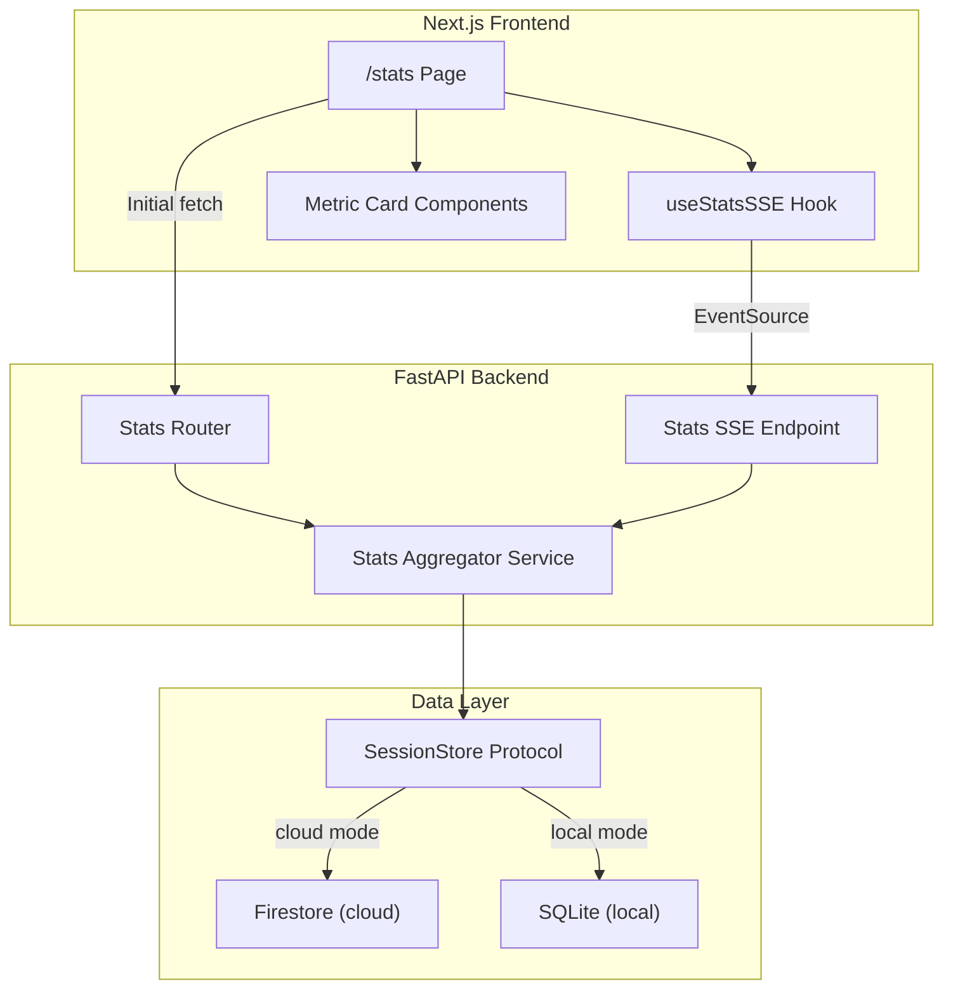

# Design Document: Public Stats Dashboard

## Overview

The Public Stats Dashboard adds a `/stats` page and supporting backend API that surfaces real-time platform usage metrics without authentication. The system follows the existing release notes page pattern for layout, uses the existing `SessionStore` abstraction for dual-mode DB access, and streams live updates via a dedicated SSE endpoint.

The feature spans three layers:
1. A FastAPI stats router (`/api/v1/stats`) that aggregates session data from Firestore or SQLite
2. An SSE endpoint (`/api/v1/stats/stream`) that pushes metric snapshots every 30 seconds
3. A Next.js page at `/stats` that renders metric cards and subscribes to the SSE stream

## Architecture



## Components and Interfaces

### Backend

#### `backend/app/routers/stats.py` — Stats Router
- `GET /api/v1/stats` — Returns all aggregated metrics as JSON (no auth)
- `GET /api/v1/stats/stream` — SSE endpoint emitting `stats_update` events every 30s

#### `backend/app/services/stats_aggregator.py` — Stats Aggregator Service
Pure aggregation logic. Queries the session store and computes all metrics:
- Unique user counts (today / 7d)
- Simulation counts, active count, outcome breakdown (today / 7d)
- Total tokens consumed (today / 7d)
- Per-model token breakdown (today / 7d)
- Per-model average response time (today / 7d)
- Scenario popularity ranked list (today / 7d)
- Average turns to resolution (today / 7d)
- Custom scenario counts (today / 7d / all-time)
- Custom agent session counts (today / 7d / all-time)

This service takes a `SessionStore`-compatible client and queries session documents directly. For Firestore, it uses collection queries with timestamp filters. For SQLite, it uses SQL aggregation queries.

#### `backend/app/models/stats.py` — Stats Pydantic Models
Response models for the stats API.

### Frontend

#### `frontend/app/stats/page.tsx` — Stats Page
Server component with metadata. Follows the release notes page pattern: title, subtitle, "Back to Home" link, card grid.

#### `frontend/components/stats/StatsDashboard.tsx` — Client Component
Client component that:
1. Fetches initial data from `GET /api/v1/stats`
2. Establishes SSE connection to `/api/v1/stats/stream`
3. Renders metric cards with live updates
4. Shows stale-data indicator on SSE disconnect
5. Reconnects with exponential backoff (max 60s)

#### `frontend/components/stats/StatCard.tsx` — Reusable Metric Card
Displays a single metric with label, today value, 7-day value, and optional breakdown.

### Footer Update

#### `frontend/components/Footer.tsx`
Add "Platform Stats" link adjacent to "Release Notes" link, same styling.

## Data Models

### Backend — Stats Response

```python
class ModelTokenBreakdown(BaseModel):
    model_id: str
    tokens_today: int
    tokens_7d: int

class ModelPerformance(BaseModel):
    model_id: str
    avg_response_time_today: float | None  # seconds
    avg_response_time_7d: float | None

class ScenarioPopularity(BaseModel):
    scenario_id: str
    scenario_name: str
    count_today: int
    count_7d: int

class OutcomeBreakdown(BaseModel):
    agreed: int
    blocked: int
    failed: int

class StatsResponse(BaseModel):
    # User activity
    unique_users_today: int
    unique_users_7d: int

    # Simulations
    simulations_today: int
    simulations_7d: int
    active_simulations: int
    outcomes_today: OutcomeBreakdown
    outcomes_7d: OutcomeBreakdown

    # Tokens
    total_tokens_today: int
    total_tokens_7d: int

    # Per-model
    model_tokens: list[ModelTokenBreakdown]
    model_performance: list[ModelPerformance]

    # Scenarios
    scenario_popularity: list[ScenarioPopularity]

    # Turns
    avg_turns_today: float | None
    avg_turns_7d: float | None

    # Custom scenarios (Req 15)
    custom_scenarios_today: int
    custom_scenarios_7d: int
    custom_scenarios_all_time: int

    # Custom agent sessions (Req 16)
    custom_agent_sessions_today: int
    custom_agent_sessions_7d: int
    custom_agent_sessions_all_time: int

    # Metadata
    generated_at: str  # ISO 8601 UTC timestamp
```

### Frontend — SSE Event Type

```typescript
interface StatsUpdateEvent {
  event_type: "stats_update";
  data: StatsResponse;
}
```

### Session Store Query Requirements

The aggregator needs to query sessions by time window. The existing `SessionStore` protocol only supports single-session CRUD. Two approaches:

**Chosen approach**: Add a `list_sessions` method to the `SessionStore` protocol that returns all session documents (or filtered by timestamp). For Firestore this uses collection-level queries; for SQLite this uses `SELECT` with `WHERE created_at >= ?`. This keeps the aggregation logic in the service layer and the DB access behind the protocol.

For custom scenario counts (Req 15), the Firestore aggregator queries `profiles/{email}/custom_scenarios` sub-collections using a collection group query. For SQLite local mode, custom scenarios are not available (SQLite doesn't store custom scenarios), so counts return 0.


## Correctness Properties

*A property is a characteristic or behavior that should hold true across all valid executions of a system — essentially, a formal statement about what the system should do. Properties serve as the bridge between human-readable specifications and machine-verifiable correctness guarantees.*

### Property 1: Unique user count equals distinct emails in time window

*For any* set of session documents with varying `email` and `created_at` values, the computed `unique_users_today` SHALL equal the count of distinct `email` values among sessions whose `created_at` falls within today (UTC), and `unique_users_7d` SHALL equal the count of distinct emails within the last 7 days.

**Validates: Requirements 3.1, 3.2, 3.3**

### Property 2: Simulation counts and outcome breakdown match manual computation

*For any* set of session documents with varying `deal_status` and `created_at` values, the computed `simulations_today` SHALL equal the count of sessions created today, `simulations_7d` SHALL equal the count within 7 days, `active_simulations` SHALL equal sessions with `deal_status="Negotiating"`, and `outcomes_today`/`outcomes_7d` SHALL match the count of sessions grouped by terminal `deal_status` within each window.

**Validates: Requirements 4.1, 4.2, 4.3, 4.4, 4.5**

### Property 3: Total token sum equals aggregate of session tokens in time window

*For any* set of session documents with varying `total_tokens_used` and `created_at` values, the computed `total_tokens_today` SHALL equal the sum of `total_tokens_used` for sessions created today, and `total_tokens_7d` SHALL equal the sum for sessions within the last 7 days.

**Validates: Requirements 5.1, 5.2, 5.3**

### Property 4: Per-model token breakdown matches grouped aggregation

*For any* set of session documents with varying agent `model_id` assignments and `total_tokens_used` values, the computed per-model token breakdown SHALL equal the sum of tokens grouped by each `model_id` within each time window.

**Validates: Requirements 6.1, 6.2, 6.3**

### Property 5: Per-model average response time matches manual mean computation

*For any* set of completed session documents with timing data per agent turn, the computed average response time per `model_id` SHALL equal the arithmetic mean of response times for that model within each time window. When no data exists for a model in a window, the value SHALL be `None`.

**Validates: Requirements 7.1, 7.2, 7.3**

### Property 6: Scenario popularity is ranked descending by simulation count

*For any* set of session documents with varying `scenario_id` values, the computed scenario popularity list SHALL be sorted in descending order by simulation count, and each entry's count SHALL equal the number of sessions with that `scenario_id` within the time window.

**Validates: Requirements 8.1, 8.3**

### Property 7: Average turns equals mean of turn_count for terminal sessions

*For any* set of session documents where some have terminal `deal_status` (Agreed, Blocked, Failed), the computed `avg_turns_today` SHALL equal the arithmetic mean of `turn_count` for terminal sessions created today, and `avg_turns_7d` for the 7-day window. When no terminal sessions exist in a window, the value SHALL be `None`.

**Validates: Requirements 9.1, 9.2, 9.3**

### Property 8: SSE reconnect backoff is exponential and capped at 60 seconds

*For any* retry count `n` where `n >= 0`, the computed reconnect delay SHALL equal `min(baseDelay * 2^n, 60000)` milliseconds, where `baseDelay` is the configured base delay.

**Validates: Requirements 10.4**

### Property 9: Number formatting applies comma separators and decimal rules

*For any* non-negative integer, the formatted string SHALL contain comma separators at every three digits from the right. *For any* non-negative float representing an average, the formatted string SHALL display exactly one decimal place.

**Validates: Requirements 12.4**

### Property 10: Session data round-trip preserves stats-relevant fields

*For any* valid `NegotiationStateModel` instance, persisting it to the session store and reading it back SHALL preserve the `total_tokens_used`, `deal_status`, `scenario_id`, `turn_count`, and agent `model_id` values exactly.

**Validates: Requirements 14.3**

### Property 11: Custom agent session classification matches endpoint_overrides presence

*For any* session document, the session SHALL be classified as a Custom_Agent_Session if and only if the document contains a non-empty `endpoint_overrides` field. The computed counts per time window SHALL equal the count of such sessions within each window.

**Validates: Requirements 16.1, 16.2, 16.3, 16.4**

## Error Handling

| Error Condition | Handling Strategy |
|---|---|
| Session store unavailable (Firestore down / SQLite locked) | Stats API returns HTTP 503 with `{"detail": "Database unavailable"}`. Reuses existing `DatabaseConnectionError` exception handler. |
| SSE connection drops (client-side) | Client reconnects with exponential backoff: `min(base * 2^n, 60000ms)`. Stale-data indicator shown while disconnected. |
| SSE connection drops (server-side) | `StreamingResponse` generator catches exceptions, logs error, closes stream gracefully. Client reconnects. |
| No sessions exist (empty database) | All counts return 0, all averages return `None`, empty lists for breakdowns. No error — valid empty state. |
| Custom scenarios unavailable in local mode | Custom scenario counts return 0 in SQLite mode. No error. |
| Malformed session data (missing fields) | Aggregator uses `.get()` with defaults (0 for counts, skip for missing timing data). Logs warning, doesn't crash. |
| SSE client limit | Stats SSE is read-only broadcast — no per-user limit needed. If server load is a concern, add a max connections cap later. |

## Testing Strategy

### Unit Tests (pytest + Vitest)

**Backend:**
- Stats aggregator logic with mock session data (various combinations of sessions, timestamps, statuses)
- StatsResponse Pydantic model validation
- Stats router endpoint returns correct status codes (200, 503)
- Number formatting utilities

**Frontend:**
- StatCard component renders values correctly
- StatsDashboard displays stale indicator on disconnect
- Footer contains "Platform Stats" link
- Stats page metadata

### Property-Based Tests

**Library**: Hypothesis (Python backend), fast-check (TypeScript frontend)
**Minimum iterations**: 100 per property

Each property test references its design property via tag comment:
`# Feature: 195_public-stats-dashboard, Property {N}: {title}`

**Backend properties (Hypothesis):**
- Property 1: Unique user counting
- Property 2: Simulation counts and outcomes
- Property 3: Token sum aggregation
- Property 4: Per-model token breakdown
- Property 5: Per-model average response time
- Property 6: Scenario popularity ranking
- Property 7: Average turns computation
- Property 10: Session round-trip preservation
- Property 11: Custom agent session classification

**Frontend properties (fast-check):**
- Property 8: SSE reconnect backoff calculation
- Property 9: Number formatting rules

### Integration Tests

- `GET /api/v1/stats` returns valid StatsResponse with seeded session data
- `GET /api/v1/stats/stream` returns SSE-formatted events
- Stats endpoint works with both Firestore mock and SQLite
- 503 response when session store is unavailable
