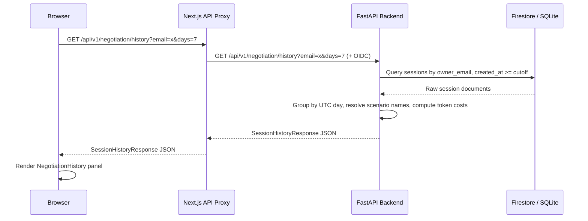
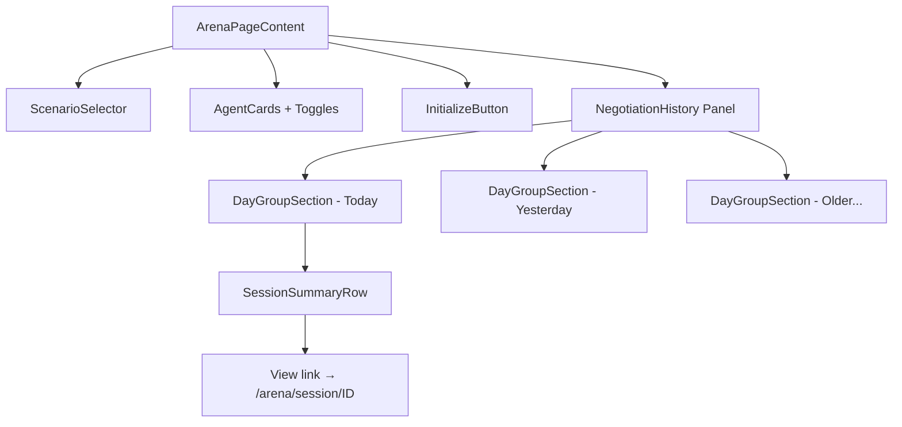

# Design Document: Negotiation History Panel

## Overview

This feature adds a Negotiation History panel to the `/arena` page, rendered below the `InitializeButton`. It displays the authenticated user's completed negotiation sessions grouped by UTC day, with token costs as secondary metadata. The implementation spans:

1. A new `GET /api/v1/negotiation/history` backend endpoint
2. Pydantic V2 response schemas (`SessionHistoryItem`, `DayGroup`, `SessionHistoryResponse`)
3. A pure `compute_token_cost` utility shared between the history endpoint and the existing deduction logic in `stream_negotiation`
4. A `NegotiationHistory` React component on the arena page
5. A Next.js API proxy route to forward history requests to the backend
6. Adjustments to the existing GlassBox session page for read-only replay of completed sessions

The backend queries either Firestore (cloud) or SQLite (local) depending on `RUN_MODE`, filtering by `owner_email` and `created_at` within the requested day range.

## Architecture



### Component Placement



## Components and Interfaces

### Backend

#### New file: `backend/app/utils/token_cost.py`

Pure function for token cost calculation, imported by both the history endpoint and `stream_negotiation`.

```python
import math

def compute_token_cost(total_tokens_used: int) -> int:
    """1 user token per 1,000 AI tokens, rounded up, minimum 1."""
    return max(1, math.ceil(total_tokens_used / 1000))
```

#### New file: `backend/app/models/history.py`

Pydantic V2 schemas for the history response.

```python
from pydantic import BaseModel, Field

class SessionHistoryItem(BaseModel):
    session_id: str
    scenario_id: str
    scenario_name: str
    deal_status: str
    total_tokens_used: int = Field(ge=0)
    token_cost: int = Field(ge=1)
    created_at: str
    completed_at: str | None = None

class DayGroup(BaseModel):
    date: str  # YYYY-MM-DD
    total_token_cost: int = Field(ge=0)
    sessions: list[SessionHistoryItem]

class SessionHistoryResponse(BaseModel):
    days: list[DayGroup]
    total_token_cost: int = Field(ge=0)
    period_days: int = Field(ge=1)
```

#### Extended: `backend/app/db/base.py` — `SessionStore` protocol

Add a new method to the protocol:

```python
async def list_sessions_by_owner(
    self, owner_email: str, since: str
) -> list[dict]: ...
```

Both `FirestoreSessionClient` and `SQLiteSessionClient` implement this. The `since` parameter is an ISO timestamp string; only sessions with `created_at >= since` are returned.

#### New route in `backend/app/routers/negotiation.py`

```
GET /api/v1/negotiation/history?email=<str>&days=<int:1-90, default=7>
```

Logic:
1. Validate `email` (422 if missing/empty)
2. Compute cutoff = `now_utc - timedelta(days=days)`
3. Call `db.list_sessions_by_owner(email, cutoff_iso)`
4. Filter to terminal sessions (`deal_status` in `{Agreed, Blocked, Failed}`)
5. Resolve `scenario_name` from `ScenarioRegistry` (fallback to `scenario_id` if not found)
6. Compute `token_cost` via `compute_token_cost`
7. Group by UTC date, sort groups descending, sessions within each group descending by `created_at`
8. Return `SessionHistoryResponse`

#### Firestore implementation (`list_sessions_by_owner`)

```python
async def list_sessions_by_owner(self, owner_email: str, since: str) -> list[dict]:
    query = (
        self._collection
        .where("owner_email", "==", owner_email)
        .where("created_at", ">=", since)
        .order_by("created_at", direction="DESCENDING")
    )
    docs = []
    async for doc in query.stream():
        docs.append(doc.to_dict())
    return docs
```

#### SQLite implementation (`list_sessions_by_owner`)

```python
async def list_sessions_by_owner(self, owner_email: str, since: str) -> list[dict]:
    conn = await self._get_connection()
    try:
        cursor = await conn.execute(
            "SELECT data FROM negotiation_sessions "
            "WHERE created_at >= ? ORDER BY created_at DESC",
            (since,),
        )
        rows = await cursor.fetchall()
        results = []
        for (raw,) in rows:
            doc = json.loads(raw)
            if doc.get("owner_email") == owner_email:
                results.append(doc)
        return results
    finally:
        await conn.close()
```

Note: SQLite filters `created_at` at the SQL level (indexed column) but must check `owner_email` in Python since it's inside the JSON `data` column. This is acceptable for local mode volumes.

### Frontend

#### New file: `frontend/lib/history.ts`

API client function:

```typescript
export interface SessionHistoryItem { ... }
export interface DayGroup { ... }
export interface SessionHistoryResponse { ... }

export async function fetchNegotiationHistory(
  email: string, days?: number
): Promise<SessionHistoryResponse> { ... }
```

#### New file: `frontend/components/arena/NegotiationHistory.tsx`

The panel component. Accepts `email`, `dailyLimit`, and renders:
- Loading skeleton while fetching
- Error state with retry button
- Empty state message
- Day groups (collapsible, today expanded by default)
- Session summary rows with status badges and "View" links

#### New file: `frontend/app/api/v1/negotiation/history/route.ts`

Next.js API route that proxies `GET` requests to the backend, using the existing `buildProxyHeaders` + `BACKEND_ORIGIN` pattern.

#### Modified: `frontend/app/(protected)/arena/page.tsx`

Import and render `<NegotiationHistory>` after `<InitializeButton>`.

#### Modified: `frontend/app/(protected)/arena/session/[sessionId]/page.tsx`

The existing GlassBox page already connects via SSE. For completed sessions navigated from history, the SSE hook should detect the terminal state from the first snapshot replay and render read-only. No major changes needed — the existing `_snapshot_to_events` + event buffer replay already handles this. The `useSSE` hook receives the terminal event and sets `isTerminal`, which disables the stop button and shows the outcome receipt.

## Data Models

### Session Document (existing, relevant fields)

Stored in Firestore collection `negotiation_sessions` or SQLite `negotiation_sessions.data` JSON:

| Field | Type | Notes |
|---|---|---|
| `session_id` | string | Primary key |
| `owner_email` | string | Set during `start_negotiation` |
| `scenario_id` | string | References scenario registry |
| `deal_status` | string | `Negotiating`, `Agreed`, `Blocked`, `Failed`, `Confirming` |
| `total_tokens_used` | int | AI tokens consumed |
| `created_at` | string (ISO) | Set at session creation |
| `completed_at` | string (ISO) | Set when negotiation ends |

### History Response Schema

```
SessionHistoryResponse
├── days: DayGroup[]
│   ├── date: "2025-06-23" (YYYY-MM-DD)
│   ├── total_token_cost: 12
│   └── sessions: SessionHistoryItem[]
│       ├── session_id: "abc-123"
│       ├── scenario_id: "talent-war"
│       ├── scenario_name: "Talent War"
│       ├── deal_status: "Agreed"
│       ├── total_tokens_used: 4500
│       ├── token_cost: 5
│       ├── created_at: "2025-06-23T14:30:00Z"
│       └── completed_at: "2025-06-23T14:32:15Z"
├── total_token_cost: 25
└── period_days: 7
```


## Correctness Properties

*A property is a characteristic or behavior that should hold true across all valid executions of a system — essentially, a formal statement about what the system should do. Properties serve as the bridge between human-readable specifications and machine-verifiable correctness guarantees.*

### Property 1: Grouping and sorting correctness

*For any* set of completed negotiation sessions with arbitrary `created_at` timestamps, when grouped by UTC day:
- Every session in a `DayGroup` must have a `created_at` whose UTC date (`YYYY-MM-DD`) matches the group's `date` field
- Sessions within each `DayGroup` must be sorted by `created_at` in descending order
- `DayGroup`s themselves must be sorted by `date` in descending order

**Validates: Requirements 1.2, 1.3**

### Property 2: Date range filtering

*For any* set of sessions spanning an arbitrary date range and *for any* `days` parameter value between 1 and 90, the grouping function shall return only sessions whose `created_at` falls within the last `days` UTC days. No session outside this window shall appear in the result.

**Validates: Requirements 1.4**

### Property 3: DayGroup token cost sum invariant

*For any* `DayGroup`, the `total_token_cost` field must equal the sum of `token_cost` values across all `SessionHistoryItem`s in that group. Additionally, the top-level `SessionHistoryResponse.total_token_cost` must equal the sum of all `DayGroup.total_token_cost` values.

**Validates: Requirements 1.6**

### Property 4: SessionHistoryResponse round-trip serialization

*For any* valid `SessionHistoryResponse` instance (with nested `DayGroup`s and `SessionHistoryItem`s), serializing via `.model_dump_json()` and deserializing via `SessionHistoryResponse.model_validate_json()` shall produce an object equal to the original.

**Validates: Requirements 2.1, 2.2, 2.3, 2.4**

### Property 5: Token cost formula correctness

*For any* non-negative integer `total_tokens_used`, `compute_token_cost(total_tokens_used)` shall return `max(1, ceil(total_tokens_used / 1000))`, and the result shall always be a positive integer ≥ 1.

**Validates: Requirements 3.1, 3.4**

## Error Handling

| Scenario | Layer | Behavior |
|---|---|---|
| `email` query param missing/empty | Backend endpoint | Return HTTP 422 with `{"detail": "email query parameter is required"}` |
| `days` param out of range (< 1 or > 90) | Backend endpoint | Return HTTP 422 via Pydantic `Query(ge=1, le=90)` validation |
| `days` param non-integer | Backend endpoint | Return HTTP 422 via FastAPI type coercion failure |
| Scenario not found in registry | Backend grouping logic | Use `scenario_id` as fallback for `scenario_name` |
| Database query failure (Firestore/SQLite) | Backend endpoint | Return HTTP 500 with generic error; log details server-side |
| History API returns non-2xx | Frontend `NegotiationHistory` | Show inline error message + "Retry" button |
| Network timeout on history fetch | Frontend `NegotiationHistory` | Same error state with retry |
| Session not found on replay navigation | Frontend GlassBox page | Show "Session not found" with link back to `/arena` (existing behavior) |
| Session belongs to different user | Backend SSE endpoint | Return 403 (existing behavior) |

## Testing Strategy

### Property-Based Tests (Hypothesis)

Library: **Hypothesis** (Python, already in use)

Each property test runs a minimum of 100 iterations. Tests are tagged with the property they validate.

| Property | Test Location | What's Generated |
|---|---|---|
| P1: Grouping & sorting | `backend/tests/property/test_history_grouping.py` | Random lists of session dicts with random `created_at` timestamps across multiple UTC days |
| P2: Date range filtering | `backend/tests/property/test_history_grouping.py` | Random sessions spanning wide date ranges + random `days` values (1–90) |
| P3: Token cost sum invariant | `backend/tests/property/test_history_grouping.py` | Random DayGroups with varying session counts and token costs |
| P4: Round-trip serialization | `backend/tests/property/test_history_models.py` | Random `SessionHistoryResponse` instances via Hypothesis `builds()` strategy |
| P5: Token cost formula | `backend/tests/property/test_token_cost.py` | Random non-negative integers (0 to 10,000,000) |

Tag format: `# Feature: 197_token-usage-history, Property N: <title>`

### Unit Tests

| Area | Test Location | Coverage |
|---|---|---|
| `compute_token_cost` edge cases | `backend/tests/unit/test_token_cost.py` | 0, 1, 999, 1000, 1001 boundary values |
| Pydantic model validation | `backend/tests/unit/test_history_models.py` | Required fields, optional `completed_at`, field constraints (ge=0, ge=1) |
| Scenario name resolution fallback | `backend/tests/unit/test_history_endpoint.py` | Unknown scenario_id falls back to ID string |
| Empty history response | `backend/tests/unit/test_history_endpoint.py` | No sessions → empty days, zero totals |
| Frontend: NegotiationHistory rendering | `frontend/__tests__/components/arena/NegotiationHistory.test.tsx` | Loading, error, empty, populated states |
| Frontend: Day group expansion | `frontend/__tests__/components/arena/NegotiationHistory.test.tsx` | Today expanded, others collapsed |
| Frontend: Status badges | `frontend/__tests__/components/arena/NegotiationHistory.test.tsx` | Agreed=green, Failed=red, Blocked=yellow |
| Frontend: Local mode ∞ display | `frontend/__tests__/components/arena/NegotiationHistory.test.tsx` | dailyLimit=Infinity shows "∞" |

### Integration Tests

| Area | Test Location | Coverage |
|---|---|---|
| `GET /api/v1/negotiation/history` happy path | `backend/tests/integration/test_history_endpoint.py` | Full request/response with in-memory SQLite |
| 422 on missing email | `backend/tests/integration/test_history_endpoint.py` | Validation error response |
| SQLite `list_sessions_by_owner` | `backend/tests/integration/test_history_endpoint.py` | Query with date filtering, owner filtering |
