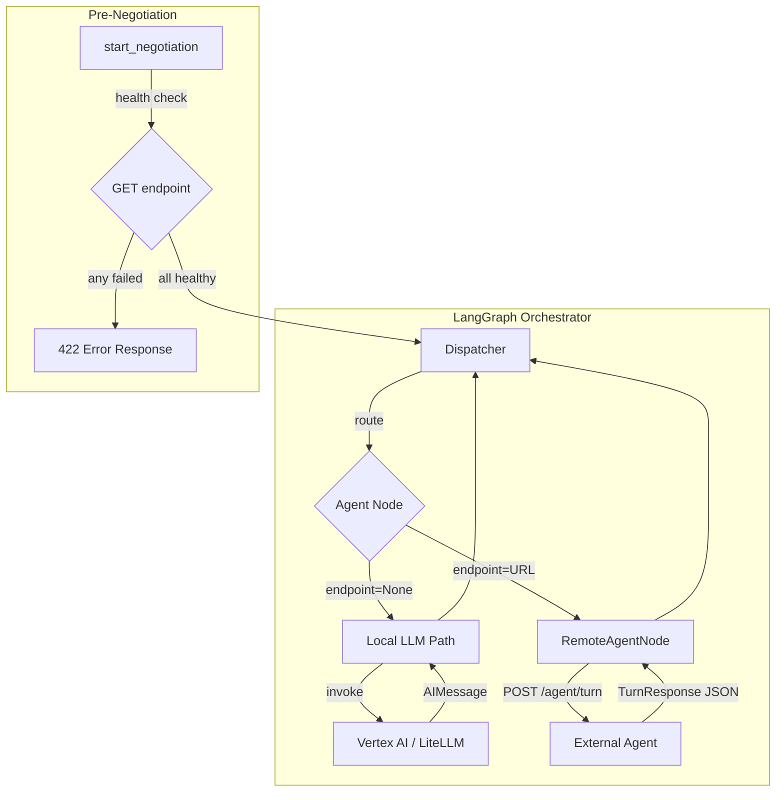

# Design Document: Agent Gateway API & Remote Agent Node

## Overview

This design extends the JuntoAI orchestrator to support external AI agents via HTTP, transforming the platform from a closed LLM orchestrator into an open agent-to-agent protocol. The core idea: if an `AgentDefinition` has an `endpoint` field, the orchestrator calls that URL instead of invoking a local LLM. Everything else — turn order, agreement detection, stall detection, SSE streaming — works identically.

The design touches four layers:
1. **Schema layer** — `AgentDefinition` gains `endpoint: str | None`
2. **Node layer** — `create_agent_node` routes to either local LLM or remote HTTP based on endpoint presence
3. **Contract layer** — `TurnPayload` / `TurnResponse` Pydantic models define the HTTP wire format
4. **Orchestration layer** — health checks at negotiation start, error handling with fallback, config for timeouts

Zero breaking changes to existing scenarios. No frontend changes required.

## Architecture



The key architectural decision is that `RemoteAgentNode` is **not** a separate LangGraph node type. Instead, `create_agent_node` internally branches: when the agent's config has an `endpoint`, it uses `httpx.AsyncClient` to POST the turn payload; when it doesn't, it uses the existing `model_router.get_model` → LLM invoke path. This means the graph topology is identical for local and remote agents — the dispatcher, turn order, and conditional edges don't change at all.

### Design Decisions

1. **Single factory, not separate node classes**: `create_agent_node` handles both paths. This avoids duplicating turn-order advancement, state-delta construction, and history formatting. The branching point is just the "get agent output" step.

2. **httpx over aiohttp**: `httpx.AsyncClient` is already the standard async HTTP client in the FastAPI ecosystem. It supports connection pooling, timeouts, and retries natively. No new dependency needed (FastAPI's test client uses httpx).

3. **Schema version in payload**: `schema_version: "1.0"` future-proofs the contract. External agents can check this field and fail fast if they don't support the version.

4. **Health check is GET, not POST**: A GET to the endpoint URL is a lightweight liveness probe. It doesn't require the external agent to process a full turn payload. This is intentionally simple — if the agent can respond to GET with 200, it's alive.

5. **No token tracking for remote agents**: Remote agents manage their own LLM calls. The orchestrator reports `tokens_used: 0` for remote turns. This is honest — we don't know what the remote agent did internally.

6. **Retry once on 5xx/timeout, never on 4xx**: A 4xx means the remote agent has a bug (bad contract implementation). Retrying won't fix it. A 5xx or timeout might be transient.

## Components and Interfaces

### 1. AgentDefinition Schema Extension

**File**: `backend/app/scenarios/models.py`

Add `endpoint` field to `AgentDefinition`:

```python
class AgentDefinition(BaseModel):
    # ... existing fields ...
    endpoint: str | None = Field(
        default=None,
        description="HTTP(S) URL for remote agent. When set, orchestrator "
                    "calls this endpoint instead of invoking a local LLM.",
    )

    @field_validator("endpoint")
    @classmethod
    def validate_endpoint_url(cls, v: str | None) -> str | None:
        if v is None:
            return v
        if not v.strip():
            raise ValueError("endpoint must not be empty when provided")
        from urllib.parse import urlparse
        parsed = urlparse(v)
        if parsed.scheme not in ("http", "https"):
            raise ValueError(
                f"endpoint must use http or https scheme, got '{parsed.scheme}'"
            )
        if not parsed.netloc:
            raise ValueError("endpoint URL must have a valid host")
        return v
```

### 2. Turn Payload & Response Models

**File**: `backend/app/orchestrator/remote_agent.py` (new)

```python
class TurnPayload(BaseModel):
    schema_version: str = "1.0"
    agent_role: str
    agent_type: Literal["negotiator", "regulator", "observer"]
    agent_name: str
    turn_number: int
    max_turns: int
    current_offer: float
    history: list[dict[str, Any]]
    agent_config: dict[str, Any]
    negotiation_params: dict[str, Any]
```

Response models reuse existing `NegotiatorOutput`, `RegulatorOutput`, `ObserverOutput` from `outputs.py`. No new response models needed — the external agent returns the same JSON shape.

### 3. RemoteAgentNode (inside create_agent_node)

**File**: `backend/app/orchestrator/agent_node.py`

The existing `create_agent_node` factory gains a branch:

```python
def create_agent_node(agent_role: str) -> Callable:
    async def _node(state: NegotiationState) -> dict[str, Any]:
        agent_config = _find_agent_config(agent_role, state)
        endpoint = agent_config.get("endpoint")

        if endpoint:
            return await _remote_agent_turn(agent_role, agent_config, state)
        else:
            return _local_agent_turn(agent_role, agent_config, state)

    return _node
```

The `_remote_agent_turn` function:
1. Increments `turn_count` for negotiators (same as local path)
2. Builds `TurnPayload` from state
3. POSTs to endpoint with `httpx.AsyncClient`
4. Parses response into the appropriate output model
5. Calls `_update_state` and `_advance_turn_order` (shared with local path)

### 4. Health Check Integration

**File**: `backend/app/routers/negotiation.py`

Before starting the LangGraph execution in `start_negotiation`, check all remote endpoints:

```python
async def _check_remote_agent_health(
    agents: list[AgentDefinition],
    timeout: float,
) -> list[dict[str, str]]:
    """GET each remote agent endpoint. Returns list of health results."""
    results = []
    async with httpx.AsyncClient() as client:
        for agent in agents:
            if agent.endpoint:
                try:
                    resp = await client.get(
                        agent.endpoint,
                        timeout=timeout,
                        headers={"User-Agent": "JuntoAI-A2A/1.0"},
                    )
                    status = "healthy" if resp.status_code == 200 else f"unhealthy ({resp.status_code})"
                except Exception as e:
                    status = f"unreachable ({type(e).__name__})"
                results.append({
                    "role": agent.role,
                    "endpoint": agent.endpoint,
                    "status": status,
                })
    return results
```

### 5. Settings Extension

**File**: `backend/app/config.py`

```python
class Settings(BaseSettings):
    # ... existing fields ...
    REMOTE_AGENT_TIMEOUT_SECONDS: float = 30.0
    REMOTE_AGENT_HEALTH_CHECK_TIMEOUT_SECONDS: float = 5.0
```

### 6. StartNegotiationResponse Extension

**File**: `backend/app/routers/negotiation.py`

```python
class AgentHealthStatus(BaseModel):
    role: str
    status: str
    endpoint: str

class StartNegotiationResponse(BaseModel):
    session_id: str
    tokens_remaining: int
    max_turns: int
    agent_health: list[AgentHealthStatus] | None = None
```

## Data Models

### TurnPayload (Request to Remote Agent)

```json
{
  "schema_version": "1.0",
  "agent_role": "Candidate",
  "agent_type": "negotiator",
  "agent_name": "Alex",
  "turn_number": 3,
  "max_turns": 12,
  "current_offer": 120000.0,
  "history": [
    {
      "role": "Recruiter",
      "agent_type": "negotiator",
      "turn_number": 1,
      "content": {
        "public_message": "We'd like to offer €110,000...",
        "proposed_price": 110000.0
      }
    }
  ],
  "agent_config": {
    "persona_prompt": "You are Alex...",
    "goals": ["Achieve base salary of €135,000..."],
    "budget": {"min": 125000, "max": 160000, "target": 135000},
    "tone": "confident and data-driven"
  },
  "negotiation_params": {
    "agreement_threshold": 5000,
    "value_label": "Salary (€)",
    "value_format": "currency"
  }
}
```

### TurnResponse (Negotiator)

```json
{
  "inner_thought": "Their offer is below market...",
  "public_message": "I appreciate the offer, but based on market data...",
  "proposed_price": 135000.0,
  "extra_fields": {}
}
```

### TurnResponse (Regulator)

```json
{
  "status": "WARNING",
  "reasoning": "The proposed salary of €135,000 exceeds the approved band..."
}
```

### TurnResponse (Observer)

```json
{
  "observation": "Both parties are still far apart on base salary...",
  "recommendation": "Consider exploring equity compensation..."
}
```

### AgentDefinition (Extended)

```python
class AgentDefinition(BaseModel):
    role: str
    name: str
    type: Literal["negotiator", "regulator", "observer"]
    persona_prompt: str
    goals: list[str]
    budget: Budget
    tone: str
    output_fields: list[str]
    model_id: str
    fallback_model_id: str | None = None
    endpoint: str | None = None  # NEW — remote agent URL
```

### NegotiationState Impact

No changes to `NegotiationState` TypedDict. Remote agent turns produce identical state deltas to local agent turns. The `history` entries, `agent_states` updates, `current_offer`, and `turn_order_index` advancement are all handled by the shared `_update_state` and `_advance_turn_order` functions.

The only difference: `total_tokens_used` gets `+0` for remote agent turns instead of the actual token count.


## Correctness Properties

*A property is a characteristic or behavior that should hold true across all valid executions of a system — essentially, a formal statement about what the system should do. Properties serve as the bridge between human-readable specifications and machine-verifiable correctness guarantees.*

### Property 1: Endpoint URL Validation

*For any* string value provided as the `endpoint` field of an `AgentDefinition`, the model SHALL accept it if and only if it is a well-formed HTTP or HTTPS URL with a valid host. Strings with non-HTTP(S) schemes (ftp, ws, etc.), empty strings, strings composed entirely of whitespace, and malformed URLs SHALL be rejected at Pydantic validation time. `None` SHALL always be accepted.

**Validates: Requirements 1.1, 7.1, 7.2**

### Property 2: TurnPayload Contains All Required Fields

*For any* valid `NegotiationState` and any agent with an `endpoint`, the constructed `TurnPayload` SHALL contain all required fields (`schema_version`, `agent_role`, `agent_type`, `agent_name`, `turn_number`, `max_turns`, `current_offer`, `history`, `agent_config`, `negotiation_params`) with values correctly derived from the state. No required field SHALL be `None` or missing.

**Validates: Requirements 2.2, 2.4**

### Property 3: Hidden Context Isolation

*For any* `NegotiationState` with `hidden_context` entries for multiple agents, the `TurnPayload` constructed for agent A SHALL NOT contain hidden context belonging to agent B. Hidden context for the target agent SHALL be injected into `agent_config` only for that agent.

**Validates: Requirements 2.3**

### Property 4: Agent Output Serialization Round-Trip

*For any* valid `NegotiatorOutput`, `RegulatorOutput`, or `ObserverOutput` instance, serializing to JSON via `model_dump_json()` and parsing back via `model_validate_json()` SHALL produce an equivalent object. This ensures the wire format between the orchestrator and external agents is lossless.

**Validates: Requirements 3.2, 3.3, 3.4**

### Property 5: State Delta Equivalence for Local and Remote Agents

*For any* valid parsed agent output (negotiator, regulator, or observer) and any valid `NegotiationState`, the state delta produced by `_update_state` and `_advance_turn_order` SHALL be identical regardless of whether the output originated from a local LLM call or a remote HTTP call. History entries, `agent_states` updates, `current_offer`, `turn_order_index`, and `turn_count` SHALL all match.

**Validates: Requirements 4.4, 5.2, 5.3**

### Property 6: Zero Token Tracking for Remote Agents

*For any* remote agent turn (agent with `endpoint` set), the `total_tokens_used` delta SHALL be exactly 0. The orchestrator SHALL NOT fabricate or estimate token counts for remote agents.

**Validates: Requirements 4.5**

### Property 7: Invalid Remote Response Triggers Fallback

*For any* HTTP response from a remote agent that is either non-200 status, non-JSON body, or valid JSON that fails Pydantic validation against the expected output model, the `RemoteAgentNode` SHALL produce a valid fallback output (via `_fallback_output`) and the resulting state delta SHALL be well-formed (valid history entry, no corrupted `agent_states`).

**Validates: Requirements 3.5, 3.6, 6.1, 6.2, 6.3**

## Error Handling

### Remote Agent Errors

All remote agent errors follow the same pattern: log at WARNING level, use `_fallback_output`, and continue the negotiation. The negotiation never crashes due to a single remote agent failure.

| Error Condition | Behavior | Retry? |
| --- | --- | --- |
| Connection refused / DNS failure | Log + fallback | No |
| Timeout (exceeds `REMOTE_AGENT_TIMEOUT_SECONDS`) | Log + retry once, then fallback | Yes (1x) |
| HTTP 4xx | Log status + body (truncated 500 chars) + fallback | No |
| HTTP 5xx | Log status + body (truncated 500 chars) + retry once, then fallback | Yes (1x) |
| Non-JSON response body | Log raw body (truncated 500 chars) + fallback | No |
| JSON parses but fails Pydantic validation | Log validation errors + fallback | No |

### Fallback Output Behavior

The existing `_fallback_output` function is reused unchanged:
- **Negotiator**: Holds last proposed price (from `agent_states`), emits a "gathering thoughts" message
- **Regulator**: Returns `CLEAR` status with a neutral reasoning message
- **Observer**: Returns a generic observation message

When fallback is triggered for a remote agent, the history entry content includes `[{agent_name} encountered a communication error]` so the conversation flow remains coherent for other agents.

### Health Check Errors

Health check failures at negotiation start time are **blocking** — the negotiation does not start. The API returns a 422 response with the list of unhealthy endpoints:

```json
{
  "detail": "Remote agent health check failed",
  "unhealthy_agents": [
    {"role": "Candidate", "endpoint": "https://agent.example.com/turn", "status": "unreachable (ConnectError)"}
  ]
}
```

### Error Logging Format

All remote agent errors are logged at WARNING level with consistent fields:

```
WARNING - Remote agent error: role=%s endpoint=%s error_type=%s response=%s
```

The response body is always truncated to 500 characters to prevent log flooding from large error responses.

## Testing Strategy

### Property-Based Tests (Hypothesis)

The project already uses Hypothesis for property-based testing (see `backend/tests/property/`). Each property from the Correctness Properties section maps to a Hypothesis test with minimum 100 examples.

| Property | Test File | Strategy |
| --- | --- | --- |
| P1: Endpoint URL Validation | `test_remote_agent_properties.py` | Generate random strings via `st.text()`, valid URLs via custom strategy, verify accept/reject |
| P2: TurnPayload Completeness | `test_remote_agent_properties.py` | Generate random `NegotiationState` dicts, build payload, assert all fields present |
| P3: Hidden Context Isolation | `test_remote_agent_properties.py` | Generate states with multi-agent hidden context, build payloads per agent, assert no leakage |
| P4: Output Round-Trip | `test_remote_agent_properties.py` | Generate random output model instances, serialize/deserialize, assert equality |
| P5: State Delta Equivalence | `test_remote_agent_properties.py` | Generate random parsed outputs + states, run through `_update_state`, compare deltas |
| P6: Zero Tokens for Remote | `test_remote_agent_properties.py` | Generate random remote agent turns, assert `total_tokens_used` delta is 0 |
| P7: Invalid Response Fallback | `test_remote_agent_properties.py` | Generate random invalid responses (bad JSON, wrong schema, missing fields), verify fallback produces valid state |

Each test is tagged: `# Feature: agent-gateway-api, Property {N}: {title}`

### Unit Tests (pytest)

Focus on specific examples and edge cases not covered by property tests:

- **Routing**: `create_agent_node` routes to local path when `endpoint=None`, remote path when `endpoint` is set
- **Headers**: Outbound requests include `User-Agent: JuntoAI-A2A/1.0` and `X-JuntoAI-Session-Id`
- **Retry logic**: 5xx → retry → success; 5xx → retry → 5xx → fallback; 4xx → no retry → fallback; timeout → retry → success
- **Health check**: GET request, 200 = healthy, non-200 = unhealthy, timeout = unreachable
- **Health check blocking**: Any unhealthy agent → 422 response, no negotiation started
- **Backward compatibility**: All existing scenario JSON files load without modification
- **Settings defaults**: `REMOTE_AGENT_TIMEOUT_SECONDS=30.0`, `REMOTE_AGENT_HEALTH_CHECK_TIMEOUT_SECONDS=5.0`
- **Scenario load with invalid endpoint**: `ftp://`, empty string, no host → validation error at load time, not at runtime

### Integration Tests (pytest + httpx mock)

- **Mixed negotiation**: Scenario with 1 local + 1 remote negotiator + 1 local regulator, run 2-3 turns, verify state consistency
- **Full remote negotiation**: All agents remote, verify complete negotiation flow
- **Health check integration**: `start_negotiation` with remote agents, verify health checks run before graph execution
- **SSE event parity**: Verify SSE events from remote agent turns are structurally identical to local agent turns

### Mocking Strategy

- **External HTTP calls**: Use `respx` (httpx mock library) or `unittest.mock.patch` on `httpx.AsyncClient`
- **Local LLM calls**: Continue using existing `unittest.mock` patches on `model_router.get_model`
- **No real network calls in tests**: All external endpoints are mocked
