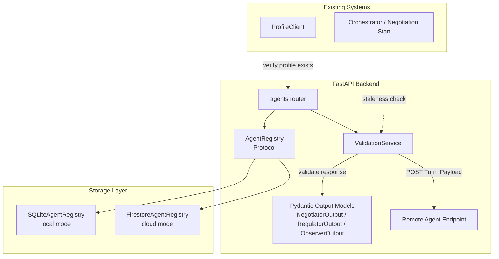
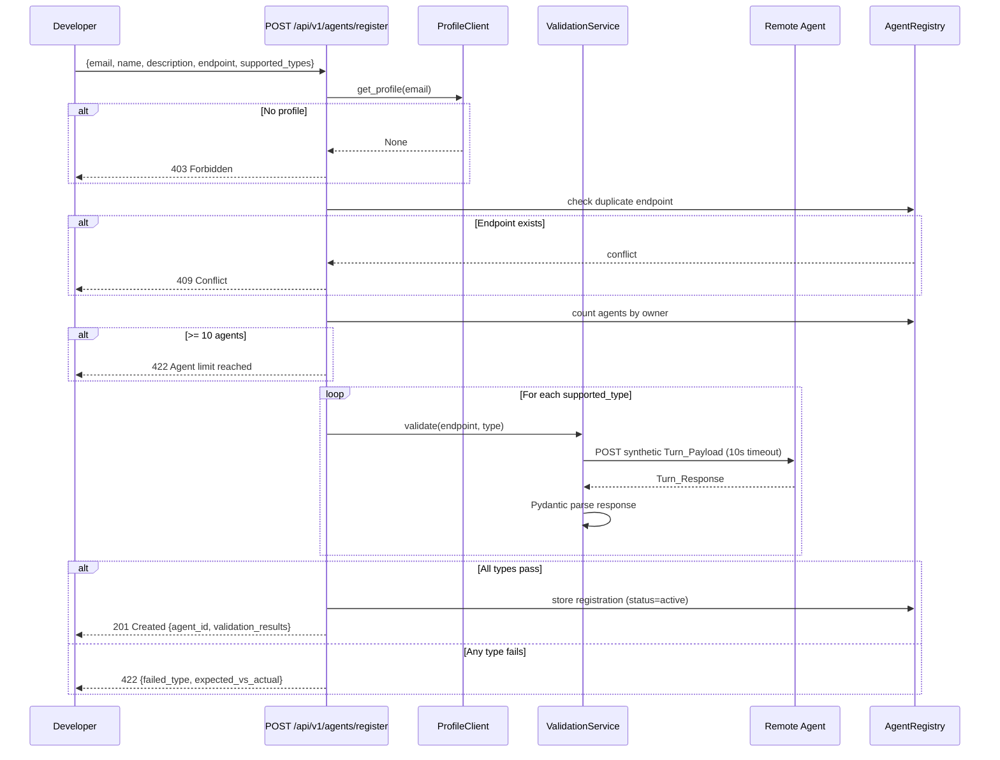

# Design Document: Agent Registration & Validation

## Overview

This feature adds an agent registration and validation system to the JuntoAI platform. External developers register their remote agents via a REST API, the platform validates each agent against the Agent Gateway HTTP contract (Spec 200) by sending synthetic `Turn_Payload` requests, and valid agents are stored in a dual-mode registry (Firestore for cloud, SQLite for local). A discovery API exposes active agents publicly, and management endpoints let owners update, delete, and revalidate their agents. Stale registrations (>24h) are automatically revalidated when referenced in a new negotiation.

The system follows the existing codebase patterns: Pydantic V2 models for validation, FastAPI routers under `/api/v1`, factory-based DB client selection via `RUN_MODE`, and `httpx` for async HTTP calls to remote agent endpoints.

## Architecture



### Request Flow — Registration



## Components and Interfaces

### 1. Pydantic Models — `backend/app/models/agent.py`

```python
# New file
from pydantic import BaseModel, Field, field_validator
from typing import Literal
from datetime import datetime
import re

class AgentRegistrationRequest(BaseModel):
    email: str
    name: str = Field(..., min_length=3, max_length=100)
    description: str = Field(..., min_length=10, max_length=500)
    endpoint: str
    supported_types: list[Literal["negotiator", "regulator", "observer"]] = Field(..., min_length=1)

    @field_validator("endpoint")
    @classmethod
    def validate_endpoint(cls, v: str) -> str:
        pattern = r"^https?://.+"
        if not re.match(pattern, v):
            raise ValueError("Endpoint must be a valid HTTP or HTTPS URL")
        return v

    @field_validator("supported_types")
    @classmethod
    def validate_unique_types(cls, v: list[str]) -> list[str]:
        if len(v) != len(set(v)):
            raise ValueError("supported_types must not contain duplicates")
        return v

class AgentUpdateRequest(BaseModel):
    name: str | None = Field(None, min_length=3, max_length=100)
    description: str | None = Field(None, min_length=10, max_length=500)
    endpoint: str | None = None
    supported_types: list[Literal["negotiator", "regulator", "observer"]] | None = Field(None, min_length=1)

    @field_validator("endpoint")
    @classmethod
    def validate_endpoint(cls, v: str | None) -> str | None:
        if v is None:
            return v
        pattern = r"^https?://.+"
        if not re.match(pattern, v):
            raise ValueError("Endpoint must be a valid HTTP or HTTPS URL")
        return v

class TypeValidationResult(BaseModel):
    agent_type: Literal["negotiator", "regulator", "observer"]
    passed: bool
    error: str | None = None

class AgentRegistration(BaseModel):
    agent_id: str
    owner_email: str
    name: str
    description: str
    endpoint: str
    supported_types: list[str]
    validation_results: list[TypeValidationResult]
    validated_at: datetime
    created_at: datetime
    updated_at: datetime
    status: Literal["active", "inactive", "validation_failed"]

class AgentCard(BaseModel):
    agent_id: str
    name: str
    description: str
    endpoint: str
    supported_types: list[str]
    validated_at: datetime
    owner_email: str
    status: str
```

### 2. Validation Service — `backend/app/services/agent_validator.py`

```python
# New file
import httpx
from app.orchestrator.outputs import NegotiatorOutput, RegulatorOutput, ObserverOutput
from app.models.agent import TypeValidationResult

OUTPUT_MODEL_MAP = {
    "negotiator": NegotiatorOutput,
    "regulator": RegulatorOutput,
    "observer": ObserverOutput,
}

SYNTHETIC_PAYLOAD = {
    # Built per supported_type — realistic 2-agent scenario,
    # 3 history entries, turn_number=4, max_turns=12, current_offer=100000.0
}

class AgentValidator:
    TIMEOUT_SECONDS = 10

    async def validate_endpoint(self, endpoint: str, agent_type: str) -> TypeValidationResult:
        """Send synthetic Turn_Payload, validate response against Pydantic model."""
        ...

    async def validate_all_types(self, endpoint: str, types: list[str]) -> list[TypeValidationResult]:
        """Validate endpoint for each declared type. Returns list of results."""
        ...

    def build_synthetic_payload(self, agent_type: str) -> dict:
        """Construct a realistic Turn_Payload for the given agent type."""
        ...
```

### 3. Agent Registry Protocol & Implementations — `backend/app/db/agent_registry.py`

```python
# New file — follows SessionStore / ProfileClient pattern
from typing import Protocol, runtime_checkable

@runtime_checkable
class AgentRegistryStore(Protocol):
    async def create_agent(self, registration: AgentRegistration) -> None: ...
    async def get_agent(self, agent_id: str) -> AgentRegistration | None: ...
    async def get_agent_by_endpoint(self, endpoint: str) -> AgentRegistration | None: ...
    async def list_agents(self, status: str = "active", agent_type: str | None = None) -> list[AgentRegistration]: ...
    async def list_agents_by_owner(self, email: str) -> list[AgentRegistration]: ...
    async def count_agents_by_owner(self, email: str) -> int: ...
    async def update_agent(self, agent_id: str, fields: dict) -> None: ...
    async def delete_agent(self, agent_id: str) -> None: ...

class FirestoreAgentRegistry:
    COLLECTION = "agent_registry"
    # Implements AgentRegistryStore using Firestore
    ...

class SQLiteAgentRegistry:
    TABLE = "agent_registry"
    # Implements AgentRegistryStore using aiosqlite
    ...
```

### 4. Factory Function — added to `backend/app/db/__init__.py`

```python
def get_agent_registry() -> AgentRegistryStore:
    """Return singleton AgentRegistryStore based on RUN_MODE."""
    ...
```

### 5. Router — `backend/app/routers/agents.py`

```python
# New file — registered in main.py as api_router.include_router(agents_router)
router = APIRouter(prefix="/agents", tags=["agents"])

# POST /agents/register — registration + validation
# GET /agents — list active agents (public, no auth)
# GET /agents/mine?email= — list owner's agents
# GET /agents/{agent_id} — get single agent card (public)
# PUT /agents/{agent_id} — update + revalidate (owner only)
# DELETE /agents/{agent_id}?email= — delete (owner only)
# POST /agents/{agent_id}/revalidate?email= — revalidate (owner only)
```

### 6. Staleness Check Integration

A utility function `check_and_revalidate_stale_agents(scenario_config)` will be called at negotiation start (in the orchestrator or negotiation router). It checks `validated_at` for any registered agent endpoints in the scenario, revalidates if >24h stale, and raises an error if revalidation fails.

## Data Models

### Firestore Document — `agent_registry/{agent_id}`

| Field | Type | Description |
|---|---|---|
| `agent_id` | string | UUID v4, document ID |
| `owner_email` | string | Registering user's email |
| `name` | string | Agent display name (3-100 chars) |
| `description` | string | Agent description (10-500 chars) |
| `endpoint` | string | HTTP/HTTPS URL |
| `supported_types` | array[string] | ["negotiator", "regulator", "observer"] subset |
| `validation_results` | array[object] | Per-type {agent_type, passed, error} |
| `validated_at` | timestamp | Last successful validation UTC |
| `created_at` | timestamp | Registration timestamp |
| `updated_at` | timestamp | Last modification timestamp |
| `status` | string | "active" \| "inactive" \| "validation_failed" |

### SQLite Table — `agent_registry`

```sql
CREATE TABLE IF NOT EXISTS agent_registry (
    agent_id TEXT PRIMARY KEY,
    owner_email TEXT NOT NULL,
    name TEXT NOT NULL,
    description TEXT NOT NULL,
    endpoint TEXT NOT NULL UNIQUE,
    supported_types TEXT NOT NULL,  -- JSON array
    validation_results TEXT NOT NULL,  -- JSON array
    validated_at TEXT NOT NULL,
    created_at TEXT NOT NULL,
    updated_at TEXT NOT NULL,
    status TEXT NOT NULL DEFAULT 'active'
);
CREATE INDEX IF NOT EXISTS idx_agent_registry_owner ON agent_registry(owner_email);
CREATE INDEX IF NOT EXISTS idx_agent_registry_status ON agent_registry(status);
CREATE INDEX IF NOT EXISTS idx_agent_registry_endpoint ON agent_registry(endpoint);
```


## Correctness Properties

*A property is a characteristic or behavior that should hold true across all valid executions of a system — essentially, a formal statement about what the system should do. Properties serve as the bridge between human-readable specifications and machine-verifiable correctness guarantees.*

### Property 1: Registration model round-trip serialization

*For any* valid `AgentRegistration` instance with arbitrary field values, serializing via `model_dump()` and reconstructing via `AgentRegistration(**data)` shall produce an object equal to the original.

**Validates: Requirements 1.1, 3.1, 3.2**

### Property 2: Registration input validation rejects invalid inputs

*For any* `AgentRegistrationRequest` where `name` length is outside 3-100 chars, or `description` length is outside 10-500 chars, or `endpoint` is not a valid HTTP/HTTPS URL, or `supported_types` is empty or contains values outside {"negotiator", "regulator", "observer"}, Pydantic validation shall raise a `ValidationError`.

**Validates: Requirements 1.1**

### Property 3: Validation produces one result per declared type

*For any* non-empty subset of `["negotiator", "regulator", "observer"]`, calling `validate_all_types(endpoint, types)` shall return a list of `TypeValidationResult` with exactly one entry per declared type, and the `agent_type` field of each result shall match one of the input types with no duplicates.

**Validates: Requirements 1.3, 2.1, 2.6**

### Property 4: Valid responses produce passed results, invalid responses produce failed results

*For any* agent type and any response body that is valid JSON conforming to the corresponding Pydantic output model (`NegotiatorOutput` for "negotiator", `RegulatorOutput` for "regulator", `ObserverOutput` for "observer") with HTTP 200, the validation result shall have `passed=True`. Conversely, *for any* non-200 HTTP status code or response body that fails Pydantic validation, the result shall have `passed=False` with a non-empty `error` string.

**Validates: Requirements 2.3, 2.4, 2.5**

### Property 5: Status derivation from validation results

*For any* list of `TypeValidationResult`, the derived agent status shall be `"active"` if and only if every result has `passed=True`. If any result has `passed=False`, the status shall be `"validation_failed"`.

**Validates: Requirements 3.4**

### Property 6: Type filter returns only matching agents

*For any* set of registered agents with varying `supported_types` and `status`, and *for any* type filter value, listing agents with that filter shall return only agents whose `supported_types` contains the filter value and whose `status` is `"active"`.

**Validates: Requirements 4.1, 4.2**

### Property 7: Owner filter returns only owner's agents

*For any* set of registered agents with varying `owner_email` values, and *for any* email query, listing agents by owner shall return exactly the agents whose `owner_email` matches the query email.

**Validates: Requirements 5.5**

### Property 8: Staleness detection

*For any* `validated_at` UTC timestamp and *for any* current UTC time, the staleness check shall return `True` if and only if the difference between current time and `validated_at` exceeds 24 hours.

**Validates: Requirements 6.2, 6.4**

## Error Handling

| Scenario | HTTP Status | Response |
|---|---|---|
| No profile for email | 403 | `{"detail": "No profile found for this email. Register first."}` |
| Duplicate endpoint URL | 409 | `{"detail": "Endpoint already registered", "existing_agent_id": "..."}` |
| Agent limit exceeded (>10) | 422 | `{"detail": "Maximum 10 agents per user"}` |
| Contract validation failure | 422 | `{"detail": "Validation failed", "failures": [{type, error}]}` |
| Agent not found | 404 | `{"detail": "Agent not found"}` |
| Not owner | 403 | `{"detail": "Only the agent owner can perform this action"}` |
| Stale agent revalidation failure | 503 | `{"detail": "Agent revalidation failed", "agent_id": "...", "agent_name": "..."}` |
| Remote agent timeout (10s) | — | Captured in `TypeValidationResult.error` as "Connection timeout after 10s" |
| Remote agent connection error | — | Captured in `TypeValidationResult.error` with connection details |
| Invalid JSON from remote agent | — | Captured in `TypeValidationResult.error` as "Invalid JSON response" |

All errors follow the existing FastAPI `JSONResponse` pattern used throughout the codebase. Validation errors from Pydantic are automatically handled by FastAPI's built-in 422 handler.

## Testing Strategy

### Property-Based Tests (Hypothesis)

Following the existing pattern in `backend/tests/property/`, using `hypothesis` with `@settings(max_examples=100)`:

- **Property 1**: Generate random `AgentRegistration` instances, verify `model_dump()` → reconstruct round-trip
- **Property 2**: Generate random strings for name/description/endpoint/types with invalid lengths and formats, verify `ValidationError`
- **Property 3**: Generate random subsets of types, mock HTTP, verify result count and type matching
- **Property 4**: Generate random valid/invalid response bodies per type, verify passed/failed classification
- **Property 5**: Generate random lists of `TypeValidationResult` with varying pass/fail, verify status derivation
- **Property 6**: Generate random agent sets with varying types/status, verify type filter correctness
- **Property 7**: Generate random agent sets with varying owners, verify owner filter correctness
- **Property 8**: Generate random timestamp pairs, verify staleness calculation

Each test tagged with: `Feature: 210_agent-registration-validation, Property {N}: {title}`

### Unit Tests (pytest)

- `AgentRegistrationRequest` validation: specific valid/invalid examples
- `AgentValidator.build_synthetic_payload()`: verify payload structure per type
- `AgentValidator.validate_endpoint()`: mock httpx responses (200 valid, 200 invalid JSON, 500, timeout)
- Ownership check helper: specific email match/mismatch cases
- `get_agent_registry()` factory: returns correct implementation per `RUN_MODE`

### Integration Tests (pytest + TestClient)

- Full registration flow: valid request → 201 with agent_id
- Registration with no profile → 403
- Registration with duplicate endpoint → 409
- Registration exceeding 10-agent limit → 422
- Registration with failing agent → 422 with failure details
- Discovery: GET /agents returns only active agents
- Discovery: GET /agents?type=negotiator filters correctly
- Discovery: GET /agents/{id} returns correct agent
- Management: PUT updates and revalidates
- Management: DELETE removes agent
- Management: non-owner gets 403
- Revalidation: POST revalidate updates timestamps
- Mine endpoint: returns only owner's agents

### Test File Structure

```
backend/tests/
├── property/
│   └── test_agent_registration_properties.py   # Properties 1-8
├── unit/
│   └── test_agent_models.py                    # Pydantic model unit tests
│   └── test_agent_validator.py                 # Validation service unit tests
└── integration/
    └── test_agent_registration_router.py       # Full endpoint integration tests
```
