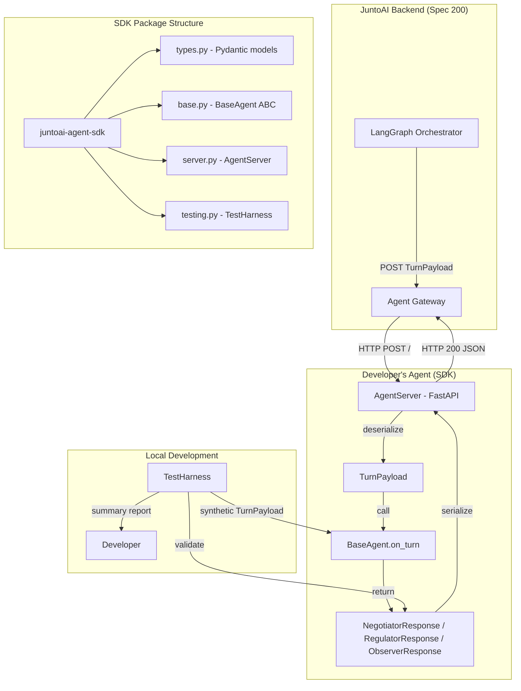
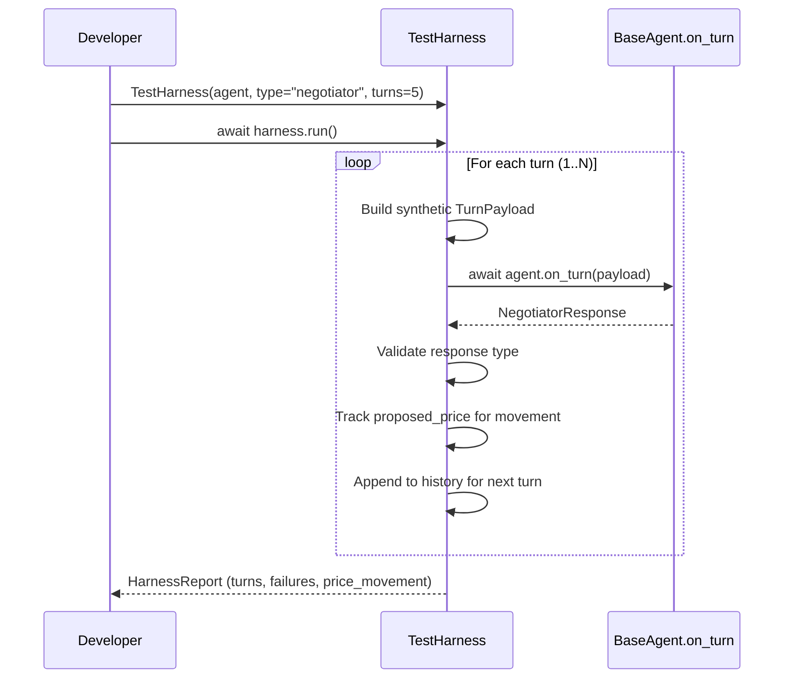

# Design Document: Developer Agent SDK & Documentation

## Overview

This design defines `juntoai-agent-sdk`, a standalone Python package that lives in `sdk/` at the monorepo root. The SDK gives external developers everything they need to build, test, and deploy agents compatible with the JuntoAI Agent Gateway (Spec 200) — without reading the backend source code.

The SDK is intentionally thin. It provides:
1. **Pydantic type definitions** mirroring the Agent Gateway contract (`TurnPayload`, `NegotiatorResponse`, `RegulatorResponse`, `ObserverResponse`)
2. **`BaseAgent` abstract class** — subclass it, implement `on_turn`, done
3. **`AgentServer`** — FastAPI wrapper that handles HTTP plumbing, CORS, logging, health checks
4. **`TestHarness`** — local testing tool that simulates multi-turn negotiations without connecting to JuntoAI
5. **Template agents** — copy-paste-modify examples for each agent type + an LLM-powered example
6. **OpenAPI spec** — machine-readable contract for non-Python developers
7. **Documentation** — quickstart guide and architecture docs

The SDK has zero coupling to the backend. No LangChain, no LangGraph, no GCP dependencies. Just `pydantic`, `fastapi`, `uvicorn`, `httpx`. The type definitions are manually kept in sync with `backend/app/orchestrator/outputs.py` — a deliberate choice over shared code to keep the SDK installable without the backend.

### Design Decisions

1. **Separate package, not a shared library**: The SDK is a standalone pip-installable package. Sharing code between `backend/` and `sdk/` would force SDK users to install backend dependencies (LangChain, GCP SDKs, etc.). The cost is manual type sync; the benefit is a clean `pip install juntoai-agent-sdk` with 4 dependencies.

2. **`on_turn` returns a union, not separate methods**: A single `on_turn(payload) -> Response` is simpler than `on_negotiator_turn`, `on_regulator_turn`, `on_observer_turn`. The agent knows its type. If it supports multiple types, it switches on `payload.agent_type` internally.

3. **FastAPI over raw ASGI**: FastAPI gives us automatic OpenAPI docs, Pydantic validation, and middleware support for free. The overhead is negligible for an agent that processes one request at a time.

4. **TestHarness is in-process, not HTTP**: The harness instantiates the agent directly and calls `on_turn` — no server needed. This is faster for iteration. For HTTP-level testing, developers can use `httpx` against the running server.

5. **CLI via entry point, not click/typer**: The `juntoai-test` CLI is a simple `argparse`-based entry point registered in `pyproject.toml`. No extra dependency.

6. **OpenAPI spec is hand-written, not auto-generated**: Auto-generating from FastAPI would produce the SDK's server spec, not the Agent Gateway contract. The OpenAPI spec describes what the *orchestrator* sends and expects — a different perspective.

## Architecture



### Package Layout

```
sdk/
├── pyproject.toml
├── README.md
├── LICENSE
├── openapi.yaml
├── docs/
│   ├── quickstart.md
│   └── architecture.md
├── examples/
│   ├── simple_negotiator.py
│   ├── simple_regulator.py
│   ├── simple_observer.py
│   ├── llm_negotiator.py
│   └── Dockerfile
├── src/
│   └── juntoai_agent_sdk/
│       ├── __init__.py          # Re-exports BaseAgent, AgentServer
│       ├── types.py             # TurnPayload, responses, supporting types
│       ├── base.py              # BaseAgent abstract class
│       ├── server.py            # AgentServer (FastAPI wrapper)
│       ├── testing.py           # TestHarness
│       └── py.typed             # PEP 561 marker
└── tests/
    ├── conftest.py
    ├── test_types.py
    ├── test_base.py
    ├── test_server.py
    ├── test_testing.py
    └── property/
        └── test_sdk_properties.py
```

## Components and Interfaces

### 1. Type Definitions (`juntoai_agent_sdk.types`)

All Pydantic V2 models matching the Agent Gateway contract from Spec 200.

```python
from typing import Any, Literal
from pydantic import BaseModel, Field


class Budget(BaseModel):
    min: float = Field(..., ge=0)
    max: float = Field(..., ge=0)
    target: float = Field(..., ge=0)


class AgentConfig(BaseModel):
    persona_prompt: str
    goals: list[str]
    budget: Budget
    tone: str


class HistoryEntry(BaseModel):
    role: str
    content: dict[str, Any]
    agent_type: str | None = None
    turn_number: int | None = None


class NegotiationParams(BaseModel):
    agreement_threshold: float
    value_label: str = "Price"
    value_format: str = "currency"
    max_turns: int | None = None


class TurnPayload(BaseModel):
    schema_version: str = "1.0"
    agent_role: str
    agent_type: Literal["negotiator", "regulator", "observer"]
    agent_name: str
    turn_number: int
    max_turns: int
    current_offer: float
    history: list[HistoryEntry]
    agent_config: AgentConfig
    negotiation_params: NegotiationParams


class NegotiatorResponse(BaseModel):
    """Must match NegotiatorOutput from backend/app/orchestrator/outputs.py"""
    inner_thought: str
    public_message: str
    proposed_price: float
    extra_fields: dict[str, Any] = {}


class RegulatorResponse(BaseModel):
    """Must match RegulatorOutput from backend/app/orchestrator/outputs.py"""
    status: Literal["CLEAR", "WARNING", "BLOCKED"]
    reasoning: str


class ObserverResponse(BaseModel):
    """Must match ObserverOutput from backend/app/orchestrator/outputs.py"""
    observation: str
    recommendation: str = ""


# Union type for on_turn return
AgentResponse = NegotiatorResponse | RegulatorResponse | ObserverResponse
```

**Sync strategy**: The SDK response models (`NegotiatorResponse`, `RegulatorResponse`, `ObserverResponse`) must have identical field names, types, and defaults as the backend models (`NegotiatorOutput`, `RegulatorOutput`, `ObserverOutput` in `backend/app/orchestrator/outputs.py`). A CI check will compare the two sets of models and fail if they diverge.

### 2. BaseAgent Abstract Class (`juntoai_agent_sdk.base`)

```python
from abc import ABC, abstractmethod
from juntoai_agent_sdk.types import TurnPayload, AgentResponse


class BaseAgent(ABC):
    def __init__(self, name: str, supported_types: list[str]) -> None:
        self.name = name
        self.supported_types = supported_types

    @abstractmethod
    async def on_turn(self, payload: TurnPayload) -> AgentResponse:
        """Process a single turn. Implement your agent logic here."""
        ...

    def run(self, host: str = "0.0.0.0", port: int = 8080) -> None:
        """Start the agent as an HTTP server."""
        from juntoai_agent_sdk.server import AgentServer
        server = AgentServer(self)
        server.run(host=host, port=port)
```

### 3. AgentServer (`juntoai_agent_sdk.server`)

```python
import os
import time
import logging
from fastapi import FastAPI, Request, Response
from fastapi.middleware.cors import CORSMiddleware

logger = logging.getLogger("juntoai_agent_sdk")


class AgentServer:
    def __init__(self, agent: "BaseAgent") -> None:
        self.agent = agent
        self.app = FastAPI(title=f"JuntoAI Agent: {agent.name}")

        # CORS — agents are called server-to-server
        self.app.add_middleware(
            CORSMiddleware,
            allow_origins=["*"],
            allow_methods=["*"],
            allow_headers=["*"],
        )

        # Request logging middleware
        @self.app.middleware("http")
        async def log_requests(request: Request, call_next):
            start = time.time()
            response = await call_next(request)
            elapsed = time.time() - start
            logger.info(
                "%s %s %d %.3fs",
                request.method, request.url.path,
                response.status_code, elapsed,
            )
            return response

        # Health check endpoints
        @self.app.get("/")
        async def health():
            return {
                "status": "ok",
                "name": agent.name,
                "supported_types": agent.supported_types,
            }

        @self.app.get("/health")
        async def health_alias():
            return {"status": "ok"}

        # Turn endpoint
        @self.app.post("/")
        async def turn(request: Request):
            from juntoai_agent_sdk.types import TurnPayload
            try:
                body = await request.json()
                payload = TurnPayload.model_validate(body)
                result = await agent.on_turn(payload)
                return result.model_dump()
            except Exception as e:
                logger.exception("Error in on_turn")
                return Response(
                    content=f'{{"error": "{str(e)}"}}',
                    status_code=500,
                    media_type="application/json",
                )

    def run(self, host: str = "0.0.0.0", port: int = 8080) -> None:
        import uvicorn
        host = os.environ.get("AGENT_HOST", host)
        port = int(os.environ.get("AGENT_PORT", port))
        log_level = os.environ.get("AGENT_LOG_LEVEL", "info")
        uvicorn.run(self.app, host=host, port=port, log_level=log_level)
```

### 4. TestHarness (`juntoai_agent_sdk.testing`)

```python
from dataclasses import dataclass, field
from juntoai_agent_sdk.types import (
    TurnPayload, AgentConfig, Budget, HistoryEntry,
    NegotiationParams, NegotiatorResponse, AgentResponse,
)
from juntoai_agent_sdk.base import BaseAgent


@dataclass
class TurnResult:
    turn_number: int
    response: AgentResponse
    validation_error: str | None = None


@dataclass
class HarnessReport:
    turns_executed: int
    results: list[TurnResult]
    validation_failures: int
    price_movement: bool  # True if proposed_prices changed across turns


class TestHarness:
    def __init__(
        self,
        agent: BaseAgent,
        agent_type: str = "negotiator",
        num_turns: int = 5,
        initial_offer: float = 100.0,
        history_seed: list[HistoryEntry] | None = None,
    ) -> None:
        self.agent = agent
        self.agent_type = agent_type
        self.num_turns = num_turns
        self.initial_offer = initial_offer
        self.history_seed = history_seed or []

    async def run(self) -> HarnessReport:
        """Simulate a multi-turn negotiation and collect results."""
        results: list[TurnResult] = []
        history = list(self.history_seed)
        current_offer = self.initial_offer
        prices: list[float] = []

        for turn in range(1, self.num_turns + 1):
            payload = TurnPayload(
                schema_version="1.0",
                agent_role="TestAgent",
                agent_type=self.agent_type,
                agent_name=self.agent.name,
                turn_number=turn,
                max_turns=self.num_turns,
                current_offer=current_offer,
                history=history,
                agent_config=AgentConfig(
                    persona_prompt="Test agent",
                    goals=["Test goal"],
                    budget=Budget(min=0, max=1000000, target=500000),
                    tone="neutral",
                ),
                negotiation_params=NegotiationParams(
                    agreement_threshold=5000,
                    value_label="Price",
                    value_format="currency",
                ),
            )

            validation_error = None
            try:
                response = await self.agent.on_turn(payload)
                # Validate response type matches agent_type
                if self.agent_type == "negotiator" and not isinstance(response, NegotiatorResponse):
                    validation_error = f"Expected NegotiatorResponse, got {type(response).__name__}"
                # Track prices for movement detection
                if isinstance(response, NegotiatorResponse):
                    prices.append(response.proposed_price)
                    current_offer = response.proposed_price
                # Add to history
                history.append(HistoryEntry(
                    role="TestAgent",
                    content=response.model_dump(),
                ))
            except Exception as e:
                validation_error = str(e)
                response = None

            results.append(TurnResult(
                turn_number=turn,
                response=response,
                validation_error=validation_error,
            ))

        price_movement = len(set(prices)) > 1 if prices else False

        return HarnessReport(
            turns_executed=len(results),
            results=results,
            validation_failures=sum(1 for r in results if r.validation_error),
            price_movement=price_movement,
        )
```

### 5. CLI Entry Point

Registered in `pyproject.toml` as `juntoai-test`:

```python
# juntoai_agent_sdk/cli.py
import argparse
import asyncio
import importlib


def main():
    parser = argparse.ArgumentParser(description="Test a JuntoAI agent locally")
    parser.add_argument("--agent", required=True, help="module:ClassName (e.g. my_agent:MyAgent)")
    parser.add_argument("--type", default="negotiator", choices=["negotiator", "regulator", "observer"])
    parser.add_argument("--turns", type=int, default=5)
    parser.add_argument("--initial-offer", type=float, default=100.0)
    args = parser.parse_args()

    module_path, class_name = args.agent.split(":")
    module = importlib.import_module(module_path)
    agent_cls = getattr(module, class_name)
    agent = agent_cls()

    from juntoai_agent_sdk.testing import TestHarness
    harness = TestHarness(
        agent=agent,
        agent_type=args.type,
        num_turns=args.turns,
        initial_offer=args.initial_offer,
    )
    report = asyncio.run(harness.run())

    print(f"\n{'='*50}")
    print(f"Test Report: {agent.name}")
    print(f"{'='*50}")
    print(f"Turns executed: {report.turns_executed}")
    print(f"Validation failures: {report.validation_failures}")
    print(f"Price movement: {'Yes' if report.price_movement else 'No (stuck!)'}")
    for r in report.results:
        status = "✓" if not r.validation_error else f"✗ {r.validation_error}"
        print(f"  Turn {r.turn_number}: {status}")
```

### 6. pyproject.toml

```toml
[build-system]
requires = ["hatchling"]
build-backend = "hatchling.build"

[project]
name = "juntoai-agent-sdk"
version = "0.1.0"
description = "Build AI agents for the JuntoAI negotiation platform"
requires-python = ">=3.10"
dependencies = [
    "pydantic>=2.0",
    "fastapi>=0.100",
    "uvicorn>=0.20",
    "httpx>=0.24",
]

[project.optional-dependencies]
dev = ["pytest", "pytest-asyncio", "hypothesis", "mypy", "httpx"]

[project.scripts]
juntoai-test = "juntoai_agent_sdk.cli:main"

[tool.hatch.build.targets.wheel]
packages = ["src/juntoai_agent_sdk"]
```


## Data Models

### TurnPayload (What the orchestrator sends to the agent)

```json
{
  "schema_version": "1.0",
  "agent_role": "Candidate",
  "agent_type": "negotiator",
  "agent_name": "Alex",
  "turn_number": 3,
  "max_turns": 12,
  "current_offer": 120000.0,
  "history": [
    {
      "role": "Recruiter",
      "agent_type": "negotiator",
      "turn_number": 1,
      "content": {
        "public_message": "We'd like to offer €110,000...",
        "proposed_price": 110000.0
      }
    }
  ],
  "agent_config": {
    "persona_prompt": "You are Alex, a senior engineer...",
    "goals": ["Achieve base salary of €135,000"],
    "budget": {"min": 125000, "max": 160000, "target": 135000},
    "tone": "confident and data-driven"
  },
  "negotiation_params": {
    "agreement_threshold": 5000,
    "value_label": "Salary (€)",
    "value_format": "currency"
  }
}
```

### Response Models (What the agent returns)

**NegotiatorResponse** — mirrors `NegotiatorOutput` from `backend/app/orchestrator/outputs.py`:
```json
{
  "inner_thought": "Their offer is below market rate...",
  "public_message": "I appreciate the offer, but based on market data...",
  "proposed_price": 135000.0,
  "extra_fields": {}
}
```

**RegulatorResponse** — mirrors `RegulatorOutput`:
```json
{
  "status": "WARNING",
  "reasoning": "The proposed salary exceeds the approved band..."
}
```

**ObserverResponse** — mirrors `ObserverOutput`:
```json
{
  "observation": "Both parties are still far apart on base salary...",
  "recommendation": "Consider exploring equity compensation..."
}
```

### Type Sync Contract

The SDK response models are manually maintained copies of the backend output models. The mapping is:

| SDK Type | Backend Type | File |
|---|---|---|
| `NegotiatorResponse` | `NegotiatorOutput` | `backend/app/orchestrator/outputs.py` |
| `RegulatorResponse` | `RegulatorOutput` | `backend/app/orchestrator/outputs.py` |
| `ObserverResponse` | `ObserverOutput` | `backend/app/orchestrator/outputs.py` |

A CI script (`sdk/scripts/check_type_sync.py`) will:
1. Import both the SDK and backend models
2. Compare `model_fields` (names, types, defaults)
3. Fail the build if any field diverges

This is preferable to a shared package because:
- SDK users don't need `langchain`, `google-cloud-*`, etc.
- The SDK can evolve its `TurnPayload` independently (it's SDK-only, not in the backend)
- The sync check catches drift at CI time, not at runtime

### TestHarness Data Flow




## Correctness Properties

*A property is a characteristic or behavior that should hold true across all valid executions of a system — essentially, a formal statement about what the system should do. Properties serve as the bridge between human-readable specifications and machine-verifiable correctness guarantees.*

### Property 1: SDK Type Serialization Round-Trip

*For any* valid instance of `TurnPayload`, `NegotiatorResponse`, `RegulatorResponse`, `ObserverResponse`, `AgentConfig`, `Budget`, `HistoryEntry`, or `NegotiationParams`, serializing via `model_dump_json()` and deserializing via `model_validate_json()` SHALL produce an object equal to the original.

**Validates: Requirements 2.1, 2.2, 2.3**

### Property 2: SDK-Backend Response Model Field Sync

*For any* response model pair (`NegotiatorResponse`/`NegotiatorOutput`, `RegulatorResponse`/`RegulatorOutput`, `ObserverResponse`/`ObserverOutput`), the SDK model's `model_fields` SHALL have identical field names, annotation types, and default values as the corresponding backend model from `backend/app/orchestrator/outputs.py`.

**Validates: Requirements 2.5**

### Property 3: Health Check Returns Agent Identity

*For any* agent name (non-empty string) and any list of supported types, the `GET /` endpoint of an `AgentServer` wrapping that agent SHALL return HTTP 200 with a JSON body containing `"status": "ok"`, `"name"` equal to the agent's name, and `"supported_types"` equal to the agent's supported types list.

**Validates: Requirements 3.5**

### Property 4: Server Turn Endpoint Round-Trip

*For any* valid `TurnPayload` and any `BaseAgent` subclass whose `on_turn` returns a valid `AgentResponse`, POSTing the payload as JSON to the `POST /` endpoint SHALL return HTTP 200 with a JSON body equal to `on_turn(payload).model_dump()`.

**Validates: Requirements 3.6**

### Property 5: TestHarness Executes Requested Turn Count

*For any* `BaseAgent` that returns valid responses and any requested turn count N (1 ≤ N ≤ 50), running the `TestHarness` with `num_turns=N` SHALL produce a `HarnessReport` with `turns_executed == N` and exactly N entries in `results`.

**Validates: Requirements 5.2**

### Property 6: TestHarness Propagates Configuration to Payloads

*For any* valid TestHarness configuration (agent_type, initial_offer, num_turns), every `TurnPayload` passed to `on_turn` during the harness run SHALL have `agent_type` matching the configured type, `turn_number` incrementing from 1 to N, `max_turns` equal to the configured turn count, and the first payload's `current_offer` equal to the configured initial offer.

**Validates: Requirements 5.4**

### Property 7: Price Movement Detection

*For any* sequence of `proposed_price` values returned by a negotiator agent across N turns (N ≥ 2), the `HarnessReport.price_movement` flag SHALL be `True` if and only if the sequence contains at least two distinct values.

**Validates: Requirements 5.5**

### Property 8: Template Agents Return Valid Responses

*For any* valid `TurnPayload` with `agent_type` matching the template agent's supported type, calling the template agent's `on_turn` SHALL return a response that is a valid instance of the corresponding Pydantic response model (`NegotiatorResponse` for negotiators, `RegulatorResponse` for regulators, `ObserverResponse` for observers).

**Validates: Requirements 6.2**

## Error Handling

### Server-Level Errors

| Error Condition | HTTP Status | Response Body | Behavior |
|---|---|---|---|
| Invalid JSON in POST body | 422 | FastAPI validation error | Automatic via Pydantic |
| Valid JSON but fails TurnPayload validation | 422 | FastAPI validation error with field details | Automatic via Pydantic |
| `on_turn` raises any exception | 500 | `{"error": "<exception message>"}` | Caught by server, logged |
| `on_turn` returns wrong response type | 200 | Response serialized as-is | No server-side type check (developer's responsibility) |

### TestHarness Errors

| Error Condition | Behavior |
|---|---|
| `on_turn` raises exception | Recorded as `validation_error` in `TurnResult`, harness continues to next turn |
| `on_turn` returns wrong response type for agent_type | Recorded as `validation_error`, response still collected |
| Agent returns same `proposed_price` every turn | `price_movement` flag set to `False` in report |

### Type Sync Errors

If the CI sync check (`check_type_sync.py`) detects field divergence between SDK and backend models, the build fails with a clear message:

```
SYNC ERROR: NegotiatorResponse.extra_fields has type dict[str, Any] 
but NegotiatorOutput.extra_fields has type dict[str, str]
```

The fix is always to update the SDK types to match the backend — the backend is the source of truth.

## Testing Strategy

### Property-Based Tests (Hypothesis)

The SDK uses Hypothesis for property-based testing, consistent with the backend's existing PBT approach (see `backend/tests/property/`). Each property maps to a Hypothesis test with minimum 100 examples.

| Property | Test File | Strategy |
|---|---|---|
| P1: SDK Type Round-Trip | `sdk/tests/property/test_sdk_properties.py` | Generate random instances of each Pydantic model via `st.builds()`, serialize/deserialize, assert equality |
| P2: SDK-Backend Field Sync | `sdk/tests/property/test_sdk_properties.py` | Parametrize over model pairs, compare `model_fields` programmatically |
| P3: Health Check Identity | `sdk/tests/property/test_sdk_properties.py` | Generate random agent names via `st.text()` and type lists via `st.lists(st.sampled_from(...))`, create TestClient, GET /, assert fields |
| P4: Server Turn Round-Trip | `sdk/tests/property/test_sdk_properties.py` | Generate random TurnPayloads, POST to TestClient, compare response to direct `on_turn` call |
| P5: Harness Turn Count | `sdk/tests/property/test_sdk_properties.py` | Generate random turn counts via `st.integers(1, 50)`, run harness, assert `turns_executed` |
| P6: Harness Config Propagation | `sdk/tests/property/test_sdk_properties.py` | Generate random configs, instrument agent to capture payloads, verify fields |
| P7: Price Movement Detection | `sdk/tests/property/test_sdk_properties.py` | Generate random price sequences via `st.lists(st.floats())`, mock agent to return them, verify flag |
| P8: Template Agent Validity | `sdk/tests/property/test_sdk_properties.py` | Generate random TurnPayloads, call each template's `on_turn`, assert response is valid Pydantic model |

Each test is tagged: `# Feature: developer-agent-sdk, Property {N}: {title}`

### Unit Tests (pytest + pytest-asyncio)

Focus on specific examples and edge cases:

- **Import tests**: All public types importable from `juntoai_agent_sdk.types`, `BaseAgent` from `juntoai_agent_sdk`
- **BaseAgent contract**: Subclass without `on_turn` → `TypeError` on instantiation
- **Server CORS**: OPTIONS request returns `Access-Control-Allow-Origin: *`
- **Server logging**: Request produces log entry with method, path, status, time
- **Server error handling**: `on_turn` raising `ValueError` → HTTP 500 with error message
- **Health alias**: `GET /health` returns `{"status": "ok"}`
- **Env var config**: `AGENT_HOST`, `AGENT_PORT`, `AGENT_LOG_LEVEL` override defaults
- **CLI argument parsing**: `--agent`, `--type`, `--turns`, `--initial-offer` parsed correctly
- **CLI module loading**: `module:ClassName` format resolves to correct class
- **OpenAPI validity**: `openapi.yaml` parses as valid OpenAPI 3.1

### Integration Tests

- **Template + TestHarness**: Each template agent passes TestHarness with zero validation failures
- **Full server flow**: Start TestClient, POST valid payload, verify response matches expected output
- **CLI end-to-end**: Run `juntoai-test` with a template agent, verify exit code 0 and report output

### CI Checks

- **Type sync**: `python sdk/scripts/check_type_sync.py` compares SDK and backend models
- **mypy**: `mypy --strict sdk/src/` passes with zero errors
- **OpenAPI validation**: Validate `openapi.yaml` against OpenAPI 3.1 spec
- **Coverage**: `pytest --cov=juntoai_agent_sdk --cov-fail-under=70`
