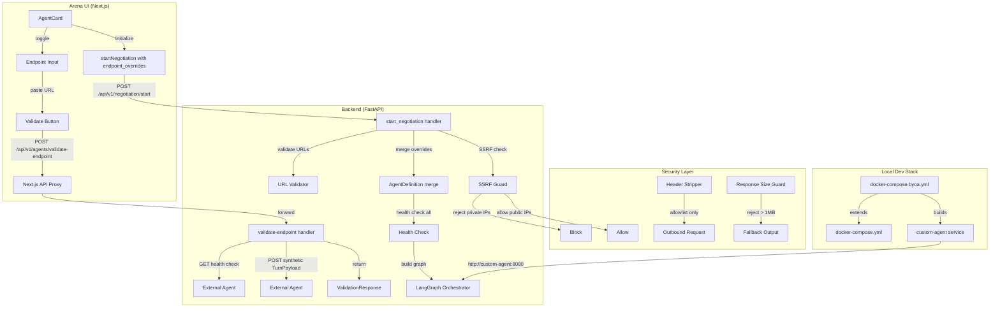
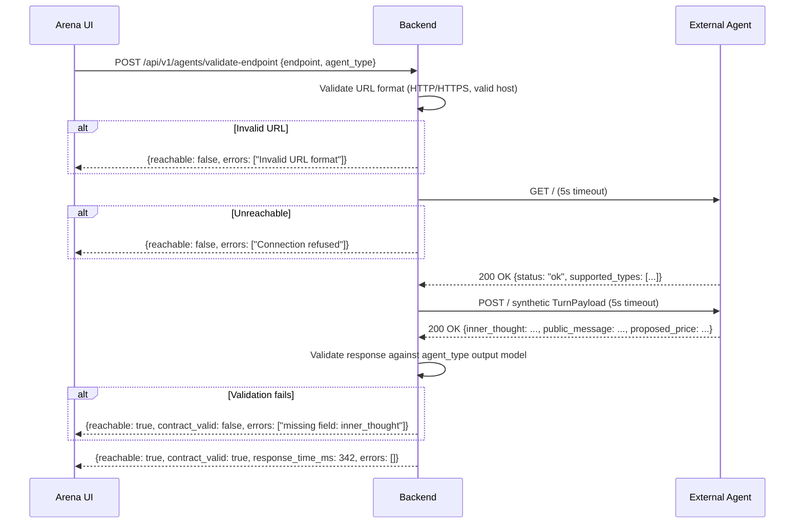
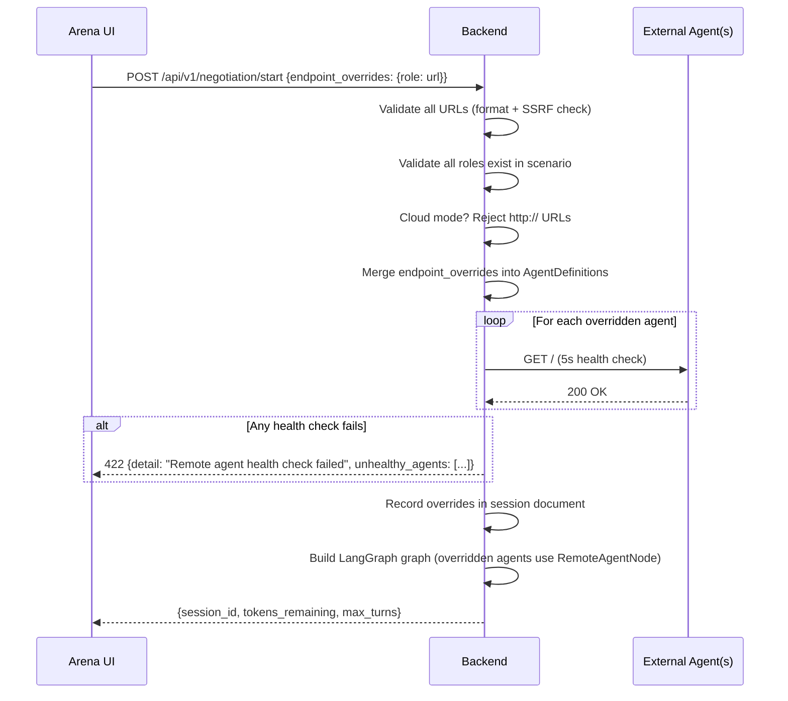

# Design Document: Bring Your Own Agent (BYOA)

## Overview

This design covers the "last mile" that connects a developer's custom agent to a live JuntoAI negotiation. Specs 200 (Agent Gateway) and 220 (Developer Agent SDK) provide the HTTP contract and the SDK — this spec provides the UI, the backend wiring, the local dev stack, and the security guardrails that make it all work end-to-end.

The design touches five layers:
1. **Arena UI** — "Use External Agent" toggle on AgentCards, endpoint input, validation UX
2. **Backend API** — `endpoint_overrides` in `StartNegotiationRequest`, merge into `AgentDefinition` before graph construction, `POST /api/v1/agents/validate-endpoint`
3. **Security** — SSRF prevention, header stripping, response size limits, HTTPS enforcement in cloud mode, rate limiting
4. **Local Dev Stack** — `docker-compose.byoa.yml` + `byoa/` starter directory
5. **Documentation** — `docs/byoa-guide.md` covering the full workflow, tunneling, testing checklist

### Design Decisions

1. **Endpoint overrides at request time, not scenario config**: Developers paste URLs in the Arena UI per-session, not in scenario JSON. This keeps scenario files portable and avoids coupling scenario authoring to agent deployment. The `endpoint_overrides` dict in `StartNegotiationRequest` mirrors the existing `model_overrides` pattern.

2. **Validation API is a separate endpoint, not inline in start_negotiation**: The Arena UI calls `POST /api/v1/agents/validate-endpoint` before the user clicks "Initialize". This gives instant feedback without burning tokens. The pre-negotiation health check in `start_negotiation` is a second safety net.

3. **SSRF prevention via post-DNS-resolution IP check**: We resolve the hostname and check the IP against private ranges *after* DNS resolution. This prevents DNS rebinding attacks where a hostname resolves to `127.0.0.1`. The check runs at negotiation start time, not at URL input time (the endpoint may not be running yet during input).

4. **Header allowlist, not blocklist**: We explicitly set only `User-Agent`, `Content-Type`, `X-JuntoAI-Session-Id`, and `X-JuntoAI-Schema-Version` on outbound requests. This is safer than stripping known-bad headers — new headers can't leak.

5. **1MB response size limit**: External agents return structured JSON (a few hundred bytes typically). 1MB is generous enough for any legitimate response but prevents memory exhaustion from malicious endpoints.

6. **Cloud mode requires HTTPS, local mode allows HTTP**: Local development with Docker Compose and ngrok uses HTTP internally. Cloud mode enforces TLS because traffic crosses the public internet.

7. **Docker Compose override file, not a separate compose**: `docker-compose.byoa.yml` extends the existing `docker-compose.yml` via `-f` flag. This avoids duplicating service definitions and lets developers opt-in to the BYOA stack.

## Architecture



### Request Flow: Endpoint Validation



### Request Flow: Negotiation Start with Overrides



## Components and Interfaces

### 1. Arena UI — AgentCard BYOA Extension

**File**: `frontend/components/arena/AgentCard.tsx`

Extend `AgentCardProps` with BYOA state:

```typescript
export interface AgentCardProps {
  // ... existing props ...
  byoaEndpoint?: string | null;
  byoaValidated?: boolean;
  byoaValidating?: boolean;
  byoaError?: string | null;
  onByoaToggle?: (role: string, enabled: boolean) => void;
  onByoaEndpointChange?: (role: string, endpoint: string) => void;
  onByoaValidate?: (role: string) => void;
}
```

The toggle reveals an endpoint input + validate button. Validation state is managed by the parent Arena page component, which calls the `validate-endpoint` API.

**URL validation (client-side)**: A `validateEndpointUrl(url: string): string | null` utility function that returns an error message or null. Checks:
- Non-empty after trim
- Starts with `http://` or `https://`
- Valid URL via `new URL()` constructor
- Has a hostname

This mirrors the backend Pydantic validator for instant feedback.

### 2. Arena Page — BYOA State Management

**File**: `frontend/app/(protected)/arena/page.tsx`

New state in `ArenaPageContent`:

```typescript
const [byoaEndpoints, setByoaEndpoints] = useState<Record<string, string>>({});
const [byoaValidated, setByoaValidated] = useState<Record<string, boolean>>({});
const [byoaValidating, setByoaValidating] = useState<Record<string, boolean>>({});
const [byoaErrors, setByoaErrors] = useState<Record<string, string | null>>({});
```

The `startNegotiation` call gains `endpointOverrides`:

```typescript
// In the handleInitialize function:
const endpointOverrides: Record<string, string> = {};
for (const [role, url] of Object.entries(byoaEndpoints)) {
  if (byoaValidated[role] && url) {
    endpointOverrides[role] = url;
  }
}
```

### 3. API Client Extension

**File**: `frontend/lib/api.ts`

```typescript
export interface ValidateEndpointRequest {
  endpoint: string;
  agent_type: "negotiator" | "regulator" | "observer";
}

export interface ValidateEndpointResponse {
  reachable: boolean;
  contract_valid: boolean;
  response_time_ms: number;
  errors: string[];
}

export async function validateAgentEndpoint(
  req: ValidateEndpointRequest,
): Promise<ValidateEndpointResponse> {
  const res = await fetch(`${API_BASE}/agents/validate-endpoint`, {
    method: "POST",
    headers: { "Content-Type": "application/json" },
    body: JSON.stringify(req),
  });
  if (!res.ok) {
    const detail = await extractErrorDetail(res);
    throw new Error(detail);
  }
  return res.json();
}

// Extend startNegotiation signature:
export async function startNegotiation(
  email: string,
  scenarioId: string,
  activeToggles: string[],
  customPrompts?: Record<string, string>,
  modelOverrides?: Record<string, string>,
  structuredMemoryRoles?: string[],
  milestoneSummariesEnabled?: boolean,
  noMemoryRoles?: string[],
  endpointOverrides?: Record<string, string>,  // NEW
): Promise<StartNegotiationResponse> {
  // ... existing body construction ...
  if (endpointOverrides && Object.keys(endpointOverrides).length > 0) {
    body.endpoint_overrides = endpointOverrides;
  }
  // ... rest unchanged ...
}
```

### 4. Backend — StartNegotiationRequest Extension

**File**: `backend/app/routers/negotiation.py`

```python
class StartNegotiationRequest(BaseModel):
    # ... existing fields ...
    endpoint_overrides: dict[str, str] = Field(
        default_factory=dict,
        description="Map of agent role → external agent endpoint URL. "
                    "Overrides the built-in agent for that role.",
    )

    @field_validator("endpoint_overrides")
    @classmethod
    def validate_endpoint_urls(cls, v: dict[str, str]) -> dict[str, str]:
        from urllib.parse import urlparse
        for role, url in v.items():
            if not url.strip():
                raise ValueError(f"Endpoint URL for role '{role}' must not be empty")
            parsed = urlparse(url)
            if parsed.scheme not in ("http", "https"):
                raise ValueError(
                    f"Endpoint for role '{role}' must use http or https, "
                    f"got '{parsed.scheme}'"
                )
            if not parsed.netloc:
                raise ValueError(
                    f"Endpoint for role '{role}' must have a valid host"
                )
        return v
```

### 5. Backend — Endpoint Override Merge

**File**: `backend/app/routers/negotiation.py` (inside `start_negotiation`)

After scenario loading and before state creation:

```python
# Validate endpoint_overrides roles exist in scenario
if body.endpoint_overrides:
    agent_roles = {a.role for a in scenario.agents}
    invalid_roles = set(body.endpoint_overrides.keys()) - agent_roles
    if invalid_roles:
        return JSONResponse(
            status_code=422,
            content={
                "detail": f"Invalid agent roles in endpoint_overrides: "
                          f"{sorted(invalid_roles)}. "
                          f"Valid roles: {sorted(agent_roles)}"
            },
        )

    # SSRF check + cloud HTTPS enforcement
    for role, url in body.endpoint_overrides.items():
        ssrf_error = await check_ssrf(url)
        if ssrf_error:
            return JSONResponse(
                status_code=422,
                content={"detail": f"Endpoint for role '{role}': {ssrf_error}"},
            )
        if settings.RUN_MODE == "cloud" and url.startswith("http://"):
            return JSONResponse(
                status_code=422,
                content={
                    "detail": f"Endpoint for role '{role}' must use HTTPS "
                              f"in cloud mode"
                },
            )

    # Merge overrides into scenario agent definitions
    scenario_dict = scenario.model_dump()
    for agent in scenario_dict["agents"]:
        if agent["role"] in body.endpoint_overrides:
            agent["endpoint"] = body.endpoint_overrides[agent["role"]]
```

### 6. Backend — Endpoint Validation API

**File**: `backend/app/routers/agents.py` (new)

```python
from fastapi import APIRouter
from pydantic import BaseModel, Field
from typing import Literal
import httpx
import time
import logging

from app.orchestrator.outputs import NegotiatorOutput, RegulatorOutput, ObserverOutput

logger = logging.getLogger(__name__)
router = APIRouter(prefix="/api/v1/agents", tags=["agents"])

AGENT_TYPE_TO_MODEL = {
    "negotiator": NegotiatorOutput,
    "regulator": RegulatorOutput,
    "observer": ObserverOutput,
}


class ValidateEndpointRequest(BaseModel):
    endpoint: str = Field(..., min_length=1)
    agent_type: Literal["negotiator", "regulator", "observer"]


class ValidateEndpointResponse(BaseModel):
    reachable: bool
    contract_valid: bool
    response_time_ms: int
    errors: list[str]


@router.post("/validate-endpoint", response_model=ValidateEndpointResponse)
async def validate_endpoint(body: ValidateEndpointRequest):
    errors: list[str] = []
    reachable = False
    contract_valid = False
    start_time = time.monotonic()

    # 1. Health check (GET)
    try:
        async with httpx.AsyncClient() as client:
            health_resp = await client.get(
                body.endpoint,
                timeout=5.0,
                headers={"User-Agent": "JuntoAI-A2A/1.0"},
            )
            if health_resp.status_code == 200:
                reachable = True
            else:
                errors.append(
                    f"Health check returned HTTP {health_resp.status_code}"
                )
    except httpx.TimeoutException:
        errors.append("Health check timed out (5s)")
    except httpx.ConnectError as e:
        errors.append(f"Connection failed: {str(e)[:200]}")
    except Exception as e:
        errors.append(f"Health check error: {str(e)[:200]}")

    # 2. Contract probe (POST synthetic payload)
    if reachable:
        synthetic_payload = _build_synthetic_payload(body.agent_type)
        try:
            async with httpx.AsyncClient() as client:
                probe_resp = await client.post(
                    body.endpoint,
                    json=synthetic_payload,
                    timeout=5.0,
                    headers={
                        "User-Agent": "JuntoAI-A2A/1.0",
                        "Content-Type": "application/json",
                    },
                )
                if probe_resp.status_code == 200:
                    output_model = AGENT_TYPE_TO_MODEL[body.agent_type]
                    try:
                        output_model.model_validate(probe_resp.json())
                        contract_valid = True
                    except Exception as e:
                        errors.append(f"Contract validation failed: {str(e)[:500]}")
                else:
                    errors.append(
                        f"Contract probe returned HTTP {probe_resp.status_code}"
                    )
        except httpx.TimeoutException:
            errors.append("Contract probe timed out (5s)")
        except Exception as e:
            errors.append(f"Contract probe error: {str(e)[:200]}")

    elapsed_ms = int((time.monotonic() - start_time) * 1000)

    return ValidateEndpointResponse(
        reachable=reachable,
        contract_valid=contract_valid,
        response_time_ms=elapsed_ms,
        errors=errors,
    )


def _build_synthetic_payload(agent_type: str) -> dict:
    """Build a minimal valid TurnPayload for contract probing."""
    return {
        "schema_version": "1.0",
        "agent_role": "TestAgent",
        "agent_type": agent_type,
        "agent_name": "BYOA Validator",
        "turn_number": 1,
        "max_turns": 10,
        "current_offer": 100000.0,
        "history": [],
        "agent_config": {
            "persona_prompt": "You are a test agent for endpoint validation.",
            "goals": ["Validate contract compliance"],
            "budget": {"min": 50000, "max": 200000, "target": 100000},
            "tone": "neutral",
        },
        "negotiation_params": {
            "agreement_threshold": 5000,
            "value_label": "Price",
            "value_format": "currency",
        },
    }
```

### 7. Backend — SSRF Prevention

**File**: `backend/app/services/ssrf_guard.py` (new)

```python
import ipaddress
import socket
from urllib.parse import urlparse


# Private/internal IP ranges to block
_BLOCKED_NETWORKS = [
    ipaddress.ip_network("10.0.0.0/8"),
    ipaddress.ip_network("172.16.0.0/12"),
    ipaddress.ip_network("192.168.0.0/16"),
    ipaddress.ip_network("127.0.0.0/8"),
    ipaddress.ip_network("169.254.0.0/16"),  # link-local
    ipaddress.ip_network("::1/128"),
    ipaddress.ip_network("fc00::/7"),  # unique local
    ipaddress.ip_network("fe80::/10"),  # link-local IPv6
]


async def check_ssrf(url: str) -> str | None:
    """Check if a URL resolves to a private/internal IP.

    Returns an error message string if blocked, None if safe.
    """
    parsed = urlparse(url)
    hostname = parsed.hostname
    if not hostname:
        return "URL has no hostname"

    try:
        # Resolve hostname to IP addresses
        addr_infos = socket.getaddrinfo(hostname, parsed.port or 80)
    except socket.gaierror as e:
        return f"DNS resolution failed: {e}"

    for family, _, _, _, sockaddr in addr_infos:
        ip_str = sockaddr[0]
        try:
            ip = ipaddress.ip_address(ip_str)
        except ValueError:
            continue

        for network in _BLOCKED_NETWORKS:
            if ip in network:
                return (
                    f"Endpoint resolves to private/internal IP {ip_str} "
                    f"(blocked for SSRF prevention)"
                )

    return None
```

### 8. Backend — Outbound Request Header Stripping

**File**: `backend/app/orchestrator/agent_node.py` (in the remote agent HTTP call path)

The `RemoteAgentNode` (from Spec 200) constructs outbound requests with an explicit header allowlist:

```python
ALLOWED_OUTBOUND_HEADERS = {
    "User-Agent": "JuntoAI-A2A/1.0",
    "Content-Type": "application/json",
}

def build_outbound_headers(session_id: str, schema_version: str = "1.0") -> dict[str, str]:
    """Build the exact set of headers for outbound agent requests.

    Only allowed headers are included — no cookies, auth tokens, or
    other headers leak to external endpoints.
    """
    return {
        **ALLOWED_OUTBOUND_HEADERS,
        "X-JuntoAI-Session-Id": session_id,
        "X-JuntoAI-Schema-Version": schema_version,
    }
```

### 9. Backend — Response Size Guard

Integrated into the `RemoteAgentNode` HTTP call (Spec 200):

```python
MAX_RESPONSE_SIZE_BYTES = 1_048_576  # 1 MB

async def _read_response_with_limit(response: httpx.Response) -> bytes:
    """Read response body up to MAX_RESPONSE_SIZE_BYTES.

    Raises ValueError if the response exceeds the limit.
    """
    content = await response.aread()
    if len(content) > MAX_RESPONSE_SIZE_BYTES:
        raise ValueError(
            f"Response body size {len(content)} bytes exceeds "
            f"limit of {MAX_RESPONSE_SIZE_BYTES} bytes"
        )
    return content
```

### 10. Docker Compose — BYOA Stack

**File**: `docker-compose.byoa.yml`

```yaml
services:
  custom-agent:
    build:
      context: ./byoa
      dockerfile: Dockerfile
    ports:
      - "8080:8080"
    environment:
      - AGENT_HOST=0.0.0.0
      - AGENT_PORT=8080
    networks:
      - default

  backend:
    environment:
      - CUSTOM_AGENT_ENDPOINT=http://custom-agent:8080
```

**File**: `byoa/Dockerfile`

```dockerfile
FROM python:3.11-slim
WORKDIR /app
COPY requirements.txt .
RUN pip install --no-cache-dir -r requirements.txt
COPY my_agent.py .
CMD ["python", "my_agent.py"]
```

**File**: `byoa/my_agent.py`

```python
from juntoai_agent_sdk import BaseAgent, AgentServer
from juntoai_agent_sdk.types import TurnPayload, NegotiatorResponse

class MyAgent(BaseAgent):
    def __init__(self):
        super().__init__(name="My Custom Agent", supported_types=["negotiator"])

    async def on_turn(self, payload: TurnPayload) -> NegotiatorResponse:
        # Your negotiation logic here
        return NegotiatorResponse(
            inner_thought="Analyzing the current offer...",
            public_message=f"I'd like to propose {payload.current_offer * 1.1:.2f}",
            proposed_price=payload.current_offer * 1.1,
        )

if __name__ == "__main__":
    agent = MyAgent()
    agent.run()
```

### 11. Settings Extension

**File**: `backend/app/config.py`

```python
class Settings(BaseSettings):
    # ... existing fields ...

    # BYOA security settings
    BYOA_SSRF_CHECK_ENABLED: bool = True
    BYOA_MAX_RESPONSE_SIZE_BYTES: int = 1_048_576  # 1 MB
    BYOA_RATE_LIMIT_INTERVAL_SECONDS: float = 2.0
```

## Data Models

### StartNegotiationRequest (Extended)

```python
class StartNegotiationRequest(BaseModel):
    email: str = Field(..., min_length=1)
    scenario_id: str = Field(..., min_length=1)
    active_toggles: list[str] = Field(default_factory=list)
    custom_prompts: dict[str, str] = Field(default_factory=dict)
    model_overrides: dict[str, str] = Field(default_factory=dict)
    structured_memory_enabled: bool = Field(default=False)
    structured_memory_roles: list[str] = Field(default_factory=list)
    milestone_summaries_enabled: bool = Field(default=False)
    no_memory_roles: list[str] = Field(default_factory=list)
    endpoint_overrides: dict[str, str] = Field(default_factory=dict)  # NEW
```

### ValidateEndpointRequest

```json
{
  "endpoint": "https://my-agent.ngrok.io",
  "agent_type": "negotiator"
}
```

### ValidateEndpointResponse

```json
{
  "reachable": true,
  "contract_valid": true,
  "response_time_ms": 342,
  "errors": []
}
```

Failure cases:

```json
{
  "reachable": false,
  "contract_valid": false,
  "response_time_ms": 5001,
  "errors": ["Health check timed out (5s)"]
}
```

```json
{
  "reachable": true,
  "contract_valid": false,
  "response_time_ms": 187,
  "errors": ["Contract validation failed: field required: 'inner_thought'"]
}
```

### Session Document Extension

When endpoint overrides are used, the session document gains:

```json
{
  "endpoint_overrides": {
    "Candidate": "https://my-agent.ngrok.io",
    "Recruiter": "https://other-agent.fly.dev"
  }
}
```

This is stored alongside existing session fields for audit and debugging.

### AgentDefinition (After Merge)

After `endpoint_overrides` are merged, the scenario's `AgentDefinition` for an overridden role looks like:

```python
AgentDefinition(
    role="Candidate",
    name="Alex",
    type="negotiator",
    persona_prompt="You are Alex...",
    goals=["Achieve base salary of €135,000"],
    budget=Budget(min=125000, max=160000, target=135000),
    tone="confident",
    output_fields=["offer"],
    model_id="gemini-3-flash-preview",  # still present but ignored for remote
    endpoint="https://my-agent.ngrok.io",  # SET by merge
)
```

Non-overridden agents retain `endpoint=None` and use the local LLM path.


## Correctness Properties

*A property is a characteristic or behavior that should hold true across all valid executions of a system — essentially, a formal statement about what the system should do. Properties serve as the bridge between human-readable specifications and machine-verifiable correctness guarantees.*

### Property 1: Endpoint URL Validation

*For any* string provided as an endpoint URL (in `endpoint_overrides` or the frontend input), the validator SHALL accept it if and only if it is a well-formed URL with an `http` or `https` scheme and a non-empty host. Strings with non-HTTP(S) schemes (`ftp://`, `ws://`), empty strings, whitespace-only strings, and malformed URLs (no host, no scheme) SHALL be rejected. `None` and omission SHALL always be accepted (the field is optional).

**Validates: Requirements 1.3, 2.2**

### Property 2: Endpoint Override Merge Correctness

*For any* valid `ArenaScenario` with N agents and any `endpoint_overrides` dict mapping a subset of valid agent roles to endpoint URLs, merging the overrides into the scenario's `AgentDefinition` objects SHALL result in: (a) each overridden agent's `endpoint` field equals the URL from `endpoint_overrides`, (b) each non-overridden agent's `endpoint` field remains `None`, and (c) all other `AgentDefinition` fields are unchanged.

**Validates: Requirements 2.3**

### Property 3: Invalid Role Rejection

*For any* valid `ArenaScenario` and any `endpoint_overrides` dict containing at least one key that does not match any agent role in the scenario, the system SHALL return HTTP 422 with an error message that identifies the invalid role(s). The negotiation SHALL NOT start.

**Validates: Requirements 2.4**

### Property 4: Endpoint Validation Response Completeness

*For any* call to `POST /api/v1/agents/validate-endpoint` with a valid `endpoint` and `agent_type`, the response SHALL always contain all four fields: `reachable` (boolean), `contract_valid` (boolean), `response_time_ms` (non-negative integer), and `errors` (list of strings). When `reachable` is `false`, `contract_valid` SHALL also be `false`. When `contract_valid` is `true`, `reachable` SHALL also be `true` and `errors` SHALL be empty.

**Validates: Requirements 3.3, 3.4**

### Property 5: SSRF Private IP Rejection

*For any* URL whose hostname resolves to an IP address in a private/internal range (10.0.0.0/8, 172.16.0.0/12, 192.168.0.0/16, 127.0.0.0/8, 169.254.0.0/16, ::1/128, fc00::/7, fe80::/10), the SSRF guard SHALL return a non-None error message identifying the blocked IP. *For any* URL whose hostname resolves exclusively to public IP addresses, the SSRF guard SHALL return `None`.

**Validates: Requirements 7.1**

### Property 6: Response Size Limit Enforcement

*For any* HTTP response body from an external agent, if the body size exceeds 1,048,576 bytes (1 MB), the response reader SHALL raise a `ValueError`. If the body size is ≤ 1 MB, the response reader SHALL return the full content without error.

**Validates: Requirements 7.3**

### Property 7: Outbound Header Allowlist

*For any* outbound request to an external agent endpoint, the request headers SHALL contain exactly: `User-Agent`, `Content-Type`, `X-JuntoAI-Session-Id`, and `X-JuntoAI-Schema-Version`. No other headers (cookies, authorization, etc.) SHALL be present.

**Validates: Requirements 7.4**

### Property 8: Cloud Mode HTTPS Enforcement

*For any* endpoint URL and any `RUN_MODE` setting: when `RUN_MODE` is `"cloud"`, URLs with `http://` scheme SHALL be rejected and URLs with `https://` scheme SHALL be accepted. When `RUN_MODE` is `"local"`, both `http://` and `https://` URLs SHALL be accepted.

**Validates: Requirements 7.6**

## Error Handling

### Endpoint Validation Errors

| Error Condition | Response | Behavior |
|---|---|---|
| Invalid URL format in request | 422 (Pydantic validation) | Automatic via FastAPI |
| Endpoint unreachable (connection refused, DNS failure) | 200 with `reachable: false` | Error message in `errors` array |
| Health check timeout (>5s) | 200 with `reachable: false` | Timeout error in `errors` array |
| Health check returns non-200 | 200 with `reachable: false` | Status code in `errors` array |
| Contract probe returns non-200 | 200 with `contract_valid: false` | Status code in `errors` array |
| Contract probe response fails Pydantic validation | 200 with `contract_valid: false` | Field-level errors in `errors` array |

### Negotiation Start Errors

| Error Condition | HTTP Status | Response |
|---|---|---|
| `endpoint_overrides` URL fails format validation | 422 | Pydantic validation error with role and reason |
| `endpoint_overrides` key doesn't match any agent role | 422 | `{"detail": "Invalid agent roles: [...]"}` |
| Endpoint resolves to private IP (SSRF) | 422 | `{"detail": "Endpoint for role 'X': resolves to private IP ..."}` |
| `http://` URL in cloud mode | 422 | `{"detail": "Endpoint for role 'X' must use HTTPS in cloud mode"}` |
| Health check fails for overridden endpoint | 422 | `{"detail": "Remote agent health check failed", "unhealthy_agents": [...]}` |

### Runtime Errors (During Negotiation)

These are handled by the `RemoteAgentNode` from Spec 200:

| Error Condition | Behavior |
|---|---|
| External agent unreachable mid-negotiation | Fallback output, negotiation continues |
| External agent response > 1MB | Treated as error, fallback output |
| External agent timeout (>30s) | Retry once, then fallback output |
| External agent returns invalid JSON | Fallback output |

### Security Error Logging

All security-relevant events are logged at INFO level:

```
INFO - BYOA outbound request: session_id=%s role=%s endpoint=%s status=%d time_ms=%d
INFO - BYOA SSRF blocked: role=%s endpoint=%s resolved_ip=%s
INFO - BYOA response size exceeded: role=%s endpoint=%s size_bytes=%d
```

## Testing Strategy

### Property-Based Tests (Hypothesis)

The project uses Hypothesis for property-based testing (see `backend/tests/property/`). Each property maps to a Hypothesis test with minimum 100 examples.

| Property | Test File | Strategy |
|---|---|---|
| P1: URL Validation | `backend/tests/property/test_byoa_properties.py` | Generate random strings via `st.text()`, valid URLs via custom strategy combining `st.sampled_from(["http", "https", "ftp", "ws", ""])` with `st.text()` hosts. Verify accept/reject matches scheme+host rules. |
| P2: Override Merge | `backend/tests/property/test_byoa_properties.py` | Use existing `arena_scenario_strategy()`, generate random subsets of agent roles with random URLs, apply merge, assert overridden agents have correct endpoint and non-overridden agents have `None`. |
| P3: Invalid Role Rejection | `backend/tests/property/test_byoa_properties.py` | Use `arena_scenario_strategy()`, generate random role strings not in scenario, submit as `endpoint_overrides` keys, verify 422 response. |
| P4: Validation Response Completeness | `backend/tests/property/test_byoa_properties.py` | Generate random validation outcomes (mock reachable/unreachable, valid/invalid contract), verify response always has all 4 fields with correct logical constraints (`contract_valid=true` implies `reachable=true`). |
| P5: SSRF IP Rejection | `backend/tests/property/test_byoa_properties.py` | Generate random IPv4 addresses via `st.tuples(st.integers(0,255), ...)`, classify as private/public, mock DNS resolution, verify `check_ssrf` returns error for private and `None` for public. |
| P6: Response Size Limit | `backend/tests/property/test_byoa_properties.py` | Generate random byte lengths via `st.integers(0, 2_000_000)`, create mock responses of that size, verify `_read_response_with_limit` raises for >1MB and succeeds for ≤1MB. |
| P7: Header Allowlist | `backend/tests/property/test_byoa_properties.py` | Generate random session IDs and schema versions via `st.text()`, call `build_outbound_headers`, verify exactly 4 keys present with correct values. |
| P8: Cloud HTTPS Enforcement | `backend/tests/property/test_byoa_properties.py` | Generate random URLs with `st.sampled_from(["http", "https"])` schemes, test with both `RUN_MODE` values, verify cloud rejects `http://` and local accepts both. |

Each test is tagged: `# Feature: bring-your-own-agent, Property {N}: {title}`

### Unit Tests (pytest + pytest-asyncio)

Backend:
- **Validate-endpoint handler**: Mock httpx, test healthy endpoint → `reachable: true, contract_valid: true`
- **Validate-endpoint handler**: Mock unreachable endpoint → `reachable: false`
- **Validate-endpoint handler**: Mock bad contract response → `contract_valid: false` with field errors
- **StartNegotiationRequest**: `endpoint_overrides` field is optional, defaults to empty dict
- **StartNegotiationRequest**: Valid URLs accepted, invalid URLs rejected at Pydantic level
- **Endpoint merge**: Overrides applied to correct agents, non-overridden agents unchanged
- **SSRF guard**: `127.0.0.1`, `10.0.0.1`, `192.168.1.1`, `::1` all blocked
- **SSRF guard**: Public IPs like `8.8.8.8`, `1.1.1.1` allowed
- **Response size guard**: 500 bytes → OK, 2MB → ValueError
- **Header builder**: Returns exactly 4 headers, no extras
- **Cloud HTTPS**: `http://` rejected in cloud mode, accepted in local mode

Frontend (Vitest + React Testing Library):
- **AgentCard**: BYOA toggle renders with correct `data-testid`
- **AgentCard**: Toggle reveals endpoint input and validate button
- **AgentCard**: Invalid URL shows inline error
- **AgentCard**: Successful validation shows green badge
- **AgentCard**: Deactivate toggle clears endpoint state
- **Arena page**: `startNegotiation` includes `endpoint_overrides` when set
- **URL validator**: `validateEndpointUrl` accepts `http://` and `https://`, rejects `ftp://`, empty, malformed

### Integration Tests (pytest + respx)

**File**: `backend/tests/integration/test_byoa_flow.py`

Full BYOA flow test:
1. Create a mock external agent using `respx` that responds to GET `/` with `{"status": "ok"}` and POST `/` with a valid `NegotiatorResponse`
2. Call `POST /api/v1/agents/validate-endpoint` → verify `reachable: true, contract_valid: true`
3. Call `POST /api/v1/negotiation/start` with `endpoint_overrides` mapping one role to the mock URL
4. Verify the session document records the endpoint override
5. Run 3 turns of the negotiation, verify the mock agent's responses appear in session history

Additional integration tests:
- **Mixed negotiation**: 1 local + 1 overridden agent, verify both produce valid history entries
- **Health check failure**: Mock agent returns 500 on GET, verify negotiation start returns 422
- **SSRF integration**: Submit `http://127.0.0.1:8080` as endpoint, verify 422 rejection

### Smoke Tests

- `docker-compose.byoa.yml` is valid YAML and defines `custom-agent` service
- `byoa/` directory contains `Dockerfile`, `requirements.txt`, `my_agent.py`, `README.md`
- `docs/byoa-guide.md` exists and contains required sections
