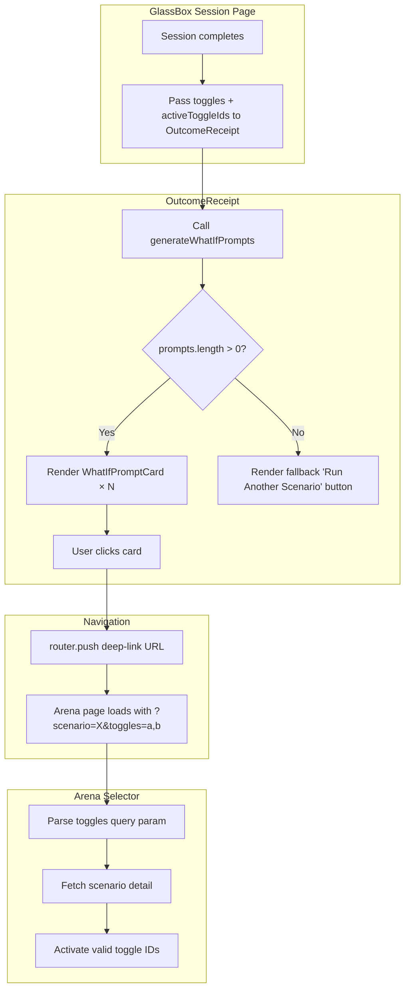

# Design Document: What-If Prompts

## Overview

Replace the generic "Run Another Scenario" CTA on the Outcome Receipt with contextual, curiosity-driven "What If" prompt cards. Each card references a specific inactive toggle and the negotiation outcome, deep-linking back to the Arena Selector with the suggested toggle pre-activated.

The feature is entirely frontend-driven. The backend already exposes `target_agent_role` on `ToggleDefinition` via `model_dump()` — the frontend type just needs to be extended to consume it. No new API endpoints are required.

### Key Design Decisions

1. **Pure frontend logic** — The Prompt Generator is a stateless utility module (`lib/whatIfPrompts.ts`), not a React component. This keeps it testable without DOM dependencies.
2. **Extend existing `ToggleDefinition`** — Add `target_agent_role` to the frontend interface. The backend already returns it; the frontend was ignoring it.
3. **Deep-link via query params** — `toggles` param uses comma-separated IDs, parsed on Arena page load after scenario detail is fetched.
4. **Max 3 prompts** — When >3 inactive toggles exist, prioritize diversity across `target_agent_role` values.

## Architecture



## Components and Interfaces

### 1. `lib/whatIfPrompts.ts` — Prompt Generator Module

Pure functions, no React dependencies.

```typescript
export interface WhatIfPrompt {
  text: string;
  toggleIds: string[];       // toggle IDs to activate (for deep-link)
  targetAgentName: string;   // resolved agent name for display
  toggleLabel: string;       // toggle label for display
}

export interface PromptGeneratorInput {
  toggles: ToggleDefinition[];          // all scenario toggles
  activeToggleIds: string[];            // toggles used in this run
  agents: AgentDefinition[];            // scenario agents (for name resolution)
  dealStatus: "Agreed" | "Blocked" | "Failed";
  finalSummary: Record<string, unknown>;
  scenarioId: string;
}

export function generateWhatIfPrompts(input: PromptGeneratorInput): WhatIfPrompt[];
export function buildDeepLinkUrl(scenarioId: string, toggleIds: string[]): string;
```

**Logic:**
1. Compute inactive toggles: `toggles.filter(t => !activeToggleIds.includes(t.id))`
2. If no inactive toggles (all were active), return single "all toggles off" prompt
3. Generate one prompt per inactive toggle using `buildPromptText()`
4. If >3 prompts, select 3 prioritizing different `target_agent_role` values
5. Return max 3 `WhatIfPrompt` objects

### 2. `OutcomeReceipt.tsx` — Extended Props

```typescript
// New props added to OutcomeReceiptProps
toggles?: ToggleDefinition[];    // scenario toggle definitions
activeToggleIds?: string[];      // toggle IDs used in current run
agents?: AgentDefinition[];      // scenario agents for name resolution
```

When `toggles` and `activeToggleIds` are provided, the component calls `generateWhatIfPrompts()` and renders prompt cards in place of the "Run Another Scenario" button. The "Reset with Different Variables" button is retained.

### 3. Arena Page — Toggle Query Param Handling

Extend the existing `useEffect` that handles `?scenario=` to also parse `?toggles=`:

```typescript
const togglesParam = searchParams.get("toggles");
// After scenarioDetail loads, activate valid toggles:
if (togglesParam && scenarioDetail) {
  const requestedIds = togglesParam.split(",");
  const validIds = requestedIds.filter(id =>
    scenarioDetail.toggles.some(t => t.id === id)
  );
  setActiveToggles(validIds);
}
```

The `toggles` param is ignored if no `scenario` param is present.

### 4. GlassBox Session Page — Data Passing

The session page already fetches `scenarioDetail`. It needs to:
1. Pass `scenarioDetail.toggles` to `OutcomeReceipt`
2. Extract `activeToggleIds` from the session URL or negotiation state and pass it down

Since `activeToggleIds` aren't currently available on the session page, we'll extract them from the `startNegotiation` call's URL params or store them in the session state. The simplest approach: add `active_toggles` to the query params when navigating to the session page (the arena page already has this data).

## Data Models

### Extended `ToggleDefinition` (frontend)

```typescript
// frontend/lib/api.ts — update existing interface
export interface ToggleDefinition {
  id: string;
  label: string;
  target_agent_role: string;  // NEW — already returned by backend
}
```

### `WhatIfPrompt` (new)

```typescript
export interface WhatIfPrompt {
  text: string;
  toggleIds: string[];
  targetAgentName: string;
  toggleLabel: string;
}
```

### Deep-Link URL Format

```
/arena?scenario={scenarioId}&toggles={toggleId1},{toggleId2}
```

### Session Page URL — Extended

```
/arena/session/{sessionId}?max_turns={N}&scenario={scenarioId}&toggles={id1},{id2}
```

The `toggles` param here carries the active toggle IDs from the current run so the Outcome Receipt can compute inactive toggles without an additional API call.


## Correctness Properties

*A property is a characteristic or behavior that should hold true across all valid executions of a system — essentially, a formal statement about what the system should do. Properties serve as the bridge between human-readable specifications and machine-verifiable correctness guarantees.*

### Property 1: Inactive toggle computation is correct

*For any* set of scenario toggle definitions and *any* subset of active toggle IDs, `generateWhatIfPrompts` SHALL produce prompts only for toggles whose IDs are NOT in the active set, and the number of prompts (before the max-3 cap) SHALL equal the number of inactive toggles.

**Validates: Requirements 1.1, 1.2**

### Property 2: Prompt text contains toggle label and resolved agent name

*For any* inactive toggle with a valid `target_agent_role` mapping to a scenario agent, the generated prompt text SHALL contain the toggle's `label` and the agent's `name` (not the role string).

**Validates: Requirements 1.3, 5.4**

### Property 3: All-active scenario produces baseline prompt

*For any* scenario where `activeToggleIds` contains every toggle ID in the scenario's toggle definitions, `generateWhatIfPrompts` SHALL return exactly one prompt, and that prompt's `toggleIds` SHALL be an empty array (representing "all toggles off").

**Validates: Requirements 1.4, 5.5**

### Property 4: Output length never exceeds 3

*For any* valid `PromptGeneratorInput`, the length of the array returned by `generateWhatIfPrompts` SHALL be at most 3.

**Validates: Requirements 1.5**

### Property 5: Role diversity maximization

*For any* scenario with more than 3 inactive toggles, the 3 selected prompts SHALL cover at least `min(3, uniqueRoleCount)` distinct `target_agent_role` values, where `uniqueRoleCount` is the number of unique roles among all inactive toggles.

**Validates: Requirements 1.6**

### Property 6: Deal-status-specific prompt content

*For any* "Agreed" outcome with a non-zero `current_offer`, the prompt text SHALL contain the formatted offer value. *For any* "Blocked" outcome, the prompt text SHALL reference the block. *For any* "Failed" outcome with `turns_completed`, the prompt text SHALL reference the turn count.

**Validates: Requirements 5.1, 5.2, 5.3**

### Property 7: Deep-link URL round-trip

*For any* scenario ID and *any* list of toggle IDs, parsing the URL produced by `buildDeepLinkUrl(scenarioId, toggleIds)` SHALL yield the original scenario ID and the original toggle ID list.

**Validates: Requirements 3.1, 3.2**

## Error Handling

| Scenario | Behavior |
|---|---|
| `toggles` or `activeToggleIds` props not provided to OutcomeReceipt | Fall back to existing "Run Another Scenario" button (legacy behavior) |
| `target_agent_role` doesn't match any agent in the agents array | Skip that toggle — don't generate a prompt for it |
| `toggles` query param contains invalid/unknown toggle IDs on Arena page | Silently ignore invalid IDs, activate only valid ones |
| `toggles` query param present without `scenario` param | Ignore `toggles` entirely |
| Empty `toggles` array (scenario has no toggles) | Show fallback "Run Another Scenario" button |
| `finalSummary` missing expected fields (current_offer, turns_completed) | Generate prompt text without the missing data point — use generic phrasing |
| `customPrompts` query param contains invalid Base64 or malformed JSON | Silently ignore — do not prefill any custom prompts, log warning to console |
| `customPrompts` query param contains an `agent_role` not in the scenario's agents | Silently ignore that role's entry, prefill only valid roles |
| `customPrompts` query param present without `scenario` param | Ignore `customPrompts` entirely |
| Advice item has empty or missing `suggested_prompt` | Do not render "Try This" button for that item |

## Architecture: Apply Advice Recommendation

### Overview

When a negotiation is Blocked or Failed, the Outcome Receipt already shows an advice section with `agent_role`, `issue`, and `suggested_prompt` per item. This feature adds a "Try This" button to each advice item that deep-links back to the Arena Selector with the recommended prompt prefilled for the specified agent.

### Deep-Link URL Format

```
/arena?scenario={scenarioId}&customPrompts={base64EncodedJson}
```

The `customPrompts` param is a Base64-encoded JSON string of `Record<string, string>`:

```typescript
// Encoding (in OutcomeReceipt)
const promptMap: Record<string, string> = { [item.agent_role]: item.suggested_prompt };
const encoded = btoa(JSON.stringify(promptMap));
const url = `/arena?scenario=${scenarioId}&customPrompts=${encodeURIComponent(encoded)}`;

// Decoding (in Arena page)
const raw = searchParams.get("customPrompts");
if (raw) {
  const decoded: Record<string, string> = JSON.parse(atob(decodeURIComponent(raw)));
  // Validate roles against scenarioDetail.agents before applying
}
```

Base64 is used because `suggested_prompt` can be multi-line, long text with special characters. URL-encoding raw JSON would be fragile and ugly. `encodeURIComponent` wraps the Base64 to handle `+`, `/`, `=` characters safely in URLs.

### Component Changes

#### OutcomeReceipt.tsx — "Try This" Button

Inside the existing `block-advice` section, add a button after each `<pre>` block:

```tsx
<button
  onClick={() => {
    const promptMap = { [String(item.agent_role)]: String(item.suggested_prompt) };
    const encoded = btoa(JSON.stringify(promptMap));
    router.push(`/arena?scenario=${scenarioId}&customPrompts=${encodeURIComponent(encoded)}`);
  }}
  className="mt-2 rounded-md bg-blue-600 px-3 py-1.5 text-xs font-medium text-white hover:bg-blue-700 transition-colors"
  data-testid={`try-this-btn-${i}`}
>
  Try This
</button>
```

The button replaces the italic "Paste this into Advanced Options…" instruction text. Only rendered when `item.suggested_prompt` is non-empty and `scenarioId` is available.

#### Arena Page — Parse `customPrompts` Query Param

Extend the existing scenario-loading `useEffect` to also handle `customPrompts`:

```typescript
// After scenarioDetail loads and scenario is selected:
const customPromptsParam = searchParams.get("customPrompts");
if (customPromptsParam && scenarioDetail) {
  try {
    const decoded: Record<string, string> = JSON.parse(atob(decodeURIComponent(customPromptsParam)));
    const validRoles = new Set(scenarioDetail.agents.map(a => a.role));
    const filtered: Record<string, string> = {};
    for (const [role, prompt] of Object.entries(decoded)) {
      if (validRoles.has(role) && typeof prompt === "string" && prompt.trim()) {
        filtered[role] = prompt;
      }
    }
    if (Object.keys(filtered).length > 0) {
      setCustomPrompts(filtered);
    }
  } catch {
    console.warn("Invalid customPrompts query parameter — ignoring");
  }
}
```

This runs after `scenarioDetail` is fetched, so it can validate roles. The `useEffect` on `selectedScenarioId` that resets `customPrompts` to `{}` fires first (on scenario change), so we need to apply the URL-based prompts in a separate effect that depends on `scenarioDetail` being loaded.

### Correctness Properties (Requirement 6)

#### Property 8: Custom prompts URL encoding round-trip

*For any* valid `Record<string, string>` mapping agent roles to prompt text, encoding via `btoa(JSON.stringify(map))` then decoding via `JSON.parse(atob(encoded))` SHALL produce an object deeply equal to the original map.

**Validates: Requirements 6.2, 6.3, 6.4**

#### Property 9: Only valid roles are prefilled

*For any* decoded custom prompts map and *any* scenario agent list, the Arena_Selector SHALL only apply prompts for roles that exist in the scenario's agent definitions. Roles not in the agent list SHALL be silently dropped.

**Validates: Requirements 6.6**

## Testing Strategy

### Property-Based Tests (fast-check, min 100 iterations each)

The Prompt Generator module (`lib/whatIfPrompts.ts`) is a pure function with clear input/output behavior — ideal for PBT. All 7 properties above will be implemented as property-based tests using `fast-check`.

- **Test file**: `frontend/__tests__/properties/whatIfPrompts.property.test.ts`
- **Library**: fast-check (already used in the project)
- **Iterations**: 100+ per property
- **Tag format**: `Feature: 260_what-if-prompts, Property N: {title}`

### Unit Tests (Vitest + React Testing Library)

- **Prompt Generator unit tests** (`frontend/__tests__/lib/whatIfPrompts.test.ts`):
  - Specific examples for each deal status text template
  - Edge case: scenario with exactly 0 toggles
  - Edge case: scenario with exactly 3 inactive toggles (no selection needed)
  - Edge case: all toggles active → baseline prompt

- **OutcomeReceipt component tests** (`frontend/__tests__/components/glassbox/OutcomeReceipt.test.tsx`):
  - Renders prompt cards when toggles/activeToggleIds provided
  - Retains "Reset with Different Variables" button alongside cards
  - Falls back to "Run Another Scenario" when no toggles provided
  - Falls back when toggles array is empty
  - Card click triggers navigation to correct deep-link URL

- **Arena page toggle param tests** (`frontend/__tests__/components/arena/ArenaPage.test.tsx`):
  - Parses and activates valid toggle IDs from URL
  - Ignores invalid toggle IDs
  - Ignores toggles param when scenario param is absent
  - Preserves existing scenario param behavior

### What Is NOT Tested

- Responsive layout (CSS breakpoints) — requires visual regression testing
- Prompt text "feeling curiosity-driven" — subjective, not computable

### Property-Based Tests for Apply Advice Recommendation

- **Test file**: `frontend/__tests__/properties/adviceDeepLink.property.test.ts`
- **Library**: fast-check
- **Iterations**: 100+ per property

**Property 8**: Generate random `Record<string, string>` maps (role → prompt text with unicode, newlines, special chars). Encode with `btoa(JSON.stringify(map))`, decode with `JSON.parse(atob(encoded))`, verify deep equality.

**Property 9**: Generate random decoded maps and random agent role lists. Filter the map to only roles in the agent list. Verify the filtered result contains no roles outside the agent list and retains all roles that were in both.

### Unit Tests for Apply Advice Recommendation

- **OutcomeReceipt advice button tests** (`frontend/__tests__/components/glassbox/OutcomeReceipt.test.tsx`):
  - Renders "Try This" button for each advice item with non-empty `suggested_prompt`
  - Does not render "Try This" button when `suggested_prompt` is empty/missing
  - Does not render "Try This" button when `scenarioId` is null
  - Click navigates to correct deep-link URL with Base64-encoded `customPrompts` param
  - Deep-link URL includes the `scenario` param

- **Arena page customPrompts param tests** (`frontend/__tests__/pages/arena-advanced-config.test.tsx` or similar):
  - Parses and prefills valid custom prompts from URL
  - Ignores roles not in the scenario's agent list
  - Ignores malformed Base64 / invalid JSON gracefully
  - Ignores `customPrompts` param when no `scenario` param is present
  - Agent card shows `hasCustomPrompt` indicator for prefilled agents
