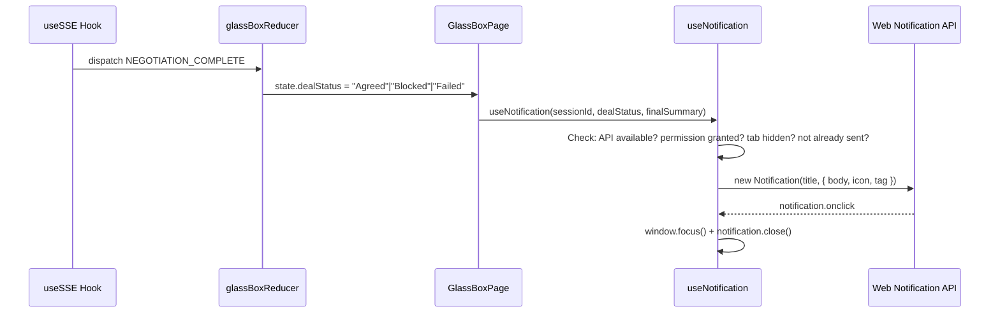

# Design Document

## Overview

This feature adds browser notifications (Web Notification API) to alert users when a negotiation reaches a terminal state (Agreed / Blocked / Failed). The entire implementation is frontend-only — the backend already emits `NegotiationCompleteEvent` via SSE, and the reducer already processes `NEGOTIATION_COMPLETE` actions.

The core deliverable is a `useNotification` React hook that:
1. Requests notification permission on mount (when permission is "default")
2. Fires a browser notification when a terminal state is reached while the tab is hidden
3. Maps deal status to notification title/body content
4. Handles click-to-focus, deduplication by session ID, and graceful degradation

## Architecture



The hook is a pure consumer of existing reducer state. No changes to `useSSE`, `glassBoxReducer`, or the SSE event types are needed.

## Components and Interfaces

### `useNotification` Hook

**File:** `frontend/hooks/useNotification.ts`

```typescript
interface UseNotificationOptions {
  sessionId: string;
  dealStatus: "Negotiating" | "Agreed" | "Blocked" | "Failed";
  finalSummary: Record<string, unknown> | null;
}

function useNotification(options: UseNotificationOptions): void;
```

**Responsibilities:**
- On mount: request permission if `Notification.permission === "default"`
- On `dealStatus` change to a terminal value: fire notification if tab is hidden, permission is granted, and not already sent for this session
- On click: `window.focus()` then `notification.close()`
- On unmount: reset the sent-tracking ref

### `buildNotificationContent` Pure Function

**File:** `frontend/lib/notificationContent.ts`

```typescript
interface NotificationContent {
  title: string;
  body: string;
}

function buildNotificationContent(
  dealStatus: "Agreed" | "Blocked" | "Failed",
  finalSummary: Record<string, unknown>,
): NotificationContent;
```

This is extracted as a pure function to make it independently testable and property-testable without DOM/hook overhead.

**Mapping:**

| dealStatus | title | body |
|---|---|---|
| `"Agreed"` | `"Deal Agreed"` | `"Final offer: {current_offer}"` or `"Your negotiation reached an agreement."` |
| `"Blocked"` | `"Deal Blocked"` | `"Blocked by: {blocked_by}"` or `"Your negotiation was blocked."` |
| `"Failed"` | `"Negotiation Failed"` | `"{reason}"` or `"Negotiation ended without agreement."` |

### Integration Point — GlassBoxPage

**File:** `frontend/app/(protected)/arena/session/[sessionId]/page.tsx`

Add a single hook call after the existing `useSSE` and `useReducer` setup:

```typescript
useNotification({
  sessionId: sessionId as string,
  dealStatus: state.dealStatus,
  finalSummary: state.finalSummary,
});
```

No other changes to the page component.

## Data Models

No new data models. The feature consumes existing types:

- `GlassBoxState.dealStatus`: `"Negotiating" | "Agreed" | "Blocked" | "Failed"` (from `glassBoxReducer.ts`)
- `GlassBoxState.finalSummary`: `Record<string, unknown> | null` (from `glassBoxReducer.ts`)
- `NegotiationCompleteEvent.session_id`: `string` (from `types/sse.ts`)

The `NotificationContent` interface is the only new type, defined inline in `notificationContent.ts`.

## Correctness Properties

*A property is a characteristic or behavior that should hold true across all valid executions of a system — essentially, a formal statement about what the system should do. Properties serve as the bridge between human-readable specifications and machine-verifiable correctness guarantees.*

### Property 1: Visibility gate

*For any* terminal deal status (Agreed, Blocked, or Failed) and any finalSummary, when permission is "granted", a browser notification is displayed if and only if `document.hidden` is `true`.

**Validates: Requirements 2.1, 2.2**

### Property 2: Status-specific content mapping

*For any* terminal deal status and any finalSummary containing the corresponding field (`current_offer` for Agreed, `blocked_by` for Blocked, `reason` for Failed), `buildNotificationContent` SHALL return a title matching the status label and a body containing the field value. Additionally, the notification SHALL include the application icon and set the tag to the session ID.

**Validates: Requirements 2.3, 2.4, 2.5, 2.6, 2.7**

### Property 3: Deduplication — at most one notification per session

*For any* session ID and any sequence of terminal state transitions, the notification service SHALL construct at most one `Notification` instance for that session ID.

**Validates: Requirements 5.1, 5.2**

## Error Handling

| Scenario | Handling |
|---|---|
| `window.Notification` undefined (e.g., SSR, unsupported browser) | Guard check at top of hook; skip all notification logic. No errors, no console warnings. |
| `Notification.requestPermission()` rejects | Catch error, `console.error(...)`, continue without notifications. |
| `new Notification()` constructor throws | Catch error, `console.error(...)`, continue. Mark session as "sent" to avoid retry loops. |
| `document.hidden` is `undefined` (edge case) | Treat as `false` (tab is visible) — do not fire notification. |
| Permission is `"denied"` | Skip notification dispatch silently. No console warnings. |

## Testing Strategy

### Property-Based Tests (fast-check)

Library: `fast-check` (already used in the project — see `fc-config.ts`)
Minimum iterations: 100 (30 in CI via `FAST_CHECK_CI` env var)

Each property test references its design document property:

1. **Property 1 — Visibility gate**: Generate random `{ dealStatus, finalSummary, hidden: boolean }` tuples. Mock `document.hidden` and `Notification` constructor. Assert notification is constructed iff `hidden === true`.
   - Tag: `Feature: 290_negotiation-completion-notification, Property 1: Visibility gate`

2. **Property 2 — Status-specific content mapping**: Generate random `{ dealStatus, current_offer, blocked_by, reason }` values. Call `buildNotificationContent(...)`. Assert title matches status label and body contains the relevant field value.
   - Tag: `Feature: 290_negotiation-completion-notification, Property 2: Status-specific content mapping`

3. **Property 3 — Deduplication**: Generate random sequences of terminal deal statuses (length 1–10). For a fixed session ID, invoke the notification logic for each. Assert `Notification` constructor is called exactly once.
   - Tag: `Feature: 290_negotiation-completion-notification, Property 3: Deduplication`

### Unit Tests (Vitest + React Testing Library)

- **Permission request on mount**: Mount hook with `Notification.permission = "default"`, verify `requestPermission()` called. Mount with `"granted"` and `"denied"`, verify not called.
- **requestPermission rejection**: Mock rejection, verify `console.error` and no throw.
- **API unavailable**: Delete `window.Notification`, mount hook, verify no errors.
- **Click handler**: Construct notification, simulate `onclick`, verify `window.focus()` and `notification.close()`.
- **Permission denied**: Set `"denied"`, trigger terminal state, verify no notification and no errors.
- **Constructor throws**: Mock constructor to throw, verify `console.error` and no propagation.
- **Unmount resets tracking**: Mount, trigger notification, unmount, remount same session, trigger again — verify second notification fires.

### Test File Locations

- `frontend/__tests__/properties/notificationContent.property.test.ts` — Property 2
- `frontend/__tests__/properties/useNotification.property.test.ts` — Properties 1 and 3
- `frontend/__tests__/hooks/useNotification.test.ts` — Unit tests
