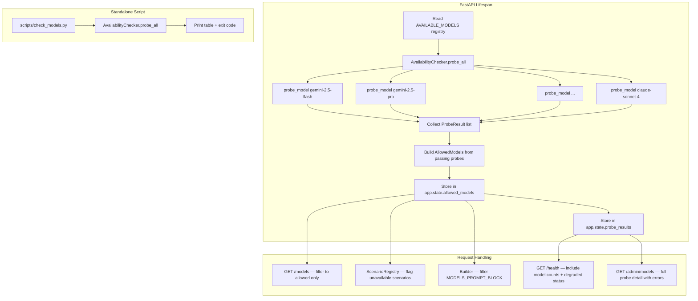
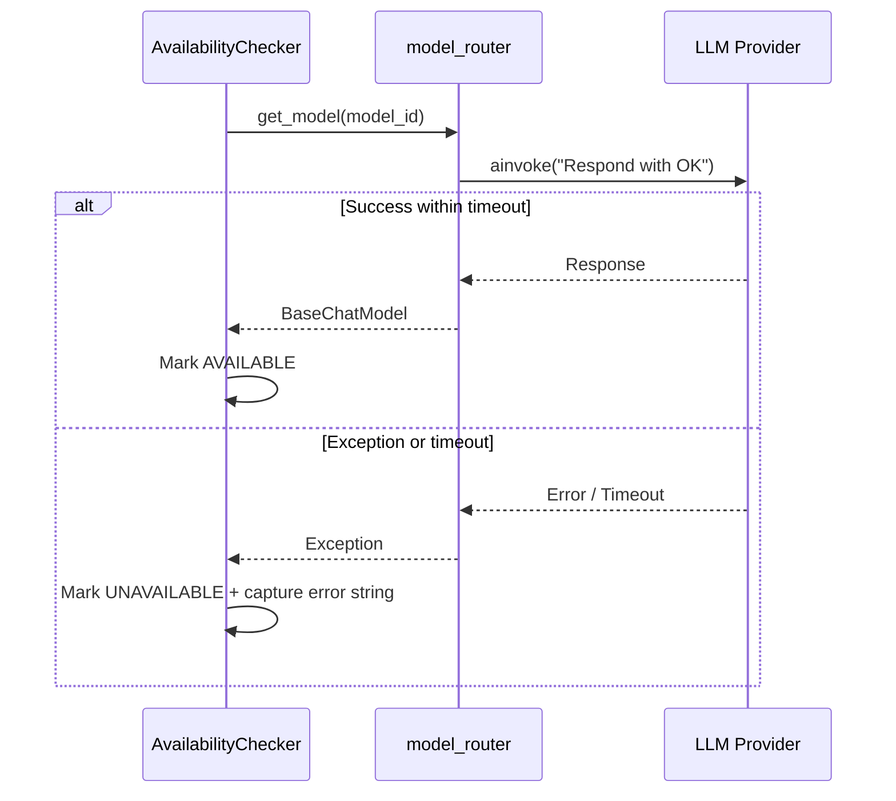

# Design Document: LLM Availability Checker

## Overview

The LLM Availability Checker adds a startup-time probe layer that tests every model in the registry before the application accepts traffic. The result is a frozen "allowed models" list stored in `app.state` that gates all downstream consumers: the `/models` endpoint, scenario validation, builder prompt injection, health reporting, and admin visibility.

The core insight is simple: shift model failure detection from mid-negotiation (catastrophic, unrecoverable) to startup (clean, surfaceable). The system degrades gracefully — zero available models doesn't crash the app, it just marks status as `degraded`.

### Key Design Decisions

1. **Probes run concurrently via `asyncio.gather`** with per-probe timeout. This keeps startup fast even with 8+ models.
2. **The allowed list is a `frozenset` + `tuple`** — immutable after construction, no locking needed.
3. **Probe results (including error reasons) are stored alongside the allowed list** so admin/health endpoints can report *why* a model failed, not just *that* it failed.
4. **The CLI script reuses the same `probe_model` coroutine** — no duplicated probe logic.
5. **Scenario validation is additive** — scenarios with unavailable models still load, they just get an `available: false` flag. This avoids breaking the registry when a single model is down.

## Architecture



### Probe Flow (per model)



## Components and Interfaces

### 1. `ModelEntry` Extensions (existing: `backend/app/orchestrator/available_models.py`)

Add three new entries to `AVAILABLE_MODELS`:
- `gemini-3.1-pro-preview` (family: `gemini`, label: "Gemini 3.1 Pro (Preview)")
- `gemini-3.1-flash-lite-preview` (family: `gemini`, label: "Gemini 3.1 Flash Lite (Preview)")
- `gemini-3-flash-preview` already exists — no change needed.

Add corresponding entries to `DEFAULT_MODEL_MAP` in `model_mapping.py` for all three providers (openai, anthropic, ollama).

### 2. `ProbeResult` Dataclass (new: `backend/app/orchestrator/availability_checker.py`)

```python
@dataclass(frozen=True)
class ProbeResult:
    model_id: str
    family: str
    available: bool
    error: str | None  # None if available, error message if not
    latency_ms: float  # probe round-trip time
```

### 3. `AllowedModels` (new: `backend/app/orchestrator/availability_checker.py`)

```python
@dataclass(frozen=True)
class AllowedModels:
    entries: tuple[ModelEntry, ...]       # only models that passed
    model_ids: frozenset[str]             # fast lookup set
    probe_results: tuple[ProbeResult, ...]  # full probe detail for all models
    probed_at: str                        # ISO timestamp of probe completion
```

### 4. `AvailabilityChecker` (new: `backend/app/orchestrator/availability_checker.py`)

```python
class AvailabilityChecker:
    PROBE_PROMPT: str = "Respond with OK"
    DEFAULT_TIMEOUT: float = 15.0

    async def probe_model(self, model_id: str, family: str, timeout: float) -> ProbeResult:
        """Probe a single model. Never raises — returns ProbeResult with error on failure."""

    async def probe_all(
        self,
        models: tuple[ModelEntry, ...],
        timeout: float = DEFAULT_TIMEOUT,
    ) -> AllowedModels:
        """Probe all models concurrently. Returns AllowedModels."""
```

Key behaviors:
- `probe_model` wraps `get_model()` + `model.ainvoke()` in `asyncio.wait_for(timeout)`.
- All exceptions are caught and stored in `ProbeResult.error` — never propagated.
- `probe_all` uses `asyncio.gather(*tasks)` for concurrency.
- Logs per-model results at WARNING (failures) and INFO (summary).

### 5. Lifespan Integration (modify: `backend/app/main.py`)

```python
@asynccontextmanager
async def lifespan(app: FastAPI):
    checker = AvailabilityChecker()
    allowed = await checker.probe_all(AVAILABLE_MODELS)
    app.state.allowed_models = allowed
    # ... existing startup logic ...
    yield
```

### 6. Models Endpoint (modify: `backend/app/routers/models.py`)

Change from reading `AVAILABLE_MODELS` directly to reading `request.app.state.allowed_models.entries`. Falls back to empty list if `allowed_models` not yet set.

### 7. Health Endpoint Enhancement (modify: `backend/app/routers/health.py`)

Add to `HealthResponse`:
- `models: { total_registered: int, total_available: int }`
- `unavailable_models: list[str]`
- Status becomes `"degraded"` when `total_available == 0`.

### 8. Scenario Registry Enhancement (modify: `backend/app/scenarios/registry.py`)

- Accept `allowed_model_ids: frozenset[str]` in constructor or via a setter after probes complete.
- `list_scenarios()` adds `available: bool` to each scenario dict.
- A scenario is `available` if every agent's `model_id` or `fallback_model_id` is in the allowed set.
- Log WARNING for scenarios with unavailable models during `_discover()`.

### 9. Builder Integration (modify: `backend/app/routers/builder.py`)

- Filter `MODELS_PROMPT_BLOCK` to only include allowed model IDs before injecting into LLM prompts.
- Read allowed models from `request.app.state.allowed_models`.

### 10. Admin Model Availability Endpoint (new route in: `backend/app/routers/admin.py`)

```
GET /api/v1/admin/models → requires verify_admin_session
```

Response:
```json
{
  "total_registered": 7,
  "total_available": 5,
  "total_unavailable": 2,
  "probed_at": "2025-01-15T10:30:00Z",
  "models": [
    {
      "model_id": "gemini-2.5-flash",
      "family": "gemini",
      "label": "Gemini 2.5 Flash",
      "status": "available",
      "error": null,
      "latency_ms": 234.5
    },
    {
      "model_id": "claude-sonnet-4",
      "family": "claude",
      "label": "Claude Sonnet 4",
      "status": "unavailable",
      "error": "TimeoutError: probe exceeded 15s",
      "latency_ms": 15000.0
    }
  ]
}
```

Returns 503 with `{"detail": "Probe results not yet available"}` if probes haven't completed.

### 11. CLI Script (new: `backend/scripts/check_models.py`)

- Loads settings from `.env` via `pydantic-settings` (same `Settings` class).
- Instantiates `AvailabilityChecker` and calls `probe_all()`.
- Prints formatted table to stdout.
- Exits with code 0 (all pass) or 1 (any fail).

Runnable as: `python -m scripts.check_models` or `python scripts/check_models.py`.

## Data Models

### ProbeResult

| Field       | Type          | Description                              |
|-------------|---------------|------------------------------------------|
| model_id    | str           | Model identifier from registry           |
| family      | str           | Model family (gemini, claude)            |
| available   | bool          | Whether probe succeeded                  |
| error       | str \| None   | Error message if probe failed            |
| latency_ms  | float         | Probe round-trip time in milliseconds    |

### AllowedModels

| Field         | Type                    | Description                                    |
|---------------|-------------------------|------------------------------------------------|
| entries       | tuple[ModelEntry, ...]  | Registry entries that passed probes             |
| model_ids     | frozenset[str]          | Fast lookup set of passing model IDs            |
| probe_results | tuple[ProbeResult, ...] | Full probe results for all registered models    |
| probed_at     | str                     | ISO 8601 timestamp of when probes completed     |

### HealthResponse (extended)

| Field              | Type       | Description                                      |
|--------------------|------------|--------------------------------------------------|
| status             | str        | "ok" or "degraded"                               |
| version            | str        | App version                                      |
| models             | dict       | `{total_registered: int, total_available: int}`  |
| unavailable_models | list[str]  | Model IDs that failed startup probe              |

### Scenario List Item (extended)

| Field     | Type | Description                                              |
|-----------|------|----------------------------------------------------------|
| available | bool | True if all agents have a reachable model (primary or fallback) |


## Correctness Properties

*A property is a characteristic or behavior that should hold true across all valid executions of a system — essentially, a formal statement about what the system should do. Properties serve as the bridge between human-readable specifications and machine-verifiable correctness guarantees.*

### Property 1: Registry derivation consistency

*For any* `AVAILABLE_MODELS` tuple, every entry's `model_id` SHALL appear in `VALID_MODEL_IDS` and in `MODELS_PROMPT_BLOCK`, and `VALID_MODEL_IDS` SHALL contain no IDs absent from `AVAILABLE_MODELS`.

**Validates: Requirements 1.2**

### Property 2: Probe exception safety

*For any* model probe that raises any exception (including `asyncio.TimeoutError`, `ConnectionError`, `ValueError`, or any arbitrary `Exception` subclass), the resulting `ProbeResult` SHALL have `available=False`, a non-empty `error` string, and the exception SHALL NOT propagate to the caller or affect other concurrent probes.

**Validates: Requirements 2.5, 8.2**

### Property 3: Allowed list contains exactly passing models

*For any* set of `ProbeResult` objects where a subset have `available=True`, the constructed `AllowedModels.model_ids` SHALL equal exactly the set of `model_id` values from passing probes, and `AllowedModels.entries` SHALL contain exactly the corresponding `ModelEntry` objects in registry order.

**Validates: Requirements 3.1**

### Property 4: AllowedModels immutability

*For any* constructed `AllowedModels` instance, attempting to assign to `entries`, `model_ids`, `probe_results`, or `probed_at` SHALL raise `FrozenInstanceError`, and the contained `entries` (tuple) and `model_ids` (frozenset) SHALL be inherently immutable collection types.

**Validates: Requirements 3.3**

### Property 5: Models endpoint returns exactly allowed models

*For any* `AllowedModels` instance stored in `app.state`, the `/models` endpoint SHALL return a list whose `model_id` values are exactly `AllowedModels.model_ids` — no more, no fewer.

**Validates: Requirements 4.1**

### Property 6: Scenario availability flag correctness

*For any* scenario with N agents each having a `model_id` and optional `fallback_model_id`, and *for any* `allowed_model_ids` frozenset, the scenario's `available` flag SHALL be `True` if and only if every agent has at least one of `{model_id, fallback_model_id}` present in `allowed_model_ids`.

**Validates: Requirements 5.3**

### Property 7: Builder prompt block filtering

*For any* subset of model IDs in the allowed list, the filtered `MODELS_PROMPT_BLOCK` SHALL contain exactly those model IDs (each appearing in a line) and SHALL NOT contain any model ID not in the allowed subset.

**Validates: Requirements 6.2**

### Property 8: Health and admin count consistency

*For any* set of probe results with T total models, A available, and U unavailable: `total_registered` SHALL equal T, `total_available` SHALL equal A, `total_unavailable` SHALL equal T - A, `unavailable_models` SHALL contain exactly the U failing model IDs, and the health `status` SHALL be `"degraded"` if and only if A equals 0.

**Validates: Requirements 7.1, 7.2, 7.3, 9.3**

### Property 9: Probe idempotence

*For any* fixed mock model configuration (deterministic success/failure per model), running `probe_all` twice SHALL produce `AllowedModels` instances with identical `model_ids`, identical `entries`, and identical `available` flags in `probe_results`.

**Validates: Requirements 8.3**

### Property 10: CLI output completeness

*For any* set of probe results, the CLI formatted table output SHALL contain every `model_id` from the registry, each with its correct `family`, and each with `PASS` if `available=True` or `FAIL` if `available=False`.

**Validates: Requirements 10.4**

### Property 11: CLI exit code reflects failures

*For any* set of probe results where at least one model has `available=False`, the CLI exit code SHALL be 1. When all models have `available=True`, the exit code SHALL be 0.

**Validates: Requirements 10.6, 10.7**

## Error Handling

| Error Condition | Handling Strategy | User Impact |
|---|---|---|
| Single probe timeout | `asyncio.TimeoutError` caught, model marked unavailable with timeout error message | Model excluded from allowed list; other probes unaffected |
| Single probe exception (any type) | Bare `except Exception` in `probe_model`, error string captured in `ProbeResult` | Same as timeout — isolated failure |
| All probes fail | `AllowedModels` constructed with empty entries; ERROR logged | App starts in degraded mode; `/models` returns `[]`; health status = `"degraded"` |
| `app.state.allowed_models` not yet set | Endpoints check `hasattr(app.state, 'allowed_models')`; return empty/503 | Admin endpoint returns 503; models endpoint returns `[]`; health omits model info |
| Model router `get_model()` raises `ModelNotAvailableError` | Caught by `probe_model` like any other exception | Model marked unavailable |
| LiteLLM provider API key missing | `ModelNotAvailableError` raised by `_instantiate_local_model`, caught by probe | Model marked unavailable with "Missing API key" error |
| CLI script can't load `.env` | `pydantic-settings` falls back to env vars / defaults | Script runs with whatever config is available |
| CLI script interrupted (Ctrl+C) | `KeyboardInterrupt` caught in `__main__` block, clean exit | Partial results not printed; exit code 1 |

## Testing Strategy

### Property-Based Tests (Hypothesis)

The project already uses Hypothesis extensively. Each correctness property maps to a property-based test with minimum 100 iterations.

**Library**: `hypothesis` (already in project dependencies)

**Test file**: `backend/tests/property/test_availability_checker_properties.py`

| Property | Test Description | Generator Strategy |
|---|---|---|
| P1: Registry derivation | Generate random ModelEntry tuples, rebuild VALID_MODEL_IDS and MODELS_PROMPT_BLOCK, verify consistency | `st.lists(st.builds(ModelEntry, model_id=st.text(min_size=1), family=st.text(min_size=1), label=st.text(min_size=1)))` |
| P2: Exception safety | Generate random exception types + messages, mock model to raise them, verify ProbeResult | `st.sampled_from([TimeoutError, ConnectionError, ValueError, RuntimeError, OSError])` combined with `st.text()` for messages |
| P3: Allowed list correctness | Generate random subsets of models as passing/failing, verify AllowedModels construction | `st.lists(st.booleans())` to determine pass/fail per model |
| P4: Immutability | Construct AllowedModels with random data, attempt mutations | Reuse P3 generators |
| P5: Models endpoint filtering | Generate random AllowedModels, mock app.state, call endpoint | Reuse P3 generators + httpx AsyncClient |
| P6: Scenario availability | Generate random agent configs with model_id/fallback_model_id, random allowed sets | `st.frozensets(st.sampled_from(VALID_MODEL_IDS))` for allowed, random agent model assignments |
| P7: Prompt block filtering | Generate random allowed model ID subsets, filter MODELS_PROMPT_BLOCK | `st.frozensets(st.sampled_from(VALID_MODEL_IDS))` |
| P8: Count consistency | Generate random probe results, verify health/admin counts | `st.lists(st.builds(ProbeResult, ...))` |
| P9: Idempotence | Generate random mock configs, run probe_all twice | Reuse P3 generators |
| P10: CLI output | Generate random probe results, verify table output | Reuse P3 generators |
| P11: CLI exit code | Generate random probe results with at least one failure | `st.lists(st.booleans(), min_size=1).filter(lambda x: not all(x))` |

**Configuration**: `@settings(max_examples=100)` minimum per test. Tag format: `# Feature: llm-availability-checker, Property N: <title>`

### Unit Tests (pytest)

Focus on specific examples, edge cases, and integration points:

- **Registry entries**: Verify the three new model entries exist with correct fields (Req 1.1)
- **DEFAULT_MODEL_MAP**: Verify new models have mappings for all three providers (Req 1.2)
- **Probe timeout**: Mock a slow model, verify timeout produces unavailable result (Req 2.4)
- **Zero models available**: Verify degraded mode — no crash, ERROR logged (Req 2.7)
- **Empty allowed list → empty /models**: Verify endpoint returns `[]` (Req 4.2)
- **Scenario WARNING logs**: Verify log output for unavailable model references (Req 5.2)
- **Health degraded status**: Verify status="degraded" when total_available=0 (Req 7.3)
- **Admin auth gating**: Verify 401 without cookie, 200 with valid cookie (Req 9.4)
- **Admin 503 before probes**: Verify response when allowed_models not set (Req 9.5)
- **CLI summary format**: Verify "X/Y models available" output format (Req 10.5)
- **CLI exit code 0**: All models pass → exit 0 (Req 10.7)

### Integration Tests (pytest + httpx AsyncClient)

- **Lifespan probe execution**: Verify `app.state.allowed_models` is set after startup
- **End-to-end /models filtering**: Start app with mocked models, verify endpoint reflects probe results
- **End-to-end /health with model info**: Verify health response includes model counts
- **Admin /models endpoint**: Full request cycle with auth cookie
- **Scenario registry with allowed models**: Load real scenario files, verify `available` flag

### Test Organization

```
backend/tests/
├── unit/
│   └── orchestrator/
│       └── test_availability_checker.py      # Unit tests for checker logic
├── integration/
│   └── test_availability_endpoints.py        # Endpoint integration tests
└── property/
    └── test_availability_checker_properties.py  # All 11 property tests
```
