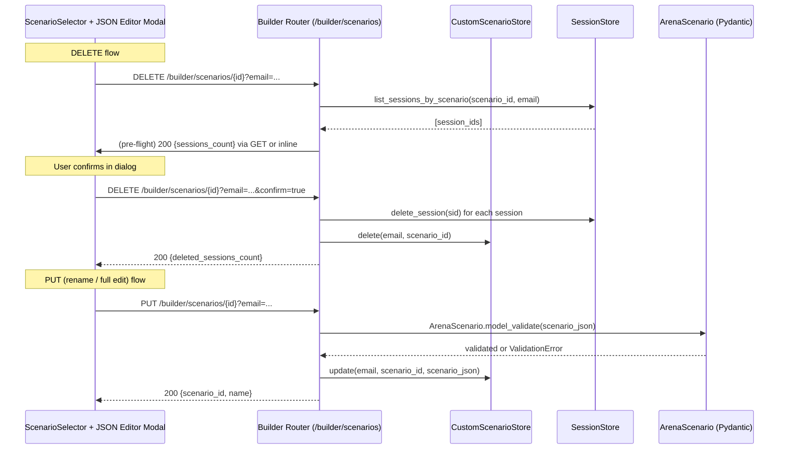

# Design Document: Scenario Management

## Overview

This feature adds delete-with-cascade, rename, and manual JSON editing for user-created custom scenarios. It extends the existing builder API (`/builder/scenarios`) with a PUT endpoint and enhances the DELETE endpoint to cascade-delete connected negotiation sessions. The frontend gains a JSON editor modal with inline rename, Pydantic validation feedback, and a cascade-delete confirmation dialog.

All operations are scoped to custom scenarios only — built-in file-based scenarios loaded by `ScenarioRegistry` remain immutable.

### Key Design Decisions

1. **Cascade delete is atomic**: If any session deletion fails, the entire operation aborts. This prevents orphaned state where a scenario is deleted but some sessions still reference it.
2. **PUT replaces the full `scenario_json`**: Partial updates are not supported. The client sends the complete scenario JSON, which is validated against `ArenaScenario` before overwrite. This keeps the API simple and avoids merge conflicts.
3. **Session lookup uses new `SessionStore` methods**: Rather than querying sessions through the builder store, we add `list_sessions_by_scenario` and `delete_session` directly to the `SessionStore` protocol. This keeps session concerns in the session layer.
4. **Frontend JSON editor uses a `<textarea>` with monospace font**: No heavy code editor dependency (Monaco/CodeMirror). A styled textarea with client-side JSON.parse validation before submission is sufficient for editing scenario JSON.

## Architecture



### Component Interaction

- **Builder Router** (`backend/app/routers/builder.py`): Gains `PUT /builder/scenarios/{id}` and enhanced `DELETE` with cascade logic.
- **CustomScenarioStore** (`backend/app/builder/scenario_store.py`): Gains `update()` method on both Firestore and SQLite implementations.
- **SessionStore** (`backend/app/db/base.py`): Protocol extended with `list_sessions_by_scenario()` and `delete_session()`.
- **SQLiteSessionClient** / **FirestoreSessionClient**: Implement the two new methods.
- **Frontend**: New `ScenarioEditorModal` component, updated `ScenarioSelector` with edit button, new API functions in `frontend/lib/builder/api.ts`.

## Components and Interfaces

### Backend: New SessionStore Methods

Added to the `SessionStore` protocol in `backend/app/db/base.py`:

```python
async def list_sessions_by_scenario(
    self, scenario_id: str, owner_email: str
) -> list[dict]:
    """Return session dicts where scenario_id matches and owner_email matches."""
    ...

async def delete_session(self, session_id: str) -> None:
    """Delete a single session by session_id."""
    ...
```

**FirestoreSessionClient** implementation:
- `list_sessions_by_scenario`: Query `negotiation_sessions` with `.where("scenario_id", "==", scenario_id).where("owner_email", "==", owner_email)`.
- `delete_session`: `self._collection.document(session_id).delete()`.

**SQLiteSessionClient** implementation:
- `list_sessions_by_scenario`: `SELECT data FROM negotiation_sessions WHERE created_at >= '1970-01-01'` then filter in Python where `doc["scenario_id"] == scenario_id and doc["owner_email"] == owner_email`. (Consistent with existing `list_sessions_by_owner` pattern that filters JSON in Python.)
- `delete_session`: `DELETE FROM negotiation_sessions WHERE session_id = ?`.

### Backend: CustomScenarioStore.update()

Added to both `CustomScenarioStore` (Firestore) and `SQLiteCustomScenarioStore`:

```python
async def update(
    self, email: str, scenario_id: str, scenario_json: dict
) -> bool:
    """Overwrite scenario_json and updated_at. Returns True if found."""
    ...
```

**Firestore**: `doc_ref.update({"scenario_json": scenario_json, "updated_at": now})`.
**SQLite**: `UPDATE custom_scenarios SET scenario_json = ?, updated_at = ? WHERE scenario_id = ? AND email = ?`.

### Backend: PUT /builder/scenarios/{scenario_id}

```python
class UpdateScenarioRequest(BaseModel):
    scenario_json: dict

@router.put("/scenarios/{scenario_id}")
async def update_scenario(
    scenario_id: str,
    body: UpdateScenarioRequest,
    email: str = Query(..., min_length=1),
    store=Depends(get_custom_scenario_store),
) -> dict:
    # 1. Validate scenario_json against ArenaScenario
    # 2. Check scenario exists and is owned by email
    # 3. store.update(email, scenario_id, validated.model_dump())
    # 4. Return {scenario_id, name, updated_at}
```

Returns:
- 200: `{scenario_id, name, updated_at}`
- 404: Scenario not found or not owned
- 422: Pydantic validation errors list
- 403: Attempt to update a built-in scenario (checked by store ownership — built-ins have no owner)

### Backend: Enhanced DELETE /builder/scenarios/{scenario_id}

The existing DELETE endpoint is extended with cascade logic:

```python
@router.delete("/scenarios/{scenario_id}")
async def delete_scenario(
    scenario_id: str,
    email: str = Query(..., min_length=1),
    store=Depends(get_custom_scenario_store),
    session_store: SessionStore = Depends(get_session_store),
) -> dict:
    # 1. Verify scenario exists and is owned by email
    # 2. list_sessions_by_scenario(scenario_id, email)
    # 3. Delete each session (abort on failure)
    # 4. Delete the scenario
    # 5. Return {scenario_id, deleted_sessions_count}
```

### Backend: GET /builder/scenarios/{scenario_id}/sessions/count

New lightweight endpoint for the frontend confirmation dialog:

```python
@router.get("/scenarios/{scenario_id}/sessions/count")
async def get_scenario_session_count(
    scenario_id: str,
    email: str = Query(..., min_length=1),
    store=Depends(get_custom_scenario_store),
    session_store: SessionStore = Depends(get_session_store),
) -> dict:
    # Returns {count: N}
```

### Frontend: ScenarioEditorModal Component

New component at `frontend/components/arena/ScenarioEditorModal.tsx`:

```typescript
interface ScenarioEditorModalProps {
  isOpen: boolean;
  onClose: () => void;
  scenarioId: string;
  scenarioJson: Record<string, unknown>;
  onSave: (updated: Record<string, unknown>) => Promise<void>;
}
```

Features:
- Inline editable name field at top (controlled input, max 100 chars)
- `<textarea>` with monospace font, 2-space indented JSON
- Client-side `JSON.parse` validation on change (red border + error message on invalid JSON)
- "Save" button calls PUT endpoint; "Cancel" discards changes
- Validation errors from backend displayed inline below textarea
- Loading state during save

### Frontend: Updated ScenarioSelector

- New `onEditCustom` callback prop alongside existing `onDeleteCustom`
- Pencil icon button (from Lucide `Pencil`) shown when a custom scenario is selected
- Edit/delete buttons only visible for custom scenarios (requirement 7.7)

### Frontend: Updated builder/api.ts

```typescript
export async function updateCustomScenario(
  email: string,
  scenarioId: string,
  scenarioJson: Record<string, unknown>,
): Promise<{ scenario_id: string; name: string; updated_at: string }>;

export async function getScenarioSessionCount(
  email: string,
  scenarioId: string,
): Promise<{ count: number }>;
```

The existing `deleteCustomScenario` function is unchanged — the cascade happens server-side.

## Data Models

### Existing Models (unchanged)

- **ArenaScenario** (`backend/app/scenarios/models.py`): Full Pydantic V2 model with cross-reference validation. Used as the validation gate for all scenario updates.
- **NegotiationStateModel** (`backend/app/models/negotiation.py`): Session state with `scenario_id` field linking to scenarios.
- **CustomScenarioStore document**: `{scenario_json: dict, created_at: datetime, updated_at: datetime}` keyed by `scenario_id`, scoped to user email.

### New Request/Response Models

```python
class UpdateScenarioRequest(BaseModel):
    scenario_json: dict

class UpdateScenarioResponse(BaseModel):
    scenario_id: str
    name: str
    updated_at: str

class DeleteScenarioResponse(BaseModel):
    scenario_id: str
    deleted_sessions_count: int
    detail: str

class SessionCountResponse(BaseModel):
    count: int
```

### Data Flow: Cascade Delete

1. Frontend fetches session count via `GET /builder/scenarios/{id}/sessions/count`
2. Frontend shows confirmation dialog: "This will delete N connected simulations"
3. On confirm, frontend calls `DELETE /builder/scenarios/{id}?email=...`
4. Backend: `list_sessions_by_scenario(scenario_id, email)` → get all session docs
5. Backend: For each session, `delete_session(session_id)` — if any fails, abort with 500
6. Backend: `store.delete(email, scenario_id)` — remove the custom scenario
7. Backend returns `{scenario_id, deleted_sessions_count}`


## Correctness Properties

*A property is a characteristic or behavior that should hold true across all valid executions of a system — essentially, a formal statement about what the system should do. Properties serve as the bridge between human-readable specifications and machine-verifiable correctness guarantees.*

### Property 1: Session lookup returns exactly the matching sessions

*For any* set of sessions with varying `scenario_id` and `owner_email` values stored in the SessionStore, calling `list_sessions_by_scenario(target_scenario_id, target_email)` should return exactly those sessions where both `scenario_id == target_scenario_id` and `owner_email == target_email`, and no others.

**Validates: Requirements 1.1, 6.1, 6.3, 6.4**

### Property 2: Cascade delete removes all connected sessions and returns correct count

*For any* custom scenario with N connected sessions (where N >= 0), after a successful cascade delete, `list_sessions_by_scenario` for that scenario should return an empty list, the scenario should no longer exist in the CustomScenarioStore, and the API response `deleted_sessions_count` should equal N.

**Validates: Requirements 1.2, 1.3**

### Property 3: Scenario update round-trip preserves data

*For any* valid `ArenaScenario` dict, if it is submitted via the PUT endpoint for an existing custom scenario, then retrieving that scenario via `store.get()` should return a `scenario_json` that is equivalent to the submitted dict, and the `updated_at` timestamp should be >= the previous `updated_at`.

**Validates: Requirements 3.1, 4.6, 5.3, 5.6**

### Property 4: Validation gate accepts valid scenarios and rejects invalid ones

*For any* dict that passes `ArenaScenario.model_validate()`, the PUT endpoint should accept it with 200. *For any* dict that fails `ArenaScenario.model_validate()`, the PUT endpoint should reject it with 422 and return a non-empty list of validation errors. Additionally, scenario names must be between 1 and 100 characters — names outside this range should be rejected.

**Validates: Requirements 3.2, 4.3, 4.4, 5.2, 5.4**

### Property 5: Session deletion removes the session

*For any* session stored in the SessionStore, after calling `delete_session(session_id)`, calling `get_session(session_id)` should raise `SessionNotFoundError`.

**Validates: Requirements 6.2, 6.5**

## Error Handling

### Backend Error Cases

| Condition | HTTP Status | Response |
|---|---|---|
| Scenario not found or not owned by user | 404 | `{"detail": "Scenario not found or not owned by this email"}` |
| Built-in scenario targeted | 403 | `{"detail": "Cannot modify built-in scenarios"}` |
| Invalid JSON against ArenaScenario | 422 | `{"detail": "Validation failed", "errors": [...]}` |
| Session deletion fails mid-cascade | 500 | `{"detail": "Cascade delete failed: could not delete session {id}"}` |
| Missing or empty email | 401 | `{"detail": "Valid email required"}` |
| Name too long (>100 chars) or empty | 422 | `{"detail": "Validation failed", "errors": [...]}` |

### Cascade Delete Atomicity

If any `delete_session` call fails during cascade:
1. The operation aborts immediately
2. The custom scenario is NOT deleted (it was not yet touched)
3. Sessions deleted before the failure remain deleted (no rollback — acceptable since they're orphaned data anyway, and the user can retry)
4. HTTP 500 is returned with the failing session_id

This is a pragmatic choice: true transactional rollback across Firestore sub-collections is not feasible without a distributed transaction coordinator. The scenario surviving the failure means the user can retry the delete.

### Frontend Error Handling

- **Invalid JSON syntax**: Caught by `JSON.parse()` before submission. Red border on textarea, error message below, Save button disabled.
- **422 from backend**: Validation errors displayed inline in the modal. Modal stays open for correction.
- **404/403/500**: Toast notification with error message. Modal closes on 404/403 (scenario gone or forbidden). Modal stays open on 500 (retry possible).
- **Network failure**: Generic error toast. Modal stays open.

## Testing Strategy

### Property-Based Tests (Hypothesis)

The project already uses Hypothesis extensively. Each property test runs a minimum of 100 iterations.

| Property | Test Location | Strategy |
|---|---|---|
| Property 1: Session lookup | `backend/tests/property/test_session_lookup.py` | Generate random sessions with varying scenario_ids/emails in SQLite. Query and verify exact match. |
| Property 2: Cascade delete | `backend/tests/property/test_cascade_delete.py` | Generate random scenario + N sessions in SQLite. Delete scenario. Verify empty session list and correct count. |
| Property 3: Update round-trip | `backend/tests/property/test_scenario_update.py` | Generate valid ArenaScenario dicts via Hypothesis. Save, update, get. Verify round-trip. |
| Property 4: Validation gate | `backend/tests/property/test_validation_gate.py` | Generate both valid and invalid scenario dicts. Verify accept/reject behavior. |
| Property 5: Session deletion | `backend/tests/property/test_session_deletion.py` | Generate sessions, delete, verify gone. Can be combined with Property 2 test file. |

**PBT Library**: Hypothesis (already in project dependencies)
**Tag format**: `# Feature: 320_scenario-management, Property N: <title>`

### Unit Tests (pytest)

| Area | Test Location | Cases |
|---|---|---|
| PUT endpoint | `backend/tests/unit/test_builder_update.py` | Valid update, 404 not found, 422 validation error, 403 built-in |
| Enhanced DELETE | `backend/tests/unit/test_builder_cascade_delete.py` | Cascade with 0/1/N sessions, 404, 500 on session failure |
| CustomScenarioStore.update | `backend/tests/unit/test_custom_scenario_store.py` | Update existing, update nonexistent, verify updated_at |
| Session count endpoint | `backend/tests/unit/test_session_count.py` | Count with 0/N sessions, 404 scenario |
| SQLiteSessionClient new methods | `backend/tests/unit/test_sqlite_session_methods.py` | list_sessions_by_scenario, delete_session |

### Frontend Tests (Vitest + RTL)

| Component | Test Location | Cases |
|---|---|---|
| ScenarioEditorModal | `frontend/__tests__/components/arena/ScenarioEditorModal.test.tsx` | Render with JSON, edit name, invalid JSON error, save success, save validation error, cancel |
| ScenarioSelector (edit button) | `frontend/__tests__/components/arena/ScenarioSelector.test.tsx` | Edit button visible for custom, hidden for built-in |
| Delete confirmation dialog | `frontend/__tests__/components/arena/DeleteConfirmDialog.test.tsx` | Shows session count, confirm triggers delete, cancel aborts |
| builder/api.ts (new functions) | `frontend/__tests__/lib/builder/api.test.ts` | updateCustomScenario, getScenarioSessionCount |
