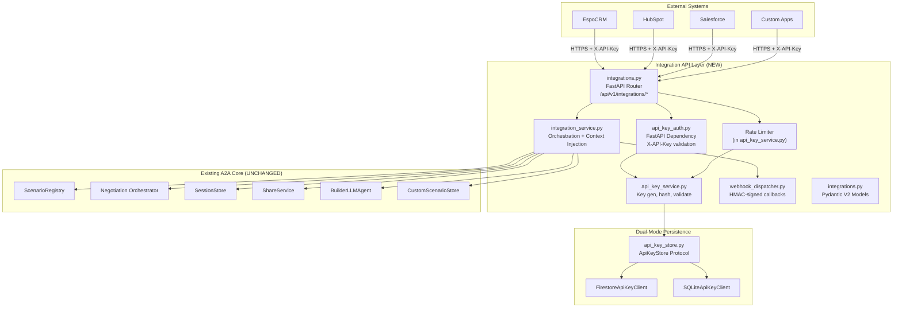

# Design Document: CRM Integration API

## Overview

The CRM Integration API adds a thin, authenticated API layer on top of the existing JuntoAI A2A negotiation engine. It enables external CRM systems (EspoCRM, HubSpot, Salesforce, custom integrations) to programmatically trigger AI negotiation simulations, poll for results, and receive completion callbacks — all without duplicating any core engine logic.

The API lives under `/api/v1/integrations/*` and introduces:
- **API key authentication** with SHA-256 hashed storage and scope-based access control
- **Rate limiting** (daily + per-minute) with standard headers
- **CRM context injection** that transforms CRM entity data into agent persona preambles
- **Async simulation execution** via FastAPI background tasks
- **Webhook callbacks** with HMAC-SHA256 signed payloads
- **Dynamic scenario building** from CRM profile data via the existing `BuilderLLMAgent`
- **Dual-mode persistence** (Firestore + SQLite) following the established Protocol pattern

**Key design principle**: The Integration API is a translation layer. It converts external API-key-authenticated requests into the same internal calls the frontend uses, adds auth/rate-limiting/context-injection, and returns structured results. Zero engine logic is duplicated.

## Architecture



### Request Flow

1. Request arrives at `/api/v1/integrations/*` with `X-API-Key` header
2. `api_key_auth` dependency computes SHA-256 hash, queries `ApiKeyStore` for match
3. Validates key is active, has required scope, and is within rate limits
4. Router delegates to `IntegrationService` for business logic
5. `IntegrationService` calls existing core services (ScenarioRegistry, orchestrator, SessionStore, ShareService)
6. For simulations: session created synchronously, negotiation runs as `BackgroundTask`
7. On completion: `WebhookDispatcher` sends HMAC-signed callback if `callback_url` was provided

### Design Decisions

| Decision | Rationale |
|---|---|
| FastAPI `Depends()` for auth | Matches existing middleware patterns; composable with scope checks |
| SHA-256 hash storage (not bcrypt) | API keys are high-entropy random bytes, not user passwords. SHA-256 is sufficient and fast for lookup-by-hash queries |
| Background tasks (not Celery) | Matches existing `start_negotiation` pattern; no new infrastructure needed |
| HMAC-SHA256 for webhooks | Industry standard (Stripe, GitHub); uses the API key itself as the secret — no additional secret management |
| Separate `api_key_service.py` and `integration_service.py` | Single responsibility: key management vs. simulation orchestration |
| Rate limit state in the key record | Avoids a separate rate-limit store; atomic increment on each request |

## Components and Interfaces

### New Files

| File | Responsibility |
|---|---|
| `backend/app/routers/integrations.py` | FastAPI router — all `/integrations/*` endpoints |
| `backend/app/services/api_key_service.py` | Key generation, hashing, validation, rate-limit checking |
| `backend/app/services/integration_service.py` | Simulation orchestration, context injection, session status mapping |
| `backend/app/services/webhook_dispatcher.py` | HMAC-signed webhook delivery with retry logic |
| `backend/app/models/integrations.py` | Pydantic V2 request/response models |
| `backend/app/db/api_key_store.py` | `ApiKeyStore` Protocol + Firestore and SQLite implementations |
| `backend/app/middleware/api_key_auth.py` | FastAPI dependency for API key authentication + scope enforcement |

### Modified Files

| File | Change |
|---|---|
| `backend/app/main.py` | Register `integrations_router` on `api_router` |
| `backend/app/db/__init__.py` | Add `get_api_key_store()` factory function |
| `backend/app/db/base.py` | Add `ApiKeyStore` Protocol definition |
| `backend/app/config.py` | Add integration settings (webhook retry config, default rate limits) |

### Component Interfaces

#### ApiKeyStore Protocol (`backend/app/db/base.py`)

```python
@runtime_checkable
class ApiKeyStore(Protocol):
    """Protocol for API key persistence — Firestore or SQLite."""

    async def create_key(self, key_record: dict) -> None: ...
    async def get_key_by_hash(self, key_hash: str) -> dict | None: ...
    async def get_key_by_id(self, key_id: str) -> dict | None: ...
    async def update_key(self, key_id: str, updates: dict) -> None: ...
    async def deactivate_key(self, key_id: str) -> None: ...
    async def increment_usage(self, key_id: str) -> int: ...
    async def reset_daily_usage(self, key_id: str) -> None: ...
```

#### ApiKeyService (`backend/app/services/api_key_service.py`)

```python
class ApiKeyService:
    def __init__(self, store: ApiKeyStore): ...

    async def generate_key(self, org_name: str, created_by_email: str,
                           scopes: list[str] | None = None,
                           rate_limit_daily: int | None = None,
                           rate_limit_per_minute: int | None = None) -> tuple[str, dict]:
        """Generate a new API key. Returns (raw_key, key_record)."""

    async def validate_key(self, raw_key: str) -> dict | None:
        """Validate an API key. Returns key_record or None."""

    async def check_rate_limit(self, key_record: dict) -> tuple[bool, dict]:
        """Check daily + per-minute limits. Returns (allowed, rate_info)."""

    async def deactivate_key(self, key_id: str) -> None:
        """Soft-delete: set active=false."""

    @staticmethod
    def hash_key(raw_key: str) -> str:
        """Compute SHA-256 hash of a raw API key."""

    @staticmethod
    def generate_raw_key() -> str:
        """Generate a2a_live_<base64url 32 random bytes>."""
```

#### IntegrationService (`backend/app/services/integration_service.py`)

```python
class IntegrationService:
    def __init__(self, session_store, share_service, scenario_registry,
                 api_key_service, custom_scenario_store): ...

    async def create_simulation(self, request: SimulateRequest,
                                key_record: dict,
                                background_tasks: BackgroundTasks) -> SimulateResponse: ...

    async def get_session_status(self, session_id: str, key_record: dict) -> SessionStatusResponse: ...

    def list_scenarios(self) -> list[dict]: ...

    def build_context_preamble(self, context: dict) -> str: ...

    def parse_context_preamble(self, preamble: str) -> dict: ...

    def inject_context_into_prompts(self, scenario: ArenaScenario,
                                     context: dict) -> ArenaScenario: ...
```

#### WebhookDispatcher (`backend/app/services/webhook_dispatcher.py`)

```python
class WebhookDispatcher:
    @staticmethod
    def compute_signature(payload_bytes: bytes, secret: str) -> str:
        """Compute HMAC-SHA256 signature."""

    @staticmethod
    def verify_signature(payload_bytes: bytes, secret: str, signature: str) -> bool:
        """Verify HMAC-SHA256 signature."""

    async def deliver(self, callback_url: str, payload: dict,
                      api_key_raw: str, local_mode: bool = False) -> bool:
        """Deliver webhook with retry logic. Returns True on success."""
```

#### API Key Auth Dependency (`backend/app/middleware/api_key_auth.py`)

```python
async def validate_api_key(
    x_api_key: str = Header(...),
    required_scope: str | None = None,
) -> dict:
    """FastAPI dependency — validates X-API-Key header and returns key_record.
    Raises HTTPException(401/403/429) on failure."""

def require_scope(scope: str) -> Callable:
    """Returns a dependency that validates the API key has the given scope."""
```

### Endpoint Summary

| Method | Path | Scope | Description |
|---|---|---|---|
| `GET` | `/integrations/health` | any | Health check + rate limit status |
| `GET` | `/integrations/scenarios` | `list_scenarios` | List available scenarios (filtered) |
| `POST` | `/integrations/simulate` | `simulate` | Trigger async simulation |
| `GET` | `/integrations/sessions/{session_id}` | `read_sessions` | Poll session status/results |
| `POST` | `/integrations/keys` | `manage_keys` | Generate new API key |
| `DELETE` | `/integrations/keys/{key_id}` | `manage_keys` | Deactivate API key |

## Data Models

### API Key Record

```python
{
    "key_id": str,           # Auto-generated UUID
    "key_hash": str,         # SHA-256 hex digest
    "key_prefix": str,       # First 4 chars after "a2a_live_"
    "org_name": str,
    "created_by_email": str,
    "scopes": list[str],     # ["simulate", "read_sessions", "list_scenarios"]
    "rate_limit_daily": int,  # Default: 100 (cloud) / 1000 (local)
    "rate_limit_per_minute": int,  # Default: 10
    "active": bool,
    "created_at": str,       # ISO 8601
    "last_used_at": str | None,
    "usage_today": int,
    "usage_today_date": str, # ISO date for midnight reset detection
    "minute_window_start": str | None,  # ISO 8601 for per-minute tracking
    "minute_window_count": int,         # Requests in current minute window
}
```

### Pydantic V2 Models (`backend/app/models/integrations.py`)

```python
class CreateKeyRequest(BaseModel):
    org_name: str = Field(..., min_length=1, max_length=200)
    scopes: list[str] | None = None
    rate_limit_daily: int | None = Field(None, gt=0, le=10000)
    rate_limit_per_minute: int | None = Field(None, gt=0, le=100)

class CreateKeyResponse(BaseModel):
    key_id: str
    api_key: str  # Raw key — shown once only
    org_name: str
    scopes: list[str]
    rate_limit_daily: int
    created_at: str
    warning: str = "Save this API key now. It will not be shown again."

class CRMContext(BaseModel):
    contact_name: str | None = None
    company: str | None = None
    role: str | None = None
    industry: str | None = None
    deal_value: float | None = Field(None, ge=0)
    deal_stage: str | None = None
    pain_points: list[str] | None = None
    competing_vendors: list[str] | None = None
    budget_approved: bool | None = None
    custom_fields: dict[str, Any] | None = None

class MyProfileInput(BaseModel):
    name: str = Field(..., min_length=1)
    role: str = Field(..., min_length=1)
    company: str = Field(..., min_length=1)
    goals: list[str] = Field(..., min_length=1)
    constraints: list[str] = Field(default_factory=list)
    tone: str | None = None

class TheirProfileInput(BaseModel):
    name: str = Field(..., min_length=1)
    role: str = Field(..., min_length=1)
    company: str = Field(..., min_length=1)
    industry: str | None = None
    goals: list[str] = Field(..., min_length=1)
    constraints: list[str] = Field(default_factory=list)
    tone: str | None = None

class DealContextInput(BaseModel):
    value: float | None = Field(None, ge=0)
    stage: str | None = None
    competing_vendors: list[str] | None = None
    deadline: str | None = None
    key_terms: list[str] | None = None

class RegulatorInput(BaseModel):
    name: str = Field(..., min_length=1)
    role: str = Field(..., min_length=1)
    rules: list[str] = Field(..., min_length=1)

class ScenarioBuilderInput(BaseModel):
    simulation_type: str = Field(..., min_length=1)
    my_profile: MyProfileInput
    their_profile: TheirProfileInput
    deal_context: DealContextInput | None = None
    regulator: RegulatorInput | None = None
    additional_instructions: str | None = None

class SimulateRequest(BaseModel):
    scenario_id: str = Field(..., min_length=1)
    active_toggles: list[str] | None = None
    context: CRMContext | None = None
    callback_url: str | None = None  # Validated as HTTPS (or HTTP in local mode)
    triggered_by: str | None = None
    scenario_builder: ScenarioBuilderInput | None = None

    @model_validator(mode="after")
    def validate_dynamic_scenario(self) -> "SimulateRequest":
        if self.scenario_id == "_dynamic" and self.scenario_builder is None:
            raise ValueError("scenario_builder is required when scenario_id is '_dynamic'")
        if self.scenario_id != "_dynamic" and self.scenario_builder is not None:
            raise ValueError("scenario_builder is forbidden when scenario_id is not '_dynamic'")
        return self

class SimulateResponse(BaseModel):
    session_id: str
    status: str = "running"
    viewer_url: str
    estimated_duration_seconds: int = 120
    created_at: str

class ParticipantSummary(BaseModel):
    role: str
    name: str
    agent_type: str
    summary: str

class EvaluationScores(BaseModel):
    fairness: int = Field(..., ge=1, le=10)
    mutual_respect: int = Field(..., ge=1, le=10)
    value_creation: int = Field(..., ge=1, le=10)
    satisfaction: int = Field(..., ge=1, le=10)
    overall_score: int = Field(..., ge=1, le=10)

class SessionOutcome(BaseModel):
    deal_status: Literal["Agreed", "Blocked", "Failed"]
    summary: str
    final_offer: float
    turns_completed: int
    warning_count: int
    duration_seconds: int
    participant_summaries: list[ParticipantSummary]
    evaluation_scores: EvaluationScores | None = None

class SessionStatusResponse(BaseModel):
    session_id: str
    scenario_id: str
    scenario_name: str
    status: str
    viewer_url: str
    turns_completed: int
    current_offer: float | None = None
    created_at: str
    completed_at: str | None = None
    outcome: SessionOutcome | None = None

class ScenarioAgent(BaseModel):
    role: str
    name: str
    type: str

class ScenarioToggle(BaseModel):
    id: str
    label: str
    target_agent_role: str

class ScenarioContextFields(BaseModel):
    required: list[str]
    optional: list[str]

class ScenarioListItem(BaseModel):
    id: str
    name: str
    description: str
    category: str
    difficulty: str
    agents: list[ScenarioAgent]
    toggles: list[ScenarioToggle]
    context_fields: ScenarioContextFields

class ScenarioListResponse(BaseModel):
    scenarios: list[ScenarioListItem]

class RateLimitInfo(BaseModel):
    daily_limit: int
    used_today: int
    remaining: int
    resets_at: str

class HealthResponse(BaseModel):
    status: str = "ok"
    version: str
    key_valid: bool = True
    org_name: str
    rate_limit: RateLimitInfo

class WebhookPayload(BaseModel):
    event: str = "simulation.completed"
    session_id: str
    scenario_id: str
    status: str
    outcome: dict
    viewer_url: str
    timestamp: str

class IntegrationErrorResponse(BaseModel):
    error: str
    message: str
    details: dict = Field(default_factory=dict)
```

### SQLite Schema (`integration_api_keys` table)

```sql
CREATE TABLE IF NOT EXISTS integration_api_keys (
    key_id TEXT PRIMARY KEY,
    key_hash TEXT NOT NULL UNIQUE,
    key_prefix TEXT NOT NULL,
    org_name TEXT NOT NULL,
    created_by_email TEXT NOT NULL,
    scopes TEXT NOT NULL,          -- JSON array
    rate_limit_daily INTEGER NOT NULL DEFAULT 1000,
    rate_limit_per_minute INTEGER NOT NULL DEFAULT 10,
    active INTEGER NOT NULL DEFAULT 1,
    created_at TEXT NOT NULL,
    last_used_at TEXT,
    usage_today INTEGER NOT NULL DEFAULT 0,
    usage_today_date TEXT,
    minute_window_start TEXT,
    minute_window_count INTEGER NOT NULL DEFAULT 0
);
CREATE INDEX IF NOT EXISTS idx_api_keys_hash ON integration_api_keys(key_hash);
```

### Firestore Collection

Collection: `integration_api_keys`, Document ID: `key_id`. Same fields as the SQLite schema, with `scopes` stored as a native Firestore array.

## Correctness Properties

*A property is a characteristic or behavior that should hold true across all valid executions of a system — essentially, a formal statement about what the system should do. Properties serve as the bridge between human-readable specifications and machine-verifiable correctness guarantees.*

### Property 1: API Key Generation and Validation Round-Trip

*For any* valid `org_name`, `scopes`, and `rate_limit_daily`, generating an API key and then validating it by computing SHA-256 of the raw key and querying the store SHALL return the original key record with matching metadata.

**Validates: Requirements 1.1, 2.1**

### Property 2: API Key Record Completeness

*For any* generated API key, the persisted record SHALL contain all required fields (`key_id`, `key_hash`, `key_prefix`, `org_name`, `created_by_email`, `scopes`, `rate_limit_daily`, `rate_limit_per_minute`, `active`, `created_at`) with correct types, and `key_prefix` SHALL equal the first 4 characters after `a2a_live_` in the raw key.

**Validates: Requirements 1.2**

### Property 3: Scope-Based Access Control

*For any* API key with scopes `S` and any endpoint requiring scope `R` where `R` is not in `S`, the authentication dependency SHALL reject the request with HTTP 403 and error code `insufficient_scope`.

**Validates: Requirements 2.4**

### Property 4: Rate Limit Enforcement

*For any* API key with `rate_limit_daily` of `D` and `usage_today` of `U`, if `U >= D` then the next request SHALL be rejected with HTTP 429. Similarly, *for any* key with `rate_limit_per_minute` of `M` and `minute_window_count` of `C`, if `C >= M` within the current 60-second window then the request SHALL be rejected with HTTP 429. Each successful request SHALL increment the appropriate counters.

**Validates: Requirements 3.1, 3.2, 3.4**

### Property 5: Rate Limit Header Consistency

*For any* successful response from `/api/v1/integrations/*`, the headers `X-RateLimit-Limit`, `X-RateLimit-Remaining`, and `X-RateLimit-Reset` SHALL be present, and `Remaining` SHALL equal `Limit - usage_today` for the authenticated key.

**Validates: Requirements 3.3**

### Property 6: Scenario List Field Filtering

*For any* scenario in the ScenarioRegistry, the integration scenarios endpoint SHALL return `id`, `name`, `description`, `category`, `difficulty`, `agents` (with only `role`, `name`, `type`), `toggles` (with only `id`, `label`, `target_agent_role`), and `context_fields`. The response SHALL NOT contain `model_id`, `persona_prompt`, `hidden_context_payload`, `budget`, `goals`, `output_fields`, or any other internal fields.

**Validates: Requirements 5.1, 5.2**

### Property 7: Context Preamble Round-Trip

*For any* valid `CRMContext` object, building a context preamble string and then parsing the preamble's key-value lines SHALL recover the original field names and values — lists as comma-separated strings, booleans as "Yes"/"No", and `deal_value` as a currency-formatted string.

**Validates: Requirements 7.1, 7.3, 7.5**

### Property 8: Context Preamble Injection Preserves Original Prompt

*For any* non-empty `CRMContext` and any agent `persona_prompt`, the injected prompt SHALL start with the context preamble block and end with the original `persona_prompt` content, with no content lost or reordered.

**Validates: Requirements 7.2**

### Property 9: Session Status Excludes Internal Data

*For any* session (running or completed), the `SessionStatusResponse` SHALL NOT contain `history`, `hidden_context`, `custom_prompts`, `model_overrides`, `agent_states`, or `agent_memories` fields.

**Validates: Requirements 8.4**

### Property 10: Email triggered_by Sets Owner and Integration Metadata

*For any* simulate request where `triggered_by` is a valid email address, the created session SHALL have `owner_email` set to that email, `source` set to `"integration"`, and `integration_org` set to the API key's `org_name`.

**Validates: Requirements 9.1, 9.2**

### Property 11: Non-Email triggered_by Uses Synthetic Owner

*For any* simulate request where `triggered_by` is not a valid email (display name, empty string) or is not provided, the created session SHALL have `owner_email` set to `"integration:<org_name>"`.

**Validates: Requirements 9.3**

### Property 12: HMAC-SHA256 Webhook Signature Correctness

*For any* webhook payload bytes and API key string, `compute_signature(payload, key)` SHALL produce a hex digest that equals `hmac.new(key.encode(), payload, hashlib.sha256).hexdigest()`, and `verify_signature(payload, key, signature)` SHALL return `True` for a correctly computed signature and `False` for any tampered payload or incorrect key.

**Validates: Requirements 11.2**

### Property 13: Error Response Format Consistency

*For any* error response from the Integration API (status codes 401, 403, 404, 422, 429, 500, 503), the response body SHALL conform to the schema `{"error": str, "message": str, "details": dict}` with the correct error code for the condition.

**Validates: Requirements 13.1, 13.2**

### Property 14: Pydantic Model Serialization Round-Trip

*For any* valid instance of `CreateKeyRequest`, `SimulateRequest`, `CRMContext`, `SessionStatusResponse`, `HealthResponse`, `WebhookPayload`, `ScenarioBuilderInput`, or `IntegrationErrorResponse`, serializing to JSON via `.model_dump_json()` and deserializing back via `.model_validate_json()` SHALL produce an equivalent model instance.

**Validates: Requirements 14.3**

## Error Handling

### Error Response Format

All Integration API errors use a consistent JSON envelope:

```json
{
    "error": "<error_code>",
    "message": "<human-readable description>",
    "details": {}
}
```

### Error Code Mapping

| HTTP Status | Error Code | Trigger Condition |
|---|---|---|
| 401 | `invalid_api_key` | Missing `X-API-Key` header or no matching hash in store |
| 403 | `key_deactivated` | Key exists but `active` is `false` |
| 403 | `insufficient_scope` | Key lacks the required scope for the endpoint |
| 404 | `scenario_not_found` | `scenario_id` not in ScenarioRegistry |
| 404 | `session_not_found` | `session_id` not in SessionStore |
| 422 | `validation_error` | Pydantic validation failure or invalid toggle IDs |
| 422 | `scenario_generation_failed` | `BuilderLLMAgent` fails to produce valid scenario |
| 429 | `rate_limit_exceeded` | Daily or per-minute limit exceeded |
| 500 | `simulation_failed` | Unhandled error during simulation creation/execution |
| 503 | `service_unavailable` | Core engine temporarily unavailable |

### Error Handling Strategy

- **Auth errors (401/403)**: Raised in `api_key_auth.py` dependency before the route handler executes. No side effects.
- **Rate limit errors (429)**: Raised in `api_key_auth.py` after key validation. Includes `retry_after_seconds`, `limit`, and `used` in `details`.
- **Validation errors (422)**: Pydantic handles request body validation automatically. Toggle validation happens in `IntegrationService` and raises a custom `IntegrationError`.
- **Not found errors (404)**: Raised by `ScenarioRegistry.get_scenario()` (existing `ScenarioNotFoundError`) and `SessionStore.get_session_doc()` (existing `SessionNotFoundError`). Caught and mapped to integration error format.
- **Internal errors (500/503)**: Caught by a top-level exception handler on the integration router. Logged with full traceback, returned as generic error to client.

### Webhook Error Handling

- **Cloud mode**: 3 retries with exponential backoff (5s, 30s, 120s). Non-2xx or network error triggers retry.
- **Local mode**: Single attempt, best-effort. Failure is logged but not retried.
- After all retries exhausted: log the failure, cease delivery. No dead-letter queue (post-MVP consideration).

## Testing Strategy

### Property-Based Tests (Hypothesis)

The feature is well-suited for property-based testing. The core logic involves pure functions (key generation, hashing, context preamble building/parsing, HMAC signing) and data transformations (Pydantic model serialization, field filtering) that have clear universal properties.

**Library**: [Hypothesis](https://hypothesis.readthedocs.io/) (already in use across the project)

**Configuration**: Minimum 100 iterations per property test via `@settings(max_examples=100)`.

**Tag format**: `# Feature: 350_crm-integration-api, Property {N}: {title}`

Each correctness property (P1–P14) maps to a single Hypothesis property test in `backend/tests/property/test_integration_properties.py`.

### Unit Tests (pytest)

Unit tests cover specific examples, edge cases, and error conditions:

- **API key defaults**: Verify default scopes and rate limits for cloud/local modes
- **Key deactivation**: Verify soft-delete preserves record
- **Auth error cases**: 401 for missing/invalid key, 403 for deactivated/insufficient scope
- **Rate limit 429 responses**: Verify response body includes `retry_after_seconds`, `limit`, `used`
- **Scenario not found**: 404 for invalid `scenario_id`
- **Session not found**: 404 for invalid `session_id`
- **Dynamic scenario validation**: `scenario_builder` required when `_dynamic`, forbidden otherwise
- **Builder failure**: 422 when `BuilderLLMAgent` fails
- **Webhook retry logic**: 3 retries with correct delays in cloud mode, 1 attempt in local mode
- **Empty context**: No preamble injected when context is empty/missing
- **triggered_by edge cases**: `None`, empty string, display name, valid email

### Integration Tests (pytest + httpx AsyncClient)

Integration tests verify the full request/response cycle through FastAPI:

- **Health endpoint**: Valid key returns 200 with all fields
- **Scenarios endpoint**: Returns filtered scenario list
- **Simulate endpoint**: Returns 201 with session_id, viewer_url
- **Session status endpoint**: Returns correct fields for running/completed sessions
- **Key management endpoints**: Create and deactivate keys
- **Rate limit headers**: Present on all successful responses
- **Error format consistency**: All error responses match the envelope schema

### Test File Structure

```
backend/tests/
├── unit/
│   └── integration_api/
│       ├── test_api_key_service.py
│       ├── test_context_injector.py
│       ├── test_webhook_dispatcher.py
│       └── test_integration_models.py
├── integration/
│   └── test_integration_endpoints.py
└── property/
    └── test_integration_properties.py
```

### Mocking Strategy

- **SessionStore, ShareStore, ApiKeyStore**: Use in-memory SQLite (`:memory:`) implementations
- **ScenarioRegistry**: Use a test registry with fixture scenarios
- **BuilderLLMAgent**: Mock LLM calls, return pre-built `ArenaScenario` JSON
- **httpx (webhooks)**: Mock `httpx.AsyncClient.post` for webhook delivery tests
- **Background tasks**: Use `TestClient` which executes background tasks synchronously
