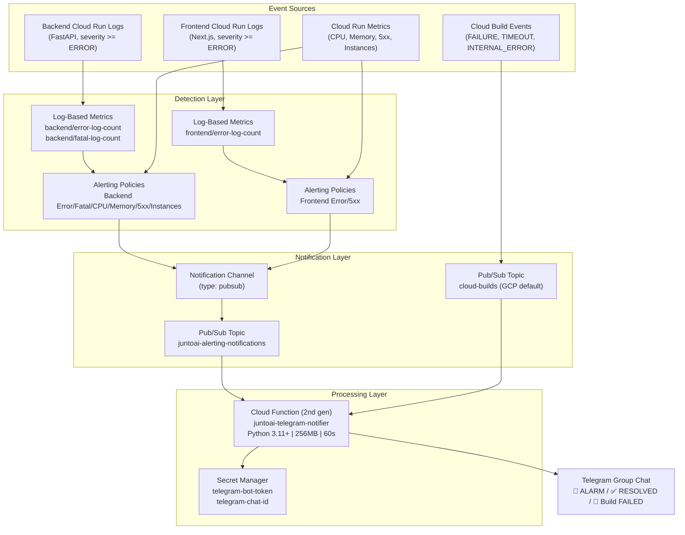

# Design Document: GCP Telegram Alerting Pipeline

## Overview

This design describes a centralized alerting pipeline for the JuntoAI A2A MVP on GCP. The pipeline detects errors from Cloud Run structured logs, monitors application metrics, catches Cloud Build CI/CD failures, and delivers formatted notifications to a Telegram group chat.

The data flow is:

```
Event Sources → Log-Based Metrics / Alerting Policies / Cloud Build Events
    → Pub/Sub Topic (juntoai-alerting-notifications)
        → Cloud Function (Python 3.11+, 2nd gen)
            → Telegram Bot API (sendMessage, HTML)
```

This is the GCP-native equivalent of the existing AWS pipeline (CloudWatch → SNS → Lambda → Telegram), adapted to use Cloud Logging log-based metrics, GCP Monitoring alerting policies, Pub/Sub, and a Cloud Function.

### Design Decisions

1. **Single Pub/Sub topic** — All alert types (log-based, metric, Cloud Build) converge on one topic. This simplifies the Cloud Function subscription model and matches the AWS SNS pattern.
2. **Cloud Function 2nd gen** — Uses Cloud Run under the hood, supports Python 3.11+, and integrates natively with Pub/Sub event triggers.
3. **Secret Manager at runtime** — Telegram credentials are fetched via the Secret Manager API at function cold start and cached in module-level globals. Never mounted as env vars (avoids leaking into Terraform state).
4. **Separate log-based metrics per service** — Backend and frontend get independent metrics and alerting policies so alerts clearly identify which service is affected.
5. **Cloud Build uses the default `cloud-builds` topic** — GCP automatically publishes build events to this topic. The Cloud Function subscribes to it directly rather than creating a custom topic.

## Architecture



## Components and Interfaces

### 1. Terraform Module (`infra/modules/alerting/`)

Files following existing module conventions:

| File | Purpose |
|------|---------|
| `main.tf` | All resources: Pub/Sub topic, notification channel, log-based metrics, alerting policies, Cloud Function, service account, IAM bindings, Secret Manager secrets, API enablement |
| `variables.tf` | Input variables: `gcp_project_id`, `gcp_region`, `backend_service_name`, `frontend_service_name`, alerting threshold variables with defaults |
| `outputs.tf` | Outputs: topic name, function URL, service account email |
| `backend.tf` | `terraform { backend "gcs" {} }` |
| `terragrunt.hcl` | Terragrunt config with `include "root"` and dependencies on `iam` and `cloud-run` modules |

### 2. Cloud Function Source (`infra/modules/alerting/function/`)

| File | Purpose |
|------|---------|
| `main.py` | Entry point: `handle_pubsub(cloud_event)` — parses, detects type, formats, sends |
| `requirements.txt` | `functions-framework`, `google-cloud-secret-manager`, `requests` |

### 3. Cloud Function Internal Modules

The Cloud Function `main.py` contains these logical components:

| Component | Responsibility |
|-----------|---------------|
| `_get_secrets()` | Fetches and caches Telegram bot token and chat ID from Secret Manager |
| `detect_message_type(payload)` | Returns `"alerting_policy"`, `"cloud_build"`, or `"unknown"` based on payload structure |
| `parse_alerting_incident(payload)` | Extracts policy name, state, resource labels, summary, start time from GCP Monitoring notification schema |
| `parse_cloud_build_event(payload)` | Extracts trigger name, status, branch, commit SHA, duration, log URL from Cloud Build event schema |
| `format_alerting_message(incident)` | Produces HTML string with 🚨/✅ prefix based on incident state |
| `format_cloud_build_message(build)` | Produces HTML string with 🔴 prefix for failed builds |
| `send_telegram_message(text)` | POSTs to Telegram Bot API with `parse_mode=HTML`, raises on non-2xx |

### Interface: Pub/Sub Message Schemas

**Alerting Policy Notification** (GCP Monitoring → Pub/Sub):
```json
{
  "incident": {
    "policy_name": "Backend Error Log Rate",
    "state": "open" | "closed",
    "resource": {
      "labels": {
        "service_name": "juntoai-backend",
        "project_id": "juntoai-a2a-mvp"
      }
    },
    "condition_name": "backend/error-log-count above 5",
    "summary": "...",
    "started_at": 1234567890,
    "ended_at": null | 1234567890,
    "url": "https://console.cloud.google.com/monitoring/alerting/incidents/..."
  },
  "version": "1.2"
}
```

**Cloud Build Event** (Cloud Build → `cloud-builds` topic):
```json
{
  "id": "build-id-123",
  "status": "FAILURE" | "SUCCESS" | "TIMEOUT" | "INTERNAL_ERROR",
  "substitutions": {
    "_REGION": "europe-west1",
    "TRIGGER_NAME": "juntoai-cicd-backend",
    "SHORT_SHA": "abc1234",
    "BRANCH_NAME": "main"
  },
  "logUrl": "https://console.cloud.google.com/cloud-build/builds/...",
  "startTime": "2025-01-01T00:00:00Z",
  "finishTime": "2025-01-01T00:05:00Z",
  "source": {
    "repoSource": {
      "branchName": "main",
      "commitSha": "abc1234567890"
    }
  }
}
```

### Interface: Telegram Output Messages

**Alerting Policy — Firing:**
```html
🚨 <b>ALARM: Backend Error Log Rate</b>

<b>State:</b> FIRING
<b>Resource:</b> juntoai-backend
<b>Condition:</b> backend/error-log-count above 5
<b>Started:</b> 2025-01-01 12:00:00 UTC
<b>Summary:</b> Error log count exceeded threshold...
<b>Link:</b> <a href="...">View Incident</a>
```

**Alerting Policy — Resolved:**
```html
✅ <b>RESOLVED: Backend Error Log Rate</b>

<b>State:</b> RESOLVED
<b>Resource:</b> juntoai-backend
<b>Condition:</b> backend/error-log-count above 5
<b>Resolved:</b> 2025-01-01 12:05:00 UTC
```

**Cloud Build Failure:**
```html
🔴 <b>Build FAILED: juntoai-cicd-backend</b>

<b>Status:</b> FAILURE
<b>Branch:</b> main
<b>Commit:</b> abc1234
<b>Duration:</b> 5m 12s
<b>Logs:</b> <a href="...">View Build Logs</a>
```

## Data Models

### Terraform Variables (with defaults)

```hcl
variable "gcp_project_id" { type = string }
variable "gcp_region"     { type = string }

variable "backend_service_name"  { type = string }
variable "frontend_service_name" { type = string }

# Alerting thresholds — tunable without modifying module source
variable "backend_error_threshold"    { type = number, default = 5 }
variable "backend_fatal_threshold"    { type = number, default = 0 }
variable "frontend_error_threshold"   { type = number, default = 5 }
variable "backend_cpu_threshold"      { type = number, default = 0.8 }
variable "backend_memory_threshold"   { type = number, default = 0.85 }
variable "backend_5xx_threshold"      { type = number, default = 10 }
variable "frontend_5xx_threshold"     { type = number, default = 10 }
variable "backend_instance_threshold" { type = number, default = 10 }

# Alerting policy config
variable "notification_rate_limit_seconds" { type = number, default = 300 }
variable "auto_close_seconds"              { type = number, default = 1800 }
```

### Python Data Classes (Cloud Function internal)

```python
@dataclass
class AlertIncident:
    policy_name: str
    state: str          # "open" or "closed"
    condition_name: str
    resource_labels: dict[str, str]
    summary: str
    started_at: int | None
    ended_at: int | None
    url: str

@dataclass
class CloudBuildEvent:
    build_id: str
    status: str         # "FAILURE", "TIMEOUT", "INTERNAL_ERROR"
    trigger_name: str
    branch: str
    commit_sha: str
    log_url: str
    start_time: str
    finish_time: str
    duration_seconds: float
```

### Terraform Outputs

```hcl
output "pubsub_topic_name" {
  value = google_pubsub_topic.alerting.name
}

output "notifier_function_url" {
  value = google_cloudfunctions2_function.notifier.url
}

output "alerting_sa_email" {
  value = google_service_account.alerting.email
}
```


## Correctness Properties

*A property is a characteristic or behavior that should hold true across all valid executions of a system — essentially, a formal statement about what the system should do. Properties serve as the bridge between human-readable specifications and machine-verifiable correctness guarantees.*

Note: Requirements 1–4, 7, 8, and 10 are entirely IaC (Terraform) configuration. PBT does not apply to those — they are validated via Terraform plan/validate smoke tests and structural tests (parsing `variables.tf`, `outputs.tf`). The properties below cover the Cloud Function logic (Requirements 5, 6, 9).

### Property 1: Message type detection correctness

*For any* valid Pub/Sub payload, if the payload contains an `incident` field, `detect_message_type` SHALL return `"alerting_policy"`; if the payload contains a `status` field matching the Cloud Build schema, it SHALL return `"cloud_build"`; otherwise it SHALL return `"unknown"`.

**Validates: Requirements 9.1**

### Property 2: SUCCESS events are discarded

*For any* Cloud Build event payload where `status = "SUCCESS"`, the notifier function SHALL not produce a Telegram message (the event is silently discarded).

**Validates: Requirements 5.3**

### Property 3: Alerting policy parse round-trip

*For any* valid `AlertIncident` object, serializing it to the GCP Monitoring notification JSON schema and then parsing it back with `parse_alerting_incident` SHALL produce an equivalent `AlertIncident` with identical `policy_name`, `state`, `condition_name`, `resource_labels`, `summary`, `started_at`, `ended_at`, and `url` fields.

**Validates: Requirements 9.2, 9.6**

### Property 4: Cloud Build parse round-trip

*For any* valid `CloudBuildEvent` object, serializing it to the Cloud Build event JSON schema and then parsing it back with `parse_cloud_build_event` SHALL produce an equivalent `CloudBuildEvent` with identical `trigger_name`, `status`, `branch`, `commit_sha`, `log_url`, `start_time`, `finish_time`, and `duration_seconds` fields.

**Validates: Requirements 9.3, 9.7**

### Property 5: Alerting policy format completeness

*For any* valid alerting policy notification payload, the formatted Telegram message SHALL: (a) start with `🚨` when `incident.state` is `"open"` or `✅` when `incident.state` is `"closed"`, (b) contain the `policy_name`, `condition_name`, resource `service_name` label, `summary`, and incident start time, and (c) contain `<b>` HTML tags for field labels.

**Validates: Requirements 6.4, 6.8, 9.4**

### Property 6: Cloud Build format completeness

*For any* valid Cloud Build event payload with a failure status (`FAILURE`, `TIMEOUT`, or `INTERNAL_ERROR`), the formatted Telegram message SHALL: (a) start with `🔴`, (b) contain the trigger name, build status, branch name, commit SHA, duration, and log URL, and (c) contain `<b>` HTML tags for field labels.

**Validates: Requirements 5.2, 5.4, 6.5, 6.9, 9.4**

## Error Handling

| Scenario | Behavior |
|----------|----------|
| Telegram API returns non-2xx | Log error with response body, raise exception → Pub/Sub retries delivery with exponential backoff |
| Secret Manager access fails | Function cold start fails, Cloud Function runtime retries → logged to Cloud Logging |
| Pub/Sub message is not valid JSON | `detect_message_type` returns `"unknown"`, log warning with raw payload, discard (ack the message to prevent infinite retry) |
| Pub/Sub message matches no known schema | Same as above — log warning, discard |
| Cloud Build event with SUCCESS status | Silently discard (ack without sending) |
| Alerting policy payload missing required fields | `parse_alerting_incident` uses safe `.get()` with fallback defaults, formats a degraded but still useful message |
| Cloud Build payload missing substitutions | `parse_cloud_build_event` uses safe `.get()` with `"unknown"` fallbacks for trigger name, branch, SHA |
| Telegram bot token or chat ID is empty/missing secret version | Function raises on cold start, logged to Cloud Logging, Pub/Sub retries |
| Rate limiting by Telegram (HTTP 429) | Treated as non-2xx — exception raised, Pub/Sub retries with backoff (natural rate limiting) |

## Testing Strategy

### Unit Tests (pytest)

Location: `infra/tests/test_alerting.py` — Terraform module structural tests

- Verify `variables.tf` contains all required variables (`gcp_project_id`, `gcp_region`, `backend_service_name`, `frontend_service_name`, threshold variables with defaults)
- Verify `outputs.tf` contains required outputs (`pubsub_topic_name`, `notifier_function_url`, `alerting_sa_email`)
- Verify module directory structure matches conventions (`main.tf`, `variables.tf`, `outputs.tf`, `backend.tf`, `terragrunt.hcl`)
- Verify `terragrunt.hcl` includes root and declares dependencies

Location: `infra/tests/test_alerting_function.py` — Cloud Function unit tests

- `detect_message_type()` with alerting policy payload → returns `"alerting_policy"`
- `detect_message_type()` with Cloud Build payload → returns `"cloud_build"`
- `detect_message_type()` with unknown payload → returns `"unknown"`
- `parse_alerting_incident()` extracts all fields from a sample GCP Monitoring notification
- `parse_cloud_build_event()` extracts all fields from a sample Cloud Build event
- `format_alerting_message()` produces correct emoji prefix for open/closed states
- `format_cloud_build_message()` produces 🔴 prefix and includes all fields
- `send_telegram_message()` with mocked HTTP — verifies URL, parse_mode, and error handling
- Telegram API non-2xx response raises exception
- Unknown schema messages are discarded with warning log

### Property-Based Tests (pytest + Hypothesis)

Location: `infra/tests/test_alerting_function_properties.py`

Library: Hypothesis (matching existing backend test patterns)
Minimum iterations: 100 per property (`@settings(max_examples=100)`)

Each property test is tagged with a comment referencing the design property:
- `Feature: gcp-telegram-alerting, Property 1: Message type detection correctness`
- `Feature: gcp-telegram-alerting, Property 2: SUCCESS events are discarded`
- `Feature: gcp-telegram-alerting, Property 3: Alerting policy parse round-trip`
- `Feature: gcp-telegram-alerting, Property 4: Cloud Build parse round-trip`
- `Feature: gcp-telegram-alerting, Property 5: Alerting policy format completeness`
- `Feature: gcp-telegram-alerting, Property 6: Cloud Build format completeness`

Hypothesis strategies will generate:
- Random policy names, condition names, resource labels, summaries (safe text)
- Random incident states (`"open"` / `"closed"`)
- Random timestamps (positive integers)
- Random Cloud Build statuses (`"FAILURE"`, `"TIMEOUT"`, `"INTERNAL_ERROR"`, `"SUCCESS"`)
- Random trigger names, branch names, commit SHAs, log URLs
- Random start/finish times (ISO 8601 strings)

### Integration Tests

Not in scope for this module. The Terraform module is validated via `terragrunt plan` in CI. The Cloud Function is tested against mocked Secret Manager and Telegram API in unit tests. End-to-end validation (actual Pub/Sub → Cloud Function → Telegram) is done manually after first deployment.
