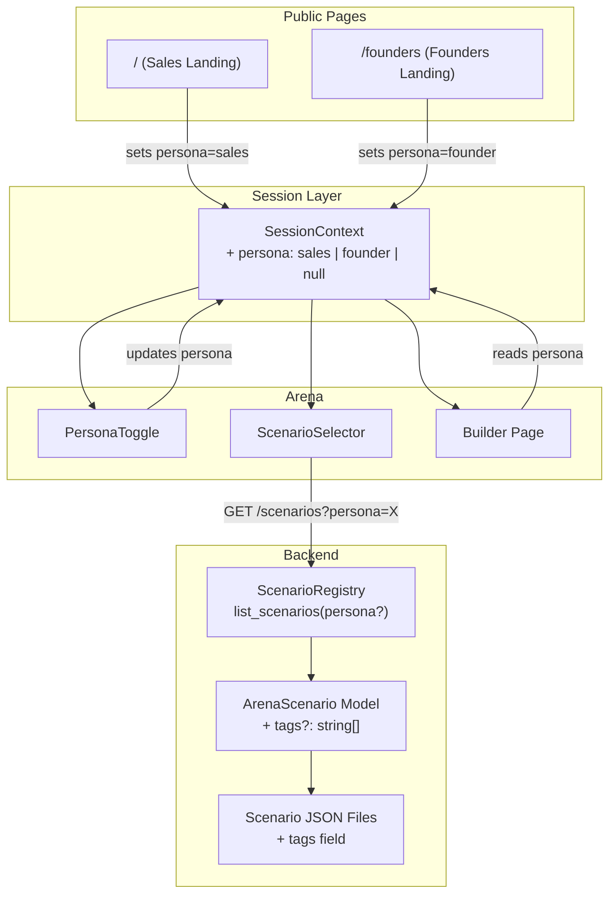

# Design Document: Persona Landing Pages

## Overview

This feature introduces a persona system (`sales` | `founder`) that flows from dedicated landing pages through the session context into the Arena scenario selector and AI Builder. The design adds:

1. A `persona` field to `SessionContext` set by landing page URL or Arena toggle
2. A `/founders` landing page mirroring the existing `/` page structure with founder-specific content
3. An optional `tags` field on `ArenaScenario` for persona-based filtering without disrupting the existing category system
4. Backend filtering in `ScenarioRegistry.list_scenarios` via an optional `persona` query parameter
5. Persona-specific pre-filled templates in the Builder chat input
6. Two new founder scenarios (Term Sheet Negotiation, VC Due Diligence Defense)
7. A lightweight persona toggle in the Arena near the ScenarioSelector

The design prioritizes backward compatibility — all existing behavior is preserved when no persona is set.

## Architecture



### Data Flow

1. User lands on `/` → persona set to `"sales"` in SessionContext
2. User lands on `/founders` → persona set to `"founder"` in SessionContext
3. User authenticates → persona preserved across login
4. Arena loads → `fetchScenarios` passes `persona` query param to backend
5. Backend `ScenarioRegistry.list_scenarios` filters by tag match or no-tags
6. User toggles persona in Arena → SessionContext updates, scenarios re-fetched
7. Builder reads persona from context → pre-fills appropriate template

## Components and Interfaces

### 1. SessionContext Changes (frontend/context/SessionContext.tsx)

Add `persona` to the session state and expose `setPersona` via the hook.

```typescript
// New type
type Persona = "sales" | "founder" | null;

// Added to SessionState
persona: Persona;

// Added to SessionContextValue
setPersona: (persona: Persona) => void;

// Storage key
const STORAGE_KEY_PERSONA = "junto_persona";
```

Behavior:
- `persona` is stored in `sessionStorage` alongside existing fields
- `setPersona` updates both state and sessionStorage
- `logout` clears persona from sessionStorage and resets to `null`
- Default when no persona is set: `null` (Arena will treat as `"sales"`)
- Local mode: persona defaults to `"sales"` unless overridden by URL

### 2. Founders Landing Page (frontend/app/founders/page.tsx)

A new Next.js page component at `/founders` following the same structure as `/` and `/open-source`:

- Server component with `metadata` export for SEO
- `isLocalMode` check → redirect to `/arena` (with persona set client-side)
- Hero section with founder-focused headline
- Value proposition cards (pitch simulation, term sheet practice, investor objection handling)
- Scenario showcase (startup pitch, equity split, term sheet negotiation, M&A buyout)
- WaitlistForm component (reused)
- CTA linking to Arena

A client component wrapper (`FoundersPersonaSetter`) sets `persona="founder"` in SessionContext on mount.

### 3. Sales Landing Page Update (frontend/app/page.tsx)

Add a client component wrapper (`SalesPersonaSetter`) that sets `persona="sales"` in SessionContext on mount. Minimal change to existing page.

### 4. PersonaToggle Component (frontend/components/arena/PersonaToggle.tsx)

A lightweight toggle near the ScenarioSelector in the Arena:

```typescript
interface PersonaToggleProps {
  persona: Persona;
  onPersonaChange: (persona: "sales" | "founder") => void;
}
```

- Two-option segmented control: "Sales" | "Founders"
- Styled to match existing Arena UI (gray-900 background, brand-blue active state)
- Placed above or inline with the ScenarioSelector

### 5. ArenaScenario Model Update (backend/app/scenarios/models.py)

Add optional `tags` field:

```python
class ArenaScenario(BaseModel):
    # ... existing fields ...
    tags: list[str] | None = Field(
        default=None,
        description="Optional persona tags for filtering. "
        "None means visible to all personas.",
    )
```

No validation constraints on tag values — they are free-form strings. This keeps the system extensible for future persona types.

### 6. ScenarioRegistry Filtering (backend/app/scenarios/registry.py)

Update `list_scenarios` to accept optional `persona` parameter:

```python
def list_scenarios(self, email: str | None = None, persona: str | None = None) -> list[dict]:
    # ... existing sorting logic ...
    # After access filtering, apply persona filter:
    # Include scenario if: scenario.tags is None OR persona in scenario.tags
    # Exclude scenario if: scenario.tags is not None AND persona not in scenario.tags
```

The `list_scenarios` return dict gains a `tags` field so the frontend can use it for ordering.

### 7. Scenarios Router Update (backend/app/scenarios/router.py)

Add `persona` query parameter to `list_scenarios` endpoint:

```python
@router.get("")
async def list_scenarios(
    email: str | None = Query(default=None),
    persona: str | None = Query(default=None, description="Filter by persona tag"),
    registry: ScenarioRegistry = Depends(get_scenario_registry),
) -> list[dict[str, str | bool]]:
    return registry.list_scenarios(email=email, persona=persona)
```

### 8. Frontend API Client Update (frontend/lib/api.ts)

Update `fetchScenarios` to pass persona:

```typescript
export async function fetchScenarios(
  email?: string,
  persona?: string,
): Promise<ScenarioSummary[]> {
  const params = new URLSearchParams();
  if (email) params.set("email", email);
  if (persona) params.set("persona", persona);
  const qs = params.toString();
  const res = await fetch(`${API_BASE}/scenarios${qs ? `?${qs}` : ""}`);
  // ...
}
```

`ScenarioSummary` gains optional `tags` field for frontend ordering.

### 9. Arena Page Updates (frontend/app/(protected)/arena/page.tsx)

- Import and render `PersonaToggle` above `ScenarioSelector`
- Read `persona` from `useSession()`
- Pass `persona` to `fetchScenarios` call
- On persona change: update session context, clear selected scenario, re-fetch scenarios
- Default persona to `"sales"` if null

### 10. Builder Template System (frontend/app/(protected)/arena/builder/page.tsx)

- Read `persona` from `useSession()`
- Define template strings as constants:

```typescript
const FOUNDER_TEMPLATE = `I'm [Your Name] ...`;
const SALES_TEMPLATE = `I'm a [Your Role] at [Company Name] ...`;
```

- Pre-fill the chat input with the appropriate template based on persona
- Template is editable — it's just the initial value of the textarea
- No template when persona is null

### 11. New Scenario JSON Files

Two new files in `backend/app/scenarios/data/`:

**term-sheet-negotiation.scenario.json**
- ID: `term_sheet_negotiation`
- Category: "Corporate"
- Tags: `["founder"]`
- Agents: Founder (negotiator), Lead Investor (negotiator), Legal Advisor (regulator)
- Toggles: ≥2 (e.g., "Founder has a competing term sheet", "Investor has a fund timeline pressure")
- Focus: Liquidation preferences, anti-dilution, pro-rata rights, board composition

**vc-due-diligence.scenario.json**
- ID: `vc_due_diligence`
- Category: "Corporate"
- Tags: `["founder"]`
- Agents: Founder (negotiator), VC Partner (negotiator), Financial Analyst (regulator)
- Toggles: ≥2 (e.g., "Startup has inflated metrics", "VC has inside knowledge of a competitor pivot")
- Focus: Metrics defense, market sizing, competitive positioning, unit economics

### 12. Existing Scenario Tag Updates

All existing scenario JSON files updated with `tags` field per Requirement 7:

| Scenario | Tags |
|---|---|
| b2b_sales, saas_negotiation, renewal_churn_save, discovery_qualification, enterprise_multi_stakeholder | `["sales"]` |
| startup_pitch, startup_equity_split, ma_buyout | `["founder"]` |
| talent_war, freelance_gig | `["sales", "founder"]` |
| family_curfew, easter_bunny_debate, landlord_lease_renewal, urban_development | no tags (null) |
| plg_vs_slg | no tags (null), retains allowed_email_domains |

## Data Models

### ArenaScenario (Updated)

```python
class ArenaScenario(BaseModel):
    id: str
    name: str
    description: str
    difficulty: Literal["beginner", "intermediate", "advanced", "fun"]
    category: str
    tags: list[str] | None = None  # NEW — persona filtering
    agents: list[AgentDefinition]
    toggles: list[ToggleDefinition]
    negotiation_params: NegotiationParams
    outcome_receipt: OutcomeReceipt
    evaluator_config: EvaluatorConfig | None = None
    allowed_email_domains: list[str] | None = None
```

### SessionState (Updated)

```typescript
interface SessionState {
  email: string | null;
  tokenBalance: number;
  lastResetDate: string | null;
  tier: number;
  dailyLimit: number;
  isAuthenticated: boolean;
  isHydrated: boolean;
  persona: "sales" | "founder" | null;  // NEW
}
```

### ScenarioSummary (Updated)

```typescript
interface ScenarioSummary {
  id: string;
  name: string;
  description: string;
  difficulty: "beginner" | "intermediate" | "advanced" | "fun";
  category: string;
  tags?: string[] | null;  // NEW — for frontend ordering
}
```

### Builder Templates

```typescript
const BUILDER_TEMPLATES: Record<string, string> = {
  founder: `I'm [Your Name], founder of [Company Name].

Here's my LinkedIn: [Your LinkedIn URL]
Here's my pitch deck: [Pitch Deck Link]

I want to practice pitching to [Target Investor Name].
Their LinkedIn: [Investor LinkedIn URL]
They're a partner at [VC Firm Name]: [VC Firm Link]

My confidence target: [e.g., "Close a $2M seed at $10M pre-money"]`,

  sales: `I'm a [Your Role] at [Company Name].

We sell [Product/Service Description].

I want to practice selling to a [Target Buyer Role].
Typical deal size: [Deal Size, e.g., "$50K ARR"]

Key objections I want to handle:
- [Objection 1, e.g., "Price is too high"]
- [Objection 2, e.g., "We already have a solution"]
- [Objection 3, e.g., "Need to check with my team"]`,
};
```


## Correctness Properties

*A property is a characteristic or behavior that should hold true across all valid executions of a system — essentially, a formal statement about what the system should do. Properties serve as the bridge between human-readable specifications and machine-verifiable correctness guarantees.*

### Property 1: Persona filtering correctness

*For any* persona value P and *for any* list of scenarios with arbitrary tag combinations, filtering by persona P SHALL return only scenarios where either (a) the scenario has no tags (tags is None) or (b) P is contained in the scenario's tags list. No scenario whose tags list exists and does not contain P shall appear in the filtered result.

**Validates: Requirements 3.1, 3.2, 3.5, 3.6, 4.4**

### Property 2: Category sort order preserved after persona filtering

*For any* persona filter applied to *any* list of scenarios, the resulting filtered list SHALL maintain category-based grouping where categories appear in alphabetical order with "General" always last, and within each category, scenarios are ordered by difficulty then name.

**Validates: Requirements 3.4, 4.6**

### Property 3: ArenaScenario tags round-trip

*For any* valid ArenaScenario instance with an arbitrary tags list (including None, empty list, or list of arbitrary strings), serializing to JSON via `model_dump()` and deserializing via `model_validate()` SHALL produce an equivalent ArenaScenario with identical tags.

**Validates: Requirements 4.1, 4.2**

## Error Handling

| Scenario | Handling |
|---|---|
| Invalid persona value in query param | Backend ignores unknown persona values — returns all scenarios (fail-open for forward compatibility) |
| SessionStorage unavailable | Persona defaults to `null`, Arena treats as `"sales"` |
| Scenario JSON missing `tags` field | Pydantic default `None` — scenario visible to all personas |
| Persona set but no matching scenarios | Empty scenario list displayed with "Build Your Own" option still visible |
| Local mode + /founders | Redirect to /arena, persona set to "founder" via URL param or client-side setter |
| Logout with persona set | Persona cleared from sessionStorage and state |
| Backend returns scenario with unknown tag | Frontend ignores unknown tags — no crash, scenario still displayed |

## Testing Strategy

### Property-Based Tests (Hypothesis — Python backend)

PBT is appropriate for the filtering and round-trip logic in this feature. The filtering function is a pure function with clear input/output behavior and a large input space (arbitrary scenario lists × persona values × tag combinations).

**Library**: Hypothesis (already in use — see `.hypothesis/` directory and testing.md)
**Minimum iterations**: 100 per property

| Property | Test Location | Tag |
|---|---|---|
| Property 1: Persona filtering | `backend/tests/property/test_persona_filtering.py` | Feature: persona-landing-pages, Property 1: Persona filtering correctness |
| Property 2: Sort order preserved | `backend/tests/property/test_persona_filtering.py` | Feature: persona-landing-pages, Property 2: Category sort order preserved |
| Property 3: Tags round-trip | `backend/tests/property/test_scenario_tags_roundtrip.py` | Feature: persona-landing-pages, Property 3: ArenaScenario tags round-trip |

### Unit Tests (Example-Based)

**Backend (pytest)**:
- `ScenarioRegistry.list_scenarios` with persona param — verify correct filtering for sales, founder, None
- `ArenaScenario` model validation with tags field — None, empty, populated
- Scenario router endpoint with persona query param
- Backward compatibility: no persona param returns all scenarios

**Frontend (Vitest + RTL)**:
- `SessionContext`: persona storage, setPersona, logout clears persona, default behavior
- `PersonaToggle`: renders both options, fires onPersonaChange callback
- `ScenarioSelector`: renders filtered scenarios, includes "Build Your Own"
- Founders landing page: renders hero, value props, scenario cards, WaitlistForm, CTA, SEO metadata
- Sales landing page: sets persona on mount
- Builder page: pre-fills correct template per persona, no template when null, template is editable
- Arena page: persona toggle present, switching clears selected scenario

### Smoke Tests

- Each new scenario JSON file loads and validates against `ArenaScenario` schema
- Each existing scenario has correct tags per Requirement 7
- `/founders` route is accessible
- Local mode redirect works

### Integration Tests

- Full flow: land on `/founders` → authenticate → navigate to Arena → scenarios filtered for founder
- Persona switch in Arena → re-fetch scenarios → list updates
- Builder template pre-fill based on persona from session context
