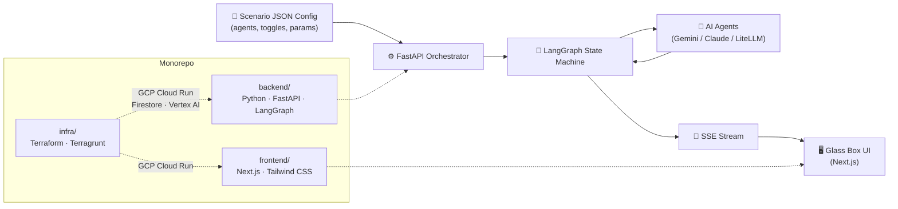

<p align="center">
  <h1 align="center">JuntoAI A2A — Agent-to-Agent Negotiation Engine</h1>
</p>

<p align="center">
  
  
  
  
  
  <a href="https://kiro.dev"></a>
</p>

> **Built with [Kiro](https://kiro.dev)** — JuntoAI A2A was primarily developed using Kiro, the AI-powered IDE. Kiro's specs-driven workflow, steering files, and automation hooks shaped every feature in this repo. [Learn more about Kiro →](https://kiro.dev)

---

**JuntoAI A2A is a config-driven scenario engine and universal protocol-level execution layer for professional negotiations.** It is not a chatbot. Drop a JSON scenario file into the repo, and autonomous AI agents — powered by Gemini, Claude, or any LiteLLM-supported provider — negotiate in real time while a Glass Box UI streams their inner reasoning and public messages to your browser. Toggle a single hidden variable (a secret competing offer, a compliance constraint) and watch the deal outcome shift. A2A proves that AI negotiation is controllable, observable, and reproducible.

## 📑 Table of Contents

- [🏗️ Architecture](#-architecture)
- [🚀 Quick Start](#-quick-start)
- [⚔️ Local Battle Arena](#-local-battle-arena)
- [⚙️ Environment Configuration](#-environment-configuration)
- [🤖 Connect Your Own Agents](#-connect-your-own-agents)
- [🏆 Leaderboard](#-leaderboard)
- [🛠️ Developing with Kiro](#-developing-with-kiro)
- [🤝 Contributing](#-contributing)
- [📄 License](#-license)

---

## 🏗️ Architecture

JuntoAI A2A is a monorepo with three top-level directories:

| Directory | Stack | Purpose |
|-----------|-------|---------|
| `backend/` | Python 3.11 · FastAPI · LangGraph | Scenario orchestration, AI agent execution, SSE streaming |
| `frontend/` | Next.js 14 · Tailwind CSS | Glass Box UI, Arena Selector, Outcome Receipt |
| `infra/` | Terraform · Terragrunt | GCP infrastructure (Cloud Run, Firestore, Vertex AI) |

**Data flow:** A scenario JSON config defines the agents, toggles, and negotiation parameters. The FastAPI orchestrator loads the config, initializes a LangGraph state machine, and runs the agents turn-by-turn. Each agent's inner thoughts and public messages stream as Server-Sent Events (SSE) to the Next.js Glass Box UI in real time.

```
Scenario JSON → FastAPI Orchestrator → LangGraph State Machine → AI Agents (Gemini/Claude) → SSE Stream → Next.js Glass Box UI
```



<!-- ============================================================ -->
<!-- SECTIONS BELOW WILL BE ADDED BY SUBSEQUENT TASKS              -->
<!-- ============================================================ -->

<!-- Task 2: Quick Start and Local Battle Arena sections -->

## 🚀 Quick Start

Get the full stack running locally in under 5 minutes. No GCP credentials required.

**Prerequisites:**

- [Docker](https://docs.docker.com/get-docker/) and [Docker Compose](https://docs.docker.com/compose/install/)
- At least one LLM API key: [OpenAI](https://platform.openai.com/api-keys), [Anthropic](https://console.anthropic.com/), or a local [Ollama](https://ollama.com/) instance

**Steps:**

1. Clone the repo:

```bash
git clone https://github.com/Juntoai/a2a.git
cd a2a
```

2. Copy the environment template:

```bash
cp .env.example .env
```

3. Set your API key in `.env` (pick one):

```bash
# OpenAI
LLM_PROVIDER=openai
OPENAI_API_KEY=sk-your-key-here

# — OR — Anthropic
LLM_PROVIDER=anthropic
ANTHROPIC_API_KEY=sk-ant-your-key-here

# — OR — Ollama (no key needed, just a running Ollama instance)
LLM_PROVIDER=ollama
```

4. Start the stack:

```bash
docker compose up
```

5. Open the Arena in your browser:

```bash
open http://localhost:3000
```

> The default `RUN_MODE` is `local` — the stack uses SQLite and LiteLLM out of the box. No GCP credentials, no Firestore, no Vertex AI setup needed.

## ⚔️ Local Battle Arena

When `RUN_MODE=local` (the default), the entire cloud stack is swapped for lightweight local alternatives — zero GCP dependencies:

| Component | Cloud Mode | Local Mode |
|-----------|-----------|------------|
| Database | Firestore | SQLite |
| LLM Router | Vertex AI | LiteLLM |
| Auth | Waitlist + tokens | Bypassed |
| Hosting | GCP Cloud Run | Docker Compose |

### Docker Compose Services

The `docker compose up` command starts two services:

| Service | Port | Description |
|---------|------|-------------|
| `backend` | `8000` | FastAPI orchestrator, LangGraph agents, SSE streaming |
| `frontend` | `3000` | Next.js Glass Box UI, Arena Selector |

SQLite data is persisted via a Docker volume, so your session history survives container restarts.

### Scenario Configs Work Everywhere

The same scenario JSON files in `backend/app/scenarios/data/` work in both cloud and local modes without modification. The orchestrator reads the scenario config identically — only the underlying LLM provider and database change based on `RUN_MODE`.

### Model Mapping

Local mode uses LiteLLM to route `model_id` values from scenario configs to your chosen provider. Control the mapping with these environment variables:

| Variable | Purpose | Example |
|----------|---------|---------|
| `LLM_PROVIDER` | Which provider to route to | `openai`, `anthropic`, `ollama` |
| `LLM_MODEL_OVERRIDE` | Force all agents to use one model (great for cost savings) | `gpt-4o-mini` |
| `MODEL_MAP` | JSON object mapping scenario `model_id` → local model name | `{"gemini-2.5-flash": "gpt-4o", "claude-sonnet-4": "claude-sonnet-4-20250514"}` |

If `LLM_MODEL_OVERRIDE` is set, it takes precedence over `MODEL_MAP` — every agent uses the override model regardless of what the scenario config specifies.

<!-- Task 3: Environment Configuration and Connect Your Own Agents -->

## ⚙️ Environment Configuration

Every configurable value lives in a single `.env` file at the monorepo root. Copy `.env.example` to `.env` and adjust as needed.

<details>
<summary><strong>Full Environment Variable Reference</strong> (click to expand)</summary>

#### Run Mode

| Variable | Required | Default | Description |
|----------|----------|---------|-------------|
| `RUN_MODE` | Optional | `local` | `local` for SQLite + LiteLLM, `cloud` for Firestore + Vertex AI |
| `ENVIRONMENT` | Optional | `development` | Runtime environment label (`development`, `staging`, `production`) |

#### LLM Provider

| Variable | Required | Default | Description |
|----------|----------|---------|-------------|
| `LLM_PROVIDER` | **Yes** | — | LLM backend: `openai`, `anthropic`, `ollama`, or `vertexai` |
| `OPENAI_API_KEY` | Conditional | — | Required when `LLM_PROVIDER=openai` |
| `ANTHROPIC_API_KEY` | Conditional | — | Required when `LLM_PROVIDER=anthropic` |
| `LLM_MODEL_OVERRIDE` | Optional | — | Force every agent to use this single model (ignores scenario `model_id`) |
| `MODEL_MAP` | Optional | — | JSON object mapping scenario `model_id` → provider model name |

#### Database

| Variable | Required | Default | Description |
|----------|----------|---------|-------------|
| `GOOGLE_CLOUD_PROJECT` | Cloud only | — | GCP project ID for Firestore and Vertex AI |
| `FIRESTORE_EMULATOR_HOST` | Optional | — | Firestore emulator address (e.g. `localhost:8080`) for local testing |

#### Frontend

| Variable | Required | Default | Description |
|----------|----------|---------|-------------|
| `NEXT_PUBLIC_SITE_URL` | Optional | `https://app.juntoai.org` | Canonical site URL for SEO and metadata |
| `NEXT_PUBLIC_FIREBASE_API_KEY` | Optional | — | Firebase API key for client-side Firestore |
| `NEXT_PUBLIC_FIREBASE_PROJECT_ID` | Optional | — | Firebase project ID |
| `NEXT_PUBLIC_FIREBASE_APP_ID` | Optional | — | Firebase app ID |
| `BACKEND_URL` | Optional | `http://localhost:8000` | Backend origin for server-side API proxy (never exposed to browser) |

#### Backend

| Variable | Required | Default | Description |
|----------|----------|---------|-------------|
| `VERTEX_AI_LOCATION` | Cloud only | `us-east5` | Vertex AI region for all models (Gemini + Claude) |
| `VERTEX_AI_REQUEST_TIMEOUT_SECONDS` | Optional | `60` | Timeout in seconds for Vertex AI requests |
| `SCENARIOS_DIR` | Optional | `backend/app/scenarios/data` | Directory containing scenario JSON files |
| `CORS_ALLOWED_ORIGINS` | Optional | `http://localhost:3000` | Comma-separated allowed CORS origins |
| `APP_VERSION` | Optional | `0.1.0` | Application version string |

</details>

### Provider-Specific Examples

**OpenAI:**

```bash
LLM_PROVIDER=openai
OPENAI_API_KEY=sk-your-key-here
```

**Anthropic:**

```bash
LLM_PROVIDER=anthropic
ANTHROPIC_API_KEY=sk-ant-your-key-here
```

**Ollama (local, no API key):**

```bash
LLM_PROVIDER=ollama
# Ensure Ollama is running: ollama serve
```

### Force a Single Model for All Agents

Use `LLM_MODEL_OVERRIDE` to make every agent use the same model — great for cost savings during development:

```bash
LLM_MODEL_OVERRIDE=gpt-4o-mini
```

When set, this overrides all `model_id` values in every scenario config. Remove it to let each agent use its configured model.

## 🤖 Connect Your Own Agents

Add a new negotiation scenario by dropping a single JSON file into `backend/app/scenarios/data/` — zero code changes. The orchestrator discovers it automatically on startup.

### Scenario Config Schema

Every scenario JSON file must conform to the `ArenaScenario` Pydantic model. Top-level fields:

| Field | Type | Description |
|-------|------|-------------|
| `id` | string | Unique scenario identifier |
| `name` | string | Display name shown in the Arena Selector |
| `description` | string | Short scenario description |
| `agents` | AgentDefinition[] | Array of agent configs (minimum 2) |
| `toggles` | ToggleDefinition[] | Investor-facing information toggles (minimum 1) |
| `negotiation_params` | NegotiationParams | Turn limits, agreement threshold, turn order |
| `outcome_receipt` | OutcomeReceipt | Post-negotiation display metadata |

### Agent Object Schema

Each entry in the `agents` array defines one AI agent:

| Field | Type | Description |
|-------|------|-------------|
| `role` | string | Unique role identifier (e.g. `"Developer"`, `"CTO"`) |
| `name` | string | Display name for the agent |
| `type` | `"negotiator"` \| `"regulator"` \| `"observer"` | Agent type — controls output schema |
| `persona_prompt` | string | System prompt defining the agent's personality and strategy |
| `goals` | string[] | List of objectives the agent tries to achieve |
| `budget` | `{min, max, target}` | Financial constraints (min ≤ max, all ≥ 0) |
| `tone` | string | Communication style (e.g. `"professional and confident"`) |
| `output_fields` | string[] | Fields the agent must include in each response |
| `model_id` | string | LLM model identifier (mapped to provider via `MODEL_MAP`) |
| `fallback_model_id` | string (optional) | Fallback model if primary is unavailable |

### Example Scenario

<details>
<summary><strong>Complete example: Freelance Rate Negotiation</strong> (click to expand)</summary>

```json
{
  "id": "freelance_rate",
  "name": "Freelance Rate Negotiation",
  "description": "A freelance developer negotiates their hourly rate with a startup CTO.",
  "difficulty": "beginner",
  "agents": [
    {
      "role": "Developer",
      "name": "Jordan",
      "type": "negotiator",
      "persona_prompt": "You are Jordan, a freelance developer with 5 years of experience. Your target rate is $120/hr.",
      "goals": ["Achieve hourly rate of $120 or above", "Secure a 3-month minimum contract"],
      "budget": {"min": 80, "max": 160, "target": 120},
      "tone": "professional and confident",
      "output_fields": ["offer", "reasoning", "counter_terms"],
      "model_id": "gemini-2.5-flash"
    },
    {
      "role": "CTO",
      "name": "Morgan",
      "type": "negotiator",
      "persona_prompt": "You are Morgan, CTO of a seed-stage startup. Your budget is $80-100/hr for this role.",
      "goals": ["Keep rate at or below $100/hr", "Negotiate a trial period before long commitment"],
      "budget": {"min": 60, "max": 120, "target": 90},
      "tone": "friendly but budget-conscious",
      "output_fields": ["offer", "reasoning", "counter_terms"],
      "model_id": "gemini-2.5-flash"
    },
    {
      "role": "Regulator",
      "name": "Compliance Bot",
      "type": "regulator",
      "persona_prompt": "You enforce fair contracting practices. Flag rates below market minimum ($70/hr) or contracts without clear deliverables.",
      "goals": ["Ensure rate is above $70/hr minimum", "Require clear scope of work"],
      "budget": {"min": 0, "max": 0, "target": 0},
      "tone": "neutral and policy-driven",
      "output_fields": ["compliance_status", "warnings", "recommendation"],
      "model_id": "gemini-2.5-flash",
      "fallback_model_id": "gemini-2.5-flash"
    }
  ],
  "toggles": [
    {
      "id": "competing_client",
      "label": "Jordan has a competing offer at $140/hr",
      "target_agent_role": "Developer",
      "hidden_context_payload": {
        "competing_offer": true,
        "competing_rate": 140,
        "details": "You have a signed offer from another client at $140/hr. Use this as leverage."
      }
    }
  ],
  "negotiation_params": {
    "max_turns": 8,
    "agreement_threshold": 10,
    "turn_order": ["Developer", "Regulator", "CTO", "Regulator"]
  },
  "outcome_receipt": {
    "equivalent_human_time": "~1 week",
    "process_label": "Freelance Rate Negotiation"
  }
}
```

</details>

Save this as `backend/app/scenarios/data/freelance-rate.scenario.json`, restart the backend, and it appears in the Arena Selector.

### Model ID Mapping

Scenario configs use generic `model_id` values like `gemini-2.5-flash`. In local mode, LiteLLM translates these to your provider's models:

1. If `LLM_MODEL_OVERRIDE` is set, **all** agents use that single model (ignores `model_id`).
2. If `MODEL_MAP` is set, each `model_id` is looked up in the JSON mapping. Example:
   ```bash
   MODEL_MAP='{"gemini-2.5-flash": "gpt-4o", "gemini-2.5-pro": "gpt-4o"}'
   ```
3. If neither is set, LiteLLM attempts to route the `model_id` string directly to the configured provider.

### LiteLLM Provider-Agnostic Routing

Local mode uses [LiteLLM](https://docs.litellm.ai/) as a universal LLM router. LiteLLM supports 100+ providers (OpenAI, Anthropic, Ollama, Azure, Bedrock, Mistral, and more) through a single interface.

To bring your own API key for any LiteLLM-supported provider, set the appropriate environment variable in `.env`:

```bash
# Example: use Mistral
LLM_PROVIDER=mistral
MISTRAL_API_KEY=your-mistral-key

# Example: use Azure OpenAI
LLM_PROVIDER=azure
AZURE_API_KEY=your-azure-key
AZURE_API_BASE=https://your-resource.openai.azure.com/
```

LiteLLM handles the provider-specific API formatting, auth, and model routing — your scenario configs stay unchanged.

<!-- Task 4: Leaderboard, Developing with Kiro, Contributing, License -->

## 🏆 Leaderboard

> **Coming Soon** — The agent leaderboard is on the roadmap. The infrastructure below describes how it will work.

Run the same scenario with different agent configurations and compare results across four evaluation dimensions:

| Dimension | What It Measures |
|-----------|-----------------|
| **Deal Outcome** | Final negotiated terms vs each agent's target values |
| **Negotiation Efficiency** | Number of turns to reach agreement (fewer = better) |
| **Humanization Quality** | Natural language fluency, strategic reasoning depth, persuasion techniques |
| **Regulator Compliance** | Number of compliance warnings received (fewer = better) |

**Want to compete?** Submit your agent configurations — scenario JSON files with custom `persona_prompt` values and `model_id` choices — by opening a PR to `backend/app/scenarios/data/`. See [Connect Your Own Agents](#-connect-your-own-agents) for the schema.

## 🛠️ Developing with Kiro

[Kiro](https://kiro.dev) is the AI-powered IDE used to build JuntoAI A2A. Open the monorepo root in Kiro and it automatically reads the project context files — no manual configuration needed.

### `.kiro/` Directory Structure

| Directory | Purpose |
|-----------|---------|
| `steering/` | Project context files that Kiro reads automatically |
| `specs/` | Feature specifications planned and built through Kiro's requirements-first workflow |
| `hooks/` | Automation hooks triggered during development workflows |

### Steering Files

Kiro reads these files automatically so AI assistance is tuned to the project's conventions:

| File | Covers |
|------|--------|
| `tech.md` | Technology stack, runtime versions, dependencies |
| `styling.md` | Tailwind config, brand colors, responsive breakpoints |
| `testing.md` | pytest + Vitest setup, coverage targets, test structure |
| `deployment.md` | Terragrunt workflow, Cloud Build pipeline, branch strategy |
| `product.md` | Product context, user flows, MVP scope, definition of done |

### Specs Workflow

Each numbered directory in `.kiro/specs/` represents a feature designed and built through Kiro's requirements-first process:

- `080_a2a-local-battle-arena` — Docker Compose local mode with SQLite + LiteLLM
- `100_structured-agent-memory` — Structured memory for agent state
- `110_hybrid-agent-memory` — Hybrid memory combining structured and unstructured approaches
- `120_world-class-readme-contributor-hub` — This README and contributor experience
- `130_ai-scenario-builder` — AI-assisted scenario creation

### Hooks

The `.kiro/hooks/` directory contains automation hooks. Currently: `spec-release-notes.kiro.hook` — generates release notes when a spec is completed.

### Contributor Guidance

- **New features** → Create a spec in `.kiro/specs/` using Kiro's requirements-first workflow
- **Consistent AI assistance** → Steering files ensure every contributor gets the same context
- **Automation** → Hooks handle repetitive tasks like release notes

Kiro is recommended but not required. Contributors can use any IDE — Kiro just provides the richest AI-assisted experience for this repo thanks to the pre-configured context files.

## 🤝 Contributing

Contributions are welcome! Check out the [open issues](https://github.com/Juntoai/a2a/issues) or propose something new.

**Ways to contribute:**

- **Scenario configs** — Add new negotiation scenarios (JSON-only, no code changes). See [Connect Your Own Agents](#-connect-your-own-agents).
- **Bug reports** — Found something broken? Open an issue with reproduction steps.
- **Feature proposals** — Have an idea? Open an issue describing the use case.
- **Documentation** — Improve the README, add examples, fix typos.
- **Agent strategies** — Share creative persona prompts and negotiation tactics.

**Branch strategy:**

1. Fork the repo
2. Create a `feature/*` branch from `main`
3. Submit a pull request to `main`

> Scenario contributions are JSON-only — drop a file in `backend/app/scenarios/data/` and open a PR. No code changes required.

## 📄 License

This project is licensed under the [MIT License](LICENSE).
